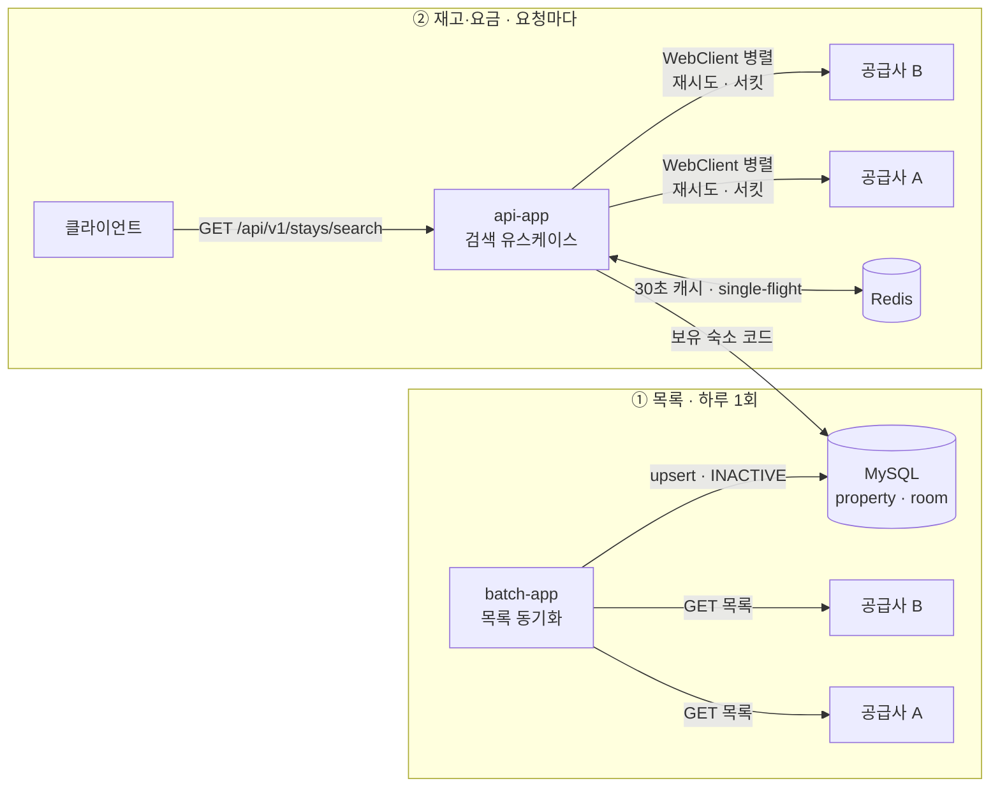
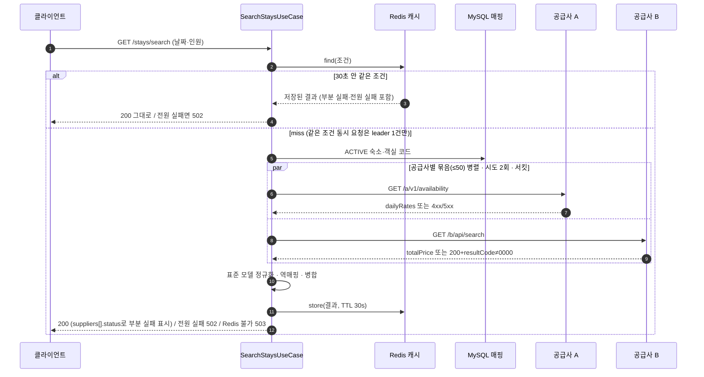

# stay-link

여러 숙박 상품 공급사의 서로 다른 API를 **하나의 표준 숙박 상품 모델**로 통합해, 날짜와 인원만으로
전 상품을 한 번에 조회하는 연동 백엔드입니다.

공급사는 지역이나 조건으로 재고·요금을 검색해 주지 않습니다. 조회가 두 단계로 나뉩니다.

| 단계 | 성격 | 이 저장소에서 |
|---|---|---|
| ① 숙소 목록 | 조건 없이 전체 목록. 자주 바뀌지 않는 정적 콘텐츠 | **배치**가 주기적으로 가져와 매핑 테이블에 쌓습니다 |
| ② 재고·요금 | 숙소 코드 목록을 받아 한 번에 조회. 부를 때마다 값이 달라집니다 | **검색 API**가 요청 때마다 병렬로 부릅니다 |

그래서 **매핑 테이블이 조회의 전제**입니다 — 무엇을 물어볼지 우리가 먼저 알고 있어야 합니다.



---

## 빠른 시작

Java 25와 Docker가 필요합니다. MySQL과 Redis는 `compose.yaml`로 자동 기동됩니다.

### 1. 모의 공급사 서버 두 개를 띄웁니다

공급사 A와 B는 **각각 독립 프로세스**입니다. 한쪽만 내려도 다른 쪽이 정상 응답해야 부분 실패를
재현할 수 있기 때문입니다.

```bash
./gradlew :mock-supplier-a:bootRun   # 9091
./gradlew :mock-supplier-b:bootRun   # 9092
```

### 2. 목록을 수집해 매핑을 채웁니다

```bash
./gradlew :batch-app:bootRun --args='syncDate=2026-09-07 --spring.docker.compose.lifecycle-management=start-only'
```

인자 두 개가 각각 이유를 갖습니다.

- **`syncDate`** — 배치는 이 날짜 하나로 실행을 식별합니다. 같은 값으로 두 번 돌리면
  `JobInstanceAlreadyCompleteException`으로 거부됩니다. 하루 한 번이라는 주기가 파라미터로 드러나
  있고, 그래서 같은 날 재실행이 조용히 중복되지 않습니다.
- **`start-only`** — 배치가 끝나면서 MySQL 컨테이너를 내리면 방금 저장한 매핑이 사라집니다. 이어서
  앱을 띄울 때 같은 컨테이너를 재사용합니다.

### 3. 앱을 띄웁니다

```bash
./gradlew :api-app:bootRun           # 8080
```

`bootRun`은 compose로 MySQL과 함께 **Redis도 올립니다** — 검색 결과 캐시가 Redis를 씁니다(아래 「검색
결과 캐시」).

jar로 직접 띄운다면 **시간대를 명시**해야 하고(아래 「과거 날짜 거부의 기준 시각」), **Redis가 떠 있어야
합니다** — 검색이 Redis에 닿지 못하면 공급사를 부르지 않고 `503`으로 답합니다.

```bash
java -Duser.timezone=Asia/Seoul -jar api-app/build/libs/api-app-0.0.1-SNAPSHOT.jar
```

### 4. 검색합니다

```bash
curl "http://localhost:8080/api/v1/stays/search?checkIn=2026-09-10&checkOut=2026-09-13&adults=2&children=0"
```

한쪽 공급사를 고장 내고 다시 부르면 부분 실패가 보입니다. 고장 제어는 **쿼리 파라미터**로 받습니다.

```bash
# B(9092)의 재고·요금만 장애로 — 검색은 200이고 A 결과만 담깁니다
curl -X POST "http://localhost:9092/control/mode?value=error&endpoint=availability"
curl "http://localhost:8080/api/v1/stays/search?checkIn=2026-09-10&checkOut=2026-09-13&adults=2&children=0"

# A도 내리면 502 ALL_SUPPLIERS_FAILED
curl -X POST "http://localhost:9091/control/mode?value=error&endpoint=availability"

# 원복
curl -X POST "http://localhost:9091/control/mode?value=normal&endpoint=all"
curl -X POST "http://localhost:9092/control/mode?value=normal&endpoint=all"
```

**같은 조건은 30초 안에 캐시에서 나옵니다.** 고장을 바꾼 직후 같은 날짜·인원으로 다시 부르면 이전
결과가 그대로 오므로, 재현할 때는 조건을 바꾸거나 30초를 기다립니다. 캐시에서 나온 응답은 요약 로그에
`cache=HIT`로 찍힙니다(아래 「연동 지표」).

`value`는 `normal` · `error` · `delay` · `no-response`, `endpoint`는 `all` · `catalog` ·
`availability`입니다. 지연 폭은 `delayMillis`로 조절합니다 — `value=delay&delayMillis=6000`이면
시도별 상한(1.85초)을 두 번 넘겨 그 공급사만 잘리는 것을 볼 수 있고, 그 실패가 쌓이면 서킷이 열려
그 공급사는 호출 없이 즉시 `FAILED`가 됩니다(아래 「재시도와 서킷」).

---

## API



### `GET /api/v1/stays/search`

요청 파라미터는 넷뿐입니다. 지역·키워드·페이징·정렬 파라미터는 두지 않았습니다.

| 파라미터 | 규칙 |
|---|---|
| `checkIn` | `YYYY-MM-DD`, 필수, 오늘 이후 |
| `checkOut` | `YYYY-MM-DD`, 필수, `checkIn`보다 뒤 (체크아웃일은 숙박일이 아닙니다) |
| `adults` | 1 이상 |
| `children` | 0 이상 |

```jsonc
{
  "code": "SUCCESS", "message": "Success", "time": "2026-09-07T10:00:00Z",
  "data": {
    "results": [
      {
        "propertyId": 1,                       // 내부 식별자 (매핑 역조회 결과)
        "propertyName": "Haeundae Blue Hotel", // 공급사 응답 값 그대로
        "roomId": 11,
        "roomName": "Ocean Double",
        "maxOccupancy": 2,
        "bookableRooms": 1,                    // 숙박 기간 전체를 연속으로 잡을 수 있는 객실 수
        "soldOut": false,
        "totalAmount": 435600,                 // 정수, 통화의 최소 단위
        "currency": "KRW",
        "breakfastIncluded": true,
        "supplier": "A"
      }
    ],
    "suppliers": [                             // 결과가 온전한지 판단하는 근거
      { "supplier": "A", "status": "OK" },
      { "supplier": "B", "status": "FAILED" }
    ]
  }
}
```

| 상황 | 상태 코드 |
|---|---|
| 정상 · 결과 0건 · **부분 실패** | `200` |
| 요청 검증 실패 | `400` `INVALID_INPUT` (위반 필드명이 `message`에) |
| **전 공급사 실패** | `502` `ALL_SUPPLIERS_FAILED` |
| **검색 결과 캐시(Redis)에 닿지 못함** | `503` `SEARCH_UNAVAILABLE` — `"Stays cannot be checked right now"`. 공급사는 부르지 않습니다 |

### API 문서 (OpenAPI)

**문서를 손으로 쓰지 않습니다. 컨트롤러 테스트가 만듭니다.**

```bash
python3 -m http.server 8000 -d api-docs
# http://localhost:8000

./gradlew :api-app:copyApiSpec        # 코드가 바뀌면 스펙을 다시 만듭니다
```

앱 서버는 띄우지 않아도 됩니다. 다만 뷰어가 스펙 파일을 `fetch`하므로 `file://`로 열면 브라우저가
막습니다 — 위처럼 정적 서버로 엽니다.

`api-docs/openapi3.json`은 **생성물이지만 커밋합니다.** 저장소를 웹에서 읽는 사람에게는 스펙이 곧
API 계약인데, 무시 목록에 넣으면 빌드를 돌려 보기 전까지 빈 뷰어만 보이기 때문입니다. 대신 코드와
어긋날 수 있으므로 **컨트롤러 테스트가 이 파일의 진짜 원본**이고, `copyApiSpec`으로 언제든 다시
만들어 대조할 수 있습니다.

**왜 애노테이션 방식이 아닌가.** 두 가지입니다.

1. `@Operation`·`@Schema` 같은 문서화 애노테이션이 컨트롤러와 DTO 안으로 들어오지 않습니다.
2. 더 중요한 이유 — **애노테이션 방식은 문서가 틀려도 빌드가 통과합니다.** 이 방식은 실제 요청·응답으로
   스니펫을 만들기 때문에 문서에 적은 필드가 응답에 없으면 테스트가 깨집니다. 문서와 코드의 불일치가
   사람의 대조가 아니라 빌드로 막힙니다.

---

## 설계 결정과 근거

### 목록은 언제 가져오는가 — 외부 스케줄러가 하루 한 번 (D-F6-19)

목록과 재고·요금은 **성격이 다릅니다.** 목록은 계약·온보딩 속도로 움직이는 정적 콘텐츠이고,
재고·요금은 부를 때마다 값이 달라지는 동적 데이터입니다. 그래서 저장 여부와 호출 시점이 갈립니다.

| | 숙소 목록 | 재고·요금 |
|---|---|---|
| 언제 부르나 | **하루 한 번, 배치가** | **검색 요청마다** |
| 저장하나 | 매핑 테이블에 저장 | 저장하지 않음 |
| 왜 | 자주 바뀌지 않고, 무엇을 물어볼지 미리 알아야 검색이 성립합니다 | 저장하는 순간 낡습니다 |

**`@Scheduled`를 쓰지 않고 외부 스케줄러가 one-shot으로 띄웁니다.** `@Scheduled`는 앱이 상주해야
하는데, 그러면 인스턴스를 늘릴 때 같은 배치가 중복 실행됩니다. 배치를 별도 실행 대상으로 떼어 두면
스케줄러가 하나만 띄우면 되고, 실패는 종료 코드로 기계가 감지합니다.

**하루 한 번으로 충분한 근거**는 이 배치가 증분이 아니라 **전체 상태 대조**라는 점입니다. 하루를
놓쳐도 다음 실행이 그날의 전체 목록으로 맞춰 놓기 때문에 누락이 누적되지 않습니다. 다만 **실행
시각 자체는 공식 근거를 찾지 못해 임의로 정한 값**이고, 문서에 그렇게 적어 두었습니다.

목록 갱신 주기 사이에 공급사가 상품을 추가하면 검색 응답에 우리 매핑에 없는 코드가 올 수 있습니다.
그 항목만 결과에서 빼고 로그에 남깁니다 — 한 항목 때문에 검색 전체가 실패하지 않습니다.

### 과거 날짜 거부의 기준 시각

`checkIn`이 오늘 이전이면 400입니다. 이 "오늘"은 **JVM 기본 시간대**로 정해집니다.

기준을 코드에 박지 않고 실행 설정에 둔 이유는, 값을 주입하는 장치(`Clock`)를 넣어서 얻는 것이
자정 경계 테스트 하나뿐이었고 그 케이스는 애초에 만들지 않기로 했기 때문입니다. 대신 **시간대를
실행 설정에 못박습니다** — `bootRun`은 `-Duser.timezone=Asia/Seoul`을 이미 넘기고, jar로 띄울 때는
같은 값을 직접 줘야 합니다.

이걸 빠뜨리면 조용히 깨집니다. 서버가 UTC로 뜨면 **KST 00~09시 사이에 "오늘" 날짜 검색이 400으로
거절됩니다.** 매일 9시간짜리 결함이고 로그만 봐서는 원인이 드러나지 않습니다.

### 요금 — 기간 총액 하나로 (D6)

두 공급사의 요금 표현이 다릅니다. A는 **날짜별 1박 단가 + 세금 별도(net)**, B는 **기간 총액에 세금
포함(gross)**입니다. 표준 모델은 `totalAmount`(정수) + `currency` 하나로 통일하고, A는 숙박일 전체를
순회해 `Σ(nightlyRate + taxAmount)`로 만듭니다.

**버린 것**: 날짜별 요금 분해와 세금 분리. B가 날짜별 단가를 주지 않아 **A만 가능한 값**이고, 한쪽만
채워지는 필드는 소비자가 신뢰할 수 없습니다. `taxIncluded`도 싣지 않습니다 — 항상 `true`라 정보가
아니라 소음입니다. 이 선택은 **단일 통화·단일 표시 규칙 전제** 위에 있고, 그 전제가 깨지면
(다통화 유입, 세금 별도 표시 시장) 되돌려야 합니다. 그때 **A는 원본 복원이 가능하지만 B는 불가능**합니다.

금액은 `Money(long amount, Currency currency)` 값 객체입니다. `double`을 쓰지 않는 이유는 정확도이고,
`long` 단독을 쓰지 않는 이유는 **통화가 열려 있어 `453600`이 45만 원인지 $4,536.00인지 값만으로
정해지지 않기** 때문입니다.

### N박 예약 가능 객실 수 — 최솟값 (D7)

`bookableRooms = min(숙박일 전체의 remainingRooms)`.

값의 뜻은 "날짜별 잔여"가 아니라 **"요청한 기간 전체를 연속으로 점유할 수 있는 그 객실 타입의 수"**
입니다. 연박은 같은 타입을 기간 내내 이어서 잡아야 하므로 최솟값이 곧 그 수입니다. 이름을
`availableRooms`에서 바꾼 이유는 그 이름이 `[3, 1, 1]` 중 무엇을 가리키는지 말해 주지 않기 때문입니다.

**전제**: 연박 가능 여부를 재고만으로 결정할 수 있다는 것. 업계 API는 최소·최대 숙박일수나 특정일
체크인 금지 같은 체류 제약으로도 연박을 막습니다. 우리 공급사 규약에 그 제약이 없어서 최솟값이
충분한 것이며, 제약이 들어오면 이 규칙을 다시 봐야 합니다.

### 예약 불가 상품 — 빼지 않고 0으로 노출 (D8)

`bookableRooms == 0`이어도 항목을 결과에서 제외하지 않고 `soldOut: true`로 내보냅니다.

공급사가 걸러 주는 것은 **인원뿐**이고 재고 0은 응답에 그대로 옵니다. "예약 불가"는 우리가 최솟값
계산으로 만드는 파생 판정이므로 노출 여부도 우리 결정입니다. **0을 버리면 복구할 수 없고, 남기면
품절 표시든 필터링이든 화면이 고를 수 있습니다.** 업계 기본값은 옵트인(빼는 쪽)에 가깝지만, 범위
검색으로 이미 나온 항목이면 품절이라고 보여주는 편을 택했습니다.

`soldOut`을 저장 필드가 아니라 **파생 값**으로 둔 이유는, 필드로 두면 `bookableRooms`와 같은 사실이
두 벌이 되어 어긋날 자리가 생기기 때문입니다.

### 숙소 코드 50개 초과 — 어댑터가 묶음으로 자릅니다 (D-F5-5)

공급사는 한 요청에 최대 50개 코드를 받습니다. 한도는 `supplier.<공급사>.availability.max-codes`로
**공급사마다 따로** 둡니다 — 지금 두 값이 같은 것은 우연이고 같아야 할 이유가 없습니다.

자르는 일은 **어댑터**가 합니다. 클라이언트 안에서 자르면 조합기의 호출당 타임아웃이 묶음 하나가
아니라 그 공급사 전체에 걸려 **묶음이 늘수록 호출 하나의 상한이 저절로 조여지고**, 실패했을 때 어느
묶음이 빠졌는지 알 수 없습니다. 지금은 어느 묶음이 실패했는지가 결과에 코드 목록으로 남습니다.

**숙소가 수천 개가 되면** 묶음이 공급사당 수십 개가 되고, 한 요청이 내는 동시 호출도 그만큼 늘어납니다.
동시 상한을 따로 두지 않으므로(아래 「타임아웃과 예산」) 천장은 커넥션 풀뿐입니다. 그 시점의 대응은
상한을 키우는 것이 아니라 **호출 수 자체를 줄이는 것**입니다. 무엇으로 줄일지는 다음 절에 있습니다.

### 숙소가 수천 개가 되면 — fan-out 을 키우지 않고 페이지 단위로 바꿉니다 (계획)

지금 검색은 **보유 숙소 전체**를 공급사에 묻고 전부 돌려줍니다. 검색 조건이 날짜·인원뿐이라 결과를
좁힐 축이 없고, 보유 숙소가 몇 곳인 지금은 그 응답이 클라이언트에게도 부담이 없습니다. 이 구조에서
숙소가 수천 개가 되면 세 가지가 같이 커집니다 — 공급사 호출 수(50개 묶음 × 수십), 응답 크기, 그리고
공급사 한도(계정 단위) 소모. 캐시(30초)는 같은 조건의 반복만 지우지 첫 호출의 크기는 못 줄입니다.

**결정 — 두 단계로 갑니다.**

1. **기획이 확정되기 전까지는 지금의 fan-out 그대로**입니다. 클라이언트가 받아도 부담 없는 양이 유지되는
   동안은 전체 조회가 가장 단순하고, 정렬·페이징 파라미터를 미리 넣으면 기준이 없는 값을 API 계약에
   박게 됩니다. 정렬 축(추천·가격)의 정의는 제품 결정이지 연동 계층의 결정이 아닙니다.
2. **확정되면 페이지 단위 조회로 바꿉니다.** 추천순·가격순 정렬을 두고, **기본 가격을 기준으로
   페이지네이션**합니다. 추천순은 자체 기록(평점·조회수·예약량)을 지수로 만들어 매깁니다. 요청이 오면
   그 정렬로 **페이지에 해당하는 숙소 코드만 골라 공급사에 묻습니다** — 공급사 호출 수가 보유 숙소 수가
   아니라 **페이지 크기**에 비례하게 되고, 그 시점부터 수천 개는 fan-out 의 문제가 아니라 순위 계산의
   문제가 됩니다. 어댑터·묶음 분할·조합기·재시도·서킷·캐시는 그대로이고, 바뀌는 곳은 유스케이스가
   "어느 코드를 물을지" 고르는 단계 하나와 캐시 키(정렬·페이지가 더해짐)입니다.

**2단계에 앞서 닫아야 하는 전제** — 이것이 지금 하지 않는 이유이기도 합니다.

- **기본 가격은 공급사를 부르기 전에 알아야 하는 값**입니다. 요금은 날짜·인원 없이 존재하지 않으므로
  (「요금·재고 저장」 행), 저장 모델이 아니라 **대표 가격 캐시 계층**(요금 스냅샷 + TTL)이 먼저 있어야
  가격 기준 페이지가 성립합니다. 지수(평점·조회·예약량)는 매핑 테이블 옆의 자체 데이터라 그것과 별개로
  쌓기 시작할 수 있습니다.
- **가격순은 조식 축 문제를 먼저 풀어야 합니다.** 위 「결과 순서」에서 가격을 기본 순서로 두지 않은 이유
  그대로입니다 — 요금제 축이나 조식 조건 필터 없이 가격순을 열면 조식 없는 상품이 구조적으로 상단을
  차지합니다. 정렬 옵션으로 제공하되 그 조건이 응답에 드러나야 합니다.
- **페이지 밖 숙소의 재고는 그 요청에서 모릅니다.** 페이지 단위로 부르면 "예약 가능한 것만 N개" 같은
  보장은 못 합니다. 품절 항목을 0으로 노출하는 지금 결정(D8)과 같은 이유로, 페이지도 순위대로 자르고
  품절은 그대로 보여 주는 쪽이 일관됩니다.

이 결정은 **연동 계층을 바꾸지 않고 호출 수를 줄이는 길**을 미리 열어 둔 것입니다. 지금 코드에서
그 길을 막는 것은 없습니다 — 검색 대상 조회(`findAllSearchTargets`)가 전체를 돌려주는 한 줄이 페이지
선정으로 바뀌는 자리입니다.

### 부분 실패 — 결과가 잘렸다는 사실을 응답에 남깁니다

한쪽 공급사가 죽어도 나머지 결과로 `200`을 냅니다. 그런데 그것만으로는 **"장애로 잘린 결과"와
"원래 조건에 맞는 상품이 없는 결과"가 응답에서 구분되지 않습니다.** 그래서 `suppliers[]` 블록에
공급사별 `status`(`OK` / `PARTIAL` / `FAILED`)를 싣습니다.

**실패 사유는 응답에 싣지 않습니다.** 세 가지 이유입니다.

1. 호출자가 사유로 행동을 바꾸지 않습니다 — "B 몫이 빠졌다"를 아는 것으로 판단이 끝납니다.
2. `INVALID_RESPONSE` 같은 값은 **어댑터 계층의 어휘**입니다. 응답에 실으면 공급사 사정이 경계를
   넘어 새어 나갑니다.
3. 원인은 로그와 지표의 몫입니다 (아래 「연동 지표」).

### 전 공급사 실패만 502

A와 B는 서로 다른 회사의 서로 다른 시스템입니다. **각각 죽는 것은 독립 사건이지만 동시에 죽는 것은
대개 공통 원인**이고, 그 후보가 전부 우리 쪽입니다 — 우리 네트워크·DNS, 설정 배포 사고, 예산이 짧게
잡힘, 커넥션 풀·스레드 고갈, 방금 나간 코드. 그래서 이 사건은 우리 지표에 잡히는 것이 맞습니다.

`500`이 아니라 `502`인 이유는, 우리가 **아는 사실**은 "상류 호출이 전부 실패했다"까지이고 원인이
우리라는 것은 추론이기 때문입니다. 실용적으로도 `502`는 상류 실패로 분류되어 우리 코드 예외(`500`)와
섞이지 않아 조사 시작점이 갈립니다.

### 결과 순서 — 숙소명 → 객실명 → 공급사

정렬 파라미터는 없지만 **응답의 순서는 정해야 합니다.** 병렬 호출은 완료 순서대로 결과를 내보내므로,
아무것도 하지 않으면 같은 요청이 매번 다른 순서로 나가고 테스트도 그 위에 설 수 없습니다.

**가격 오름차순을 기본으로 두지 않은 이유**가 이 결정의 핵심입니다. 조식 포함 여부는 부가 정보가
아니라 **`totalAmount`를 같은 축에서 비교할 수 있는지를 정하는 조건**입니다. 업계 모델에서 판매
단위는 (객실 타입 × 요금제)이고 조식은 요금제의 조건인데, 우리 모델에는 요금제 축이 없습니다.
가격순으로 두면 **조식이 없는 상품이 구조적으로 상단을 차지합니다** — 모의 데이터에서도 1위와 2위가
같은 호텔의 두 방이고 조식 유무만 다릅니다. 축을 만들기 전에는 가격을 기본 순서로 두지 않습니다.

부수 효과로, 숙소명 순은 **두 공급사가 같은 호텔을 팔 때 나란히 모입니다.** 공급사 간 숙소 병합을
구현하지 않았어도 화면에서 비교됩니다.

### 타임아웃과 예산

세 층으로 나뉩니다. 값은 모의 서버를 띄우고 **실제로 재서** 정했습니다.

| 층 | 값 | 근거 |
|---|---|---|
| 연결 타임아웃 | `1s` | 연결은 수십 ms면 끝납니다. 넘어가면 경로 문제이지 느린 응답이 아니므로 길게 기다릴 이유가 없습니다 |
| 응답 타임아웃 | `45s` | **뒷그물**입니다. 실제 상한은 아래 호출당 예산이 지므로, 두 용도(검색·수집) 중 긴 쪽보다 크게 두어 이 값이 먼저 걸리지 않게 합니다 |
| 호출당 예산 (검색) | `4s` | 정상 응답이 수십 ms인데 4s를 기다린다는 것은 이미 고장을 기다리는 것입니다. 사용자가 화면 앞에서 견딜 수 있는 상한이 기준이지 공급사의 평균 응답이 기준이 아닙니다 |
| 전체 예산 (검색) | `5s` | 동기 경로라 사용자가 기다립니다. 호출당 예산보다 커야 하고(부등식은 아래), 넘겨도 **도착한 결과는 보존**됩니다 |
| 호출당·전체 예산 (수집) | `30s` · `40s` | 배치가 기다리므로 빠른 것보다 **다 받는 것**이 중요합니다 |

**실측 (모의 서버 A·B 로컬 기동, 3박 검색 1건)**

| 시나리오 | 소요 | 응답 |
|---|---|---|
| 정상 | **21~44ms** | 200 · 5건 · `suppliers` 전원 OK |
| A 지연 2s (예산 안) | **2,036ms** | 200 · 5건 — 자르지 않습니다 |
| A 지연 6s (예산 초과) | **4,024ms** | 200 · B 2건 보존 · A `FAILED` |
| A 무응답 | **4,048ms** | 200 · B 2건 보존 · A `FAILED` |
| A·B 전원 장애 | 341ms (B 재시도 2회 포함, 재시도 이전엔 45ms) | **502** `ALL_SUPPLIERS_FAILED` · 30초 안 같은 조건은 호출 없이 5ms에 502 |

호출당 예산 `4s`가 실제로 자르고(4,024~4,048ms), **잘린 공급사 때문에 나머지 결과가 사라지지 않는다**는
것이 이 표의 요지입니다. 정상 응답과 상한 사이가 100배쯤 벌어져 있는데, 이 간격은 낭비가 아니라
**공급사가 흔들릴 때 쓰라고 남겨 둔 여유**입니다.

부하를 걸어도 같습니다 (`k6/app-search.js`, 10 VU · 20s).

```
7,700+ iterations   p95 = 82ms   실패율 0.00%   체크 38,830건 전부 통과
```

이 스크립트가 존재하는 이유는 부하 측정만이 아닙니다. **공급사로 나가는 날짜가 `YYYY-MM-DD`로
직렬화되는지**를 여기서 잡습니다 — HTTP 클라이언트 프록시가 URL을 만드는 경로는 프록시를 대체하는
단위 테스트 어디에서도 실행되지 않아, 표기가 틀려도 테스트는 전부 통과합니다. 실제로 그 결함을 한 번
겪었고, 지금은 이 경로가 회귀 장치입니다.

지켜야 하는 부등식은 **`전체 예산 > 호출당 예산`** 하나이고, 설정 바인딩이 기동 시점에 검사합니다.

원래는 `전체 예산 > ⌈묶음 수 ÷ 동시 상한⌉ × 호출당 예산`이었습니다. 동시 상한 프로퍼티를 **없애면서**
(D-F9-5) 조합기가 요청마다 묶음 수만큼 한꺼번에 내보내 웨이브가 항상 1이 되었고, 좌변의 묶음 수가
사라졌습니다. 2도 6도 근거가 없는 값이라 잘 고르는 대신 정할 값 자체를 없앤 것입니다.

**재시도도 우변에 곱해지지 않습니다.** 재시도는 호출당 예산 **안쪽**에서 도는 2단 상한이라(D-F9-3,
아래 「재시도와 서킷」) 시도를 늘리면 시도별 상한이 그만큼 줄어들 뿐, 재시도를 포함한 총 소요가 호출당
예산을 넘지 않는 것이 구조적으로 성립합니다.

대신 동시 호출의 천장이 사라졌으므로 **커넥션 풀 크기가 유일한 상한**입니다(공급사당 50, D-F9-6). 묶음이
수십 개가 되는 시점의 답은 상한을 키우는 것이 아니라 호출 수를 줄이는 캐시입니다.

### 재시도와 서킷 — 시도 2회, 공급사×용도 단위 (D-F9-3 · D-F9-4 · D-F9-7)

| | 검색 | 수집(배치) |
|---|---|---|
| 시도 수 | **2** (최초 1 + 재시도 1) | 3 |
| 백오프 | 200ms ~ 600ms · 지터 0.5 | 1s ~ 3s · 지터 0.5 |
| 서킷 | 창 10 · 최소 표본 5 · 실패율 50% · 열림 60초 · half-open 탐침 2 | 같음 |

**2단 상한.** 조합기의 호출당 예산(4초)은 그대로 두고, 어댑터가 그 안쪽에 **시도별 상한**을 한 겹 더
둡니다 — `(호출당 예산 − 백오프 합) ÷ 시도 수 = (4s − 0.3s) ÷ 2 = 1.85s`. 시도 수를 늘리면 시도별
상한이 저절로 줄어, 정해진 예산 안에서 시도를 늘리면 시도마다 짧아진다는 사실이 그대로 드러납니다.

**재시도가 바깥, 서킷이 안쪽**입니다 — Resilience4j가 문서화한 표준 순서이고, 그 결과 서킷의 표본
단위는 논리 호출이 아니라 **시도**입니다. 실패율은 왜곡되지 않고(관측 실패율 = 시도별 실패율) 장애가
심할수록 창이 빨리 차서 판정이 빨라집니다.

서킷은 **공급사 × 용도** 단위입니다(레지스트리 키 `A:availability` · `A:catalog`). A가 죽었다고 B를
막지 않고, 호출당 예산 30초짜리 수집 호출이 4초짜리 검색용 서킷을 열지 않습니다. 열린 서킷이 차단한
호출은 요약 로그에 `CIRCUIT_OPEN`으로 남습니다 — 공급사가 준 실패가 아니므로 `UNAVAILABLE`로 적으면
그 줄이 거짓이 됩니다. 상태는 **프로세스 로컬**이라 인스턴스마다 따로 논다는 한계를 명시해 두었습니다.

**재시도 대상은 서킷 기록 대상의 부분집합**입니다. `429`는 재시도하지 않지만 서킷은 셉니다 — 이미
한도를 넘긴 공급사를 다시 때리면 더 나빠지고, 그래도 공급사가 못 받고 있다는 사실은 세야 합니다.
**커넥션 풀 고갈(`POOL_EXHAUSTED`)은 둘 다에서 뺍니다** — 자사 병목이지 공급사가 준 실패가 아니라서,
표본으로 세면 부하가 오를수록 우리 풀이 멀쩡한 공급사의 서킷을 엽니다.

### 검색 결과 캐시 — 30초, Redis, 없으면 503 (D-F10-3 · D-F10-4 · D-F10-6 · D-F10-15)

같은 검색 조건(날짜·인원 넷이 키)이 30초 안에 다시 오면 공급사도 DB도 부르지 않습니다. 이 캐시는
정확성 장치가 아니라 **공급사 호출량 절감 장치**입니다 — 공급사 한도는 계정 단위라 인스턴스가 늘수록
같은 조건의 호출이 곱해지는데, 그 배수를 지웁니다. 그래서 TTL 30초(`stay.search-cache.ttl`)는 "값이
얼마나 오래 정확한가"가 아니라 절감 배수의 값이고, 실측 후 다시 잡습니다.

- **부분 실패 응답도 그대로 저장**합니다. 장애 중에만 캐시가 비면 정확히 그때 부하가 증폭됩니다.
- **전원 실패도 30초 기억**합니다. 두 공급사 모두 `FAILED`인 결과를 여느 결과처럼 저장하고, 읽는 쪽이
  판정해 호출 없이 `502`를 냅니다. 한 인스턴스가 겪은 장애가 Redis를 통해 나머지 인스턴스를 바로
  보호합니다 — 서킷은 프로세스 로컬이라 인스턴스마다 따로 실패를 겪어야 열리기 때문입니다.
- **Redis에 닿지 못하면 `503`입니다.** 캐시를 우회해 공급사로 흘리면 적중률 0에 인스턴스 수가 곱해져
  한도를 **우리가** 깹니다. 캐시가 한도 안에 머무르기 위한 장치이므로, 그것이 빠졌을 때 트래픽을 그대로
  흘리지 않습니다. 읽기 실패만 503이고, 공급사를 이미 부른 뒤의 쓰기 실패는 결과를 정상 반환하고
  WARN 한 줄만 남깁니다. 끊김은 즉시 거절, 느림은 300ms 타임아웃으로 상한합니다.
- **같은 키의 동시 miss는 JVM 안에서 한 번만** 공급사를 부릅니다(single-flight). 분산 락은 만료 순간의
  호출을 인스턴스 수에서 1로 줄일 뿐인데 락 만료·리더 사망이 따라와, 관측 전에는 넣지 않습니다.
- **재시도 대상 실패(타임아웃·5xx·연결 거부)는 재시도를 거친 뒤의 `FAILED`만 저장됩니다.** 재시도 없이
  캐시가 먼저 들어가면 타임아웃 한 번이 30초 동안 그 공급사의 미노출로 굳습니다. 그래서 캐시의 선행은
  재시도·서킷이고, 병합 순서를 이렇게 맞췄습니다. 재시도하지 않는 유형(`429`·4xx·차단·풀 고갈)은 첫
  시도의 `FAILED`가 그대로 30초 저장됩니다 — 다시 불러도 같은 결과인 유형이라 저장이 거짓은 아니지만,
  풀 고갈은 한 인스턴스의 사정이 캐시로 30초 동안 전 인스턴스에 퍼진다는 점을 알고 둔 것입니다.
- **알려진 한계 — Redis 컨테이너만 재기동하면 앱이 503에 머뭅니다.** `compose.yaml`이 Redis를 임시 호스트
  포트로 내보내므로 재기동 시 포트가 바뀌고, 앱은 기동 때 감지한 주소로만 재연결합니다. 실기동 확인
  결과이며, 로컬에서는 앱을 함께 다시 띄우면 됩니다. 실서비스라면 고정 주소(또는 compose 포트 고정)가
  전제라 이 경로는 생기지 않습니다.

### Spring MVC + 가상 스레드 — WebFlux를 전면 도입하지 않은 이유

요청 서빙은 **Spring MVC + 가상 스레드**, 공급사 병렬 호출만 **WebClient + Reactor 연산자**입니다.

WebFlux 전면 도입으로 얻는 것은 "요청 스레드를 블로킹하지 않는 것"인데, **그것은 가상 스레드가 이미
줍니다.** 반면 잃는 것이 분명합니다.

- **JPA가 블로킹입니다.** 매핑 조회가 리액티브 파이프라인 안에서 블로킹하면 이벤트 루프를 막습니다.
  R2DBC로 바꾸면 JPA를 버려야 하고, 이 프로젝트에서 JPA가 하는 일(엔티티·제약·더티 체킹)이 사라집니다.
- **디버깅과 스택 트레이스**의 비용이 코드 전체로 번집니다. 지금은 리액티브 타입이 공급사 클라이언트
  모듈 밖으로 나가지 않아, 도메인과 유스케이스는 평범한 `List`만 다룹니다.

병렬·타임아웃·예산이 실제로 필요한 곳은 **공급사로 나가는 fan-out 하나**입니다. 거기에만 Reactor를
쓰고 경계에서 `List`로 되돌립니다.

---

## 신규 공급사를 추가하려면

고칠 곳이 정해져 있습니다. 아래 일곱 군데 밖은 건드리지 않습니다.

| # | 무엇 | 어디 |
|---|---|---|
| 1 | 공급사 식별 값에 상수 하나 추가 | `core` · `Supplier` enum |
| 2 | HTTP Interface와 원본 응답 DTO | `supplier-client` · `supplier.<새 공급사>` 패키지 |
| 3 | 번역기 2개 (목록·재고요금) — 원본 필드를 표준 모델로 | 같은 패키지 |
| 4 | Fetcher 2개 — 스프링 빈으로 등록하면 어댑터가 자동으로 집어 갑니다 | 같은 패키지 |
| 5 | HTTP Interface를 그룹으로 등록 — `@ImportHttpServices(group = …)` 한 줄과, 마스킹 로그 필터의 그룹명 목록에 그 이름 추가 | `supplier-client` · `SupplierHttpClientConfig` |
| 6 | 코드 한도 설정의 공급사 칸 — `a`·`b`가 고정 필드인 record라 새 공급사 칸과 `maxCodes` 분기 한 줄 | `supplier-client` · `SupplierAvailabilityProperties` |
| 7 | 설정 — base URL·인증 키·코드 한도·(선택) 공급사별 타임아웃 | `application.yaml` (검색·수집 앱 각각) |

**유스케이스·어댑터·응답 DTO는 고치지 않습니다.** 어댑터가 주입받은 Fetcher 목록을 공급사 값으로
색인하므로, 구현을 더하는 것으로 끝나고 기존 코드에 분기가 늘지 않습니다. 등록이 중복되거나 빠지면
**기동 시점에** 실패합니다. 재시도·서킷 인스턴스는 공급사 값으로 만들어지므로 따로 등록할 것이 없습니다.
5·6번이 남는 이유는 등록기와 설정 바인딩이 자동 색인이 아니라 이름을 열거하는 구조이기 때문이며,
공급사가 셋째로 늘 때 그 두 곳을 색인 방식으로 바꿀지 판단합니다.

---

## 연동 지표

검색 1건마다 **요약 로그 한 줄**을 남깁니다. 갈래마다 흩뿌리지 않는 이유는 지표를 뽑을 때 파싱
대상이 하나여야 하기 때문입니다.

```
searchStays checkIn=2026-09-10 checkOut=2026-09-13 adults=2 children=0
  targets=3 supplierA=OK(3) supplierB=FAILED(0)[CIRCUIT_OPEN] excluded=0 results=3 elapsedMs=812

searchStays checkIn=2026-09-10 checkOut=2026-09-13 adults=2 children=0 cache=HIT results=3 elapsedMs=1
```

위는 검색 두 건입니다(한 건이 한 줄이며, 첫 건은 보기 좋게 접었습니다). 첫 건이 공급사를 실제로 부른
검색이고, 실패한 공급사 뒤에는 실패 사유가 붙습니다. 둘째 건은 캐시에서
나온 검색입니다 — `cache=`(`HIT` 또는 같은 키를 기다려 합쳐진 `JOINED`)가 붙고 공급사 항목이 없습니다.
적중률은 `cache=` 필드가 있는 줄을 전체 검색 줄로 나눈 값입니다.

| 레벨 | 조건 |
|---|---|
| `ERROR` | 전 공급사 실패 · 검색 결과 캐시(Redis)에 닿지 못해 `503` — 조치가 필요합니다 |
| `WARN` | 부분 실패 · 제외된 항목 있음 · 조회 대상 0개 · 기억된 전원 실패를 캐시에서 다시 냄 (조치 대상은 최초 실패 때 이미 ERROR로 올라갔습니다) · 서킷 상태 전이 |
| `INFO` | 그 외 (결과 0건·캐시 적중 포함) |

이 한 줄에서 **공급사별 성공률 · 응답 지연 · 타임아웃 비율 · 캐시 적중률**이 모두 산출됩니다. 수집기(Micrometer 등)는
붙이지 않았습니다 — 받을 곳과 볼 사람이 실재할 때 붙이는 것이 맞고, 지금은 그 둘이 없습니다.

---

## 모듈 구조

```
core             도메인 + 유스케이스. Spring 웹·JPA 구현·리액티브 타입이 들어오지 않습니다
persistence      JPA 구현
supplier-client  공급사 HTTP 클라이언트와 번역기, 재시도·서킷. 리액티브 타입은 이 모듈을 벗어나지 않습니다
cache-redis      검색 결과 캐시의 Redis 구현. Redis 예외는 이 모듈 안에서 끝납니다
api-app          검색 API (실행 대상)
batch-app        목록 수집 배치 (실행 대상)
mock-supplier-a  모의 공급사 A (실행 대상, 서로 의존하지 않습니다)
mock-supplier-b  모의 공급사 B (실행 대상)
```

`api-app`은 `persistence`·`supplier-client`·`cache-redis`를 **런타임에만** 의존합니다. 구현 클래스를 실수로
import하면 컴파일이 실패해 경계가 지켜집니다.

---

## 구현하지 않은 것과 이유

| 항목 | 왜 |
|---|---|
| 두 공급사의 같은 숙소 병합 | 공통 키가 없어 숙소명·객실 구성으로 추정할 수밖에 없습니다. 추정으로 합치면 **조건이 다른 상품을 하나로 보여주는** 위험이 생겨(조식 유무가 다른데 싼 쪽만 남는 식) 각각 노출하는 쪽을 택했습니다 |
| 검색 응답에 없는 숙소·객실의 즉시 정리 | 동기 경로에서는 그 항목만 빼고 로그를 남깁니다. 검색 결과에 없는 코드를 그 자리에서 비활성하거나 목록을 다시 조회해 바로잡는 안도 검토했지만 하지 않았습니다. 검색 조건이 날짜·인원뿐이고 개별 숙소 상세 조회가 없어 검색 결과가 곧 노출의 전부이므로, 응답에 없는 항목은 그 검색에서만 빠지면 되고 숙소·객실 매핑의 정정은 하루 한 번 배치의 전체 대조로 충분합니다 |
| 요금·재고 저장 | 부를 때마다 값이 달라지는 동적 데이터라 저장 대상이 아닙니다 |
| 정렬·페이징 | 기획 확정 전입니다. 확정되면 추천순·가격순과 기본 가격 기준 페이지로 가며, 그때 공급사 호출이 페이지 단위로 줄어듭니다 — 위 「숙소가 수천 개가 되면」 |
| 지표 수집기 | 위 「연동 지표」 참조 |

---

## 문서

| 문서 | 내용 |
|---|---|
| `docs/features/README.md` | 기능 단위 진행 목록과 의존 관계 |
| `docs/features/<기능>/01-design.md` | 기능별 설계 원본 — 결정 카드와 탈락한 안의 사유 |
| `docs/features/<기능>/design.html` | 같은 설계의 시각화 (클래스도·시퀀스도) |
| `docs/features/supplier-resilience/01-design.md` | 재시도·서킷 — 2단 상한의 유도, 서킷 값의 근거, 실측(`04-runtime-verification.md`) |
| `docs/features/search-cache/01-design.md` | 검색 결과 캐시 — TTL·실패 응답 저장·Redis 장애 시 503의 근거 |
| `docs/supplier-api-contract.md` | 공급사 API 규약 |
| `docs/list-api-integration-design.html` · `docs/availability-api-integration-design.html` | 목록·재고요금 통합 모델 설계 (D1~D12, 필드 매칭) |
| `docs/supplier-response-comparison.html` · `docs/domain-background.html` | A·B 응답 비교와 도메인 배경 |
| `docs/architecture.html` | 연동 구조도 — F3 병합 시점 스냅샷. 최신 전체 구조는 이 README 상단 다이어그램 |
| `docs/mock-supplier-behavior.html` · `docs/tech-reference-research.html` | 모의 서버 동작 표·실측, 클라이언트 배선 조사 |
| `api-docs/index.html` | OpenAPI 문서 (테스트가 생성, 브라우저로 바로 열림) |
| `k6/` | 부하·꼬리 지연·검색 API 회귀 스크립트 |
| `docs/db-schema.html` | 테이블 정의 원본 |
| `docs/test-cases.md` | 테스트 정리표 |
| `docs/ai-history.md` | AI 활용 기록 — 무엇을 묻고 무엇을 받아들이거나 뒤집었는지 |
| `JOURNAL.md` | 일자별 진행과 막힌 지점 |
