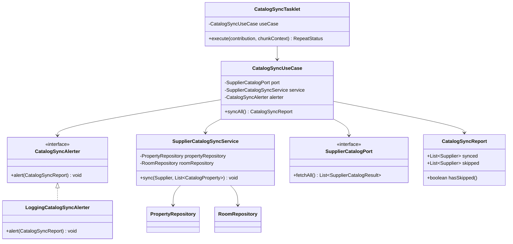
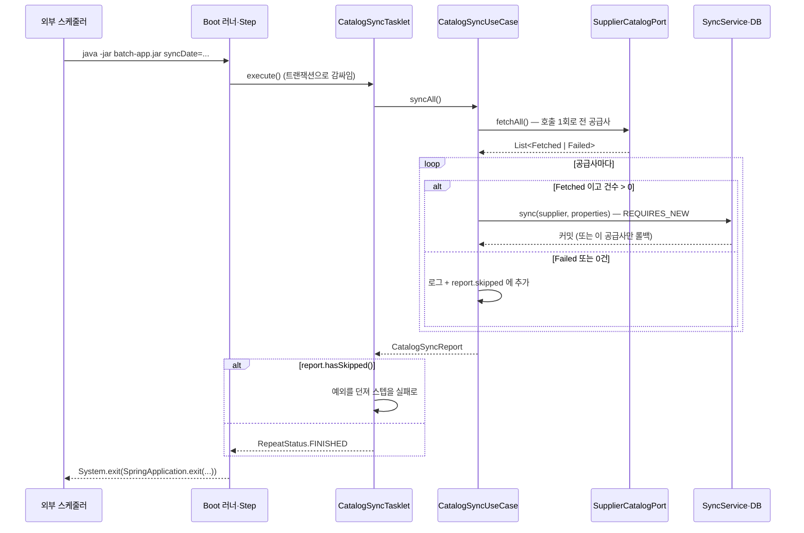

# catalog-sync 설계

status: 확정
updated: 2026-09-07

> 개발용 SSOT. 구현(`dev-checkpoint`)은 이 파일만 읽는다. 검토용 시각화는 `design.html`이며 결정의 원본이 아니다.
> 근거로 인용한 출처는 전부 `reference-verifier` 검증을 통과했다(38건 PASS · FAIL 0 · UNVERIFIED 0).

---

## 1. 요구사항 재해석·범위

### 해결하려는 문제

공급사가 파는 숙소·객실 유형의 **목록**을 하루 한 번 가져와 자사 매핑 테이블(`property`·`room`)과 맞춘다.
이 배치의 성격은 **관측된 사실의 기록**이다 — "공급사 목록에 있었는가"를 매일 확인해 매핑 행의 상태로 남긴다.
"계약이 끝났는가"를 판단하지 않는다. 그 둘을 같은 것으로 취급하면 시즌 휴업·리노베이션 같은 가역적 사유가
계약 종료와 구분되지 않는다(§6 D-F6-1 근거 참조).

### 수용 기준

1. 응답에만 있는 숙소·객실은 신규 저장되고 `ACTIVE`로 시작한다.
2. DB에 `INACTIVE`로 있던 것이 응답에 다시 나타나면 **내부 id가 유지된 채** `ACTIVE`가 된다.
3. DB에 있는데 응답에서 빠진 것은 `INACTIVE`가 된다. 하드 삭제하지 않는다.
4. 이름은 매 실행 응답 값으로 덮어쓴다.
5. 한 공급사의 실패가 다른 공급사의 갱신을 막지 않는다. **실제로 커밋이 남아야 한다.**
6. 공급사 응답이 0건이면 그 공급사의 매핑을 건드리지 않는다.
7. 건너뛴 공급사가 하나라도 있으면 잡이 실패로 끝나고 종료 코드가 0이 아니다.

### 포함

- `PropertyLifecycle`·`RoomLifecycle` enum 신설 (`ACTIVE`/`INACTIVE`)
- `Property`·`Room`에 lifecycle 필드와 상태 변경 메서드
- 리포지터리 포트에 bulk 조회·저장 메서드
- `CatalogSyncUseCase`(공급사 순회·실패 격리) + `SupplierCatalogSyncService`(공급사 1개 트랜잭션)
- `batch-app` Gradle 모듈 신설 (Job·Step·Tasklet·설정)
- `schema.sql`을 `api-app` → `persistence`로 이동, `schema-batch.sql` 신설

### 제외

- 요금·재고 수집 (D1)
- 검색 중 발견한 미매핑 코드의 즉시 수정 (F11)
- 공급사 코드의 병합·대체 — 표준 연동 스펙에 "중복 숙소 통합" 상태가 실재하나 이번 범위 아님
- 공급사 간 숙소 통합 식별(dedup) — `property` 테이블이 두 책임을 지지 않게 경계를 명시한다
- 증분 조회 · 유예 기간(N일 연속 부재) · 감소율 임계치 — §6 D-F6-8 참조
- **알람의 실제 채널 연동**(Slack·PagerDuty·로그 수집 규칙 등) — 포트와 로그 어댑터만 두고 실제 전송은 만들지 않는다 (D-F6-7c)

### DDD 적용 여부

**적용한다(전술 패턴 일부).** 단순 CRUD가 아니라 상태 전이 규칙(`ACTIVE`↔`INACTIVE`, 멱등성)과
불변식(`UNIQUE(supplier, code)` 아래에서 되살림은 insert가 아니라 update)이 있다.
다만 Aggregate 간 규칙이 없으므로 Domain Service는 두지 않는다(DDD-6).

---

## 2. 도메인 모델

### Aggregate

| Aggregate root | 식별 | 불변식 |
|---|---|---|
| `Property` | `(supplier, supplierPropertyCode)` 자연키 · `id` 대리키 | 자연키 UNIQUE. 코드·이름 공백 불가. lifecycle 은 두 값 중 하나 |
| `Room` | `(propertyId, supplierRoomCode)` 자연키 · `id` 대리키 | 자연키 UNIQUE. `propertyId` 필수. 코드·이름 공백 불가 |

`Room`은 `Property`를 **식별자로만 참조**한다(`Long propertyId`, 연관 매핑 없음). DDD-2 유지.

### VO

없다. `CatalogProperty`·`CatalogRoom`은 F3이 이미 만든 application 계층 값이며 이번에 손대지 않는다.

### 신규 enum

```java
package com.stay.property.domain;

public enum PropertyLifecycle { ACTIVE, INACTIVE }
public enum RoomLifecycle { ACTIVE, INACTIVE }
```

**별도로 둔다.** 표준 연동 스펙에 객실 유형 단독 비활성 조작이 존재하므로 객실 유형의 상태를
숙소 상태에서 파생시킬 수 없다(§6 D-F6-3).

### 엔티티에 더하는 것 (DDD-3 · DDD-5)

두 엔티티 모두 동일한 계약을 갖는다.

| 메서드 | 계약 |
|---|---|
| `activate()` | **멱등**. 이미 ACTIVE 여도 예외 없이 ACTIVE 를 유지한다 |
| `deactivate()` | **멱등**. 이미 INACTIVE 여도 예외 없이 INACTIVE 를 유지한다 |
| `rename(String)` | 공백이면 `InvalidMappingException`. 아니면 이름을 덮어쓴다 |
| `create(...)` | lifecycle 을 **`ACTIVE`로 시작**한다 |

**멱등이어야 하는 이유**: 애플리케이션 서비스가 `if (lifecycle == INACTIVE) activate()` 같은 상태 분기를
갖지 않게 하기 위해서다(DDD-5, 빈약한 모델 방지). 서비스는 조건 없이 부른다.

### 읽기 접근자

**셋만 연다** — diff 가 키로 쓰는 것뿐이다. F1 이 D-F1-8 로 "호출자가 생기는 F6 에 이관"해 둔 항목이다.

```
Property : supplierPropertyCode()
Room     : propertyId() · supplierRoomCode()
```

`lifecycle()` 접근자는 **테스트에서만** 필요하다. 프로덕션 코드에는 호출자가 없다(상태 변경이 멱등이라
조건 없이 부르므로). 테스트가 유일한 호출자인 접근자를 열지 말지는 구현 시 판단하되, 열었다면
`docs/test-cases.md`에 그 사유를 남긴다.

### 컬럼의 의미 (문서로 못박는 것)

- **`INACTIVE`는 "판매 중단"이지 "레코드 무효"가 아니다.** 숙소가 `INACTIVE` 여도 그 숙소의 기존 예약
  조회·변경·취소·정산은 계속되어야 한다. 정산은 체크아웃 이후까지 이어지므로 비활성 이후에도 수개월간
  참조되는 것이 정상이다. **조회 계층에 `WHERE lifecycle = 'ACTIVE'` 를 일괄 적용하면 진행 중인 예약이 사라진다.**
- **`property_name`·`room_name`은 공급사 응답 원문의 미러이지 고객 노출용 표시명이 아니다.**
  배치는 매 실행 이 값을 응답 값으로 무조건 덮어쓴다. 표시명이 필요해지면 별도 컬럼을 만든다 —
  이 컬럼을 재활용하면 배치가 편집을 날린다.

---

## 3. 레이어 배치

### 패키지·클래스

```
core/src/main/java/com/stay/property/
├── domain/
│   ├── PropertyLifecycle.java          (신규)
│   ├── RoomLifecycle.java              (신규)
│   ├── Property.java                   (수정) lifecycle 필드 + activate/deactivate/rename + 접근자
│   ├── Room.java                       (수정) 동일
│   ├── PropertyRepository.java         (수정) + saveAll · findAllBySupplier
│   └── RoomRepository.java             (수정) + saveAll · findAllByPropertyIdIn
└── application/
    ├── CatalogSyncUseCase.java         (신규) syncAll() — 트랜잭션 없음
    ├── CatalogSyncReport.java          (신규) 실행 결과 집계 값
    ├── CatalogSyncAlerter.java         (신규) 포트 — 외부 알림 경계
    └── SupplierCatalogSyncService.java (신규) @Transactional(REQUIRES_NEW) sync(...)

persistence/src/main/java/com/stay/property/infrastructure/
├── PropertyJpaRepository.java          (수정) saveAll default 다리
└── RoomJpaRepository.java              (수정) 동일
persistence/src/main/resources/schema.sql   (이동: api-app → persistence, lifecycle 컬럼 추가)

batch-app/                              (신규 모듈)
├── build.gradle.kts
└── src/main/
    ├── java/com/stay/
    │   ├── CatalogSyncBatchApplication.java   ← 패키지 com.stay (아래 근거)
    │   └── batch/
    │       ├── CatalogSyncJobConfig.java
    │       ├── CatalogSyncTasklet.java
    │       └── LoggingCatalogSyncAlerter.java  포트의 유일한 구현 — 로그로만 알린다
    └── resources/
        ├── application.yaml
        └── schema-batch.sql
```

**`supplier-client`는 손대지 않는다.** `SupplierCatalogPort`·`CatalogProperty`·`CatalogRoom`·
`SupplierCatalogResult`는 F3이 이미 완성했다.

### 의존 방향 (LAY-1)

```
batch-app ──implementation──> core <──implementation── persistence
    │                                              supplier-client
    └──runtimeOnly──> persistence, supplier-client
```

`api-app`과 같은 모양이다(D-MS-5). `batch-app` 코드는 구체 어댑터 클래스를 import 하지 않는다 —
실수로 하면 컴파일이 깨진다.

### 클래스 관계



### 주요 시그니처

```java
// core/application
public interface CatalogSyncUseCase { CatalogSyncReport syncAll(); }

@Service
public class SupplierCatalogSyncService {
    @Transactional(propagation = Propagation.REQUIRES_NEW)
    public void sync(Supplier supplier, List<CatalogProperty> properties) { ... }
}

// core/domain
public interface PropertyRepository {
    Property save(Property property);
    List<Property> saveAll(List<Property> properties);
    List<Property> findAllBySupplier(Supplier supplier);   // INACTIVE 포함
}
public interface RoomRepository {
    Room save(Room room);
    List<Room> saveAll(List<Room> rooms);
    List<Room> findAllByPropertyIdIn(List<Long> propertyIds);   // INACTIVE 포함
}
```

### 포트 소유

- `PropertyRepository`·`RoomRepository` — **domain** 소유 (Aggregate root 단위, DDD-7)
- `SupplierCatalogPort` — **application** 소유 (D-MS-4, F3이 이미 배치)

### 호출 시퀀스



### `sync(supplier, properties)` 내부 절차

**순서가 계약이다.** ④가 ⑤보다 먼저여야 한다.

| 순서 | 하는 일 | DB |
|---|---|---|
| ① | `findAllBySupplier(supplier)` — **lifecycle 필터 없이** 전부 | 읽기 1 |
| ② | ①의 id 로 `findAllByPropertyIdIn(...)` — **id 가 비면 호출하지 않고 빈 목록** | 읽기 2 |
| ③ | 숙소 diff — 코드로 인덱싱해 세 갈래 판정 | — |
| ④ | **신규 숙소 `saveAll`** — 여기서 내부 id 가 발급된다 | 쓰기 1 |
| ⑤ | 객실 diff — ④ 이후에만 가능 | — |
| ⑥ | 신규 객실 `saveAll` | 쓰기 2 |

**③ 숙소 diff 규칙**

- 응답에만 있음 → `Property.create(supplier, code, name)` (ACTIVE 로 시작) → ④의 저장 대상
- 양쪽에 있음 → `activate()` + `rename(응답 이름)` **조건 없이 호출**
- DB 에만 있음 → `deactivate()`, 그리고 **그 숙소의 기존 객실 전체를 `deactivate()`** (연쇄)

**⑤ 객실 diff 규칙** — 응답에 그 숙소가 있는 경우에만 수행한다.

- 응답에만 있음 → `Room.create(propertyId, code, name)` → ⑥의 저장 대상
- 양쪽에 있음 → `activate()` + `rename(응답 이름)`
- DB 에만 있음 → `deactivate()`
- **예외: 응답의 `rooms`가 빈 목록이면 그 숙소의 객실을 비활성하지 않는다.** 판정을 건너뛴다

**저장 범위**: `saveAll`은 **신규 엔티티만** 넘긴다. 이미 영속 상태인 엔티티의 변경은 트랜잭션 커밋 시
dirty checking 으로 반영되며, 실제로 값이 바뀌지 않은 행에는 UPDATE 가 나가지 않는다.

**조회에 lifecycle 필터를 걸지 않는 이유**: `ACTIVE`만 읽으면 되살아날 대상이 "DB에 없음"으로 판정되어
insert 경로로 가고 `uq_property_supplier_code`에 걸린다. 성능상 필터를 붙이고 싶어지는 자리이므로
쿼리 메서드에 주석으로 근거를 남긴다.

### 건너뛴 공급사 처리

| 상황 | 매핑 | 로그 | report |
|---|---|---|---|
| `Failed` (TIMEOUT · UNAUTHORIZED · RATE_LIMITED · UNAVAILABLE · SUPPLIER_ERROR · INVALID_REQUEST · INVALID_RESPONSE · UNEXPECTED) | 건드리지 않음 | `WARN` — 공급사·사유 | skipped |
| `Fetched` 인데 `properties` 가 빈 목록 | 건드리지 않음 | `ERROR` — 공급사 | skipped |
| `Fetched`, 건수 > 0 | 반영 | — | synced |

건너뛴 공급사가 있으면 **세 가지가 각자 다른 일을 한다.** 중복이 아니다.

| 수단 | 목적 | 언제 |
|---|---|---|
| 로그 (WARN/ERROR) | 진단 — 어느 공급사가 왜 빠졌는지 | 공급사마다 |
| `CatalogSyncAlerter.alert(report)` | **알림** — 사람에게 닿는 경로 | 실행 끝에 한 번, 요약으로 |
| 스텝 실패 → 종료 코드 | 스케줄러가 기계적으로 감지 + 재실행 경로 확보 | 실행 끝 |

`report.hasSkipped()`가 참이면 `alerter.alert(report)`를 부른 뒤
**Tasklet 이 예외를 던져 스텝을 실패로 끝낸다.**
이미 커밋된 다른 공급사의 갱신은 공급사별 독립 트랜잭션이라 남는다.

`CatalogSyncAlerter`는 **외부 시스템 경계의 포트**다(`coding-standard` OOP-6 의 단일 구현체 인터페이스
금지 규칙에서 포트는 명시적 예외). 이번 범위에서는 로그로만 알리는 어댑터 하나를 두고, 실제 채널이
생기면 core 를 건드리지 않고 어댑터만 교체한다. 인터페이스만 두고 구현을 두지 않으면 주입할 빈이 없어
컨텍스트가 뜨지 않으므로 자리표시자 구현은 필요하다.

**잡을 실패로 끝내는 두 번째 이유**: `COMPLETED`로 끝나면 같은 날짜로 재실행할 때
`JobInstanceAlreadyCompleteException`에 막힌다. 실패로 끝내면 같은 `JobInstance`의 새 실행이 되어
**공급사가 복구된 뒤 그날 배치를 다시 돌릴 수 있다.**

**일부만 온 응답(0건은 아니고 평소보다 적음)은 그대로 반영한다.** 응답에 총 건수 필드가 없어 감지할
수단이 없고, 공식 문서에 감소율 임계치의 근거 수치가 없어 임의 숫자로 개입하지 않는다.

---

## 4. 적용 패턴

| 패턴 | 격리하는 변화 | 검토한 대안 |
|---|---|---|
| **UseCase / Service 분리** (Facade 성격) | 공급사 순회·실패 판정(변함)과 공급사 1개의 트랜잭션 경계(고정)를 분리 | Tasklet 안에서 직접 순회 — 프록시 자기호출로 `@Transactional`이 걸리지 않아 폐기 |
| **Tasklet = 얇은 어댑터** | Spring Batch 의존을 batch-app 한 곳에 가둔다. 흐름은 core 에 있어 Batch 없이 단위 테스트 가능 | Tasklet 에 로직 배치 — core 밖에 비즈니스 흐름이 생김 |
| **어댑터의 `default` 다리** (`saveAll`) | Spring Data 의 제네릭 시그니처가 도메인 포트로 새는 것을 막는다 | §6 D-F6-11 의 안 A·B·C |
| **알림 포트** (`CatalogSyncAlerter`) | 알림 채널이 바뀌어도 core 가 안 바뀐다 | UseCase 가 직접 로그만 남기기 — 채널이 생길 때 core 를 고쳐야 함 |

Repository·정적 팩토리는 이미 F1에서 적용된 것을 그대로 쓴다.

---

## 5. 테스트 리스트

| ID | 레이어 | 분류 | 케이스 | 기법 | 기대 결과 |
|---|---|---|---|---|---|
| T-01 | domain | Normal | 숙소를 생성하면 | ECP | lifecycle 이 ACTIVE 로 시작한다 |
| T-02 | domain | Normal | 활성·비활성 상태에서 activate()/deactivate() 를 부르면 (4조합 Parameterized) | State Transition | 이전 상태와 무관하게 목표 상태가 되고 반복 호출해도 같다 |
| T-03 | domain | Normal | 이름을 다른 값으로 바꾸면 | ECP | 새 이름이 보존된다 |
| T-04 | domain | Invalid | 이름을 공백으로 바꾸면 | Error Guessing | `InvalidMappingException`, 메시지에 필드명 |
| T-05 | domain | Normal | 객실을 생성하면 | ECP | lifecycle 이 ACTIVE 로 시작한다 |
| T-06 | domain | Normal | 객실에 대해 T-02 와 같은 4조합 (Parameterized) | State Transition | 동일 |
| T-07 | domain | Normal | 객실 이름을 바꾸면 | ECP | 새 이름이 보존된다 |
| T-08 | domain | Invalid | 객실 이름을 공백으로 바꾸면 | Error Guessing | `InvalidMappingException` |
| T-09 | application | Normal | 응답에만 있는 숙소는 | ECP | 신규 저장된다 |
| T-10 | application | Normal | INACTIVE 인 숙소가 응답에 다시 나타나면 | State Transition | 내부 id 가 유지된 채 ACTIVE 가 된다 |
| T-11 | application | Normal | DB 에 있는데 응답에서 빠진 숙소는 | State Transition | INACTIVE 가 되고 그 하위 객실도 INACTIVE 가 된다 |
| T-12 | application | Normal | 응답의 이름이 DB 와 다르면 | ECP | DB 이름이 응답 값으로 덮어써진다 |
| T-13 | application | Interaction | 신규 숙소의 객실은 | Decision Table | 숙소 저장으로 발급된 id 를 propertyId 로 갖는다 |
| T-14 | application | Boundary | 공급사 응답이 빈 목록이면 | BVA | 저장·비활성이 일어나지 않고 skipped 에 담긴다 |
| T-15 | application | Boundary | 숙소의 객실 목록이 비면 | BVA | 그 숙소의 기존 객실을 비활성하지 않는다 |
| T-16 | application | Interaction | 결과가 Failed 인 공급사는 | Decision Table | 조회·저장을 호출하지 않고 skipped 에 담긴다 |
| T-17 | application | Interaction | 한 공급사 처리가 예외로 끝나도 | Error Guessing | 다른 공급사의 동기화는 수행된다 |
| T-18 | application | Boundary | 그 공급사의 기존 숙소가 0건이면 | BVA | 객실 조회를 호출하지 않는다 |
| T-18a | application | Interaction | 건너뛴 공급사가 있으면 | Decision Table | 알림 포트가 skipped 를 담은 report 로 1회 호출된다 |
| T-18b | application | Interaction | 모든 공급사가 정상 반영되면 | Decision Table | 알림 포트를 호출하지 않는다 |
| T-19 | repository | Normal | 공급사로 조회하면 | ECP | INACTIVE 인 숙소도 함께 반환된다 |
| T-20 | repository | Normal | 여러 숙소 id 로 객실을 조회하면 | ECP | 해당 숙소들의 객실이 한 번에 반환된다 |
| T-21 | E2E | Normal | 잡을 1회 실행하면 | ECP | 두 공급사 매핑이 저장되고 잡이 COMPLETED 로 끝난다 |
| T-22 | E2E | Interaction | 한 공급사가 건너뛰어지면 | Decision Table | 잡이 실패로 끝나고 종료 코드가 0이 아니다 |
| T-23 | E2E | Interaction | A 의 저장이 제약 위반으로 롤백되면 | Decision Table | **B 의 갱신은 커밋되어 남는다** |

**T-23 이 이 리스트에서 가장 값어치 있다.** `TaskletStep`이 Tasklet 을 트랜잭션으로 감싸기 때문에
`REQUIRES_NEW`가 빠지면 catch 를 해도 커밋 시 `UnexpectedRollbackException`으로 B 까지 롤백된다.
이 실패는 **Mockito 단위 테스트로 재현되지 않는다** — 실제 프록시와 트랜잭션이 필요하다.

**만들지 않는 것**: `CatalogSyncTasklet` 단위 테스트(단순 위임), Job·Step 빈 설정 자체(프레임워크 동작),
기본 CRUD(TST-3).

---

## 6. 결정 카드

| ID | 질문 | 검토한 안 | 결정 | 탈락 사유 | 구현 차단 |
|---|---|---|---|---|---|
| D-F6-1 | Tasklet vs Chunk | A Tasklet / B Chunk / C Chunk+커스텀 Reader | **A** | B: `ItemProcessor`는 아이템 단위 변환 모델이라 집합 연산인 3-way diff 와 구조적으로 안 맞음. C: `IteratorItemReader`가 `ItemStream` 미구현이라 재시작 이점도 못 얻음 | 예 |
| D-F6-2 | lifecycle 값 이름 | A ACTIVE/DELISTED / B ACTIVE/INACTIVE | **B** | A: DELISTED 는 주식 용어 (사용자 지적) | 아니오 |
| D-F6-3 | Property·Room enum 공유 여부 | A 공유 / B 별도 | **B** | A: 표준 연동 스펙에 객실 유형 단독 비활성 조작(`InvStatusType=Deactivated`)이 있어 객실 상태를 숙소 상태에서 파생시킬 수 없음 | 아니오 |
| D-F6-4 | 숙소 소실 시 하위 객실 | A 쓰기 연쇄 / B 읽기 파생 | **A** | B(AI 추천안): 객실 행이 자기 관측만 담아 모델링은 정직하나, `room`만 단독 조회하는 코드가 나중에 생기면 오답이 난다. 데이터 결과는 양쪽 동일함을 추적으로 확인했고, 곧 F7 검색이 이 테이블을 읽으므로 함정이 적은 A 를 택함. **뒤집으려면 이 카드와 §3 ③·T-11 만 고치면 된다** | 예 |
| D-F6-5 | revive 판정 방식 | A 이전 상태 복원 / B 응답으로 재판정 | **B** | A: 리노베이션 후 객실 구성이 바뀌는 것이 일상적이라 복원하면 사라진 타입이 부활함 | 예 |
| D-F6-6 | 이름 갱신 | A 덮어쓰기 / B 변경 시에만 | **A** | B: dirty checking 이 이미 안 바뀐 행을 걸러 이득이 없음. 단 "원문 미러이지 표시명이 아님"을 §2에 못박음 | 아니오 |
| D-F6-7 | 0건 응답 | A 그대로 반영 / B 건너뜀 | **B** | A: 잘못 반영하면 그 공급사 상품이 하루 사라지고, 건너뛰어 틀렸을 때의 손해(낡은 ACTIVE 행)는 재고·요금 조회에서 걸러짐 | 예 |
| D-F6-7a | 건너뛴 공급사 알림 | A 로그만 / B 로그+잡 실패 | **B** (사용자 결정) | A: 아무도 모름. B 는 알람과 함께 **그날 재실행 경로**까지 얻음. 대가는 불안정한 공급사가 있으면 매일 알람 — 실측 후 조정 | 예 |
| D-F6-7b | 일부만 온 응답 | A 감소율 임계치로 개입 / B 그대로 반영 | **B** (사용자 결정) | A: 공식 문서에 임계치 수치가 없어 임의 숫자가 됨. 감지 수단(총 건수 필드)도 없음 | 아니오 |
| D-F6-7c | 알람을 어디까지 만드나 | A 실제 채널까지 구현 / B 포트 + 로그 어댑터만 / C UseCase 가 직접 로그만 | **B** (사용자 결정) | A: 채널이 정해지지 않았고 이번 범위 밖 — 투기적. C: 채널이 생길 때 core 를 고쳐야 하고 알림 시점을 테스트로 고정할 수 없음. B 는 `coding-standard`의 "단일 구현체 인터페이스 금지" 예외인 **외부 시스템 경계 포트**에 해당한다 | 아니오 |
| D-F6-8 | 유예 기간(N일 연속 부재) | A 지금 도입 / B `absent_since` 컬럼만 선반영 / C 이연 | **C** | A·B: 유예 판정은 완결성 게이트와 한 묶음이라 함께 지어야 하고, 지금은 읽는 곳이 없어 투기적. **발동 조건**: 공급사가 페이지네이션을 도입하거나 유예가 필요해지면 셋을 함께 넣는다 | 아니오 |
| D-F6-9 | 조회 시 lifecycle 필터 | A 건다 / B 안 건다 | **B** | A: revive 대상이 insert 로 가 UNIQUE 위반 | 예 |
| D-F6-10 | 실패 격리 방식 | A REQUIRES_NEW / B 공급사별 Step 분리 / C 스텝 TM 만 Resourceless | **A + C 병용** | B: 잡 정의가 공급사 수에 종속되고 `fetchAll()` 형태와 안 맞음. C 단독: "REQUIRED 가 참여하지 않는다"는 공식 문장을 찾지 못함. C 를 겹치는 이유는 A 의 문서화된 대가(커넥션 두 배·풀 고갈)를 상쇄하기 위함 | 예 |
| D-F6-11 | 포트 `saveAll` 시그니처 | A `List saveAll(Iterable)` / B 제네릭 그대로 / C `List saveAll(List)` 단독 / D C+어댑터 default 다리 | **D** | A: **컴파일 에러**(erasure 충돌, `javac`로 확인). B: 하위 타입이 없는 타입 변수가 도메인 포트로 유출. C 단독: `JpaRepository`가 구현하지 않아 쿼리 파생 대상이 되어 기동 실패 | 예 |
| D-F6-12 | 채번 전략·배치 크기 | A IDENTITY 유지 / B SEQUENCE 전환 / C batch_size 설정 | **A, 미설정** | B: MySQL 은 시퀀스가 없어 채번 테이블이 생기고 F1 스키마가 바뀜. C: IDENTITY 면 insert 배치가 비활성화되어 듣지 않고, UPDATE 는 실제 변경 행이 적음. 탈출구는 채번 변경이 아니라 `JdbcTemplate.batchUpdate` | 아니오 |
| D-F6-13 | batch-app 기동 클래스 위치 | A `com.stay` / B `com.stay.batch` | **A** | B: 자동설정 패키지가 좁아져 `com.stay.property.*`의 엔티티·어댑터를 못 찾음. `scanBasePackages`만으로는 엔티티 스캔이 안 풀림 | 예 |
| D-F6-14 | 배치 의존성 | A `spring-boot-starter-batch` / B `spring-boot-starter-batch-jdbc` | **B** | A: 의존이 2개뿐이라 `spring-boot-batch-jdbc`가 없고, 그러면 `ResourcelessJobRepository`가 떠 **메타데이터가 저장되지 않음**. `@EnableBatchProcessing`·`@EnableJdbcJobRepository`는 붙이지 않는다 — `@EnableBatchProcessing` 또는 `DefaultBatchConfiguration` 빈이 있으면 두 자동설정이 모두 물러난다 | 예 |
| D-F6-15 | `schema.sql` 소유 모듈 | A api-app 유지+복사 / B persistence 로 이동 | **B** | A: 실행 모듈이 둘이 되는 순간 SSOT 가 둘. 기본 위치가 `optional:classpath*:` 와일드카드라 이동해도 두 앱이 자동 수집하고 **api-app yaml 은 무변경** | 예 |
| D-F6-16 | 배치 메타 DDL | A `initialize-schema: always` / B `never` + 자체 스크립트 | **B** | A: 배포 스크립트에 `IF NOT EXISTS`가 없고 이력 추적도 없는데 `spring.batch.jdbc.continue-on-error` 기본값이 `true`(`BatchJdbcProperties extends DatabaseInitializationProperties`)라 **SQL 실패 전부를 삼킴**. 대가: 생성물 사본을 저장소에 두므로 Batch 버전업 시 드리프트 위험 — 업그레이드 시 대조 필요 | 예 |
| D-F6-17 | 매일 새 JobInstance | A `RunIdIncrementer` / B 커맨드라인 날짜 파라미터 | **B** | A: incrementer 가 있으면 넘긴 파라미터가 **폐기**됨(인터페이스 javadoc 이 계약으로 명시). 둘은 택일이며 B 가 "1월 1일 실행" 서술과 맞고 멱등 근거가 깔끔 | 예 |
| D-F6-18 | 종료 코드 | A 그대로 / B `System.exit(SpringApplication.exit(...))` | **B** | A: 자동설정이 `JobExecutionExitCodeGenerator`를 넣지만(조건부) 호출하지 않으면 프로세스 밖으로 안 나감 | 예 |
| D-F6-19 | 트리거·주기 | A `@Scheduled` / B 외부 스케줄러 one-shot | **B** | A: 앱이 상주해야 하고 scale-out 목적과 어긋남. 주기 1일 1회는 카탈로그가 계약·온보딩 속도로 움직이고 전체 상태 대조라 하루를 놓쳐도 복구되기 때문. **실행 시각은 공식 근거를 찾지 못했으며 근거 없이 정한 값이다** | 아니오 |
| D-F6-20 | 규모 확장 시 | A 지금 Chunk 전환 / B 이연 | **B** | A: 3-way diff 를 item 단위로 해체해야 함. **발동 조건**: 수만 건 이상이면 Chunk + `JpaItemWriter`(청크마다 flush/clear) 전환을 우선 검토 | 아니오 |

---

## 7. 참고 문서

### 프로젝트 문서

- `docs/features/README.md` — F6 항목·선행 관계 (F1, F3이 F4 흡수)
- `docs/features/module-split/01-design.md` — D-MS-2(batch-app 생성 시점) · D-MS-4(포트 소유) · D-MS-5(runtimeOnly)
- `docs/features/property-mapping/01-design.md` — D-F1-8(조회 메서드 이관) · D-F1-9(room 의 공급사는 property 경유) · D-F1-10(Room 개명)
- `docs/features/supplier-client/01-design.md` — D-F3-1(포트 `fetchAll`) · D-F3-2(실패를 값으로) · D-F3-9(빈 `rooms`는 warn) · T-04(빈 `items`는 예외 아님)
- `docs/db-schema.html` — **테이블 SSOT.** 이 설계의 `lifecycle` 컬럼 추가를 같은 커밋에서 반영한다
- `docs/features/catalog-sync/design.html` — 검토용 시각화 (그림 8장)
- `.claude/skills/coding-standard` · `test-standard` — 규칙 원본

### 외부 출처 (검증 통과분만)

Spring Batch: [TaskletStep](https://docs.spring.io/spring-batch/reference/step/tasklet.html) ·
[Configuring a JobRepository](https://docs.spring.io/spring-batch/reference/job/configuring-repository.html) ·
[Domain Language](https://docs.spring.io/spring-batch/reference/domain.html) ·
[Controlling Step Flow](https://docs.spring.io/spring-batch/reference/step/controlling-flow.html) ·
[JobOperator.java v6.0.5](https://github.com/spring-projects/spring-batch/blob/v6.0.5/spring-batch-core/src/main/java/org/springframework/batch/core/launch/JobOperator.java)

Spring Framework: [Transaction Propagation](https://docs.spring.io/spring-framework/reference/data-access/transaction/declarative/tx-propagation.html) ·
[Rolling Back](https://docs.spring.io/spring-framework/reference/data-access/transaction/declarative/rolling-back.html) ·
[Using @Transactional](https://docs.spring.io/spring-framework/reference/data-access/transaction/declarative/annotations.html) ·
[ResourceDatabasePopulator v7.0.9](https://github.com/spring-projects/spring-framework/blob/v7.0.9/spring-jdbc/src/main/java/org/springframework/jdbc/datasource/init/ResourceDatabasePopulator.java)

Spring Boot: [Spring Batch](https://docs.spring.io/spring-boot/reference/io/spring-batch.html) ·
[Application Exit](https://docs.spring.io/spring-boot/reference/features/spring-application.html) ·
[Data Initialization](https://docs.spring.io/spring-boot/how-to/data-initialization.html) ·
[JobLauncherApplicationRunner v4.1.1](https://github.com/spring-projects/spring-boot/blob/v4.1.1/module/spring-boot-batch/src/main/java/org/springframework/boot/batch/autoconfigure/JobLauncherApplicationRunner.java) ·
[starter-batch 4.1.1 POM](https://repo1.maven.org/maven2/org/springframework/boot/spring-boot-starter-batch/4.1.1/spring-boot-starter-batch-4.1.1.pom)

Hibernate: [ORM 7.4 User Guide §13 Batching](https://docs.hibernate.org/orm/7.4/userguide/html_single/)

Spring Data JPA: [SimpleJpaRepository.java 4.1.1](https://github.com/spring-projects/spring-data-jpa/blob/4.1.1/spring-data-jpa/src/main/java/org/springframework/data/jpa/repository/support/SimpleJpaRepository.java)

도메인: [Property statuses](https://developers.booking.com/connectivity/docs/property-statuses) ·
[Managing room types](https://developers.booking.com/connectivity/docs/room-type-and-rate-plan-management/managing-room-types) ·
[Rooms API meta](https://developers.booking.com/connectivity/docs/rooms-api/rooms-api-meta-information) ·
[About the Content APIs](https://developers.expediagroup.com/rapid/lodging/content/about-content-api) ·
[Content pagination](https://developers.expediagroup.com/rapid/lodging/content/content-pagination) ·
[Listing feed status card](https://support.google.com/hotelprices/answer/14299750)

### 확인하지 못한 것 (수치를 지어내지 않고 비워 둔다)

- 배치 실행 **시각**(새벽 몇 시)의 권장 근거
- 카탈로그가 하루에 몇 % 바뀌는지의 수치
- 대량 소실 가드의 **임계치 수치** — 공식 문서는 *large number* 라고만 씀
- 객실 유형 단독 판매중단의 빈도 통계
- 실행 커맨드 표기는 소스로 추적해 확인했으나 **구동 실측은 하지 않았다** — 구현 시 확인한다
