# mock-supplier-server 설계

status: 확정
updated: 2026-09-05

> 이 파일이 F2의 **SSOT**다. 구현은 이 파일만 읽고 진행할 수 있어야 한다.
> `design.html`은 같은 내용을 눈으로 보기 위한 시각화이며 결정의 원본이 아니다.

**설계 수정 이력**

| 날짜 | 무엇을 | 왜 |
|---|---|---|
| 2026-09-05 | A의 `breakfastIncluded`를 **상수 `false` → 시드 값**으로. `ARoom`에 필드 추가, 시드에서 `OCN-DBL`만 `true`, `POST /control/rooms`에 파라미터 추가(A·B) | 계약은 A·B의 조식 필드를 **같은 문장으로** 정의하고, 상수인 필드는 상수라고 명시한다(B `taxIncluded` = "항상 `true`"). A만 값을 하나로 고정할 근거가 계약에 없었고, 그 상태로는 **A로 조식 유무 분기를 만들 수 없다** — 응답 필드의 절반을 도구가 스스로 잘라낸 셈이다. D-F2-2가 폐기안의 결함으로 지목한 "조식을 상수로 흉내 냈다"가 채택안에도 A쪽에 남아 있었다 |
| 2026-09-05 | **카탈로그를 H2 파일 DB로** (3.6 신설, D-F2-9). 모듈마다 자기 파일 + `/h2-console` | 조작자가 카탈로그를 **직접 보고 지울 수 있어야 한다.** 상태를 아는 수단이 `GET /control/state`의 개수 두 개뿐이었다. 파일이라 재기동해도 남고, 초기화는 파일 삭제 하나다 |
| 2026-09-05 | `FaultRegistry.decide`가 **`Decision(mode, state)`을 함께 반환**하도록 (3.5.8) | 리뷰 error 1·2. 컨트롤러가 상태를 두 번 읽어, 두 읽기 사이에 만료가 끼면 `errorCode=429`가 503으로 나가고 `delayMillis=5000`이 3000만 잤다. 3.5.8이 "판정은 호출 1건당 정확히 1회"라고 정한 자리다 |
| 2026-09-05 | **조회 실패 경로 로그 규약** 신설 (3.5.11, `CLN-9`) | 리뷰 warn 5·6. B는 세 가지 요청 오류를 `E400` 하나로 뭉개므로 사유를 아는 자리가 로그뿐인데 그 로그가 없었다 |
| 2026-09-05 | **없는 객실 코드 삭제도 거절** (3.5.9) | 리뷰 warn 7·8. 없는 숙소는 거절하면서 있는 숙소 + 없는 객실 코드는 조용히 200이었다. 손으로 코드를 치는 도구라 오타가 통과하면 안 된다 |
| 2026-09-05 | **4.3의 `CLN-2` 면제 범위 문장 정정** | 리뷰 설계 반론. "손으로 호출하는 메서드는 전부 인자 3개 이하"가 같은 문서 3.4의 다이어그램(`parse` 인자 6개)과 어긋나 있었다. **면제선이 사실이 아닌 문장 위에 있었으므로 코드가 아니라 문장을 고친다** |
| 2026-09-05 | **`docs/test-cases.md` 규약 정정** (5.1·7장) | 리뷰 warn 9. "행을 추가하지 않는다"고 정한 파일에 실측 표가 들어가 02와 같은 숫자가 두 벌로 살았다. 0건인 사실과 대체 수단만 남기고 **실측 수치는 02 한 곳으로** |
| 2026-09-05 | **모듈 안 패키지를 `api`·`control`·`catalog`·`fault` 넷으로** (3.1) | 평평하게 둔 근거("한 폴더를 열면 전부 보인다")가 파일 25개에서 무너졌다. DB 전환으로 붙은 엔티티·리포지토리가 "무엇을 파는가"와 "어떻게 저장하는가"를 한 폴더에 섞었다. 폐기한 첫 설계와 달리 **모듈이 이미 공급사 하나**라 나눠도 A가 흩어지지 않는다 |

---

## 1. 요구사항 재해석·범위

### 1.1 해결하려는 문제

공급사 A·B의 실제 서버가 없다. 그래서 F3~F9에서 만들 클라이언트·어댑터·집계 코드가 **실제로 붙어 도는지** 확인할 대상이 없고, 타임아웃·부분 실패·재시도·서킷이 **진짜로 동작하는지**도 확인할 수단이 없다. F2는 그 확인 대상을 만든다.

구현할 계약 자체는 `docs/supplier-api-contract.md`에 있다. 이 문서는 그 계약을 **어떤 구조로 담을지**와 **고장을 어떻게 재현할지**를 정한다.

### 1.2 수용 기준 (완료 기준)

1. 두 공급사 4개 조회 엔드포인트의 응답이 `docs/supplier-api-contract.md`와 **필드 단위로 같다** — 판정 근거는 3.5.1의 응답 예시와 3.5.5의 필드 대응표다.
2. 모드 전환으로 **장애·지연·무응답**을 재현할 수 있고, 확률(`rate`)·지속시간(`durationSeconds`)·범위(`endpoint`)로 조절된다.
3. **A 프로세스만 내려도 B는 정상 응답한다.**
4. 카탈로그를 런타임에 바꾸면 응답이 따라 바뀐다.
5. 요금·재고 파생의 검산값이 **`.http` S-01 시나리오의 응답에서 확인된다** — 2026-09-10~13 조회 기준 **A `OCN-DBL` 435,600원 / B `R-201` 453,600원**.

### 1.3 포함

- **독립 실행되는 Gradle 프로젝트 2개** — `:mock-supplier-a`(9091) · `:mock-supplier-b`(9092). 서로 의존하지 않고 공유 모듈도 없다.
- 조회 엔드포인트 4개 (모듈당 2개), 제어 엔드포인트 12개 (모듈당 6개).
- 고장 제어 — `mode` · `rate` · `durationSeconds` · `endpoint`(scope) 4축.
- 카탈로그 런타임 추가·삭제 (숙소 / 객실 타입).
- 요청의 숙소 코드·날짜·인원을 응답에 반영.
- 시드는 숙소 3개 · 객실 타입 5개, 품절 검증용으로 특정일 재고 0 포함. **모듈마다 자기 H2 파일 DB에 담고 `/h2-console`로 직접 조회·삭제할 수 있다** (3.6, D-F2-9).
- 검증 대본 `http/scenarios.http`(모듈별) 와 k6 스크립트.

### 1.4 제외

| 제외 항목 | 이유 |
|---|---|
| **모의 서버 모듈의 단위 테스트** | **D-F2-7 — 사용자 결정.** 두 모듈에 `src/test`를 두지 않는다. 감수하는 위험과 그것을 무엇으로 대신 막는지는 **5장** |
| 자사 앱 코드와의 결합 | 자사 앱은 base URL 설정만으로 붙는다. F3 소관 |
| 인증 외 보안 | 검증 도구다. `X-Api-Key` 일치 검사까지만 |
| connect timeout 재현 | 라우팅되지 않는 주소가 필요하다. 프로세스를 내리면 즉시 `ECONNREFUSED`이지 connect timeout이 아니다 — F3에서 별도 주소로 다룬다 |
| 부하용 대량 시드 | 코드 50개 상한은 **개수만 세면** 되므로 시드를 늘릴 이유가 없다 |
| 두 공급사를 잇는 공통 키 | 실제 계약에 없다. `A-3201`과 `P-88410`이 같은 숙소여도 그 사실을 알려주지 않는 것이 정상 동작이다 |

### 1.5 DDD·레이어드 아키텍처 적용 여부 — **면제**

이 모듈은 **검증 도구**이며 다음이 모두 없다.

- 지켜야 할 **불변식**이 없다 — 시드는 고정값이고 카탈로그 변경은 조작자가 의도적으로 넣는 값이다. 조작자가 넣은 값을 도메인 규칙으로 되받아치면 도구가 조작자와 싸운다.
- **영속성은 있지만 도메인 영속성이 아니다** (2026-09-05 정정) — 3.6에서 카탈로그를 H2 파일 DB에 두므로 리포지토리는 생긴다. 그러나 그 리포지토리는 **조작자가 눈으로 보고 지우기 위한 창**이지 애그리게이트의 수명을 지키는 장치가 아니다. 엔티티에 행위가 없고 트랜잭션 경계도 요청 하나가 전부다.
- **도메인 규칙**이 없다 — 요금·재고 파생은 우리가 만든 규칙이 아니라 계약을 흉내 내기 위한 산술이다.
- 바깥으로 **교체할 구현체**가 없다 — 포트 인터페이스를 둘 대상이 없다.

따라서 이 기능에는 **`LAY-1`~`LAY-8`(레이어드 아키텍처)과 `DDD-1`~`DDD-8`(전술 패턴)을 적용하지 않는다.** Aggregate·Entity·VO·리포지토리 포트·도메인 서비스를 만들지 않으며, 패키지도 레이어별로 나누지 않는다.

**적용하는 규칙은 `CLN-1`~`CLN-10`(클린 코드)과 `OOP-*` 중 가시성·불변성 조항뿐이다.** 단 `CLN-2`(인자 3개 이하)는 HTTP 핸들러에 한해 면제하며 근거는 4.3에 있다. `TST-*`·`TDD-*`는 테스트를 두지 않으므로 적용 대상이 없다 (5장).

> 리뷰는 이 절을 근거로 삼는다. 레이어 위반·포트 부재·Aggregate 부재·테스트 부재를 지적 대상으로 보지 않는다.

### 1.6 이어받은 전제 (재검토 없이 유지)

| 전제 | 근거 |
|---|---|
| 손잡이는 4축 (`mode`·`rate`·`durationSeconds`·`endpoint`) | 직교하는 축만 남긴다. 프리셋 조합은 한 번 폐기했다 |
| `firstN`·`everyN`은 두지 않는다 | k6로 초당 수백 건을 쏘는 상황에서 "처음 N회"는 관찰 대상이 없다 |
| 요청의 코드·날짜·인원을 응답에 반영한다 | 반영하지 않으면 어댑터가 무엇을 잘못 보내도 드러나지 않는다 |
| 시드에 없는 숙소 코드는 **조용히 제외** (오류 아님) | 계약에 그 경우의 오류가 없다. 공급사는 아는 것만 돌려준다 |
| 요금·재고 파생 축은 **주말 하나** | 축이 늘수록 검산이 어려워진다. 금·토 = 기준가 ×1.3(원 단위 절사), 재고 1로 축소 |
| 세금(A)은 `nightlyRate`의 10% | 계약 예시가 정확히 10%다 |
| 총액(B)은 Σ(할증 적용 기준가) | B는 gross 총액만 준다 |
| 숙박일은 `checkIn` ~ `checkOut` 전날 | 계약의 날짜 경계 규약 |
| 객실 타입 추가가 **미매핑 코드를 만드는 유일한 경로** | 앱은 매핑에서 꺼낸 숙소 코드만 보내므로 새 숙소 코드는 응답에 나타나지 않는다. F6·F7·F11의 재료 |
| 공급사는 2개 고정 | 세 번째 공급사는 F4 어댑터 확장으로 보인다 |
| 코드 최대 50개 상한 · `X-Api-Key` 검사 | 계약 규약 |

---

## 2. 도메인 모델

**없음. 1.5에 따라 DDD 전술 패턴을 적용하지 않는다.**

Aggregate·Entity·VO·불변식·도메인 서비스를 두지 않는다. 대신 이 모듈이 다루는 값은 다음 셋뿐이며 모두 **불변 `record`** 다.

| 값 | 성격 |
|---|---|
| 시드·카탈로그 (`AProperty`/`ARoom`, `BProperty`/`BRoom`) | 공급사가 파는 상품 목록. 런타임에 통째로 교체된다 |
| 요청 (`SearchQuery`) | 검증을 통과한 조회 조건 |
| 응답 (`A*Response`, `B*` + 내부 record) | 계약이 정한 JSON 모양 그대로 |

**시드 record의 필드 이름은 계약의 JSON 키와 같게 둔다.** 그래야 응답 조립이 이름을 바꾸지 않는 단순 복사가 되고, 옮겨 적다 생기는 오타가 원천적으로 사라진다.

```
AProperty(hotelCode,     hotelName,     roomTypes)
ARoom    (roomTypeCode,  roomTypeName,  maxOccupancy, netRate,   baseInventory, soldOutDay, breakfastIncluded)

BProperty(propertyId,    propertyName,  rooms)
BRoom    (roomId,        roomName,      maxOccupancy, grossRate, baseInventory, breakfastIncluded)
```

- **식별자 이름부터 다르다** — A는 `hotelCode`/`roomTypeCode`, B는 `propertyId`/`roomId`. 목록 필드도 `roomTypes` ↔ `rooms`다.
- `netRate`는 **세금 별도**, `grossRate`는 **세금 포함**이다. 이름이 곧 규약이므로 주석으로 뜻을 지키지 않는다.
- 시드 `ARoom`에도 `breakfastIncluded`가 **있다** (2026-09-05 수정). 계약의 A 필드 설명과 B 필드 설명은 글자 그대로 같고(`breakfastIncluded | boolean | 요금에 조식이 포함되는지`), 계약은 상수인 필드를 상수라고 적을 줄 안다 — B의 `taxIncluded`에는 "항상 `true`"가 명시돼 있다. **A만 상수 `false`로 둘 근거가 계약에 없었다.** 값이 없어서가 아니라 정하지 않았던 것이라, 시드가 값을 든다.
- 시드 `BRoom`에 `soldOutDay`가 **없다** — 시드 B 객실에 품절일이 없고, 품절(재고 0)은 A `STD-DBL`로 재현한다. B에서 품절이 필요하면 카탈로그 제어로 `baseInventory=0` 객실을 추가하는 편이 자연스럽다.

---

## 3. 레이어 배치

### 3.1 프로젝트 구조

```
settings.gradle.kts
  include(":mock-supplier-a")
  include(":mock-supplier-b")

mock-supplier-a/
  build.gradle.kts                 spring-boot-starter-web 만
  src/main/java/com/stay/mock/a/   ← 하위 패키지 4개 (2026-09-05 정정)
      MockSupplierAApplication.java
      api/        공급사 계약 API — 컨트롤러·요청 검증·응답 record·실패 변환
      control/    조작자용 제어 API — 계약이 아니다 (X-Api-Key 를 검사하지 않는다)
      catalog/    카탈로그와 그 파생 — 시드 record·엔티티·리포지토리·요금/재고 계산
      fault/      고장 상태와 판정
  src/main/resources/application.yaml
  http/scenarios.http
                                   ← src/test 없음 (D-F2-7)

mock-supplier-b/                   위와 같은 모양, 공유 없음
  ...
  src/main/java/com/stay/mock/b/

k6/                                저장소 루트
  control.js                       9091·9092 두 base URL을 다룬다
  ...
```

- **두 프로젝트는 서로 의존하지 않는다.** `:mock-supplier-common` 같은 공유 프로젝트를 만들지 않는다 (D-F2-1).
- **패키지는 모듈 안에서 네 갈래로 나눈다** (2026-09-05 정정). 원래는 "모듈 하나가 곧 공급사 하나이므로 한 폴더를 열면 전부 보인다"는 이유로 평평하게 두었다. 그 근거는 파일이 20개일 때 성립했지만 **카탈로그를 DB로 옮기며 엔티티·리포지토리 4개가 붙어 25개가 되자**, 한 폴더에서 "공급사가 무엇을 파는가"와 "그것을 어떻게 저장하는가"가 섞여 오히려 안 보인다.

  폐기한 첫 설계의 역할별 패키지와는 나누는 축이 다르다. 그때는 **한 모듈 안에 A와 B가 함께** 있어 `supplier`·`response`·`catalog`로 쪼개면 A 하나를 이해하는 데 네 폴더를 열어야 했다. 지금은 **모듈이 이미 공급사 하나**라, 그 안의 네 폴더는 A를 흩뜨리는 게 아니라 A의 구성을 보여준다.

  경계는 파일 수가 아니라 **읽는 사람이 다르다는 사실**에서 나온다 — `api`는 자사 앱이 상대할 계약이고, `control`은 조작자만 쓰며 계약이 아니다(그래서 `X-Api-Key`를 검사하지 않는다). 클래스가 하나뿐인 `control`을 따로 두는 이유가 이것이다. 크기가 아니라 **"이건 계약이 아니다"를 폴더가 말하게** 하려는 것이다.
- 루트 앱과 의존 관계가 없다. 루트 `build.gradle.kts`는 건드리지 않고 `settings.gradle.kts`에 include만 추가한다.

### 3.2 클래스 목록 — `:mock-supplier-a` (`com.stay.mock.a`)

| 클래스 | 역할 |
|---|---|
| `MockSupplierAApplication` | Spring Boot 진입점 |
| `AController` | 조회 2개. 요청을 `SearchQuery.parse`에 넘기고 응답 팩토리를 호출한다 (3~5줄) |
| `AControlController` | 제어 6개 (모드·상태·숙소 ±·객실 ±) |
| `ACatalog` | 런타임 카탈로그. `ConcurrentHashMap<String, AProperty>` |
| `AProperty` | `record (String hotelCode, String hotelName, List<ARoom> roomTypes)` |
| `ARoom` | `record (String roomTypeCode, String roomTypeName, int maxOccupancy, int netRate, int baseInventory, Integer soldOutDay, boolean breakfastIncluded)` |
| `Nights` | **순수** — 숙박일 목록·주말 판정 |
| `ARates` | **순수** — 1박 단가·세금·재고 파생 |
| `SearchQuery` | `record` + `static parse(...)`. 요청 검증의 유일한 자리 |
| `InvalidRequestException` | `RuntimeException` + `ErrorKind kind` |
| `ErrorKind` | enum — `UNAUTHORIZED` · `INVALID_DATE_RANGE` · `INVALID_PARAMETER` · `TOO_MANY_HOTEL_CODES` |
| `AExceptionHandler` | `@RestControllerAdvice` — `ErrorKind` → **HTTP 상태 + `error` 본문** (3.5.6) |
| `FaultRegistry` | 고장 상태 보관 + 호출 1건당 판정 |
| `FaultState` | `record (FaultMode mode, double rate, int errorCode, long delayMillis, Instant expiresAt, Endpoint scope)` |
| `FaultMode` | enum — `NORMAL` · `ERROR` · `DELAY` · `NO_RESPONSE` |
| `Endpoint` | enum — `ALL` · `LIST` · `AVAILABILITY` (`endpoint` 축의 값) |
| `AHotelsResponse` | 목록 응답 record + `static of(...)`. 내부 record `Hotel` · `RoomType` |
| `AAvailabilityResponse` | 재고·요금 응답 record + `static of(...)`. 내부 record `Item` · `DailyRate` |
| `AErrorResponse` | `record (String error, String message)` |

`:mock-supplier-b` (`com.stay.mock.b`)는 같은 자리에 다음이 놓인다.

| A | B | 차이 |
|---|---|---|
| `AController` | `BController` | 경로가 `/b/api/properties` · `/b/api/search`, 파라미터가 `propertyIds` |
| `AErrorResponse` | `BEnvelope<T>` | B는 성공·실패가 **같은 봉투**(`resultCode`/`resultMessage`/`data`) |
| `AHotelsResponse` | `BEnvelope<BPropertiesData>` | 봉투 안에 `data.items[]` |
| `AAvailabilityResponse` | `BEnvelope<BSearchData>` | 봉투 안에 `data.items[]` |
| `ErrorKind` → HTTP 상태 | `ErrorKind` → `BResultCode` | **HTTP는 항상 200** |
| `ARates` | `BRates` | A는 날짜별 net + 세금, B는 기간 총액 gross |
| `ARoom.netRate` | `BRoom.grossRate` | 요금 규약 자체가 다르다 |
| `Nights` · `FaultRegistry` · `FaultState` · `FaultMode` · `Endpoint` · `SearchQuery` · `InvalidRequestException` · `ErrorKind` | 같은 이름의 **별도 파일** | **의도한 중복** (D-F2-1). 두 파일이 갈라져도 각자 옳다 |

**드리프트를 확인하는 방법** (2026-09-05 정정) — 원래는 "`package` 줄만 빼면 바이트 단위로 같다"로 확인했다. 패키지를 넷으로 나눈 뒤 `fault`의 클래스가 `api`의 `ErrorKind`를 던지면서 `import com.stay.mock.{a|b}.api…` 줄이 생겨 그 형태로는 더 이상 성립하지 않는다. 지금 확인하는 성질은 **`com.stay.mock.a` → `com.stay.mock.b` 치환 후 `diff`가 0줄**이다. 의도한 중복이 "갈라져도 각자 옳다"는 것이지 "아무 때나 갈라져 있다"는 뜻은 아니므로, 갈라진 자리는 근거가 있어야 한다(현재 갈라진 곳은 `ErrorKind`의 상태·문구뿐이며 3.2가 정한 차이다).

### 3.3 응답 record 정의 — JSON 키와 1:1

**Java 필드명과 JSON 키를 전부 같게 둔다.** 따라서 `@JsonProperty`가 한 곳도 필요 없고, 필드 이름을 잘못 적으면 그 자체가 계약 위반으로 드러난다.

**A 모듈**

```java
record AHotelsResponse(List<Hotel> items) {
    record Hotel(String hotelCode, String hotelName, List<RoomType> roomTypes) {}
    record RoomType(String roomTypeCode, String roomTypeName, int maxOccupancy) {}
}

record AAvailabilityResponse(List<Item> items) {
    record Item(String hotelCode, String hotelName,
                String roomTypeCode, String roomTypeName,
                int maxOccupancy, boolean breakfastIncluded, String currency,
                List<DailyRate> dailyRates) {}
    record DailyRate(LocalDate date, int remainingRooms, int nightlyRate, int taxAmount) {}
}

record AErrorResponse(String error, String message) {}
```

**B 모듈**

```java
record BEnvelope<T>(String resultCode, String resultMessage, T data) {}

record BPropertiesData(List<Property> items) {
    record Property(String propertyId, String propertyName, List<Room> rooms) {}
    record Room(String roomId, String roomName, int maxOccupancy) {}
}

record BSearchData(List<Item> items) {
    record Item(String propertyId, String propertyName,
                String roomId, String roomName,
                int maxOccupancy, boolean breakfastIncluded, String currency,
                int totalPrice, boolean taxIncluded,
                List<Inventory> inventory) {}
    record Inventory(LocalDate date, int remainingRooms) {}
}
```

- **`date`는 `LocalDate`로 두고 Spring Boot 기본 Jackson 설정에 맡긴다** — `WRITE_DATES_AS_TIMESTAMPS`가 꺼져 있어 `"2026-09-10"` 문자열로 나간다. 이 동작이 기본값에 기대므로 **S-01 대본이 날짜 문자열 모양을 눈으로 확인한다.**
- **`roomTypes[]`는 목록 API(①)에만** 있다. 재고·요금 API(②)의 항목은 평평하며 `roomTypes`가 없다.
- **`breakfastIncluded`·`currency`는 재고·요금 API(②)에만** 있다. 목록 API의 `RoomType`·`Room`에는 없다.
- 필드 **순서도 계약 예시와 같게** 선언한다. record는 선언 순서대로 직렬화되므로 그대로 두면 예시와 눈으로 대조하기 쉽다.

### 3.4 클래스 관계 (A 모듈 기준, B도 같은 모양)

```mermaid
classDiagram
    class AController {
        -ACatalog catalog
        -FaultRegistry faults
        +hotels(String apiKey) AHotelsResponse
        +availability(String apiKey, String hotelCodes, String checkIn, String checkOut, int adults, int children) AAvailabilityResponse
    }
    class AControlController {
        -ACatalog catalog
        -FaultRegistry faults
        +mode(String value, double rate, int errorCode, long delayMillis, int durationSeconds, String endpoint) FaultState
        +state() FaultState
        +addProperty(String hotelCode, String hotelName) void
        +removeProperty(String hotelCode) void
        +addRoom(String hotelCode, String roomTypeCode, String roomTypeName, int maxOccupancy, int netRate, int baseInventory, boolean breakfastIncluded) void
        +removeRoom(String hotelCode, String roomTypeCode) void
    }
    class FaultRegistry {
        -volatile FaultState state
        +set(FaultState next) void
        +current() FaultState
        +decide(Endpoint target) FaultMode
    }
    class FaultState {
        +FaultMode mode
        +double rate
        +int errorCode
        +long delayMillis
        +Instant expiresAt
        +Endpoint scope
    }
    class ACatalog {
        -Map~String,AProperty~ properties
        +all() List~AProperty~
        +findAll(List~String~ hotelCodes) List~AProperty~
        +addProperty(AProperty p) void
        +removeProperty(String hotelCode) void
        +addRoom(String hotelCode, ARoom room) void
        +removeRoom(String hotelCode, String roomTypeCode) void
    }
    class AProperty {
        +String hotelCode
        +String hotelName
        +List~ARoom~ roomTypes
    }
    class ARoom {
        +String roomTypeCode
        +String roomTypeName
        +int maxOccupancy
        +int netRate
        +int baseInventory
        +Integer soldOutDay
        +boolean breakfastIncluded
    }
    class SearchQuery {
        +List~String~ hotelCodes
        +LocalDate checkIn
        +LocalDate checkOut
        +int adults
        +int children
        +parse(String apiKey, String hotelCodes, String checkIn, String checkOut, int adults, int children)$ SearchQuery
        +guests() int
    }
    class Nights {
        +of(LocalDate checkIn, LocalDate checkOut)$ List~LocalDate~
        +isPeak(LocalDate date)$ boolean
    }
    class ARates {
        +nightlyRate(ARoom room, LocalDate date)$ int
        +taxAmount(int nightlyRate)$ int
        +remainingRooms(ARoom room, LocalDate date)$ int
    }
    class AAvailabilityResponse {
        +List~Item~ items
        +of(List~AProperty~ properties, SearchQuery query, List~LocalDate~ nights)$ AAvailabilityResponse
    }
    class AHotelsResponse {
        +List~Hotel~ items
        +of(List~AProperty~ properties)$ AHotelsResponse
    }
    class AExceptionHandler {
        +handle(InvalidRequestException e) ResponseEntity~AErrorResponse~
    }
    class InvalidRequestException {
        +ErrorKind kind
    }

    AController --> ACatalog
    AController --> FaultRegistry
    AController --> SearchQuery
    AController --> AAvailabilityResponse
    AController --> AHotelsResponse
    AControlController --> ACatalog
    AControlController --> FaultRegistry
    FaultRegistry --> FaultState
    ACatalog "1" *-- "N" AProperty
    AProperty "1" *-- "N" ARoom
    AAvailabilityResponse ..> ARates
    AAvailabilityResponse ..> Nights
    SearchQuery ..> InvalidRequestException
    AExceptionHandler ..> InvalidRequestException
```



**의존 방향**: `Controller → (Catalog · FaultRegistry · SearchQuery · Response 팩토리)`, `Response 팩토리 → (ARates · Nights)`. 순수 함수 클래스(`Nights`·`ARates`)는 **아무것도 의존하지 않는다.**

**포트 소유 레이어**: 포트 인터페이스를 두지 않는다 (1.5). 교체할 구현체가 없고, 단일 구현체를 위한 인터페이스는 만들지 않는다(`OOP-6`).

### 3.5 계약 상세 (구현 대상)

> 이 절의 JSON은 `docs/supplier-api-contract.md` 5장·6장의 예시와 **필드명·중첩·타입이 같다.**
> 값만 이 모의 서버의 시드에서 나오는 실제 값으로 바꿨다.

#### 3.5.1 응답 예시 — A 모듈

**① 숙소 목록** `GET /a/v1/hotels` (헤더 `X-Api-Key: test-key`)

```json
{
  "items": [
    {
      "hotelCode": "A-3201",
      "hotelName": "Haeundae Blue Hotel",
      "roomTypes": [
        { "roomTypeCode": "OCN-DBL", "roomTypeName": "Ocean Double", "maxOccupancy": 2 },
        { "roomTypeCode": "STD-TWN", "roomTypeName": "Standard Twin", "maxOccupancy": 2 }
      ]
    },
    {
      "hotelCode": "A-3305",
      "hotelName": "Gangnam City Stay",
      "roomTypes": [
        { "roomTypeCode": "STD-DBL", "roomTypeName": "Standard Double", "maxOccupancy": 3 }
      ]
    }
  ]
}
```

조건 파라미터 없음. 요금·재고·조식 정보 없음.

**② 재고·요금** `GET /a/v1/availability?hotelCodes=A-3201&checkIn=2026-09-10&checkOut=2026-09-13&adults=2&children=0`

```json
{
  "items": [
    {
      "hotelCode": "A-3201",
      "hotelName": "Haeundae Blue Hotel",
      "roomTypeCode": "OCN-DBL",
      "roomTypeName": "Ocean Double",
      "maxOccupancy": 2,
      "breakfastIncluded": true,
      "currency": "KRW",
      "dailyRates": [
        { "date": "2026-09-10", "remainingRooms": 3, "nightlyRate": 110000, "taxAmount": 11000 },
        { "date": "2026-09-11", "remainingRooms": 1, "nightlyRate": 143000, "taxAmount": 14300 },
        { "date": "2026-09-12", "remainingRooms": 1, "nightlyRate": 143000, "taxAmount": 14300 }
      ]
    },
    {
      "hotelCode": "A-3201",
      "hotelName": "Haeundae Blue Hotel",
      "roomTypeCode": "STD-TWN",
      "roomTypeName": "Standard Twin",
      "maxOccupancy": 2,
      "breakfastIncluded": false,
      "currency": "KRW",
      "dailyRates": [
        { "date": "2026-09-10", "remainingRooms": 5, "nightlyRate": 90000, "taxAmount": 9000 },
        { "date": "2026-09-11", "remainingRooms": 1, "nightlyRate": 117000, "taxAmount": 11700 },
        { "date": "2026-09-12", "remainingRooms": 1, "nightlyRate": 117000, "taxAmount": 11700 }
      ]
    }
  ]
}
```

- 항목은 **(숙소, 객실 타입) 조합당 1개**인 평평한 배열이다.
- `OCN-DBL` 고객 결제 합계 = Σ(`nightlyRate` + `taxAmount`) = **435,600** (검산값).

**실패 응답** — HTTP 상태 코드로 표현한다.

```
HTTP/1.1 503 Service Unavailable

{ "error": "SERVICE_UNAVAILABLE", "message": "temporarily unavailable" }
```

#### 3.5.2 응답 예시 — B 모듈

**① 숙소 목록** `GET /b/api/properties`

```json
{
  "resultCode": "0000",
  "resultMessage": "SUCCESS",
  "data": {
    "items": [
      {
        "propertyId": "P-88410",
        "propertyName": "Haeundae Blue Hotel",
        "rooms": [
          { "roomId": "R-201", "roomName": "Ocean Double Room", "maxOccupancy": 2 },
          { "roomId": "R-305", "roomName": "Family Suite", "maxOccupancy": 4 }
        ]
      }
    ]
  }
}
```

**② 재고·요금** `GET /b/api/search?propertyIds=P-88410&checkIn=2026-09-10&checkOut=2026-09-13&adults=2&children=0`

```json
{
  "resultCode": "0000",
  "resultMessage": "SUCCESS",
  "data": {
    "items": [
      {
        "propertyId": "P-88410",
        "propertyName": "Haeundae Blue Hotel",
        "roomId": "R-201",
        "roomName": "Ocean Double Room",
        "maxOccupancy": 2,
        "breakfastIncluded": true,
        "currency": "KRW",
        "totalPrice": 453600,
        "taxIncluded": true,
        "inventory": [
          { "date": "2026-09-10", "remainingRooms": 2 },
          { "date": "2026-09-11", "remainingRooms": 1 },
          { "date": "2026-09-12", "remainingRooms": 1 }
        ]
      },
      {
        "propertyId": "P-88410",
        "propertyName": "Haeundae Blue Hotel",
        "roomId": "R-305",
        "roomName": "Family Suite",
        "maxOccupancy": 4,
        "breakfastIncluded": true,
        "currency": "KRW",
        "totalPrice": 756000,
        "taxIncluded": true,
        "inventory": [
          { "date": "2026-09-10", "remainingRooms": 3 },
          { "date": "2026-09-11", "remainingRooms": 1 },
          { "date": "2026-09-12", "remainingRooms": 1 }
        ]
      }
    ]
  }
}
```

- `R-201` `totalPrice` = 126,000 + 163,800 + 163,800 = **453,600** (검산값).
- `R-305` `totalPrice` = 210,000 + 273,000 + 273,000 = **756,000**. 요청 인원 2명이 `maxOccupancy` 4 이하라 함께 반환된다.
- 날짜별 요금과 세금 금액은 **제공하지 않는다.** `taxIncluded: true`만 알려준다.

**실패 응답** — HTTP는 **항상 200**이다.

```
HTTP/1.1 200 OK

{ "resultCode": "E503", "resultMessage": "TEMPORARILY_UNAVAILABLE", "data": null }
```

#### 3.5.3 필드 대응표

| A 필드 | B 필드 | 값의 출처 |
|---|---|---|
| `hotelCode` | `propertyId` | 시드 `AProperty.hotelCode` / `BProperty.propertyId` — **잇는 공통 키는 없다** |
| `hotelName` | `propertyName` | 시드 그대로 |
| `roomTypeCode` | `roomId` | 시드 `ARoom.roomTypeCode` / `BRoom.roomId`. **해당 숙소 안에서만 유일** |
| `roomTypeName` | `roomName` | 시드 그대로 |
| `roomTypes[]` (①에만) | `rooms[]` (①에만) | 시드의 객실 목록 |
| `maxOccupancy` | `maxOccupancy` | 시드 그대로. 인원 필터에도 쓰인다 |
| `breakfastIncluded` (②에만) | `breakfastIncluded` (②에만) | **양쪽 다 시드 값** — `ARoom.breakfastIncluded` / `BRoom.breakfastIncluded` |
| `currency` (②에만) | `currency` (②에만) | 양쪽 다 **상수 `"KRW"`** |
| `dailyRates[].nightlyRate` + `dailyRates[].taxAmount` | `totalPrice` | **A → B 한 방향만 변환 가능.** A는 Σ(net+tax)로 gross 총액을 만들 수 있지만, B의 총액에서 날짜별 단가를 되돌릴 수는 없다 |
| (없음 — 세금 별도) | `taxIncluded` | B만 가진다. **상수 `true`** |
| `dailyRates[].remainingRooms` | `inventory[].remainingRooms` | `ARates` / `BRates` 재고 파생 |
| `dailyRates[].date` | `inventory[].date` | `Nights.of(checkIn, checkOut)` |
| HTTP 상태 + `{error, message}` | `resultCode` / `resultMessage` / `data: null` | 3.5.6 대응표 |

#### 3.5.4 요금·재고 파생 (순수 함수)

```
Nights.of(checkIn, checkOut)   →  checkIn .. checkOut-1 의 날짜 목록
Nights.isPeak(date)            →  금요일 또는 토요일이면 true

ARates.nightlyRate(room, date) →  isPeak ? floor(room.netRate * 1.3) : room.netRate
ARates.taxAmount(nightly)      →  floor(nightly * 0.1)
ARates.remainingRooms(rm, dt)  →  dt.dayOfMonth == rm.soldOutDay        ? 0
                                : isPeak(dt)                            ? min(1, rm.baseInventory)
                                : rm.baseInventory

BRates.totalPrice(room, nights)→  Σ ( isPeak(d) ? floor(room.grossRate*1.3) : room.grossRate )
BRates.remainingRooms(rm, dt)  →  isPeak(dt) ? min(1, rm.baseInventory) : rm.baseInventory
```

- `floor`는 **원 단위 절사**다. 현재 시드 값은 모두 정확히 나누어떨어지지만 규칙은 명시한다.
- **품절 우선** — 품절일이면 주말 여부와 무관하게 0이다.
- 응답의 **상수 두 개**: 양쪽 `currency = "KRW"`, B `taxIncluded = true`. 앞의 것은 이 프로젝트가 KRW만 다루기 때문이고(계약 자체는 ISO 4217을 허용한다), 뒤의 것은 **계약이 "항상 `true`"라고 명시**했기 때문이다. `breakfastIncluded`는 상수가 아니다 — 양쪽 다 시드 값이다.

**검산 표** (2026-09-10 체크인 / 2026-09-13 체크아웃 = 3박, 09-10 목 · 09-11 금 · 09-12 토):

| | 09-10 (목) | 09-11 (금) | 09-12 (토) | 합 |
|---|---|---|---|---|
| A `OCN-DBL` `nightlyRate` | 110,000 | 143,000 | 143,000 | 396,000 |
| A `OCN-DBL` `taxAmount` | 11,000 | 14,300 | 14,300 | 39,600 |
| **A 고객 결제 합계** | 121,000 | 157,300 | 157,300 | **435,600** |
| A `OCN-DBL` `remainingRooms` | 3 | 1 | 1 | 최솟값 1 |
| **B `R-201` `totalPrice`** | 126,000 | 163,800 | 163,800 | **453,600** |
| B `R-201` `remainingRooms` | 2 | 1 | 1 | 최솟값 1 |

> **F5로 넘기는 확인 사항**: `docs/features/README.md` F5 절의 완료 기준에 적힌 숫자(A 396,000 / B 415,800)는 이 시드가 만드는 값과 다르다. 396,000은 세금을 뺀 net 합계이고 415,800은 출처가 확인되지 않는다. **F5 설계 시 이 표의 값(435,600 / 453,600)으로 갱신해야 한다.**

#### 3.5.5 시드 (자바 상수)

| 모듈 | 숙소 | 객실 타입 | 최대 인원 | 기준가 | 기준 재고 | 비고 |
|---|---|---|---|---|---|---|
| A | `A-3201` Haeundae Blue Hotel | `OCN-DBL` Ocean Double | 2 | 110,000 (net) | 3 | **조식 포함** |
| A | `A-3201` Haeundae Blue Hotel | `STD-TWN` Standard Twin | 2 | 90,000 (net) | 5 | 조식 미포함 |
| A | `A-3305` Gangnam City Stay | `STD-DBL` Standard Double | 3 | 130,000 (net) | 2 | 조식 미포함 · **매월 2일 품절** |
| B | `P-88410` Haeundae Blue Hotel | `R-201` Ocean Double Room | 2 | 126,000 (gross) | 2 | 조식 포함 |
| B | `P-88410` Haeundae Blue Hotel | `R-305` Family Suite | 4 | 210,000 (gross) | 3 | 조식 포함 |

조식은 **`A-3201` 한 숙소 안에서 갈린다** — `OCN-DBL`은 포함, `STD-TWN`은 미포함이라 재고·요금 조회 한 번에 `true`·`false`가 같이 나온다. 공급사 간 차이(계약 제약 5)뿐 아니라 **같은 응답 안의 차이**도 만들 수 있어야, 조식을 축으로 쓰는 뒷단 기능이 한쪽 값만 보고 통과하는 일이 없다.

`A-3201`과 `P-88410`은 **같은 숙소를 두 공급사가 각자 코드로 파는 경우**다. 둘을 잇는 공통 키는 두지 않는다.

#### 3.5.6 실패 표현 — `ErrorKind` 대응표

| `ErrorKind` / 고장 | A: HTTP 상태 + `error` | A: `message` | B: `resultCode` | B: `resultMessage` |
|---|---|---|---|---|
| `UNAUTHORIZED` | 401 `UNAUTHORIZED` | `invalid api key` | `E401` | `UNAUTHORIZED` |
| `INVALID_DATE_RANGE` | 400 `INVALID_DATE_RANGE` | `checkOut must be after checkIn` | `E400` | `INVALID_REQUEST` |
| `INVALID_PARAMETER` | 400 `INVALID_PARAMETER` | `invalid parameter` | `E400` | `INVALID_REQUEST` |
| `TOO_MANY_HOTEL_CODES` | 400 `TOO_MANY_HOTEL_CODES` | `hotelCodes exceeds 50` | `E400` | `INVALID_REQUEST` |
| 고장 `errorCode=429` | 429 `RATE_LIMIT_EXCEEDED` | `rate limit exceeded` | `E429` | `RATE_LIMIT_EXCEEDED` |
| 고장 `errorCode=500` | 500 `INTERNAL_ERROR` | `internal error` | `E500` | `INTERNAL_ERROR` |
| 고장 `errorCode=503` | 503 `SERVICE_UNAVAILABLE` | `temporarily unavailable` | `E503` | `TEMPORARILY_UNAVAILABLE` |

**B의 `resultMessage`는 세 가지 요청 오류를 구분하지 않고 모두 `INVALID_REQUEST`로 뭉갠다.** 계약이 셋을 `E400` 하나로 묶었으므로, 메시지로 사유를 흘리면 어댑터가 B에서도 사유를 알아낼 수 있게 되어 **실제 공급사보다 친절한 모의 서버**가 된다. 그러면 F4의 실패 정규화가 실제보다 쉬운 조건에서 검증된다.

#### 3.5.7 조회 규약

| 규약 | 내용 |
|---|---|
| 인증 | `X-Api-Key` 헤더가 설정값(`mock.api-key`, 기본 `test-key`)과 다르면 `UNAUTHORIZED` |
| 코드 목록 | 쉼표 구분. 공백 제거 후 개수가 **50 초과면** `TOO_MANY_HOTEL_CODES` |
| 시드에 없는 코드 | **조용히 제외**. 오류가 아니며 응답 항목에서 빠진다 |
| 인원 필터 | `adults + children > maxOccupancy`인 객실 타입은 **항목에서 제외** |
| 날짜 | 문자열로 받아 직접 파싱한다. 형식이 틀리면 `INVALID_PARAMETER`, `checkOut <= checkIn`이면 `INVALID_DATE_RANGE` |
| 숙박일 | `checkIn` 부터 `checkOut` **전날**까지 |
| 목록 API | 조건 파라미터 없음. 요금·재고·조식 정보도 없음 |

**날짜를 `LocalDate` 파라미터로 바인딩하지 않는 이유**: 프레임워크가 형식 오류에 400을 만들어 버리면 **B의 "실패해도 HTTP 200" 계약이 깨진다.** 파싱을 우리가 들고 있어야 실패 형식을 계약대로 낼 수 있다. (검증 자리는 `SearchQuery.parse` 하나다 — `Nights.of`는 검증된 입력을 전제로 날짜 파생만 한다.)

#### 3.5.8 고장 제어 — `POST /control/mode`

**쿼리 파라미터로 받는다** (D-F2-3). 모듈이 분리되어 `supplier` 경로 파라미터는 없다.

| 파라미터 | 타입 | 기본값 | 의미 |
|---|---|---|---|
| `value` | string | (필수) | `normal` · `error` · `delay` · `no-response` |
| `rate` | double | `1.0` | 0.0~1.0. **호출 1건당** 이 확률로 mode를 수행 |
| `errorCode` | int | `503` | `value=error`일 때. A는 HTTP 상태, B는 `E5xx`로 매핑 (3.5.6) |
| `delayMillis` | long | `3000` | `value=delay`일 때 지연 시간 |
| `durationSeconds` | int | `0` (무기한) | 이 시간이 지나면 **자동으로 `normal`** |
| `endpoint` | string | `all` | `all` · `list` · `availability` — `scope` 축 |

**`rate`는 `error` 전용이 아니라 네 mode 전부에 똑같이 걸리는 직교 축이다.** `delay`에 `rate=0.1`을 주면 "열 번에 한 번만 느린" 꼬리 지연이 되고, `no-response`에 `rate=0.05`를 주면 "스무 번에 한 번만 응답이 없는" 상태가 된다. 확률과 mode는 서로 독립이며, 어느 조합도 만들 수 있다.

**판정은 호출 1건당 정확히 1회**이며 순서가 고정이다.

1. **만료 확인** — `expiresAt`가 지났으면 상태를 `normal`로 되돌리고 정상 처리한다.
2. **`scope` 확인** — 지금 호출된 엔드포인트가 대상이 아니면 정상 처리한다.
3. **`rate` 난수** — `ThreadLocalRandom.nextDouble() >= rate`면 정상 처리한다.
4. **적중** — `mode`를 수행한다.

**"1회"는 상태를 한 번만 읽는다는 뜻이다** (2026-09-05 정정). `FaultRegistry.decide`는 `FaultMode`만 돌려주고 호출자가 `current()`로 값을 다시 물으면, 두 읽기 사이에 만료·교체가 끼어 **판정에 쓴 스냅샷과 실행에 쓰는 값이 달라진다** — `errorCode=429`로 걸어 둔 고장이 503으로 나가고 `delayMillis=5000`이 기본값 3000만 자는 창이 생긴다. 그래서 `decide`가 **판정 결과와 그 판정에 쓴 `FaultState`를 한 값으로 함께** 돌려준다.

```
record Decision(FaultMode mode, FaultState state) {}

FaultRegistry.decide(Endpoint target) → Decision
```

컨트롤러는 `Decision` 하나만 보고 분기하며 레지스트리에 두 번 묻지 않는다. 창을 좁히는 것이 아니라 **없앤다.**

| mode | 적중 시 동작 |
|---|---|
| `error` | 즉시 실패 응답. A는 `errorCode` HTTP 상태 + `{error, message}`, B는 **HTTP 200** + `resultCode` + `data: null` |
| `delay` | `Thread.sleep(delayMillis)` **후 정상 응답**. 실패가 아니라 **"늦게 오는 성공"**이다 |
| `no-response` | 응답을 내지 않고 요청을 붙잡는다 (상한 600초 상수). 클라이언트 타임아웃을 유발한다 |
| `normal` | 아무것도 하지 않는다 |

**조합 예시** — 네 축이 직교하므로 아래는 모두 같은 엔드포인트 하나로 만들어진다.

| 호출 | 만들어지는 상황 |
|---|---|
| `?value=delay&rate=0.1&delayMillis=5000` | 열 번에 한 번 5초 뒤 응답 — **꼬리 지연**. 평균은 멀쩡한데 p95만 튄다 |
| `?value=error&rate=0.3&errorCode=503&durationSeconds=180` | 30% 오류를 3분간, 이후 **자동 정상 복귀** — 서킷 열림·닫힘 관찰용 |
| `?value=no-response&rate=0.05` | 스무 번에 한 번 응답 없음 — 타임아웃이 간헐적으로만 나는 상태 |
| `?value=delay&rate=1.0&delayMillis=3000&endpoint=availability` | 재고·요금만 **항상** 3초 지연, 목록은 정상 — 엔드포인트별 독립 전환 |
| `?value=normal` | 즉시 정상 복귀 |

#### 3.5.9 제어 엔드포인트 (모듈당 6개)

| 메서드·경로 | 파라미터 (A / B) | 역할 |
|---|---|---|
| `POST /control/mode` | 3.5.8 표 | 고장 모드 설정 |
| `GET /control/state` | 없음 | 현재 모드·만료 시각·카탈로그 요약. 대본이 자동 복귀를 눈으로 확인하는 수단 |
| `POST /control/properties` | `hotelCode`,`hotelName` / `propertyId`,`propertyName` | 숙소 추가 — F6 목록 갱신 재료 |
| `DELETE /control/properties` | `hotelCode` / `propertyId` | 숙소 삭제 |
| `POST /control/rooms` | `hotelCode`,`roomTypeCode`,`roomTypeName`,`maxOccupancy`,`netRate`,`baseInventory`,`breakfastIncluded` / `propertyId`,`roomId`,`roomName`,`maxOccupancy`,`grossRate`,`baseInventory`,`breakfastIncluded` | 객실 타입 추가 — **미매핑 코드를 만드는 유일한 경로**. `breakfastIncluded`는 기본값 `false` (2026-09-05 추가 — 조식이 시드 값이 된 이상 제어로도 지정할 수 있어야 한다) |
| `DELETE /control/rooms` | `hotelCode`,`roomTypeCode` / `propertyId`,`roomId` | 객실 타입 삭제 |

제어 엔드포인트는 `X-Api-Key`를 검사하지 않는다. 조작자용이며 공급사 계약의 일부가 아니다.

**없는 대상을 고치려는 조작은 전부 거절한다** (A는 400 `INVALID_PARAMETER`, B는 200 + `E400`). 숙소뿐 아니라 **객실 코드도 마찬가지다** (2026-09-05 정정 — 원래는 숙소만 거절하고 없는 객실 코드 삭제는 조용히 200이었다). 손으로 코드를 타이핑하는 도구라 오타가 통과하면, 카탈로그가 바뀌지 않은 이유를 대본에서 찾을 수 없다. 거절 대상은 네 가지다 — 없는 숙소에 객실 추가·삭제, 없는 숙소 삭제, **있는 숙소 + 없는 객실 코드 삭제.**

#### 3.5.10 설정 (`application.yaml`)

```yaml
server:
  port: 9091              # B 모듈은 9092
spring:
  application:
    name: mock-supplier-a
  threads:
    virtual:
      enabled: true       # D-F2-8
  datasource:             # D-F2-9 — 모듈 전용 H2 파일 DB
    url: jdbc:h2:file:./data/mock-a;AUTO_SERVER=TRUE
    driver-class-name: org.h2.Driver
    username: sa
    password: ""
  jpa:
    hibernate:
      ddl-auto: update    # 도구다. 마이그레이션 도구를 얹지 않는다
  h2:
    console:
      enabled: true
      path: /h2-console
mock:
  api-key: test-key
```

#### 3.5.11 로그 규약

조회 API의 **실패 경로는 반드시 로그를 남긴다** (2026-09-05 추가, `CLN-9`). 원래는 제어 API만 `log.info`로 조작을 남기고 조회 실패는 무음이었다.

| 자리 | 레벨 | 남기는 것 |
|---|---|---|
| 요청 오류 (`InvalidRequestException`) | `warn` | `ErrorKind` 이름 |
| 타입 불일치 (`MethodArgumentTypeMismatchException`) | `warn` | **틀린 파라미터 이름** (`exception.getName()`) |
| 고장 적중 (`FaultException`) | `info` | `errorCode` |

**B에서 특히 중요하다.** B는 계약대로 날짜 형식·코드 개수·음수 인원 세 가지를 `E400 INVALID_REQUEST` 하나로 뭉개므로(3.5.6), 사유가 응답에서 지워진다. 도구가 로그에도 남기지 않으면 무엇이 틀렸는지 아는 방법이 모의 서버 소스를 읽는 것뿐이다.

### 3.6 카탈로그 저장소 — H2 파일 DB (D-F2-9)

**모듈마다 자기 H2 파일 DB를 하나씩 갖는다.** 자사 앱의 MySQL과 아무 관계가 없고, A와 B도 서로 다른 파일이다.

| 모듈 | 파일 | 콘솔 | 테이블 |
|---|---|---|---|
| `:mock-supplier-a` | `mock-supplier-a/data/mock-a.mv.db` | `localhost:9091/h2-console` | `a_property` · `a_room` |
| `:mock-supplier-b` | `mock-supplier-b/data/mock-b.mv.db` | `localhost:9092/h2-console` | `b_property` · `b_room` |

**왜 메모리에서 옮기는가.** 조작자가 카탈로그를 **직접 보고 지울 수 있어야 한다.** 지금까지 상태를 아는 수단은 `GET /control/state`의 개수 두 개뿐이라, "무엇이 들어 있는지"를 보려면 조회 API를 대신 호출해야 했다. 테이블이면 `SELECT`로 바로 보이고 `DELETE`로 바로 지워진다. 재기동해도 남으므로 조작한 상태 위에서 이어서 실험할 수 있고, **파일을 지우면 시드로 되돌아간다** — 초기화 절차가 "파일 삭제" 하나다.

**시드 주입** — 기동 시 `a_property`가 비어 있을 때만 3.5.5의 시드를 넣는다. 비어 있지 않으면 손대지 않는다. 조작자가 지운 것을 도구가 되살리면 조작이 무의미해진다.

**고장 상태(`FaultRegistry`)는 DB에 두지 않는다.** 호출 1건마다 판정하는 값이라 초당 수만 번 읽히고(k6 기준선 40k rps), 프로세스를 내렸다 올리면 정상으로 돌아가는 편이 대본에 유리하다. 확인 수단은 `GET /control/state`가 이미 있다. **DB에 두는 것은 "조작자가 눈으로 확인하고 지울 대상"인 카탈로그뿐이다.**

**캐시하지 않는다 — 조회 API는 요청마다 DB를 읽는다.** 이 변경의 목적이 "조작자가 직접 지우고 확인하는 것"이므로, 인메모리 사본을 두면 **외부에서 `DELETE` 한 행이 응답에 반영되지 않아** 목적 자체가 사라진다. 기존 `ConcurrentHashMap` copy-on-write는 캐시로 남기지 않고 없앤다. 숙소 3개짜리 도구라 읽기 비용은 문제가 되지 않는다.

**조작 경로는 두 가지이고 둘 다 1급이다.**

| 경로 | 쓰는 때 |
|---|---|
| `POST`·`DELETE /control/**` | 대본·k6가 자동으로 조작할 때. 없는 코드를 거절해 주는 안전장치가 있다 |
| **DB에 직접 SQL** | 사람이 상태를 보고 손으로 고칠 때. `AUTO_SERVER=TRUE`라 **서버가 떠 있는 채로** 외부 클라이언트(DataGrip·DBeaver·`h2 shell`)가 같은 파일에 붙는다. 웹 콘솔은 그중 하나일 뿐 필수 경로가 아니다 |

직접 SQL은 검증을 거치지 않으므로 계약에 없는 값(음수 요금 등)도 넣을 수 있다. **그것이 이 경로의 쓸모다** — 제어 API가 막는 상태를 일부러 만들어 자사 앱이 어떻게 반응하는지 볼 수 있다.

**엔티티는 시드 record와 별개로 둔다.** `AProperty`/`ARoom`은 응답 조립이 이름을 바꾸지 않고 복사할 수 있게 계약 JSON 키와 필드명이 같아야 하고(D-F2-2), 엔티티는 테이블 규약(`@Id`, 컬럼명)을 따른다. 둘을 한 클래스로 겸하면 어느 한쪽 규약이 깨진다. 카탈로그는 리포지토리에서 읽어 시드 record로 바꿔 돌려준다.

**1.5의 면제는 유지된다.** 리포지토리가 생겼지만 엔티티에 행위가 없고 불변식도 트랜잭션 경계도 없다. 이 DB는 도메인 영속성이 아니라 **조작자를 위한 창**이다.

---

## 4. 적용 패턴

### 4.1 적용한 것

| 패턴 | 격리하는 변화 | 검토한 대안 |
|---|---|---|
| **정적 팩토리 메서드** (`SearchQuery.parse`, `A*Response.of`) | 생성 규칙이 바뀌어도 호출부가 한 줄로 남는다. `record`의 정규 생성자는 검증·조립을 담기에 좁다 | 생성자 오버로딩(이름이 없어 의도가 안 보임), 별도 팩토리 클래스(호출자 1개, `OOP-6` 위반) |
| **불변 `record`** (시드·요청·응답 전부) | 카탈로그가 런타임에 바뀌어도 **읽는 쪽은 스냅샷을 본다**. 부분 갱신 중인 상태를 볼 수 없다 | 가변 클래스 + `synchronized`(읽기가 압도적으로 많은데 읽기를 막는다) |
| **Copy-on-write 카탈로그** | 제어 호출(쓰기)이 드물고 조회(읽기)가 압도적이다. `ConcurrentHashMap` + 불변 `List` 통째 교체 | `Collections.synchronizedList`(k6 부하에서 읽기 경합) |
| **시드 필드명 = JSON 키** | 응답 조립이 이름을 바꾸지 않는 복사가 되어 오타가 원천 차단된다 | 중립 이름(`code`·`name`) + 조립 시 변환(옮겨 적다 틀릴 자리가 생긴다) |

### 4.2 의도적으로 적용하지 않은 것

| 패턴 | 이유 |
|---|---|
| 전략(Strategy)으로 `FaultMode` 분기 | 모드가 4개이고 각 동작이 2~3줄이다. `switch` 표현식 하나가 더 읽기 쉽다 (`PAT-2` Rule of Three 미충족) |
| `sealed interface` + 결과 타입으로 검증 결과 표현 | 검증 하나에 클래스 4개가 된다. **폐기 사유 중 하나가 정확히 이것이다** (D-F2-4) |
| 별도 assembler 클래스 | 호출자가 컨트롤러 하나뿐이다 (D-F2-5) |
| A·B 공통 추상화 | **공유 모듈을 두지 않기로 했다** (D-F2-1). 물리적으로 놓을 자리가 없다 |

### 4.3 `CLN-2`(인자 3개 이하) 면제 — 근거

`AController.availability(...)`는 인자 6개, `AControlController.mode(...)`는 인자 6개, `addRoom(...)`은 6개다. `CLN-2`를 넘는다. 이것을 **회피하지 않고 면제한다.**

- **핸들러 시그니처는 손으로 호출하는 함수가 아니라 HTTP 계약의 선언이다.** 인자를 record로 묶으면 계약이 다른 파일로 숨는다.
- `@RequestParam(defaultValue = ...)`가 **기본값 표를 시그니처 그 자리에 보이게** 한다. 3.5.8의 기본값 표와 코드가 어긋날 수 없다.
- **면제 대상은 "HTTP 요청을 그대로 받는 자리" 전부다** — 프레임워크가 부르는 핸들러와, 핸들러가 받은 파라미터를 **그대로 넘겨받아 검증하는 `SearchQuery.parse`(7개)** 까지다. `parse`는 컨트롤러가 손으로 부르지만 인자 목록이 곧 핸들러 시그니처의 연장선이라, 요청 record로 묶으면 위의 두 근거가 그대로 무너진다(계약이 다른 파일로 숨는다).
- **그 밖의 메서드는 전부 인자 3개 이하다** — `Nights.of`(2), `ARates.nightlyRate`(2), `A*Response.of`(3), `ACatalog.findAll`(1), `FaultRegistry.decide`(1).

> **2026-09-05 정정.** 이 절은 원래 "손으로 호출하는 메서드는 전부 인자 3개 이하이며 면제는 프레임워크 진입점에만 적용된다"고 적었다. 그러나 같은 문서 3.4의 클래스 다이어그램이 이미 `SearchQuery.parse`를 인자 6개(구현에서 설정 키가 더해져 7개)로 선언하고 있어, **면제의 경계선이 사실이 아닌 문장 위에 그어져 있었다.** 코드가 아니라 이 문장이 틀렸으므로 문장을 사실에 맞게 고친다.
>
> 면제는 **규칙을 알고 적용 범위를 좁힌 것**이지 규칙을 몰라 넘긴 것이 아니다. 리뷰는 이 절을 근거로 요청 수신 자리의 인자 수를 지적 대상에서 제외하고, **그 밖의 메서드에는 `CLN-2`를 그대로 적용한다.**

---

## 5. 테스트 리스트 — 두지 않는다

### 5.1 결정과 감수하는 위험

**사용자 결정으로 모의 서버 두 모듈에 테스트를 두지 않는다** (D-F2-7 안 ①). `mock-supplier-a`·`mock-supplier-b`에 `src/test` 디렉터리를 만들지 않는다.

`docs/test-cases.md`에는 **테스트 케이스 행 대신 "0건인 사실과 그 대신 무엇으로 막는가"만 한 절로 적는다**(2026-09-05 정정). 테스트 정리표를 펼친 사람이 F2 자리만 비어 있는 이유를 그 파일 안에서 알 수 있어야 하기 때문이다. **실측 수치는 적지 않는다** — 실측 기록의 자리는 `02-implementation.md` 하나뿐이며, 같은 숫자를 두 파일에 두면 한쪽만 고쳐져 어긋난다.

이전 설계가 0건을 정당화하며 든 **"검증 도구라 단순하다"는 근거는 결과 1216줄로 이미 무너졌다. 그 논리를 다시 쓰지 않는다.** 이번 0건은 도구가 단순해서가 아니라 사용자가 그렇게 정했기 때문이며, 그러므로 **위험을 그대로 적어 둔다.**

**감수하는 위험**

- 날짜·요금·재고 파생(`Nights` · `ARates` / `BRates`, **모듈당 약 60줄**)에 **회귀 안전망이 없다.**
- 이 값이 조용히 틀리면 **F5 어댑터의 합산 로직이 잘못된 기준 위에서 검증된다.** F5의 완료 기준이 모의 서버의 응답값을 기대값으로 삼기 때문에, 모의 서버가 틀리면 어댑터가 "맞게" 통과한다. 틀림이 두 단계 뒤에서야, 그것도 다른 증상으로 드러난다.
- 주말 할증·품절일·체크아웃일 제외처럼 **경계에서만 틀리는 종류**의 오류라 눈으로 훑어서는 잘 보이지 않는다.

### 5.2 위험을 무엇으로 대신 막는가

**S-01 검산 시나리오를 `http/scenarios.http` 맨 앞에 고정한다.**

- A 대본 S-01: `GET /a/v1/availability?hotelCodes=A-3201&checkIn=2026-09-10&checkOut=2026-09-13&adults=2&children=0`
  → `OCN-DBL`의 `dailyRates` 3건이 3.5.4 검산 표와 같고, Σ(`nightlyRate`+`taxAmount`) = **435,600**.
- B 대본 S-01: `GET /b/api/search?propertyIds=P-88410&checkIn=2026-09-10&checkOut=2026-09-13&adults=2&children=0`
  → `R-201`의 `totalPrice` = **453,600**, `inventory` 3건.
- 두 시나리오의 주석에 **기대값을 숫자로 적어 둔다.** 응답을 보고 눈으로 대조할 수 있어야 한다.

**절차로 둔다 — 파생 로직(`Nights`·`ARates`·`BRates`)을 건드린 뒤에는 S-01을 먼저 실행한다.** 이것이 이 기능에서 회귀를 잡는 유일한 지점이므로, 다른 시나리오보다 앞에 두고 건너뛰지 않는다.

이 방법의 한계도 적어 둔다 — **사람이 실행해야 하고, 실행을 잊으면 아무것도 막지 못한다.** 자동으로 도는 안전망과 같지 않다.

### 5.3 `.http` 대본 (모듈별로 하나씩)

| 그룹 | 확인하는 것 |
|---|---|
| **S-01 검산** | **맨 앞 고정.** 3.5.1·3.5.2의 응답 예시와 필드·값이 같은가. 검산값 435,600 / 453,600 |
| S-02~ 정상 | 목록 API 응답이 3.5.1·3.5.2 ①과 같은가. 날짜가 `"2026-09-10"` 문자열로 나가는가 |
| S-1x 요청 반영 | 코드·날짜·인원을 바꾸면 응답이 따라 바뀐다. 시드에 없는 코드는 조용히 빠진다. 인원 초과 객실이 제외된다 |
| S-2x 요청 오류 | 키 불일치 / 날짜 역전 / 형식 오류 / 코드 51개 — **A는 HTTP 상태, B는 200 + `resultCode`** (3.5.6 표대로). B의 `resultMessage`가 사유를 흘리지 않는가 |
| S-3x 고장 제어 | 네 mode × `rate` × `durationSeconds` × `endpoint`. 3.5.8 조합 예시 5개를 그대로 포함한다. `GET /control/state`로 자동 복귀를 눈으로 본다 |
| S-4x 카탈로그 | 객실 추가 → 응답에 나타남 → 삭제 → 사라짐. 숙소 추가 → 목록 API에 나타남 |
| **S-5x 연결 거부** | **A 프로세스만 Ctrl+C** → A 요청은 `ECONNREFUSED`, B 요청은 정상. 수용 기준 3을 이 대본이 증명한다 |

### 5.4 k6

- `control.js` — base URL **두 개**(`http://localhost:9091` · `9092`)를 다루고, 모드 설정·복귀를 각 서버에 따로 건다.
- 부하 스크립트는 두 서버를 동시에 때리며 p50·p95·실패율을 본다. 꼬리 지연(`rate=0.1`·`delayMillis=5000`)에서 **평균은 멀쩡한데 p95만 튀는 것**이 관찰 목표다.
- **자사 앱을 대상으로 하는 스크립트는 F7~F9 이후에 실행한다.** 지금은 스크립트만 두고, 응답 필드 단정은 그때 보정한다. 지금 임계값을 확정하면 아직 없는 코드의 성능을 넘겨짚는 것이 된다.

---

## 6. 결정 카드

| ID | 질문 | 검토한 안 | 결정 | 탈락 사유 | 구현 차단 |
|---|---|---|---|---|---|
| **D-F2-1** | 모듈을 어떻게 가르는가 | ① 완전 분리 ② 공유 모듈 1개 ③ 1모듈 2포트 | **① 완전 분리** — 프로젝트 2개, 공유 모듈 없음, 서로 의존 안 함 | ② 공유 모듈이 생기는 순간 "여기 넣으면 편한데"라는 압력이 계속 생기고 이번 결함이 정확히 그렇게 시작됐다. 공유 대상 20~30줄로 `PAT-2` Rule of Three 미충족 / ③ 프로세스가 하나라 A만 내릴 수 없다 — 2모듈을 택한 이유 자체가 사라진다 | 예 |
| **D-F2-2** | 시드·카탈로그 모델을 어떻게 두는가 | ① 공급사 전용 필드 ② 공통 record + 뷰 ③ JSON 리소스 | **① 공급사 전용 필드** — `ARoom(roomTypeCode, netRate…)` / `BRoom(roomId, grossRate, breakfastIncluded…)`, 필드명은 계약 JSON 키와 동일 | ② 폐기한 설계가 바로 이 구조다. `baseRate` 뜻이 공급사마다 달라 주석으로 지켜야 했고 조식은 상수로 흉내 냈다. ①을 택하면 공통 record를 놓을 모듈도 없다 / ③ 숙소 3개에 파서를 붙일 근거가 없고 값이 틀려도 컴파일이 잡지 못한다. 런타임 변경은 카탈로그 제어 API가 이미 담당한다 | 예 |
| **D-F2-3** | 고장 제어 API 형태 | ① 쿼리 파라미터 ② JSON 본문 ③ 프리셋 엔드포인트 | **① 쿼리 파라미터** `POST /control/mode` (3.5.8) | ② 손으로 두들기는 비용이 커지고 대본·k6가 직렬화를 떠안는다. 이 서버는 손으로 두들기는 도구다 / ③ 축을 조합할 수 없어 "30% 오류를 3분간"을 만들 수 없다. 프리셋은 이미 한 번 폐기한 방향이다 | 예 |
| **D-F2-4** | 요청 검증 구조 | ① 정적 메서드 + 예외 ② record + sealed 결과 ③ 컨트롤러 인라인 | **① `SearchQuery.parse` → `InvalidRequestException(ErrorKind)` → 모듈별 `@ExceptionHandler`** | ② 검증 하나에 클래스 4개 — 폐기 사유 중 하나가 정확히 이것이다 / ③ 엔드포인트 2개 × 모듈 2개 = 네 곳에 같은 검사가 복사되고 한 곳만 고치면 어긋난다 | 예 |
| **D-F2-5** | 응답 조립 위치 | ① 응답 record의 static 팩토리 ② 컨트롤러 private 메서드 ③ 별도 assembler | **① `A*Response.of(...)`** — 컨트롤러는 3~5줄 | ② 폐기한 방식이다. 컨트롤러 120줄·private 6개·스트림 3단 중첩 / ③ 호출자가 컨트롤러 하나뿐인 클래스가 모듈마다 는다 (`OOP-6`) | 예 |
| **D-F2-6** | 포트와 기동 방법 | ① 수동 2터미널 ② compose 서비스 2개 ③ Gradle 복합 태스크 | **① 수동 2터미널** · **A 9091 · B 9092** | ② 이미지 빌드가 필요해 코드를 고칠 때마다 반복 주기가 느려지고, 루트 앱이 이미 compose로 DB를 띄우고 있어 섞인다 / ③ `bootRun`이 블로킹이라 백그라운드·PID 관리를 직접 짜야 하고, **A만 내리려면 PID를 찾아야 해 핵심 조작이 오히려 번거로워진다** | 아니오 |
| **D-F2-7** | 테스트를 둘 것인가 | ① 0건 유지 ② 요금·날짜 파생만 ③ 계약 슬라이스 | **① 0건 유지** — 모의 서버 모듈에 `src/test`를 두지 않는다. 검증은 `.http`(S-01 검산 고정) + k6 | ② **사용자 결정** — 기술적 이득이 없어서가 아니라 모의 서버 모듈에 테스트를 두지 않기로 정했기 때문이다. 감수하는 위험은 5.1에 적었다 / ③ 도구에 슬라이스 컨텍스트를 붙이는 비용이 눈으로 보는 비용을 넘고, 응답 필드는 대본이 매 회 확인한다 | 아니오 |
| **D-F2-8** | 지연 mode가 모의 서버 자신을 죽이지 않게 하려면 | ① 가상 스레드 활성화 ② 톰캣 스레드 수 상향 ③ 그대로 둔다 | **① 두 모듈 `application.yaml`에 `spring.threads.virtual.enabled: true`** | ② 숫자를 올려도 `rate`·부하가 조금만 커지면 같은 벽에 부딪히고, 얼마로 올려야 하는지의 근거가 없다 / ③ **`Thread.sleep`이 요청 스레드를 붙잡으므로, k6로 초당 수백 건을 쏘며 10%를 5초 지연시키면 톰캣 기본 풀(200)이 먼저 마른다 — 공급사가 느린 게 아니라 모의 서버가 죽는 것이라 관찰하려던 것과 다른 현상을 보게 된다.** Java 25라 별도 의존성이 필요 없다 | 아니오 |

| **D-F2-9** | 카탈로그를 어디에 두는가 (2026-09-05 추가) | ① 모듈별 H2 **파일** DB + `/h2-console` ② 기존 MySQL에 `mock_a`·`mock_b` 스키마 ③ 인메모리 H2 + 콘솔 | **① 모듈별 H2 파일 DB** (3.6) — `data/mock-a.mv.db` · `data/mock-b.mv.db` | ② 모의 서버가 자사 앱 인프라에 묶인다. 컨테이너가 떠 있어야 도구가 뜨고, **"A만 내렸을 때 B는 정상"(수용 기준 3)에 DB 의존이 끼어들어** 무엇이 죽어서 실패한 것인지 흐려진다 / ③ 재기동하면 조작한 상태가 날아가 "지운 뒤 이어서 실험"이 안 된다. 파일이면 초기화가 **파일 삭제 하나**라 오히려 되돌리기가 쉽다 | 예 |

---

## 7. 참고 문서

| 문서 | 관계 |
|---|---|
| `docs/supplier-api-contract.md` | **구현할 계약의 원본.** 3.5.1~3.5.3은 이 문서의 5장·6장과 필드 단위로 대조한 것이다 |
| `docs/features/README.md` (F2) | 범위와 완료 기준. F5 절의 검산값은 3.5.4에 따라 갱신이 필요하다 |
| `docs/features/mock-supplier-server/design.html` | 이 설계의 시각화. **결정의 원본이 아니다** |
| `docs/ai-history.md` 55번 | 첫 시도를 폐기한 사유 |
| `.claude/skills/coding-standard/SKILL.md` | `CLN-*` 규칙 원본. `LAY-*`·`DDD-*`는 1.5에 따라 미적용 |
| `.claude/skills/test-standard/SKILL.md` | 이 feature에는 **적용 대상이 없다** — 테스트를 두지 않는다 (5장) |
| `docs/test-cases.md` | 테스트 케이스 **행은 추가하지 않는다.** 0건인 사실과 대체 검증 수단만 한 절로 적고 **실측 수치는 두지 않는다** (5.1) |
