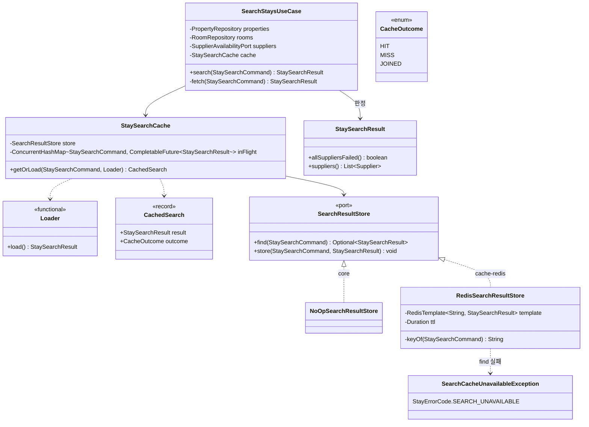
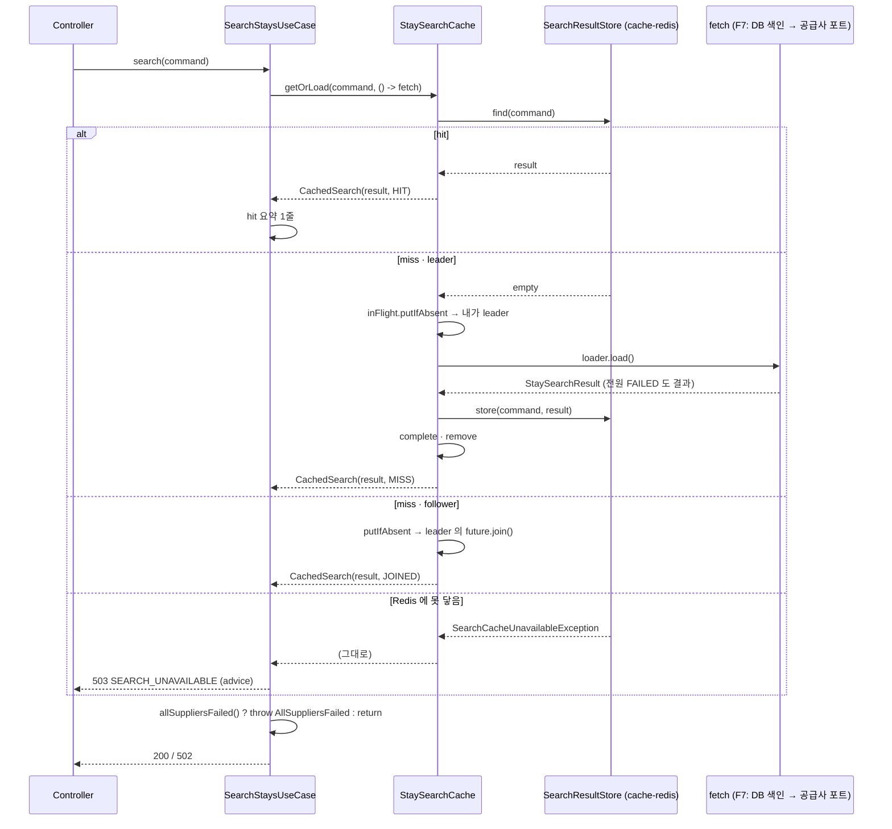

# search-cache 설계 — 검색 결과 캐시 (F10)

status: 확정
updated: 2026-09-07

## 1. 요구사항 재해석·범위

**해결하려는 문제.** 같은 검색 조건(날짜·인원 넷)으로 30초 안에 다시 들어오는 요청이 공급사를 부르지 않게 한다. 공급사 한도는 계정 단위라 `api-app` 인스턴스가 늘수록 같은 조건의 호출이 곱해지는데, 이 캐시가 그 배수를 지운다. **정확성 장치가 아니라 공급사 호출량 절감 장치**다. 검색가는 견적이고 예약 직전 재확인이 업계 표준이라 짧은 캐시는 관행과 충돌하지 않는다(§8 도메인 출처).

이 목적이 설계 전체의 방향을 정한다. 캐시는 "있으면 좋은 최적화"가 아니라 **한도 안에 머무르기 위한 장치**이므로, 캐시가 빠졌을 때 트래픽을 그대로 공급사로 흘리지 않는다(D-F10-4).

### 1.1 수용 기준

1. 동일 조건 N개 동시 요청에 공급사 호출이 **1회**다(한 인스턴스 안).
2. 30초 안의 두 번째 요청은 공급사도 DB 도 부르지 않는다.
3. 부분 실패(PARTIAL·FAILED 섞임) 응답도 그대로 30초 저장된다.
4. 두 공급사를 모두 내린 뒤 30초 안의 요청은 **호출 없이 502**가 온다. 다른 인스턴스도 같은 502 를 낸다.
5. Redis 에 못 닿으면 검색은 **503** 이고 공급사 호출은 0 이다. 503 은 명령 타임아웃(300ms) 안에 나간다.
6. 공급사를 이미 부른 뒤 저장이 실패하면 결과는 정상 반환되고 WARN 한 줄만 남는다.
7. `batch-app` 은 Redis 의존 없이 뜬다.
8. F7 의 E2E(T-15~T-19)가 무변경으로 통과한다 — 캐시가 응답 계약을 바꾸지 않는다.

### 1.2 포함

- `core.application` — `StaySearchCache`(Cache-Aside + JVM single-flight), `SearchResultStore` 포트, `NoOpSearchResultStore`, `SearchCacheUnavailableException`, `StayErrorCode.SEARCH_UNAVAILABLE`, `StaySearchResult.allSuppliersFailed()`·`suppliers()`
- `SearchStaysUseCase` 수정 — `search()` 가 캐시를 거치고, `fetch()` 는 F7 본문 그대로이되 **던지지 않는다**
- **새 모듈 `cache-redis`** — `RedisSearchResultStore`, `SearchCacheRedisConfig`, `StaySearchCacheProperties`, Testcontainers 테스트
- `api-app` — `runtimeOnly(":cache-redis")`, advice 에 503 핸들러 1개, yaml(ttl·enabled·redis 타임아웃), 테스트 yaml `enabled=false`
- `batch-app` — `SearchResultStore` 대역 빈 1줄
- `compose.yaml` — redis 서비스
- `test-standard` 환경 전제에 Testcontainers 예외 기록

### 1.3 제외

| 제외 항목 | 이유 |
|---|---|
| soft/hard 이중 TTL · 비동기 갱신 | 키 공간이 작아 만료 비용이 "키당 30초에 요청 하나가 공급사 지연을 치른다" 수준이고 측정된 문제가 없다. stale-while-revalidate(RFC 5861 §3)는 표준 패턴이지만 지금 근거가 없다 |
| 마지막 정상 값 fallback (F9 D-F9-8 이월) | 3분 전 값을 내는 것이 도메인이 반대한 "판매 불가 상품을 판매 가능처럼 노출"이다. 착수 전 two-tier 안을 이 이유로 철회했다 |
| 견적 시각(`quotedAt`) 응답 필드 | 위 fallback 이 빠지면 낡은 값이 없어 표시할 것이 없다 |
| 목록 대표 가격 | 이 경로에 닿지 않는다(README 추후 고려사항) |
| 분산 락 | 만료 순간 호출을 "인스턴스 수 → 1"로 줄이는 이득뿐인데 락 만료·leader 사망·대기 방식이 따라온다. 인스턴스 수 × 키당 30초 1건이 한도에 닿는 관측이 나오기 전에는 넣지 않는다 |
| 로컬 캐시(Caffeine) · 2단 캐시 | 공급사 한도가 계정 단위라 로컬은 인스턴스 수만큼 곱하고 롤링 배포마다 비운다(D-F10-7) |
| Redis 장애 시 로컬 5초 계층 | 두 번째 캐시 계층과 전환 로직. Redis 고가용 전제가 깨질 때 재검토(D-F10-4) |
| 503 + Retry-After (전원 실패) | 기억 잔여 시간이 근거가 되지만 그 힌트를 읽는 클라이언트가 없다. 있을 때 재검토 |
| rate limiter (F9 D-F9-10 이월) | 한도 초과가 여전히 관측되지 않고, 캐시가 먼저 호출 수를 줄인다(D-F10-14) |
| 매핑 색인(hotel list) 캐시 | 사용자 결정(2026-09-07) — 제외, 재검토 항목으로도 두지 않는다(D-F10-13) |
| Redis 호출에 서킷 | 즉시 거절 옵션이 끊김을, 타임아웃이 느림을 각각 상한한다. "타임아웃 503 반복 관측" 시 어댑터에 실패 후 N초 건너뛰기 |
| advice 의 Redis 예외 핸들러 | 어댑터가 다 잡으므로 올라올 예외가 없다. 있다면 버그라 500 이 맞다(D-F0-4) |

### 1.4 DDD 전술 패턴 — 적용하지 않는다

불변식을 지키는 Aggregate 가 없다. F7 과 같이 **유스케이스 + 캐시 컴포넌트 + 값 객체**로 간다. `core` 에 새로 생기는 것은 컴포넌트·포트·대역·예외 각 하나와 값 객체의 메서드 둘이다.

### 1.5 선행 조건 — F9 와의 순서

재시도 없이 캐시가 먼저 들어가면 1회 타임아웃이 30초 동안 그 공급사의 미노출로 굳는다. 재시도를 거친 FAILED 여야 30초 저장이 "그 시점의 사실"이다. 설계의 선행은 **F9** 다.

**구현 순서 (사용자 결정 2026-09-07).** F9 는 다른 세션에서 구현 중이다. F10 구현은 기다리지 않고 이 브랜치에서 시작하되, F9 가 병합되면 그 `main` 을 이 브랜치에 병합해 상황을 보고 수정한다. 코드 충돌은 없다 — F9 는 `core` 에 타입을 더하지 않고(F9 §2) F10 은 `supplier-client` 를 건드리지 않는다. 병합 순서가 뒤바뀌면 F9 병합 전까지 "재시도 없이 부분 실패가 30초 굳는" 구간이 생기며, 이는 알고 감수하는 것이다.

F9 는 캐시가 앞에 붙어도 서킷 설정을 그대로 둔다고 적었다(F9 설계 §3.7 — 호출이 줄어 표본이 느리게 쌓일 뿐 값의 뜻이 바뀌지 않고, 열리지 않을 때 비용이 0). F10 은 이 판단에 기대며 F9 의 수치를 건드리지 않는다.

### 1.6 착수 전에 닫힌 것 (ai-history 91·92)

| 질문 | 확정 | 탈락 사유 |
|---|---|---|
| 저장소 | Redis + JSON | 로컬 캐시: 계정 단위 한도를 인스턴스 수로 곱하고 배포마다 비운다 |
| TTL | 30초 하나, 설정 키 | soft/hard 이중: 측정된 문제 없음. 값의 근거는 정확성이 아니라 절감 배수(§8 RFC 9111 §4.2·PriceAggregator) |
| 부분 실패 응답 | 그대로 저장 | 미캐시: 장애 중 부하 증폭 · 짧은 TTL: 항목별 만료가 수단을 묶음 · 3분 마지막 정상 값: 판매 불가 노출 |
| 전원 실패 | 30초 기억 → 즉시 502 | 서킷 위임: 인스턴스별·프로세스 로컬이라 N개가 각자 실패를 겪어야 열린다(F9 D-F9-7 한계) |
| 수단 | 캐시 컴포넌트 직접 | `@Cacheable(sync=true)`: Redis 백엔드는 키 단위 single-flight 가 없고(잠금은 캐시 이름 단위), 예외는 저장되지 않으며, 오류 우회 경로에서 유스케이스 예외가 Redis 예외로 바뀐다 |

---

## 2. 도메인 모델

**Aggregate·Entity 변경 없음.** `core.domain` 은 손대지 않는다(LAY-2).

값 객체 `StaySearchResult`(application)에 메서드 둘을 더한다 — 규칙이 값 안에 산다(DDD-5).

- `allSuppliersFailed()` — `outcomes` 가 비어 있지 않고 전부 `FAILED`. **비면 false**(D-F7-15 공허참 방지를 여기로 옮긴다).
- `suppliers()` — `outcomes` 의 공급사 목록. 예외 메시지용.

---

## 3. 레이어 배치

### 3.1 모듈·패키지·클래스

```
core/src/main/java/com/stay/property/application/
├── StaySearchCache.java                 (신규) @Component. Cache-Aside + JVM single-flight
│     └ 중첩: Loader(함수형) · CachedSearch(record) · CacheOutcome(enum)
├── SearchResultStore.java               (신규) 포트 인터페이스
├── NoOpSearchResultStore.java           (신규) 대역. find → empty, store → 아무것도. 빈 등록은 각 앱이
├── SearchCacheUnavailableException.java (신규) extends BusinessException
├── StayErrorCode.java                   (수정) + SEARCH_UNAVAILABLE("Stays cannot be checked right now")
├── StaySearchResult.java                (수정) + allSuppliersFailed() · suppliers()
└── SearchStaysUseCase.java              (수정) search() 가 캐시를 거친다 · fetch() 는 던지지 않는다

cache-redis/                                       (신규 Gradle 모듈)
├── build.gradle.kts                     core · spring-boot-starter-data-redis · 테스트: starter-test · testcontainers
└── src/main/java/com/stay/property/infrastructure/
    ├── RedisSearchResultStore.java      (신규) 포트 구현. 키·TTL·직렬화·예외 변환
    ├── SearchCacheRedisConfig.java      (신규) RedisTemplate · Lettuce 커스터마이저 · SearchResultStore 빈(enabled 분기)
    └── StaySearchCacheProperties.java   (신규) record(ttl, enabled) · stay.search-cache

api-app/
├── build.gradle.kts                     (수정) runtimeOnly(project(":cache-redis"))
├── src/main/java/com/stay/common/web/GlobalExceptionHandler.java  (수정) + handleSearchCacheUnavailable → 503
├── src/main/resources/application.yaml  (수정) stay.search-cache.* · spring.data.redis.*
└── src/test/resources/application.yaml  (수정) stay.search-cache.enabled: false

batch-app/src/main/java/com/stay/batch/
└── StaySearchCacheStandIn.java          (신규) @Bean SearchResultStore → new NoOpSearchResultStore()

settings.gradle.kts                      (수정) include("cache-redis")
compose.yaml                             (수정) redis 서비스
```

의존 방향은 안쪽으로만 향한다(LAY-1). `cache-redis → core`, `api-app → core` + `runtimeOnly(cache-redis)`. `api-app` 코드는 `cache-redis` 의 클래스를 import 하지 않는다(D-MS-5 — 실수하면 컴파일 에러). `batch-app` 은 `cache-redis` 를 의존하지 않는다.

### 3.2 클래스 관계



`Loader` 를 `java.util.function.Supplier` 로 두지 않는 이유: 같은 패키지가 `com.stay.property.domain.Supplier` 를 import 하고 있어 이름이 충돌한다(DDD-1).

### 3.3 캐시 컴포넌트 절차와 포트 계약

```
getOrLoad(command, loader):
    found = store.find(command)                       # ① 못 닿으면 SearchCacheUnavailableException 이 그대로 나간다
    if found.isPresent(): return CachedSearch(found, HIT)

    mine = new CompletableFuture()
    existing = inFlight.putIfAbsent(command, mine)    # ② record 동등성이 곧 키
    if existing != null:
        return CachedSearch(existing.join() 의 결과, JOINED)   # CompletionException 은 원인으로 풀어 다시 던진다

    try:
        result = loader.load()                        # ③ 공급사 호출은 leader 만
        store.store(command, result)                  # ④ 완료 전에 저장 — 깨어난 뒤 오는 요청이 Redis 에서 만난다
        mine.complete(result)
        return CachedSearch(result, MISS)
    catch RuntimeException e:
        mine.completeExceptionally(e); throw e        # ⑤ 대기자 전원에게 같은 예외
    finally:
        if !mine.isDone(): mine.completeExceptionally(IllegalStateException)   # ⑤' Error 등 잡지 않은 갈래 — 대기자를 반드시 깨운다 (D-F10-16 ①)
        inFlight.remove(command, mine)                # ⑥ 다음 요청은 다시 leader
```

`Error` 는 잡지 않는다(CLN-6). 그 갈래에서 대기자는 "같은 원인"이 아니라 loader 가 결과 없이 끝났다는 예외로 깨어난다 — leader 에게는 `Error` 가 그대로 올라간다.

**포트 계약** (구현·테스트가 기대는 것):

1. `find` 는 저장소에 못 닿거나 값을 읽지 못하면 **`SearchCacheUnavailableException`** 을 던진다. 없으면 `Optional.empty()`.
2. `store` 는 **절대 던지지 않는다.** 실패는 구현이 WARN 한 줄(연산·키·원인 클래스)로 남긴다.
3. 같은 명령으로 `store` 한 값은 TTL 안에 `find` 로 동등하게 돌아온다(`equals`).
4. TTL 은 구현의 설정이다. 컴포넌트는 만료를 모른다.

가상 스레드에서 `join()` 은 파킹이라 플랫폼 스레드를 잡지 않는다. single-flight 는 JVM 로컬이며 만료 순간 인스턴스 사이에서는 최대 인스턴스 수만큼 호출이 나간다(D-F10-6).

### 3.4 유스케이스 변경

```
search(command):
    startedAt
    cached = cache.getOrLoad(command, () -> fetch(command))
    if cached.outcome() != MISS:                                   # HIT · JOINED
        log(hit 요약 1줄, 전원 실패면 WARN 아니면 INFO)             # §3.8
    if cached.result().allSuppliersFailed():                       # hit 든 miss 든 같은 한 줄
        throw AllSuppliersFailedException(cached.result().suppliers())
    return cached.result()

fetch(command):                                                    # F7 §3.4 본문 그대로, 두 군데만 다르다
    ... index 비면 빈 결과 (D-F7-15)
    ... collect → 정렬
    log(요약 1줄 — 전원 실패면 ERROR, 부분 실패·제외면 WARN, 그 외 INFO)
    return collected.toResult()                                    # 던지지 않는다 — 전원 FAILED 도 결과다
```

- `Collected.allFailed()` 의 판정은 `StaySearchResult.allSuppliersFailed()` 로 옮긴다. `fetch` 의 ERROR 레벨 판정은 그 메서드를 부른다(같은 사실이 두 벌이 되지 않게).
- 밖에서 보는 행동은 F7 과 같다 — T-10(전원 실패 → 예외)은 그대로 통과한다. 다만 **예외가 나기 전에 결과가 저장된다**(T-09).
- 색인이 비어 빈 결과(`([], [])`)가 나온 경우도 여느 결과처럼 30초 저장된다. 목록 동기화 직후 최대 30초 늦게 반영되는 것을 감수한다 — 저장 조건을 두면 갈래가 하나 늘고 얻는 것이 없다.

### 3.5 호출 순서



### 3.6 어댑터 — `RedisSearchResultStore`

| 항목 | 결정 |
|---|---|
| 키 | `stay-search:v1:{checkIn}:{checkOut}:{adults}:{children}` — ISO 날짜. `v1` 은 값의 JSON 모양 버전이며 `StaySearchResult` 의 필드가 바뀌면 올린다(D-F10-11). 키 문자열은 어댑터만 안다 |
| 값 | `StaySearchResult` 를 **타입 지정 JSON 직렬화기**로. `@class` 같은 타입 정보가 붙지 않는다. Spring Data Redis 4 의 Jackson 3 기반 직렬화기를 쓰며 정확한 클래스명은 구현 첫 사이클에서 확인한다. JDK 직렬화는 쓰지 않는다(§8 RedisTemplate 문서의 경고) |
| 왕복 대상 | `Money(long, Currency)` · `Supplier` enum · `Long` 식별자 · `List` — T-11 이 동등성을 고정한다 |
| TTL | `opsForValue().set(key, value, ttl)` — 쓰는 시점부터 30초. 전원 FAILED 결과도 같은 TTL |
| `find` 실패 | `DataAccessException`(연결 실패·명령 타임아웃·Redis 시스템 예외 — Spring 이 Lettuce 예외를 이 계열로 옮긴다)과 `SerializationException`(역직렬화 실패, 뿌리가 다르다) **둘만** 잡아 `SearchCacheUnavailableException(연산, 키, 원인 클래스)` 로 던진다. 그 밖의 예외는 잡지 않는다(CLN-6) |
| `store` 실패 | 같은 둘을 잡아 WARN 한 줄. 던지지 않는다 |
| 클라이언트 옵션 | Lettuce `disconnectedBehavior = REJECT_COMMANDS` — 끊긴 동안 명령을 큐에 쌓지 않고 즉시 거절. 재연결은 클라이언트가 뒤에서 한다. Boot 4.1 에서의 커스터마이저 클래스 위치는 구현 첫 사이클에서 확인 |
| 타임아웃 | `spring.data.redis.timeout`(명령) · `connect-timeout` 각 300ms. 키 존재는 Boot 4.0.6 jar 메타데이터로 확인했고 4.1 은 구현 시 재확인 |

`SearchCacheRedisConfig`:

- `@EnableConfigurationProperties(StaySearchCacheProperties.class)`
- `@Bean RedisTemplate<String, StaySearchResult>` — `StringRedisSerializer` 키, 위 JSON 값 직렬화기. 자동설정의 `RedisConnectionFactory` 를 받는다
- `@Bean LettuceClientConfigurationBuilderCustomizer` — 위 옵션
- `@Bean SearchResultStore` — `enabled=true`(기본)면 `RedisSearchResultStore`, `false` 면 `NoOpSearchResultStore`. 조건은 `@ConditionalOnProperty`

`StaySearchCacheProperties(Duration ttl, boolean enabled)` — `@ConfigurationProperties("stay.search-cache")`. `ttl` 이 없거나 0 이하면 생성자에서 `IllegalArgumentException`(F3a `FanOutProperties` 와 같은 방식, 기동 실패). `enabled` 기본 true.

### 3.7 응답 계약

**추가되는 것은 503 하나다.** F7 의 200·400·502 는 바뀌지 않는다.

```json
HTTP 503
{ "code": "SEARCH_UNAVAILABLE", "message": "Stays cannot be checked right now", "time": "...", "data": null }
```

- 코드와 문구는 원인(Redis·캐시)이 아니라 **사용자에게 보이는 사실**을 말한다(D-F0-10). 예외 클래스 이름은 내부용이라 원인을 드러낸다.
- 503 을 고르는 근거: 우리 인프라의 문제라 "이 서버가 잠시 서비스 불가"와 정확히 맞는다. F7 이 전원 실패에 503 을 탈락시킨 이유(상류 문제인데 우리 서버 문제처럼 보인다, `Retry-After` 근거 없음)는 여기 해당하지 않는다. `Retry-After` 는 싣지 않는다 — 복구 시점을 모른다.
- 200 + 빈 결과로 내지 않는 이유는 D-F7-3 과 같다 — "매물 없음"과 바이트 단위로 같아지고, 프록시가 빈 결과를 캐시하며, 상태 코드 알람에 안 걸린다.
- API 문서(D-F7-10)에 503 응답이 추가된다 — T-17 이 스니펫을 만든다.

### 3.8 로그 규칙

"검색 1건 = 요약 1줄"(F7 §3.8)을 지킨다.

| 경로 | 누가 | 형식 · 레벨 |
|---|---|---|
| MISS(loader 실행) | `fetch` | **F7 형식 그대로, 레벨 규칙 그대로.** 이 줄만이 공급사별 성공률의 재료다 |
| HIT · JOINED | `search()` | `searchStays checkIn=… checkOut=… adults=… children=… cache=HIT results=5 elapsedMs=1` (`cache=` 값은 HIT/JOINED). 기억된 전원 실패면 **WARN**(알려진 이상을 다시 만난 것 — 조치 대상은 최초 실패 때 ERROR 로 올라갔다), 아니면 INFO |
| Redis 읽기 실패 | advice 503 핸들러 | ERROR — 조치 필요(우리 인프라). 예외 메시지(연산·키·원인 클래스)와 **cause 스택**을 로그에만 (D-F10-16 ②). 응답에는 코드·문구뿐 |
| Redis 쓰기 실패 | 어댑터 | WARN 한 줄. 결과는 정상 반환 |

- 적중률 = `cache=` 필드가 있는 줄 ÷ 전체 검색 줄. F7 줄의 형식은 바뀌지 않으므로 기존 파서와 k6 검사가 그대로 선다.
- advice 가 502 마다 남기는 ERROR(F7)는 그대로다. 기억된 502 도 그 ERROR 를 낸다 — 이번 범위에서 손대지 않고, 시끄러우면 F7 advice 로그 레벨을 별도로 본다.

### 3.9 설정

```yaml
# api-app/src/main/resources/application.yaml (추가분)
stay:
  search-cache:
    ttl: 30s              # 정확성이 아니라 절감 배수의 값. 실측 후 재조정
    enabled: true
spring:
  data:
    redis:
      connect-timeout: 300ms
      timeout: 300ms      # 명령 타임아웃. 503 은 이 안에 나간다
# 접속 정보는 compose 자동 감지 (spring-boot-docker-compose 가 redis 이미지를 인식한다)

# api-app/src/test/resources/application.yaml (추가분)
stay:
  search-cache:
    ttl: 30s
    enabled: false        # NoOp — F7 E2E 가 무변경으로 통과하는 근거
```

```yaml
# compose.yaml (추가분)
  redis:
    image: redis:8          # 태그는 구현 시 Docker Hub 최신 안정판으로 확인
    ports:
      - "6379"
    healthcheck:
      test: ["CMD", "redis-cli", "ping"]
      interval: 5s
      timeout: 3s
      retries: 10
```

`batch-app` 의 `bootRun` 도 compose 파일 전체를 올리므로 redis 컨테이너가 함께 뜬다. 배치는 연결하지 않으므로 낭비일 뿐 오류는 아니다. compose 프로파일로 가르는 것은 지금 하지 않는다.

### 3.10 batch-app

`com.stay` 스캔(D-F6-13)으로 `SearchStaysUseCase` 가 이미 배치에 뜨고, 이번에 그 생성자가 `StaySearchCache` → `SearchResultStore` 빈을 요구한다. `batch-app` 은 `cache-redis` 를 의존하지 않으므로 `StaySearchCacheStandIn` 설정 클래스에서 `@Bean SearchResultStore` 로 `NoOpSearchResultStore` 를 돌려준다(D-F10-5). 기존 `CatalogSyncE2ETest` 가 컨텍스트 기동을 덮는다.

---

## 4. 적용 패턴

| 패턴 | 격리하는 변화 | 검토한 대안 |
|---|---|---|
| **Cache-Aside + single-flight** (`StaySearchCache`) | "언제 부르고 언제 저장하나"가 유스케이스 본문과 분리된다. 정책(키·동시 miss·저장 조건)이 바뀌어도 `fetch` 는 그대로다 | 유스케이스 인라인(변경 이유가 둘, F7 테스트 12개가 캐시를 거침) · 데코레이터(같은 타입 빈 둘의 배선 위험, 클래스 3개) — D-F10-1 |
| **Port/Adapter** (`SearchResultStore` ↔ `RedisSearchResultStore`) | 저장소와 그 예외 체계. `core` 는 Redis 라는 단어를 모른다. 이 저장소가 이미 하는 모양(D-MS-4·5) | Spring `Cache` 추상화(core 가 Redis 예외를 `RuntimeException` 으로 넓게 잡아야 하고 어노테이션 0개인 인터셉터가 뜬다) — D-F10-2 |
| **Null Object** (`NoOpSearchResultStore`) | "캐시 없음"이 분기가 아니라 구현 하나다. 테스트·배치가 같은 것을 쓴다 | `ObjectProvider` 선택 주입(설정 실수가 조용한 무캐시가 된다) — D-F10-5 |

`PAT-2`(Rule of Three)에 걸리지 않는 이유: 포트·어댑터·대역은 추상화를 새로 만드는 것이 아니라 **F3a·F5·F7 이 세운 모양을 한 번 더 따르는 것**이다.

---

## 5. 테스트 리스트

| ID | 레이어 | 분류 | 케이스 | 기법 | 기대 결과 |
|---|---|---|---|---|---|
| T-01 | core | Normal | 저장된 결과가 없으면 | ECP | loader 1회 · 결과가 store 에 저장 · outcome MISS |
| T-02 | core | Normal | 저장된 결과가 있으면 | ECP | loader 0회 · outcome HIT · 저장값 그대로 |
| T-03 | core | Normal | 전원 OK / 부분 실패 / 전원 FAILED 결과 (Parameterized 3) | Decision Table | 셋 다 그대로 저장된다 |
| T-04 | core | Interaction | 같은 명령 N건이 동시에 miss 면 | Error Guessing | loader 1회 · 전원 같은 결과 · leader 외 JOINED |
| T-05 | core | Invalid | leader 의 loader 가 예외를 던지면 | Error Guessing | 대기자 전원에게 같은 예외 · 다음 요청은 다시 loader 를 부른다 |
| T-06 | core | Invalid | `find` 가 `SearchCacheUnavailableException` 을 던지면 | Error Guessing | 그대로 전파 · loader 0회 |
| T-07 | core | Interaction | 캐시에 전원 FAILED 결과가 있으면 (유스케이스) | Decision Table | 리포지토리·포트 호출 0 · `AllSuppliersFailedException` |
| T-08 | core | Interaction | 캐시에 정상 결과가 있으면 (유스케이스) | Decision Table | 리포지토리·포트 호출 0 · 그 결과 반환 |
| T-09 | core | Interaction | 공급사 전원 실패로 fetch 하면 (유스케이스) | Decision Table | 전원 FAILED 결과가 store 에 저장된 뒤 예외 |
| T-10 | core | Boundary | `allSuppliersFailed()` — outcomes 빈 / 전부 FAILED / 하나라도 OK·PARTIAL (Parameterized 3) | Decision Table | false / true / false |
| T-11 | cache-redis | Normal | store 후 find (Testcontainers) | ECP | 동등한 `StaySearchResult` — Money·Currency·enum·Long 왕복 |
| T-12 | cache-redis | Normal | 저장된 원시 값 (Testcontainers) | ECP | 키 `stay-search:v1:…` · 값이 `{` 로 시작하는 JSON |
| T-13 | cache-redis | Boundary | ttl 1s 로 저장 후 경과 (Testcontainers) | BVA | find 가 empty |
| T-14 | cache-redis | Invalid | 닫힌 포트를 향한 연결 팩토리로 | Error Guessing | find 는 `SearchCacheUnavailableException` · store 는 예외 없음 (Docker 불필요) |
| T-15 | cache-redis | Invalid | ttl 부재 / 0 / 음수 (Parameterized 3) | BVA | 프로퍼티 생성 실패, 메시지에 키 |
| T-16 | cache-redis | Normal | enabled true / false (Parameterized 2) | Decision Table | Redis 구현 / NoOp 이 빈으로 뜬다 |
| T-17 | E2E | Interaction | `SearchResultStore` 가 못 닿는다고 던지면 | Decision Table | **503** · `SEARCH_UNAVAILABLE` · `data` null · 문서 스니펫 생성 |

**레이어별 방식** (TST-3): core 컴포넌트는 순수 JUnit — `SearchResultStore` 의 **맵 기반 가짜**(테스트 소스, 예외를 던지게 할 수 있는 스위치 포함)와 람다 loader. T-04·05 는 `CountDownLatch` 로 loader 를 붙들고 가상 스레드 N개로 동시에 부른다. 유스케이스(T-07~09)는 F7 방식 그대로 `@ExtendWith(MockitoExtension)` 에 리포지토리·포트 `@Mock`, `StaySearchCache` 는 가짜 store 를 넣은 실물. cache-redis 통합은 `@SpringBootTest` 없이 `LettuceConnectionFactory` + `RedisTemplate` 을 직접 만들어 Testcontainers 컨테이너에 붙인다(`persistence` 의 `@DataJpaTest` 처럼 그 모듈이 자기 테스트를 갖는다). T-16 은 `ApplicationContextRunner`. T-17 은 F7 E2E 클래스에 `@MockitoBean SearchResultStore` 하나로 — 외부 저장소 경계의 포트이므로 TST-3 의 허용 범위다.

**Docker 없는 환경** (D-F10-12): T-11~13 은 `@Testcontainers(disabledWithoutDocker = true)` 로 건너뛴다(⏭). 정리표에 건너뜀 사유를 남기고, Docker 가 있는 환경에서 돌린 결과를 `02-implementation.md` 에 기록한다. T-14 는 컨테이너 없이 돈다.

**만들지 않는 것 (TDD-8).** F7 E2E T-15~T-19 는 `enabled=false` 로 **무변경 통과**가 곧 검증이다 · `batch-app` 컨텍스트는 기존 `CatalogSyncE2ETest` 가 덮는다 · Lettuce 즉시 거절 옵션 자체(라이브러리 동작) · hit 로그 출력(F7 과 같은 이유 — 부수효과라 검증이 취약) · `NoOpSearchResultStore`(단순 위임 이하) · `Properties → 빈` 단순 위임.

**Testcontainers 의존성.** Boot 4.1 BOM 이 관리하는 Testcontainers 2.x 아티팩트(`org.testcontainers:testcontainers-junit-jupiter` 계열)를 `cache-redis` 의 `testImplementation` 으로만 넣는다. 정확한 아티팩트 이름은 구현 첫 사이클에서 BOM 으로 확인한다. `test-standard` 환경 전제에 "첫 컨테이너 의존 — cache-redis 의 Redis 왕복 테스트 3개만, Docker 없으면 건너뜀"을 기록한다.

---

## 6. 결정 카드

| ID | 질문 | 검토한 안 | 결정 | 탈락 사유 | 구현 차단 |
|---|---|---|---|---|---|
| D-F10-1 | 캐시가 끼는 자리 | 유스케이스 인라인 / 인터페이스 + 데코레이터 / **유스케이스가 부르는 컴포넌트** | **컴포넌트.** `search()` = `cache.getOrLoad(cmd, () -> fetch(cmd))` → 판정 | 인라인: 변경 이유가 둘(OOP-3), F7 테스트 12개가 캐시를 거쳐 손봐야 함 · 데코레이터: `SearchStays` 인터페이스 신설 + 같은 타입 빈 둘을 두 앱에서 `@Primary` 로 고정해야 하고 실수하면 조용히 캐시 없이 돈다. 전원 실패 기억이 delegate 의 예외를 잡아야 해 F7 의 throw 구조를 알아야 함 | 예 |
| D-F10-2 | 저장소 접근 수단 | **자체 포트 + `cache-redis` 어댑터** / Spring `Cache` 추상화 + 자동설정(설정은 모듈) / Spring `Cache` + 설정은 api-app | **포트 + 모듈.** `SearchResultStore` 는 `core.application`, 구현·설정·Testcontainers 는 `cache-redis` | Spring `Cache`: core 가 Redis 예외를 `RuntimeException` 으로 넓게 잡아야 한다(연결·타임아웃과 직렬화 실패의 뿌리가 다름) · 어노테이션 0개인데 `@EnableCaching` 인터셉터가 뜬다 · 범용 직렬화기라 `@class` 가 붙는다 · api-app 설정: D-MS-5(api-app 은 presentation, 어댑터는 runtimeOnly)와 어긋난다. **AI 의 첫 추천이 api-app 설정이었고 사용자 질문("모듈 따로 아니었나")으로 관례를 빠뜨린 것이 드러나 뒤집혔다** | 예 |
| D-F10-3 | 전원 실패의 기억 형태 | 래퍼 타입 / 실패 전용 캐시 둘째 / **결과 그대로 + 읽는 쪽 판정** | **결과 그대로.** `outcomes` 전부 FAILED 인 `StaySearchResult` 를 여느 결과처럼 저장, `allSuppliersFailed()` 로 판정 | 래퍼: 캐시 전용 타입 + 같은 사실 두 벌(플래그 vs outcomes), 예외를 값으로 값을 다시 예외로 · 캐시 둘: 요청마다 왕복 둘, "둘 중 하나만"을 코드가 지켜야 함, 실패 TTL 을 따로 줄 자유도는 지금 필요 없음 | 예 |
| D-F10-4 | Redis 장애 처리 | 우회(fail-open) / **읽기 실패 503(fail-closed)** / 로컬 5초 계층 | **읽기 실패는 503 `SEARCH_UNAVAILABLE`, 쓰기 실패는 WARN + 결과 반환.** 즉시 거절 옵션 + 300ms 타임아웃이 조건 | 우회: 캐시가 한도 안에 머무르기 위한 장치라 적중률 0 × 인스턴스 수를 공급사로 흘리는 것은 우리가 한도를 깨는 경로다. 끝은 429 → 서킷 → 전원 실패 502 이고 그 502 는 기억되지도 않는다. 공급사·Redis 동시 장애에서 보호가 0 · 로컬 5초: 두 번째 캐시 계층(TTL 맵 또는 제외한 Caffeine)과 전환 로직, 근거 없는 숫자 하나 더. **AI 의 첫 추천이 우회였고 사용자의 "잠시 서버 오류로" 제안으로 다시 재서 뒤집혔다** | 예 |
| | | | **전제와 재검토** | Redis 고가용 구성은 F10 밖(배포)의 전제다. Redis 장애가 길거나 잦다고 관측되면 로컬 5초 계층으로 간다. "타임아웃 503 반복 관측" 시 어댑터에 실패 후 N초 건너뛰기 | |
| D-F10-5 | batch-app 기동 | **대역 NoOp 빈** / 스캔에서 검색 빈 제외 / core 가 `ObjectProvider` 선택 주입 | **대역 빈 한 줄** (`StaySearchCacheStandIn`) | 스캔 제외: 목록이 검색 클래스마다 자라고 빠뜨리면 엉뚱한 빈이 조용히 뜬다, D-F6-13 을 다시 연다 · 선택 주입: api-app 설정 실수 = 조용한 무캐시로 D-F10-4 와 모순 | 예 |
| | | | **구조 변경은 이연** | 검색 전용 배선이 배치에 들어온 두 번째 사례(첫째는 fan-out yaml). **세 번째가 오면** 앱이 스캔 범위를 정하도록(`@Import`) 바꾼다 — application 을 검색/수집 하위 패키지로 나누는 안, core 를 둘로 쪼개는 안은 그때 함께 본다 | |
| D-F10-6 | single-flight 수단 | JVM 로컬 `CompletableFuture` 맵 / Redis 분산 락 / 없음 | **JVM 로컬.** `putIfAbsent` 반환값이 leader/follower 를 가른다 | 분산 락: 만료 순간 호출을 "인스턴스 수 → 1"로 줄이는 이득뿐, 락 만료·leader 사망·대기 방식이 따라온다. 관측 전 미도입 · 없음: 30초마다 스탬피드 | 예 |
| D-F10-7 | 저장소 (착수 전) | 로컬 캐시 / **Redis** | Redis + JSON | 로컬: 계정 단위 한도를 인스턴스 수로 곱하고 롤링 배포마다 비어 공급사에 몰린다 | 예 |
| D-F10-8 | TTL 과 부분 실패 (착수 전) | 이중 TTL / 미캐시 / 짧은 TTL / 3분 마지막 정상 값 / **30초 하나 · 부분 실패 그대로** | 30초 하나, 설정 키 | §1.6 | 예 |
| D-F10-9 | 수단 (착수 전) | `@Cacheable(sync=true)` / **컴포넌트 직접** | 컴포넌트 직접 | §1.6 | 예 |
| D-F10-10 | hit 로그 | 갈래마다 / **유스케이스가 짧은 1줄** / 컴포넌트가 남김 | 유스케이스가 `cache=HIT|JOINED` 1줄, 기억된 실패는 WARN | 컴포넌트가 남김: "검색 1건 = 1줄" 규칙의 소유자가 둘이 된다 · ERROR: 조치 대상은 최초 실패 때 이미 올라갔다 | 아니오 |
| D-F10-11 | 키 버전 접두 | 없음 / **`v1:`** | `v1:` — JSON 모양이 바뀌면 올린다 | 없음: 롤링 배포 중 구·신 인스턴스가 서로 못 읽는 값을 30초씩 주고받아 배포 때마다 503 이 난다 | 아니오 |
| D-F10-12 | Docker 없는 환경 | 실패 / **건너뜀** | Testcontainers 테스트 ⏭, 사유는 정리표에 (사용자 결정) | 실패: 커밋 전 검사가 로컬 Docker 에 묶인다 | 아니오 |
| D-F10-13 | 매핑 색인 캐시 | 포함(Redis 1h + 배치 지우기) / 포함(로컬 1h) / **제외** | 제외, 재검토 항목으로도 두지 않는다 (사용자 결정) | 배치 지우기: 배치가 Redis 를 알게 된다, TTL 이 이미 낡음의 상한이라 지우기의 이득은 하루 한 번 최대 1시간 · 로컬 1h: miss 당 SELECT 2건이 측정된 문제가 아니다 | 아니오 |
| D-F10-14 | rate limiter (F9 이월) | 지금 / **제외** | 제외 | F9 §1.1 의 관측 조건이 여전히 성립하지 않고, 캐시가 먼저 호출 수를 줄인다 | 아니오 |
| D-F10-15 | 구현 순서 (사용자 결정) | F9 병합 대기 / **지금 시작** | 지금 시작, F9 병합 후 이 브랜치에 병합해 재검토 (§1.5) | 대기: 시간이 없다. 코드 충돌이 없어 순서를 바꿔도 되돌릴 것이 없다 | 아니오 |
| D-F10-16 | 리뷰 round-1 warn 반영 (2026-09-07, 사용자 확인) | ① `Error` 대응: `catch (Throwable)` / **`finally` 에서 미완료 future 를 `completeExceptionally`** ② cause 체인: 어댑터가 스택을 WARN 으로 따로 찍기 / **`BusinessException` 에 `(ErrorCode, String, Throwable)` 생성자 추가** ③ `store` 실패 WARN 에 예외 객체 | ①②③ 모두 반영. ②는 F0 영역(`common.error`)의 **추가**이며 기존 생성자는 그대로다. 503 핸들러는 예외 객체를 로거에 넘겨 스택이 advice ERROR 한 줄에 남는다 | `catch (Throwable)`: CLN-6 의 catch-all 이고 `Error` 는 그대로 올라가야 한다 · 어댑터 WARN 분리: 같은 장애가 두 줄로 갈려 조사 시작점이 둘이 된다 | 아니오 |

---

## 7. 검증 계획 — 실측

목으로 대체한 자동 테스트가 못 잡는 것은 모의 서버·Redis 를 실제로 띄워 본다. 결과는 `02-implementation.md` 「실제로 돌려서 확인한 것」에 남긴다.

| 확인할 것 | 왜 실측인가 | 수단 |
|---|---|---|
| 동일 조건 N 동시 요청에 공급사 호출 1회 | in-flight 맵은 단위 테스트가 잡지만, 실제 서블릿 경로에서 가상 스레드 N개가 한 JVM 안에서 합쳐지는지는 소켓을 열어야 보인다 | k6 동시 N + 모의 서버 접근 로그 |
| 30초 안 두 번째 요청이 공급사에 닿지 않는다 | 위와 같다 | k6 순차 2회 + 접근 로그 |
| 두 공급사를 내린 뒤 30초 안 요청이 호출 없이 502 | negative cache 의 end-to-end | 모의 서버 A·B 장애 모드 |
| Redis 를 내리면 503 이 300ms 안에 | 즉시 거절 옵션과 타임아웃이 실제로 먹는지 | `docker stop` + k6 p95 |
| Redis 장애 중 ERROR 로그 바이트/초 | 503 마다 cause 스택이 붙으므로(D-F10-16 ②) 높은 트래픽에서 로그 파이프라인이 먼저 깨질 수 있다 — 리뷰 round-2 재검토 제안. 스택을 줄이거나 샘플링할지는 이 수치로 정한다 | 위 실측과 같은 자리에서 로그 크기 측정 |
| 저장된 JSON 의 모양 | 문서가 아니라 눈으로 | `redis-cli GET` |

---

## 8. 참고 문서

### 선행·관련 설계
- `docs/features/stay-search-api/01-design.md` — §3.4 절차 · §3.7 status 판정 · §3.8 로그 · D-F7-3 502 · D-F7-6 트랜잭션 없음 · D-F7-15 공허참 · D-F7-16 advice 이연
- `docs/features/supplier-resilience/01-design.md` (F9 브랜치, 설계 확정·구현 중) — D-F9-7 서킷의 프로세스 로컬 한계 · D-F9-8·10 이월 항목 · §2 `core` 무변경 · §3.7 캐시가 붙어도 서킷 설정 유지
- `docs/features/module-split/01-design.md` — D-MS-4 포트 소유 · D-MS-5 runtimeOnly 어댑터
- `docs/features/api-response/01-design.md` — D-F0-4·10 · 예외 타입 = 오류 유형
- `docs/features/catalog-sync/01-design.md` — D-F6-13 스캔 범위
- 착수 전 대화: `docs/ai-history.md` 91·92번
- 프로젝트 규칙: `.claude/skills/coding-standard`, `.claude/skills/test-standard`, `.claude/publish-checks.md`
- 시각화: `docs/features/search-cache/design.html` (결정의 원본은 이 md)

### 검증 통과 출처 (tech-research + domain-analysis, 51건 PASS)
- Redis Cache :: Spring Data Redis 4.1.1 — https://docs.spring.io/spring-data/redis/reference/redis/redis-cache.html — "RedisCacheManager defaults to a lock-free RedisCacheWriter", "Locking applies on the cache level, not per cache entry" (D-F10-9)
- Cacheable (Spring Framework 7.0.9 API) — https://docs.spring.io/spring-framework/docs/current/javadoc-api/org/springframework/cache/annotation/Cacheable.html — `sync()` 제약: `unless` 병용 불가, 캐시 하나만, 다른 캐시 연산과 조합 불가 (D-F10-9)
- DefaultRedisCacheWriter.java (spring-data-redis main) — https://raw.githubusercontent.com/spring-projects/spring-data-redis/main/src/main/java/org/springframework/data/redis/cache/DefaultRedisCacheWriter.java — 잠금 키 `name + "~lock"`, `Thread.sleep` 폴링 (D-F10-9)
- AbstractCacheInvoker.java (spring-framework main) — https://raw.githubusercontent.com/spring-projects/spring-framework/main/spring-context/src/main/java/org/springframework/cache/interceptor/AbstractCacheInvoker.java — 오류 우회 경로에서 유스케이스 예외가 Redis 예외를 cause 로 한 예외로 되던져진다 (D-F10-9)
- Working with Objects through RedisTemplate :: Spring Data Redis 4.1.1 — https://docs.spring.io/spring-data/redis/reference/redis/template.html — JDK 직렬화의 원격 코드 실행 경고, JSON 권고 (§3.6)
- Spring Boot 4.0 Migration Guide — https://github.com/spring-projects/spring-boot/wiki/Spring-Boot-4.0-Migration-Guide — 모듈 `spring-boot-data-redis`, Jackson 3 `tools.jackson` (§3.6)
- Development-time Services :: Spring Boot 4.1.1 — https://docs.spring.io/spring-boot/reference/features/dev-services.html — compose 의 `redis` 이미지 자동 감지 (§3.9)
- Build Systems :: Spring Boot 4.1.1 — https://docs.spring.io/spring-boot/reference/using/build-systems.html — `spring-boot-starter-data-redis` 유지
- Cache.java (ben-manes/caffeine master) — https://raw.githubusercontent.com/ben-manes/caffeine/master/caffeine/src/main/java/com/github/benmanes/caffeine/cache/Cache.java — "applied at most once per key": single-flight 의 의미론 참조 (D-F10-6)
- Caching challenges and strategies (AWS Builders' Library) — https://aws.amazon.com/builders-library/caching-challenges-and-strategies/ — 오류 시 캐시에 무언가를 두는 두 방법 중 하나로 negative cache · "the upstream service will continue to bombard it with traffic" · thundering herd 와 request coalescing · TTL 을 정하고 다시 안 보는 것을 피하라 (D-F10-3·6·8)
- RFC 9111 HTTP Caching — https://www.rfc-editor.org/rfc/rfc9111.html — §4.2 fresh 응답은 원본에 닿지 않고 재사용: TTL 은 정확성이 아니라 원본 호출 절감 (D-F10-8)
- RFC 9110 HTTP Semantics — https://www.rfc-editor.org/rfc/rfc9110.html — 502·503·504 는 heuristically cacheable 로 정의되지 않음: 전원 실패 기억은 HTTP 캐시 관행 밖의 애플리케이션 정책임을 명시 (D-F10-3)
- RFC 5861 HTTP Cache-Control Extensions for Stale Content — https://www.rfc-editor.org/rfc/rfc5861.html — §3·§4 stale-while-revalidate / stale-if-error: 제외 항목의 표준 근거 (§1.3)
- RFC 2308 Negative Caching of DNS Queries — https://www.rfc-editor.org/rfc/rfc2308.html — §7.1 서버 실패 응답 캐시는 MAY, 상한 있음 (D-F10-3)
- Google SRE Book, Ch.22 Addressing Cascading Failures — https://sre.google/sre-book/addressing-cascading-failures/ — 캐시 적중률 하락 → RPC 증가 → 과부하 경로(원문의 원인은 RAM 부족이며 캐시 부재 상황에의 적용은 유추), fail early (D-F10-4)
- Caching guidance (Azure Architecture Center) — https://learn.microsoft.com/en-us/azure/architecture/best-practices/caching — 만료가 너무 짧으면/길면 (D-F10-8)
- Caching strategies for Memcached (Amazon ElastiCache User Guide) — https://docs.aws.amazon.com/AmazonElastiCache/latest/dg/Strategies.html — TTL 은 낡음을 없애지 않고 "too stale" 만 막는다 (D-F10-8)
- Circuit Breaker pattern (Azure Architecture Center) — https://learn.microsoft.com/en-us/azure/architecture/patterns/circuit-breaker — Open 즉시 실패, Half-Open (Redis 서킷 제외의 비교 대상)
- PriceAggregator: An Intelligent System for Hotel Price Fetching (arXiv:2008.02087) — https://arxiv.org/abs/2008.02087 — TTL 의 세 역할(Cache Hit·QPS·Price Accuracy), QPS 한도 초과는 공급사에 치명적 (§1, D-F10-8)
- About this API (Expedia Rapid, Shopping) — https://developers.expediagroup.com/rapid/lodging/shopping/about-shopping-api — 예약 전 요금 재확인 절차 (§1)
- Common error responses (Expedia Rapid) — https://developers.expediagroup.com/rapid/lodging/reference/error-responses — 가격 불일치는 "an expected situation" (§1)
- Workflow (Hotelbeds Booking API) — https://developer.hotelbeds.com/documentation/hotels/booking-api/workflow/ — RECHECK(CheckRate) (§1)
- Hotel APIs Tutorial (Amadeus for Developers) — https://raw.githubusercontent.com/amadeus4dev/developer-guides/master/docs/resources/hotels.md — 검색과 예약 사이에 가용성이 바뀔 수 있음, offerId 재조회 (§1)
- Using the API (Booking.com 레거시 Demand API v2.6) — https://legacy.developers.booking.com/api/commercial/index.html?version=2.6&page_url=usage-information — 실시간 요금·재고는 캐시하지 말 것: 캐시 허용은 공급사 계약 조건이라 TTL 은 설정 키 (D-F10-8)
- Query Messages (Google Hotel Prices) — https://developers.google.com/hotels/hotel-prices/dev-guide/query-messages — 미응답 공급사는 그 검색에서만 제외(부분 실패 캐시의 반대 관행 — 재시도 선행으로 답한다, §1.5)

**확인 못 함 (기재하지 않음):** 검색 캐시 TTL 의 공개 수치 · 국내 대형 숙박 플랫폼 기술블로그의 검색 캐시 글 · 부분 실패 시 사용자 화면 문구의 공개 근거 · Boot 4.1 에서의 `spring.data.redis.timeout` 존재(4.0.6 jar 메타데이터로만 확인).

### 이번 범위에서 함께 고치는 문서

| 문서 | 고칠 것 |
|---|---|
| `docs/features/README.md` | F10 절 — "Redis 장애 시 우회" 를 **503** 으로, "설정은 api-app" 을 **`cache-redis` 모듈**로 정정 · 완료 기준의 "Redis 를 내려도 200" 을 "503 이 300ms 안에" 로 · 상태표 F10 설계 날짜 |
| `.claude/skills/test-standard/SKILL.md` | 환경 전제에 Testcontainers 예외 기록 |
| `docs/features/stay-search-api/01-design.md` | D-F7-16 행에 "F10 의 503 핸들러가 두 번째 사례" 한 줄 |
| `docs/ai-history.md` | 설계 대화의 의사결정 여정 (93번) |
| `docs/test-cases.md` | T-01~T-17 정리표 (구현 단계에서 누적) |

### F9 와의 병합 조정
- F9 는 다른 세션에서 구현 중이다. F9 가 `main` 에 병합되면 그 `main` 을 이 브랜치에 병합하고 상황을 보고 수정한다(D-F10-15).
- 코드 충돌은 없다 — F9 는 `core` 를 건드리지 않고 F10 은 `supplier-client` 를 건드리지 않는다.
- `docs/features/README.md` 상태표는 F9 도 같은 표(F9 행)를 고치고 F10 행과 이웃이다. 나중에 병합하는 쪽이 그 hunk 를 손으로 푼다. `docs/features/stay-search-api/01-design.md` 도 양쪽이 고치지만 자리가 다르다(F9 는 §3.9, F10 은 D-F7-16).
