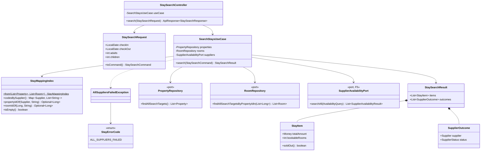
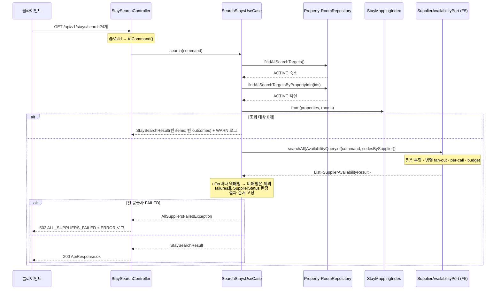

# stay-search-api 설계 — 통합 검색 API + 부분 실패 (F7, F8 흡수)

status: 확정
updated: 2026-09-07

> 개발용 SSOT. 구현(`dev-checkpoint`)은 이 파일만 읽는다. 검토용 시각화는 `design.html`이며 결정의 원본이 아니다.

---

## 1. 요구사항 재해석·범위

### 해결하려는 문제

요청 1건이 **매핑 조회 → 공급사 병렬 호출 → 역매핑 → 응답**을 끊김 없이 지나는 첫 end-to-end 경로를
만든다. F1·F3a·F3·F5·F6이 각각 만들어 둔 조각을 하나의 흐름으로 잇는 자리이며, 이 흐름이 동작하는 것이
프로젝트의 최우선 요건이다.

### F8(부분 실패)을 이번 범위로 흡수한다

F8에 실제로 남아 있던 것은 두 개뿐이었다. 나머지는 F5가 실패를 값으로 돌려주면서, 또는 F7이 응답 계약을
만들면서 이미 이쪽으로 넘어와 있다.

| F8 원래 항목 | 지금 상태 | 이번 처리 |
|---|---|---|
| 실패를 값으로 취급하는 aggregate | F5가 `SupplierAvailabilityResult(offers, failures)`로 이미 값으로 준다 | F7이 쓰기만 한다 |
| `suppliers[]` status | F7이 응답 계약을 만드는 자리 | §3.7 |
| 실패 유형별 status 표 | `reason`을 응답에서 빼기로 해 판정이 단순해졌다 | §3.7 표 하나 |
| 묶음 일부 실패 → PARTIAL | F5의 `failures`가 묶음 단위로 온다 | §3.7 |
| **전 공급사 실패 시 응답** | **미결이었다** | D-F7-3 |
| **로그·지표에 남길 최소 정보** | **미결이었다** | §3.8 |

나눠 두면 **F7 구현이 전원 실패 경로에서 무엇을 해야 할지 모르는 채 코드를 쓰게 된다.** 그래서 합친다.
상태표에는 F4→F3 선례와 같은 표기(`F8 | F7에 통합`)로 남긴다.

### 수용 기준

1. 정상 모드에서 검색 1건에 A·B 상품이 합쳐진 응답이 오고 `suppliers[]`가 모두 OK다.
2. 응답에 필수 정보 7종이 모두 있다 — 내부 숙소 ID·숙소명, 내부 객실 타입 ID·객실 타입명, 최대 수용 인원,
   예약 가능 객실 수, 출처 공급사, 요금, 그리고 **부분 실패 사실**.
3. B를 장애·무응답 모드로 두면 A 결과만 담긴 응답이 예산 시간 안에 오고, `suppliers[]`에 B가 FAILED로 남는다.
4. A·B 둘 다 실패하면 502와 `ALL_SUPPLIERS_FAILED`가 나가고 ERROR 로그가 남는다.
5. 매핑에 없는 공급사 코드가 섞여 와도 **그 항목만** 빠지고 검색은 성공한다.
6. `bookableRooms`가 0인 항목이 `soldOut: true`로 결과에 남는다.
7. 검색 대상은 **ACTIVE 매핑만**이다. INACTIVE 숙소·객실은 공급사에 물어보지도 않는다.
8. 검색 API 문서가 테스트 실행의 산출물로 만들어지고, 서버 없이 브라우저로 열린다.

### 포함

- 자사 API 계약 — 요청 파라미터 4개와 검증, 응답 `results[]` + `suppliers[]` (§3.5)
- `SearchStaysUseCase`와 그 값들 (`StaySearchCommand`·`StaySearchResult`·`StayItem`·`SupplierOutcome`·`SupplierStatus`)
- 매핑 색인 `StayMappingIndex` — 공급사별 코드 목록과 역매핑을 함께 든다
- 리포지토리 포트 2개에 조회 메서드 추가 (ACTIVE 필터를 메서드 안에 둔다)
- 부분 실패 표기와 전원 실패 응답 (`StayErrorCode`·`AllSuppliersFailedException`)
- 검색 1건당 요약 로그 1줄과 레벨 승격 규칙 (§3.8)
- API 문서 자동화 — `restdocs-api-spec` 배선과 `api-docs/index.html` (§8)
- 루트 `README.md` 신설 (§8)
- `k6/app-search.js` 채우기 — 날짜 표기·예산·부분 실패의 실측 (§7)
- 타임아웃 값 실측과 근거 기록 (§7)

### 제외

| 제외 항목 | 이유 |
|---|---|
| 재시도·서킷 브레이커 | F9. 부분 실패 대응 세 가지가 먼저 동작한 뒤에 얹는다 |
| 검색 결과 캐시 | F10 |
| 미매핑 코드 비동기 수정 | F11 (D11 비동기 트랙). 동기 경로 제외는 이번에 한다 |
| 두 공급사 동일 숙소 병합 | D5, 선택 구현. 각각 다른 내부 ID로 노출한다 |
| 페이지네이션·지역·키워드 검색·정렬 파라미터 | 요청 파라미터는 넷으로 못박혀 있다 |
| fan-out 세 값 재산정 | F9 (D-F5-10). 이번에는 실측만 하고 값 재설계는 하지 않는다 |
| 지표 수집기(Micrometer 등) 도입 | sink와 소비자가 실재할 때 한다 (DDD-8). 이번에는 **산출 가능한 형태의 로그**까지 |
| 모의 서버 시드 변경 | D-F7-12 |

### DDD 적용 여부 — 전술 패턴을 적용하지 않는다

이 범위에는 불변식을 지키는 Aggregate가 없다. 조회 조립이 전부이므로 **Transaction Script**
(유스케이스 + 값 객체)로 간다. `StayMappingIndex`만 값 객체로 두는데, 그 근거는 클래스를 줄이는 것이
아니라 **미매핑 판정이라는 규칙이 붙기 때문**이다 (OOP-8). F3·F5와 같은 판단이다.

### 선행 조건 — F6 병합 뒤에 구현을 시작한다

`PropertyLifecycle`·`RoomLifecycle`이 없으면 ACTIVE 필터가 컴파일되지 않는다. 설계는 지금 닫고,
`dev-checkpoint`를 시작하기 전에 **F6이 병합된 `main`을 이 브랜치로 머지해 온다.**

### 검증 데이터 — 명세 예시와 모의 서버 시드의 대응

전달받은 검증 기대값은 **원본 명세의 예시 데이터**이고, 이 저장소의 모의 서버(F2)는 자체 시드를 쓴다.
**시나리오의 의도는 전부 같고 식별자와 금액만 다르다.** 아래 대응표를 기준으로 삼는다 (D-F7-12).

| 명세 예시 | 모의 서버 시드 | 확인하려는 것 |
|---|---|---|
| A-10023 3박 429,000 | `A-3201` Haeundae Blue Hotel / `OCN-DBL` → **435,600** | A 날짜별 합산 |
| B77120 452,000 (조식·gross) | `P-88410` Haeundae Blue Hotel / `R-201` → **453,600** | B 총액 그대로 |
| A-10023 예약 가능 1 | `OCN-DBL` `[3, 1, 1]` → **1** | N박 최솟값 |
| A-10044 9/2 재고 0 | `A-3305` Gangnam City Stay / `STD-DBL` — 매월 2일 품절 | 0 노출, 항목 유지 |
| A-10023과 B77120이 같은 호텔 | `A-3201` · `P-88410` 둘 다 "Haeundae Blue Hotel" | 병합 없이 각각 노출 |

435,600은 F5가 이미 테스트로 재현해 둔 값이다 — 평일 `110,000 + 11,000`, 주말 `143,000 + 14,300` 두 번.

**2026-09-10 ~ 09-13, adults 2 기준 전체 기대값** (09-11·12가 주말 할증):

| 공급사 | 숙소 | 객실 | 총액 | 조식 | bookableRooms |
|---|---|---|---|---|---|
| A | A-3201 Haeundae Blue Hotel | OCN-DBL Ocean Double | 435,600 | 있음 | 1 |
| A | A-3201 Haeundae Blue Hotel | STD-TWN Standard Twin | 356,400 | 없음 | 1 |
| A | A-3305 Gangnam City Stay | STD-DBL Standard Double | 514,800 | 없음 | 1 |
| B | P-88410 Haeundae Blue Hotel | R-201 Ocean Double Room | 453,600 | 있음 | 1 |
| B | P-88410 Haeundae Blue Hotel | R-305 Family Suite | 756,000 | 있음 | 1 |

---

## 2. 도메인 모델

Aggregate·Entity는 새로 생기지 않는다. 새로 생기는 값은 전부 `core`의 `com.stay.property.application`에 둔다.

| 값 | 형태 | 불변식·규칙 | 근거 |
|---|---|---|---|
| `StaySearchCommand(LocalDate checkIn, LocalDate checkOut, int adults, int children)` | record | non-null, `checkOut > checkIn`, `adults >= 1`, `children >= 0` | DDD-4 · LAY-7 |
| `StayMappingIndex` | final class (불변 Map 3개) | 정적 팩토리 `from(List<Property>, List<Room>)` 로만 생성. 조회는 `Optional` 반환 | DDD-4 · OOP-8 |
| `StayItem(Long propertyId, String propertyName, Long roomId, String roomName, int maxOccupancy, boolean breakfastIncluded, Money totalAmount, int bookableRooms, Supplier supplier)` | record | id non-null, 이름 공백 불가, `bookableRooms >= 0`. `soldOut()`은 **파생 메서드**이며 필드가 아니다 | DDD-4 · D-F5-3 |
| `SupplierOutcome(Supplier supplier, SupplierStatus status)` | record | non-null | DDD-4 |
| `SupplierStatus` | enum | `OK` · `PARTIAL` · `FAILED` | — |
| `StaySearchResult(List<StayItem> items, List<SupplierOutcome> outcomes)` | record | `List.copyOf`. **둘 다 비어도 된다** (§3.6 조기 반환) | D-F7-15 |
| `StayErrorCode` | enum implements `ErrorCode` | `ALL_SUPPLIERS_FAILED` 하나로 시작한다 | D-F7-3 · D-F3-4 |
| `AllSuppliersFailedException` | `BusinessException` 하위 | 생성 시 실패한 공급사 목록을 메시지에 싣는다 (로그용, 응답에는 안 나간다) | LAY-8 · D-F0-10 |

**`soldOut`을 필드로 두지 않는 이유.** `bookableRooms == 0`과 항상 같은 값이므로 필드로 두면 같은 사실이
두 벌이 되고 둘이 어긋날 자리가 생긴다 (D-F5-3의 판단을 그대로 잇는다). 파생 메서드로 두고, 응답 DTO를
만들 때만 값으로 굳힌다.

**`StayErrorCode`를 `application`에 두는 이유.** D-F3-4는 두 번째 구현체 후보를 "컨텍스트 domain의 코드
enum"으로 예상했지만, 실제로 처음 필요해진 코드가 표현하는 사건은 **유스케이스 오케스트레이션의 결과**
(공급사 호출이 전부 실패)이지 도메인 규칙이 아니다. 이웃 값(`SupplierErrorCode`·`AvailabilityOffer`)도
이미 `application`에 있다. 같은 이유로 `AllSuppliersFailedException`도 `application`이다 — LAY-8의
"도메인 예외는 domain에" 조항은 도메인 규칙 위반에 대한 것이고 이 예외는 그것이 아니다.

---

## 3. 레이어 배치

### 3.1 패키지·클래스

```
api-app
└─ com.stay.property.presentation                    (신규 패키지)
   ├─ StaySearchController        @RestController  GET /api/v1/stays/search
   ├─ StaySearchRequest           record  @Valid 대상 · + toCommand()
   ├─ StaySearchResponse          record(results, suppliers)
   ├─ StayResultResponse          record  응답 필드 11개
   └─ SupplierStatusResponse      record(String supplier, String status)
└─ com.stay.common.web
   └─ GlobalExceptionHandler      (수정) AllSuppliersFailedException 핸들러 1개 추가 → 502

core
└─ com.stay.property.application                     (순수 자바 + spring-context/tx)
   ├─ SearchStaysUseCase          @Service  StaySearchResult search(StaySearchCommand)
   ├─ StaySearchCommand           record
   ├─ StaySearchResult            record
   ├─ StayItem                    record  + soldOut()
   ├─ SupplierOutcome             record
   ├─ SupplierStatus              enum
   ├─ StayMappingIndex            final class  + static from(...)
   ├─ StayErrorCode               enum implements ErrorCode
   ├─ AllSuppliersFailedException extends BusinessException
   ├─ (F5, 수정) AvailabilityQuery   + static of(StaySearchCommand, Map<Supplier,List<String>>)
   └─ (F5, 무변경) SupplierAvailabilityPort · SupplierAvailabilityResult · AvailabilityOffer · Money · FailedChunk
└─ com.stay.property.domain
   ├─ (수정) PropertyRepository   + findAllSearchTargets() : List<Property>
   ├─ (수정) RoomRepository       + findAllSearchTargetsByPropertyIdIn(List<Long>) : List<Room>
   └─ (수정) Property             + supplier() 접근자 1개

persistence
└─ com.stay.property.infrastructure
   ├─ (수정) PropertyJpaRepository  default 다리 + findAllByLifecycle(PropertyLifecycle)
   └─ (수정) RoomJpaRepository      default 다리 + findAllByPropertyIdInAndLifecycle(List<Long>, RoomLifecycle)
```

- **의존 방향**: `presentation → application → domain ← infrastructure` (LAY-1). 순환 없음.
- **`core`에 리액티브 타입이 들어오지 않는다.** 포트가 `List`를 돌려주고 `block`은 F3a 조합기 안에 있다.
- **공급사 요청 URL·쿼리 파라미터를 F7이 만들지 않는다.** `SupplierAApi`/`SupplierBApi`의
  `@GetExchange` + `@RequestParam` + `@DateTimeFormat(iso = DATE)` 시그니처가 곧 HTTP 계약이고,
  묶음 분할·날짜 표기는 F5 어댑터의 몫이다. F7이 만드는 것은 **질의 값**(`AvailabilityQuery`)까지다.

### 3.2 클래스 관계



### 3.3 호출 순서



### 3.4 유스케이스 절차

```
search(command):
    properties = propertyRepository.findAllSearchTargets()          # ACTIVE 만
    rooms      = roomRepository.findAllSearchTargetsByPropertyIdIn(properties 의 id)
    index      = StayMappingIndex.from(properties, rooms)

    if index.isEmpty():                                             # D-F7-15
        log.warn(요약 1줄, targets=0)
        return StaySearchResult(빈 items, 빈 outcomes)              # 포트를 부르지 않는다

    results = supplierPort.searchAll(AvailabilityQuery.of(command, index.codesBySupplier()))

    items = []; outcomes = []; excluded = []
    for result in results:
        for offer in result.offers():
            propertyId = index.propertyIdOf(result.supplier(), offer.propertyCode())
            if absent: excluded.add(...); continue                  # 미매핑 (§3.6)
            roomId = index.roomIdOf(propertyId, offer.roomCode())
            if absent: excluded.add(...); continue                  # 미매핑 또는 INACTIVE 객실
            items.add(StayItem(propertyId, roomId, offer 의 나머지 값))
        outcomes.add(SupplierOutcome(result.supplier(), statusOf(result)))   # §3.7

    if 모든 outcome 이 FAILED:                                      # D-F7-3
        throw AllSuppliersFailedException(실패 공급사 목록)

    items.sort(숙소명 → 객실명 → 공급사)                             # D-F7-1
    log(요약 1줄, 레벨은 §3.8 규칙)
    return StaySearchResult(items, outcomes)
```

**`index.isEmpty()` 검사가 없으면 500이 나간다.** F5의 `AvailabilityQuery`는 `propertyCodes`가 비면
불변식으로 `IllegalArgumentException`을 던지고, 그것은 advice의 마지막 그물에 걸려 500이 된다.
매핑이 비어 있는 것은 **앱을 처음 띄운 정상 상태**이므로 500으로 나가면 안 된다.

**조기 반환 시 `outcomes`가 빈 배열인 이유.** 공급사를 아무도 부르지 않았다. 안 부른 곳을 `OK`로 쓰면
"물어봤는데 결과가 없다"는 거짓이 된다.

### 3.5 API 계약

**요청** — 파라미터는 이 넷뿐이다. 지역·키워드·페이징·정렬 파라미터는 두지 않는다.

```
GET /api/v1/stays/search?checkIn=2026-09-10&checkOut=2026-09-13&adults=2&children=0
```

| 필드 | 타입 | 규칙 | 수단 |
|---|---|---|---|
| `checkIn` | `LocalDate` | 필수 · 오늘 이후 | `@NotNull` `@FutureOrPresent` `@DateTimeFormat(iso = DATE)` |
| `checkOut` | `LocalDate` | 필수 · `checkIn`보다 뒤 | `@NotNull` + 클래스 레벨 `@AssertTrue` |
| `adults` | `int` | 1 이상 | `@Min(1)` |
| `children` | `int` | 0 이상 | `@Min(0)` |

- 체크아웃일은 숙박일이 아니다 (계약 §1). 09-10 체크인 / 09-13 체크아웃 = 3박.
- **인원 상한은 두지 않는다** (D-F7-13). 계약에 상한이 없어 값을 정할 근거가 없고, 공급사가
  `adults + children <= maxOccupancy`로 걸러 빈 결과를 준다 (계약 §3).
- **`Clock`을 주입하지 않는다** (D-F7-8). 기준 시간대는 실행 설정의 `TZ=Asia/Seoul`로 못박는다.

**응답 (200)** — `data`는 `results[]` + `suppliers[]`.

| `results[]` 필드 | 출처 | 비고 |
|---|---|---|
| `propertyId` | 매핑 역조회 | 내부 식별자 |
| `propertyName` | 공급사 응답 값 | D9 — DB 저장값이 아니다 |
| `roomId` | 매핑 역조회 | 내부 식별자 |
| `roomName` | 공급사 응답 값 | D9 |
| `maxOccupancy` | 공급사 응답 값 | |
| `bookableRooms` | 날짜별 `remainingRooms`의 최솟값 | D7 · D-F5-3 |
| `soldOut` | `bookableRooms == 0` 파생 | D8 |
| `totalAmount` | `Money.amount` (정수, KRW 원 단위) | D6 · D-F5-1 |
| `currency` | `Money.currency` ISO 4217 | |
| `breakfastIncluded` | 공급사 응답 값 | 요금 비교 가능성의 조건 |
| `supplier` | 결과를 준 공급사 | 출처 |

| `suppliers[]` 필드 | 값 |
|---|---|
| `supplier` | `A` · `B` |
| `status` | `OK` · `PARTIAL` · `FAILED` |

**`reason`은 응답에 싣지 않는다** (D-F7-4, D10 개정). `results[]`의 순서는 D-F7-1의 규칙으로 고정된다.

**응답 (502)** — 전 공급사 실패.

```json
{ "code": "ALL_SUPPLIERS_FAILED", "message": "...", "time": "...", "data": null }
```

### 3.6 제외 규칙 — INACTIVE와 미매핑

항목이 결과에서 빠지는 경로는 셋이고, **셋 다 검색 전체를 실패시키지 않는다.**

| 경로 | 걸리는 자리 | 처리 |
|---|---|---|
| INACTIVE 숙소·객실 | **① 매핑 조회의 SQL** | 공급사에 물어보지도 않는다 |
| 숙소 코드가 색인에 없음 | ③ 역매핑 | 그 항목만 제외 |
| 객실 코드가 색인에 없음 | ③ 역매핑 | 그 항목만 제외 |

- **자리가 다른 이유**: INACTIVE는 우리가 미리 아는 사실이고, 미매핑은 응답을 받아 봐야 아는 사실이다.
- **객실이 색인에 없는 두 사유(미매핑 / INACTIVE)를 구분하지 않는다.** 둘 다 "지금 팔 수 없다"로 같고,
  구분하려면 색인에 INACTIVE 객실까지 실어야 해서 색인의 뜻이 흐려진다.
- **재고 0은 제외가 아니다.** `soldOut: true`로 남긴다 (D8 · D-F5-4).
- **제외된 항목이 있어도 그 공급사는 실패가 아니다.** 제외는 우리 매핑 상태의 문제이지 공급사 호출의
  결과가 아니므로 `SupplierStatus` 판정에 넣지 않는다. 제외 때문에 `offers`가 0이 되어도 status는 OK다.

**ACTIVE만 거르는 질의는 이 둘뿐이다** — `findAllSearchTargets()`와
`findAllSearchTargetsByPropertyIdIn()`. `db-schema.html`이 "판매 목록 질의에서만 명시적으로 거른다"고
정해 둔 그 자리다. F6의 동기화 경로가 lifecycle 필터 없이 전부 읽는 것(D-F6-9)과는 별개의 판단이다 —
그쪽은 되살아날 INACTIVE 행이 "DB에 없음"으로 판정되어 insert 경로로 가면 UNIQUE에 걸리기 때문이다.

**메서드 이름이 곧 의도다.** ACTIVE 필터가 메서드 **안**에 있으므로 호출자는 `lifecycle`을 모른다.
정책이 바뀌어도 고칠 자리가 한 곳이다 (CLN-1).

### 3.7 status 판정과 전원 실패

| F5가 준 결과 | status | 근거 |
|---|---|---|
| `failures` 비어 있음 | `OK` | `offers`가 비어 있어도 OK — 공급사는 아는 코드만 돌려준다 (계약 §8, F5 T-18) |
| `failures` 있음 + `offers` 있음 | `PARTIAL` | 묶음 여러 개 중 일부만 실패 |
| `failures` 있음 + `offers` 없음 | `FAILED` | 그 공급사 몫이 통째로 빠짐 |

B의 `HTTP 200 + resultCode != "0000"`은 F3의 `SupplierBResultException`과 `FailureClassifier`를 거쳐
A의 4xx/5xx와 **같은 자리**로 온다. 그래서 이 표 하나로 두 공급사가 동일하게 판정된다.

**모든 공급사가 FAILED이면 `AllSuppliersFailedException`을 던진다.** 판정을 유스케이스가 하고 예외로
표현하는 이유는, 컨트롤러에 "전원 FAILED면 502" 분기를 두면 presentation에 판단이 생기고(LAY-4)
F0이 세운 구조(예외 타입 = 오류 유형, advice가 상태 매핑)와 어긋나기 때문이다.

**502를 고르는 근거** — 두 공급사는 서로 다른 회사의 서로 다른 시스템이다. 각각 죽는 것은 독립 사건이지만
**동시에 죽는 것은 대개 공통 원인**이고, 그 후보가 전부 우리 쪽이다(우리 네트워크·DNS, 설정 배포 사고,
조합기 예산이 짧게 잡힘, 커넥션 풀·스레드 고갈, 방금 나간 코드). 그러므로 이 사건은 우리 지표에 잡히는
것이 맞다. 다만 우리가 **아는 사실**은 "상류 호출이 전부 실패했다"까지이고 원인이 우리라는 것은 추론이므로,
관측된 사실에 맞는 코드인 502를 쓴다. 실용적으로도 502는 상류 실패로 분류되어 우리 코드 예외(500)와
섞이지 않아 조사 시작점이 갈린다.

`data: null`이라 `suppliers[]`가 실리지 않지만, **전원 실패에서는 "누가 실패했나"의 정보량이 0**이다.

### 3.8 로그 규칙

**검색 1건 = 요약 로그 1줄.** 갈래마다 로그를 흩뿌리지 않는다.

```
searchStays checkIn=2026-09-10 checkOut=2026-09-13 adults=2 children=0
  targets=3 supplierA=OK(3) supplierB=OK(2) excluded=0 results=5 elapsedMs=812
```

| 레벨 | 조건 | 근거 (CLN-9) |
|---|---|---|
| `ERROR` | **전 공급사 실패** | 조치 필요 — 공통 원인이 우리 쪽일 가능성이 높다 |
| `WARN` | 부분 실패(PARTIAL·FAILED 섞임) · 제외 항목 있음 · **조회 대상 0개** | 요청은 정상 처리됐고 결과만 온전치 않다 |
| `INFO` | 그 외 전부 — **결과 0건 포함** | 지표 산출용 기본 한 줄 |

- **조회 대상 0개를 ERROR로 올리지 않는 이유**: 앱을 처음 띄우고 F6 배치가 돌기 전까지는 매핑이 비어
  있는 것이 **정상 라이프사이클의 상태**다. 새 환경마다 겪는 상태를 ERROR로 올리면 ERROR의 뜻이 닳는다.
  게다가 배치가 실제로 실패한 경우라면 F6 쪽에 이미 알림 장치가 있고, 검색은 "실패했나 아직 안 돌았나"를
  구분하지 못한다 — 조치 대상을 특정하지 못하는 로그를 ERROR로 올릴 수 없다.
- **결과 0건도 남기는 이유**: 정상일 수도 있지만 매핑이 낡았다는 신호일 수도 있다. 요청 단위 요약 한 줄은
  액세스 로그의 표준 밀도이고, 이 규모에서 부담이 되지 않는다.
- 제외 항목은 **항목마다 찍지 않고** 이 줄의 `excluded` 수와 코드 목록으로 남긴다. 항목마다 찍으면
  공급사가 대량으로 상품을 추가한 날 로그가 폭발한다.
- 실패 사유(`SupplierErrorCode` 8개 값)는 **응답이 아니라 이 줄에** 남는다. 이것이 권장 항목의
  「공급사별 성공률·응답 지연·타임아웃 비율」을 산출할 재료이며, 수집기를 붙일 때 파싱 대상이 하나다.
- 개인정보는 싣지 않는다. 인원 수는 개인 식별 정보가 아니다.

### 3.9 트랜잭션과 인덱스

**`SearchStaysUseCase.search()`에 `@Transactional`을 붙이지 않는다** (D-F7-6).

- 쓰기가 0이라 롤백할 것이 없다.
- 붙이면 **공급사 응답을 기다리는 내내 DB 커넥션을 점유**한다. 최악 기준 예산이 5초이고, 그 구간에 DB는
  아무 일도 하지 않는다. 동시 요청이 늘면 이 구간이 커넥션 풀을 먼저 고갈시킨다.
- 두 조회 사이에 매핑이 바뀌어도 결과는 "그 순간의 매핑"이며 그것이 맞는 답이다. 매핑을 바꾸는 것은
  하루 한 번 도는 F6 배치뿐이다.
- LAY-3의 "트랜잭션 경계는 application"은 **트랜잭션이 필요할 때**의 자리를 말한 것이지, 조회 전용
  유스케이스에도 붙이라는 뜻이 아니다.

**인덱스를 추가하지 않는다** (D-F7-7). 새로 생기는 질의 둘 다 이미 있는 인덱스로 처리된다.

| 질의 | 타는 인덱스 | 판단 |
|---|---|---|
| `property WHERE lifecycle = 'ACTIVE'` | 없음 (풀스캔) | 카디널리티 2이고 대부분 ACTIVE라 인덱스를 만들어도 옵티마이저가 쓰지 않는다 |
| `room WHERE property_id IN (…) AND lifecycle = 'ACTIVE'` | `uq_room_property_code` | 그 UNIQUE의 **선두 컬럼이 `property_id`** 라 IN 조건이 그대로 탄다 |

- 이번 범위는 테이블·컬럼·제약을 바꾸지 않으므로 **`docs/db-schema.html`은 갱신하지 않는다.**

#### 지속 탐구 항목 — `lifecycle` 인덱스 (닫지 않고 관측한다)

**"지금은 불필요"가 "영원히 불필요"가 아니다.** F6은 목록에서 사라진 상품을 하드 삭제하지 않고
`INACTIVE`로만 바꾼다(F6 수용 기준 3). 그러므로 **INACTIVE 행은 단조 증가**하고, 공급사 이탈·판매
중단이 잦아질수록 ACTIVE 비율은 계속 떨어진다. 카디널리티가 2라서 인덱스가 안 쓰이는 것이 아니라
**지금 ACTIVE가 거의 전부라서** 안 쓰이는 것이며, 그 전제는 시간이 지나면 깨진다.

**관측할 것** (주기적으로 본다)

| 지표 | 확인 방법 |
|---|---|
| ACTIVE / INACTIVE 비율 | `SELECT lifecycle, COUNT(*) FROM property GROUP BY lifecycle` |
| 질의가 실제로 무엇을 타는가 | 검색 질의에 `EXPLAIN` — `type=ALL`(풀스캔)인지 `ref`인지 |
| 검색 지연 중 DB 구간 비중 | §3.8 요약 로그의 `elapsedMs`와 공급사 호출 시간의 차 |

**전환 신호** — 아래 중 하나가 관측되면 카드를 다시 연다.

1. **ACTIVE 비율이 전체의 30% 아래로** 내려간다 — 선택도가 생겨 옵티마이저가 `(lifecycle)` 인덱스를
   고르기 시작하는 대략의 경계다. 정확한 값은 옵티마이저 판단이므로 **`EXPLAIN`으로 확인하고 정한다.**
2. `property` 행 수가 커져 **풀스캔 자체가 검색 지연에 보이기 시작**한다.
3. 검색 외에 `lifecycle`로 거르는 질의가 늘어난다 — 인덱스 하나가 여러 질의를 덮게 된다.

**별개로 볼 것 — 커버링 인덱스는 선택도와 무관하게 이길 수 있다.** 검색이 `property`에서 실제로 쓰는
컬럼은 `id`·`supplier`·`supplier_property_code` 셋뿐이다(`property_name`은 공급사 응답 값을 쓰므로
읽지 않는다, D9). `(lifecycle, supplier, supplier_property_code)` 인덱스는 InnoDB가 세컨더리 인덱스에
PK를 붙이므로 **이 셋을 모두 담아 테이블 접근이 0이 된다.** 선택도가 낮아도 읽는 페이지가 풀스캔보다
적으면 이긴다.

다만 **지금 구조로는 성립하지 않는다** — 리포지토리가 엔티티를 통째로 로드해 `property_name`이 SELECT에
들어가는 순간 커버링이 깨진다. 성립시키려면 조회를 **DTO 프로젝션**으로 바꿔야 하고, 그러면
`StayMappingIndex.from()`의 입력 타입도 바뀐다. 즉 이것은 인덱스 하나를 더하는 일이 아니라
**조회 경로를 바꾸는 별도 결정**이므로, 위 전환 신호와 함께 그때 판단한다.

**지금 넣지 않는 이유는 그대로다** — 쓰이지 않는 인덱스는 읽기를 돕지 않으면서 쓰기(배치의 대량 upsert)
비용만 늘린다. 근거 없이 미리 넣지 않는다.

**호출량이 커질 때** (요구 5-12 관련). 지금 데이터는 공급사당 1묶음이다. 숙소가 수천 개가 되면 묶음 수가
공급사당 수십 개가 되고, F3a가 남긴 부등식 `budget > ⌈호출 수 ÷ max-concurrent⌉ × per-call`이 깨진다.
그 시점의 대응은 fan-out 세 값 재산정(F9)과 캐시(F10)이며, 이번 범위에서 값을 다시 잡지는 않는다
(D-F5-10). 근거는 재산정에 필요한 입력(캐시 적중률·일일 요청량·rate limit 조건)이 아직 없다는 것이다.

### 3.10 설정

새로 추가하는 설정 키는 없다. **기존 값의 근거를 실측으로 채운다** (§7).

```yaml
spring:
  http:
    serviceclient:
      supplier-a: { connect-timeout: 1s, read-timeout: 45s }   # 값과 근거를 실측 후 확정
      supplier-b: { connect-timeout: 1s, read-timeout: 45s }
supplier:
  fan-out: { max-concurrent: 2, per-call: 4s, budget: 5s }     # 검색용
```

---

## 4. 적용 패턴

| 패턴 | 격리하는 변화 | 검토한 대안 |
|---|---|---|
| **Transaction Script** — 유스케이스 하나 + 값 객체 | 규칙이 없는 조회 조립에 Aggregate를 만들지 않는다 | DDD 전술 패턴 — 이 범위에 불변식이 없어 Aggregate가 빈 껍데기가 된다 |
| **일급 컬렉션 / 값 객체** — `StayMappingIndex` | 미매핑 판정 규칙이 한 타입 안에 모인다. 유스케이스가 Map 3개를 굴리지 않는다 | 유스케이스가 Map 직접 보유 — 조립·색인·판정 셋을 한 클래스가 하게 되고(OOP-3) `if (id == null)`이 흩어진다 |
| **정적 팩토리** — `StayMappingIndex.from` · `AvailabilityQuery.of` | 생성 규칙(색인 구성·공급사별 분배)이 생성자 밖으로 새지 않는다 | 생성자 직접 호출 — 인자 조립 코드가 호출자마다 복제된다 (DDD-3) |
| **예외로 표현하는 상태 매핑** — `AllSuppliersFailedException` | HTTP 상태 판단이 presentation의 분기가 아니라 예외 타입이 된다 | 컨트롤러가 outcomes를 보고 분기 — presentation에 판단이 생긴다 (LAY-4) |

- `FanOutExecutor`·`FailureClassifier`·`SupplierAvailabilityAdapter`는 F3a·F5의 것을 **그대로 쓴다.**
- 정렬은 `Comparator`를 유스케이스 안 상수로 둔다. 규칙이 하나뿐이라 전략 인터페이스를 만들지 않는다 (PAT-2).

---

## 5. 테스트 리스트

| ID | 레이어 | 분류 | 케이스 | 기법 | 기대 결과 |
|---|---|---|---|---|---|
| T-01 | core | Normal | 두 공급사 결과가 모두 오면 | ECP | 항목이 합쳐지고 내부 `propertyId`·`roomId`가 부여된다 |
| T-02 | core | Normal | 결과 순서를 확인하면 | ECP | 숙소명 → 객실명 → 공급사 순으로 고정된다 |
| T-03 | core | Boundary | `bookableRooms`가 0인 항목이 오면 | BVA | `soldOut` true, **항목은 빠지지 않는다** |
| T-04 | core | Invalid | offer의 숙소 코드가 색인에 없으면 | Decision Table | 그 항목만 제외, 나머지는 남는다 |
| T-05 | core | Invalid | offer의 객실 코드가 색인에 없으면 | Decision Table | 그 항목만 제외, 나머지는 남는다 |
| T-06 | core | Interaction | 한 공급사가 `failures`만 들고 오면 | Decision Table | 그 공급사 FAILED, 다른 공급사 항목은 유지 |
| T-07 | core | Interaction | 한 공급사가 `offers`·`failures`를 함께 들고 오면 | Decision Table | PARTIAL |
| T-08 | core | Boundary | `failures` 없이 `offers`가 빈 목록이면 | BVA | OK — 제외로 `offers`가 0이 된 경우 포함 |
| T-09 | core | Boundary | 조회 대상 코드가 0개면 | BVA | **포트를 부르지 않고** 빈 `items`·빈 `outcomes` |
| T-10 | core | Invalid | 전 공급사가 FAILED면 | Decision Table | `AllSuppliersFailedException`, errorCode `ALL_SUPPLIERS_FAILED` |
| T-11 | core | Normal | 매핑 행으로 색인을 만들면 | ECP | `codesBySupplier()`가 공급사별로 갈린다 |
| T-12 | core | Invalid | 색인에 없는 숙소·객실 코드를 조회하면 (Parameterized 2) | Error Guessing | `Optional.empty` |
| T-13 | repository | Normal | INACTIVE 숙소가 섞여 있으면 | ECP | `findAllSearchTargets()`가 ACTIVE만 돌려준다 |
| T-14 | repository | Normal | INACTIVE 객실과 다른 숙소의 객실이 섞여 있으면 | Decision Table | 지정한 숙소의 ACTIVE 객실만 돌려준다 |
| T-15 | E2E | Normal | 정상 검색 | ECP | 200 · 필수 필드 7종 · 순서 고정 · **문서 스니펫 생성** |
| T-16 | E2E | Invalid | 과거 `checkIn` / `checkOut` ≤ `checkIn` / `adults` 0 (Parameterized 3) | BVA | 400 · `INVALID_INPUT` · message에 위반 필드명 |
| T-17 | E2E | Interaction | 한 공급사만 실패 | Decision Table | 200 · `results`는 살아남은 것만 · `suppliers`에 FAILED |
| T-18 | E2E | Interaction | 전 공급사 실패 | Decision Table | **502** · `ALL_SUPPLIERS_FAILED` · `data` null |
| T-19 | E2E | Boundary | 매핑 테이블이 비어 있으면 | BVA | 200 · `results`·`suppliers` 둘 다 빈 배열 |

**레이어별 방식** (TST-3): core는 `@ExtendWith(MockitoExtension.class)`로 포트·리포지토리만 `@Mock`,
repository는 `@DataJpaTest` + H2, E2E는 `@SpringBootTest` + `@AutoConfigureMockMvc`에 공급사 포트만
`@MockitoBean`. **데이터 준비는 JPA 경유**(TST-4) — `@Sql`·native insert를 쓰지 않는다.

**「오늘은 통과」 경계 케이스를 만들지 않는 이유.** `Clock`을 주입하지 않으므로 테스트가 기준을 고정할 수
없고, 그 케이스만 자정을 넘길 때 흔들린다. 어제(거부)·내일(통과) 두 케이스로 경계는 고정된다 (T-16).

**만들지 않는 것 (TDD-8).** 단순 DTO 생성·변환 · `soldOut` 파생만 따로(T-03이 덮는다) ·
`FanOutExecutor`·어댑터·번역기 동작(F3a·F5가 덮는다) · **로그 출력 자체**(부수효과라 검증이 취약하고,
레벨의 입력이 되는 status 판정은 T-06~08이 고정한다) · 실제 소켓·타임아웃(§7 실측).

---

## 6. 결정 카드

| ID | 질문 | 검토한 안 | 결정 | 탈락 사유 | 구현 차단 |
|---|---|---|---|---|---|
| D-F7-1 | 응답의 결과 순서 | 식별 순서 고정 / 가격 오름차순 / `sort` 파라미터 / 정렬 없음 | **숙소명 → 객실명 → 공급사** | 가격순: 조식 조건이 다른 항목을 같은 축에 세운다(F5 §3.5). 모의 데이터에서 1위 `Standard Twin`(조식 없음)과 2위 `Ocean Double`(조식 있음)이 **같은 호텔의 두 방**이고 79,200원 차이 중 얼마가 조식값인지 응답만으로 알 수 없다. 통화가 섞이면 숫자 비교 자체가 뜻을 잃는다 · `sort` 파라미터: 요청 파라미터가 넷으로 못박혀 있다 · 정렬 없음: `flatMap`이 완료 순서대로 내보내 같은 요청이 매번 다른 순서가 되고 테스트가 설 수 없다 | 예 |
| D-F7-2 | 매핑 조회와 역매핑을 어디에 두나 | **리포지토리 확장 + 색인 값 객체** / 전용 조회 포트 신설 / 유스케이스가 Map 직접 | 기존 포트에 조회 메서드 2개 + `StayMappingIndex` | 전용 포트: F6과의 병합 충돌을 피하지만 **같은 테이블을 읽는 포트가 둘**이 된다. 얻는 것은 일회성이고 치르는 값은 영구적이다 · Map 직접: 유스케이스가 조립·색인·미매핑 판정 셋을 하게 되고(OOP-3) 미매핑 규칙이 붙을 자리가 없어 `if (id == null)`이 흩어진다 | 예 |
| D-F7-3 | 전 공급사 실패 시 응답 | 200 + 빈 results / **502** / 503 + Retry-After | **502 `ALL_SUPPLIERS_FAILED`** (부분 실패는 200) | 200: "조건에 맞는 상품 없음"과 바이트 단위로 같아지고, 본문을 읽지 않는 계층이 구분하지 못한다. **두 독립 시스템의 동시 실패는 대개 우리 쪽 공통 원인**이라 우리 지표에 잡히는 것이 맞다 · 503: "이 서버가 과부하·점검"이라는 뜻이라 어긋나고, `Retry-After` 값의 근거가 없다(공급사 복구 시점을 모른다) | 예 |
| D-F7-4 | `suppliers[]`에 `reason`을 싣나 | 싣는다 / **뺀다** | 뺀다 — `{supplier, status}` 2필드 (D10 개정) | 싣는다: ① 호출자가 사유로 행동을 바꾸지 않는다 — status만으로 판단이 끝난다 ② `INVALID_RESPONSE`·`UNAUTHORIZED` 같은 값은 어댑터 계층의 어휘이고 **공급사·내부 사정이 응답 경계를 넘는다** ③ 요구는 "그 사실이 응답에서 드러나면" 충족이고 원인까지 요구하지 않는다. 원인은 지표의 몫이다(§3.8) | 예 |
| D-F7-5 | 검색 대상을 ACTIVE로 거르나 | **거른다** / 전부 읽는다 | 거른다. 거르는 자리는 조회 메서드 2개 **안** | 전부 읽기: INACTIVE 숙소를 공급사에 물어 헛 호출이 나가고, 팔 수 없는 상품이 결과에 실린다. F6이 동기화 경로에서 필터 없이 읽는 것(D-F6-9)은 되살림 판정 때문이며 검색과는 목적이 다르다 | 예 |
| D-F7-6 | 유스케이스 트랜잭션 경계 | `@Transactional(readOnly)` / **없음** | 없음 | readOnly: 쓰기가 0이라 얻는 것이 없는데, **공급사 응답 대기 내내 DB 커넥션을 점유**한다. 동시 요청이 늘면 이 구간이 커넥션 풀을 먼저 고갈시킨다 | 예 |
| D-F7-7 | 인덱스를 추가하나 | 추가한다 / **지금은 안 하고 관측한다** | 안 한다 + **지속 탐구 항목으로 남긴다** (§3.9) | 추가: `room` 조회는 기존 `uq_room_property_code`의 선두 컬럼이 `property_id`라 그대로 탄다. `property`의 `lifecycle`은 **지금 ACTIVE가 거의 전부라서** 옵티마이저가 쓰지 않는다 — 카디널리티가 2인 것 자체가 이유는 아니다. **이 전제는 시간이 지나면 깨진다**: F6이 하드 삭제를 하지 않아 INACTIVE 행이 단조 증가하고, 공급사 이탈이 잦아질수록 ACTIVE 비율이 떨어진다. 그래서 **닫지 않고 관측 지표·전환 신호와 함께 열어 둔다.** 커버링 인덱스는 선택도와 무관하게 이길 수 있으나 조회를 DTO 프로젝션으로 바꿔야 성립하므로 별도 결정이다 | 아니오 |
| D-F7-8 | 과거 날짜 거부 수단 | **`@FutureOrPresent`** / `LocalDate.now(KST)` 비교 / `Clock` 주입 | `@FutureOrPresent` + 실행 설정 `TZ` | `Clock`: 얻는 것이 「오늘은 통과」 경계 테스트 하나뿐인데, 그 케이스를 리스트에서 빼면 필요가 사라진다 · 맨몸 `LocalDate.now()`: JVM 기본 시간대라 서버가 UTC면 KST 00~09시에 오늘 날짜 검색이 400으로 거절된다 | 예 |
| D-F7-9 | 응답의 재고 필드명 | `availableRooms` (D10 예시) / **`bookableRooms`** | `bookableRooms` | D10 예시의 이름은 F5가 D-F5-3에서 정정한 것이다. `[3,1,1]` 중 무엇인지 말하지 않는 이름이라 바꿨고, 응답도 같은 말을 써야 한다 (DDD-1) | 아니오 |
| D-F7-10 | API 문서화 수단 | **REST Docs 계열(테스트가 문서를 만든다)** / SpringDoc·Swagger 애노테이션 | `restdocs-api-spec` | 애노테이션: ① 문서화 애노테이션이 컨트롤러·DTO 안으로 들어온다 ② **문서가 틀려도 빌드가 통과한다.** REST Docs 계열은 문서에 적은 필드가 응답에 없으면 테스트가 깨져, 문서와 코드의 불일치가 사람 대조가 아니라 빌드로 막힌다 | 아니오 |
| D-F7-11 | 미매핑 로그 형태 | 항목마다 / **요청당 요약 1줄** | 요약 1줄에 개수와 코드 목록 | 항목마다: 공급사가 대량으로 상품을 추가한 날 로그가 폭발한다 (CLN-9) | 아니오 |
| D-F7-12 | 모의 서버 시드를 명세 예시 값으로 바꾸나 | 바꾼다 / **유지 + 대응표** | 유지 | 바꾸기: F2·F3·F5의 기존 테스트가 함께 깨진다. 시나리오 의도는 우리 시드가 전부 덮고 있고 다른 것은 식별자와 금액뿐이다. 외부 명세 원문을 저장소에 두지 않는다는 절대 규칙 2와도 어긋난다 | 아니오 |
| D-F7-13 | 인원에 상한을 두나 | 둔다(`@Max`) / **하한만** | `adults >= 1`, `children >= 0` | 상한: 계약에 인원 상한이 없어 값을 정할 근거가 없고 임의 숫자가 계약에 박힌다(CLN-5). 공급사가 `maxOccupancy`로 걸러 빈 결과를 주므로 깨지는 것이 없다 | 아니오 |
| D-F7-14 | 로그 단위와 레벨 | 갈래마다 / **검색 1건 = 요약 1줄 + 레벨 승격** | ERROR=전원 실패, WARN=부분 실패·제외·대상 0개, INFO=그 외 | 갈래마다: 로그가 여러 벌이 되어 지표 파싱 대상이 늘어난다 · **조회 대상 0개를 ERROR로 올리지 않는 이유**: 앱을 처음 띄우고 배치가 돌기 전까지 매핑이 빈 것은 정상 상태이고, 검색은 "배치가 실패했나 아직 안 돌았나"를 구분하지 못해 조치 대상을 특정할 수 없다 | 아니오 |
| D-F7-15 | 조회 대상이 0개일 때 | 그대로 포트 호출 / **조기 반환** | 포트를 부르지 않고 빈 결과 | 그대로 호출: `AvailabilityQuery`의 불변식(`propertyCodes` 비어 있을 수 없음)에 걸려 `IllegalArgumentException`이 마지막 그물에 잡혀 **500으로 나간다.** 매핑이 빈 것은 정상 상태라 500이면 안 된다. `outcomes`를 빈 배열로 두는 이유는 아무도 안 불렀기 때문이다 — 안 부른 곳을 OK라고 쓰면 거짓이다 | 예 |
| D-F3-4 | `ErrorCode`의 두 번째 구현체 (이연 해소) | — | `StayErrorCode` 신설로 **해소** | F3이 "컨텍스트 전용 응답 코드가 처음 필요한 feature(F7 후보)에서 재검토"로 남긴 항목이다. 전원 실패를 502로 내보내면서 실제로 필요해졌다. 다만 두는 자리는 예상(컨텍스트 domain)과 달리 `application`이다 — 이 코드가 표현하는 사건이 유스케이스 오케스트레이션의 결과이기 때문 | 아니오 |

---

## 7. 검증 계획 — 실측

목으로 프록시를 대체하는 자동 테스트가 **원리적으로 타지 않는 갈래**가 있다. 그 갈래는 실제 소켓을 여는
실측으로만 잡힌다. F6이 배치 쪽 실측을 하면서 **재고·요금 호출의 실측을 이쪽으로 넘겼다** — 배치는 HTTP
엔드포인트가 없어 부하 도구로 태울 수 없기 때문이다.

| 확인할 것 | 왜 실측인가 | 수단 |
|---|---|---|
| 날짜가 `YYYY-MM-DD`로 나가는가 | F5 구현 중 `LocalDate` 쿼리 파라미터가 JVM 로케일 표기(`checkIn=26. 9. 10.`)로 나가 모의 서버가 400으로 거절한 전례가 있다. 프록시를 목으로 대체하는 테스트는 이 경로를 타지 않는다 | `k6/app-search.js` (자리표시자 상태 — 이번에 채운다) |
| 타임아웃 값의 근거 | 현재 `application.yaml`이 "실측 전 자리표시자"라고 스스로 밝히고 있다 | 모의 서버 지연 모드로 A·B 응답 시간 측정 → 값과 근거를 README에 기록 |
| A 무응답 시 B 결과만으로 200, 예산 이내 | 조합기의 예산이 실제로 지켜지는지는 소켓을 열어야 보인다 | 모의 서버 무응답 모드 + k6 |
| B의 `E4xx`/`E5xx`가 A의 5xx와 같은 status로 떨어지는가 | 두 공급사의 서로 다른 실패 표현이 하나로 모이는 것이 이 범위의 핵심이다 | 모의 서버 장애 모드 |
| 전원 실패 시 502와 ERROR 로그 | 두 공급사를 동시에 내려야 재현된다 | 모의 서버 A·B 둘 다 장애 모드 |

`k6/app-search.js`에는 경로 기본값(`/api/v1/stays/search`)과 응답 필드 단정을 채우고, `k6/control.js`로
A에만 고장을 걸어 p95와 실패율이 어떻게 움직이는지 본다. 실행 결과는 `02-implementation.md`의
「실제로 돌려서 확인한 것」에 남긴다.

---

## 8. 문서화 산출물

### 8.1 API 문서 — 테스트가 만든다

`api-app`에 `com.epages.restdocs-api-spec` Gradle 플러그인과 `restdocs-api-spec-mockmvc`를 넣는다.
컨트롤러 테스트(T-15~T-19)가 통과할 때 스니펫과 OpenAPI 조각이 만들어지고, `openapi3` 태스크가 하나로
합친 뒤 `copyApiSpec` 태스크가 `api-docs/`로 복사한다.

- `api-docs/index.html`(스펙을 읽어 렌더링하는 로더)만 커밋하고 **생성물 `openapi3.json`은 `.gitignore`** 한다.
- **앱 서버는 띄우지 않아도 된다** — 문서는 테스트 산출물이라 실행 중인 API가 필요 없다. 다만 로더가
  `openapi3.json`을 `fetch`하므로 `file://`로 열면 브라우저가 로컬 파일 요청을 막는다. **정적 서버
  한 줄**(`python3 -m http.server 8000 -d api-docs`)로 연다. 로더는 실패 시 그 원인과 명령을 화면에
  띄우므로 빈 페이지로 끝나지 않는다.

**미리 확인한 걸림돌.** Spring 7의 `HttpHeaders`가 더 이상 `Map`을 구현하지 않아, 스펙 생성기가 헤더를
`Map`으로 캐스팅하는 지점에서 깨진다. 우회는 `OperationRequest`를 직접 감싸 헤더 구현을 유지하는 방식이고
클래스 2개 수준이다. **문서로 단정하지 않고 구현 첫 사이클에서 실제로 태워 확인**한 뒤 필요하면 넣는다.

### 8.2 루트 `README.md` (신설)

| 넣을 것 | 근거 |
|---|---|
| 빌드·실행 방법 — 모의 서버 두 프로세스 기동 포함 | 10-1 |
| **API 문서 여는 법**과 이 방식을 택한 근거 (§8.1의 두 문장) | 11-2 |
| 요금 필드 기준(D6) · N박 판정(D7) · 예약 불가 노출 방식(D8) · 50개 초과 대응(D-F5-5) · 타임아웃 값 근거(§7) · 신규 공급사 추가 절차 | 10-2 |
| WebFlux를 전면 도입하지 않은 이유 | 1-6 |
| 지표 설계 — 공급사별 성공률·응답 지연·타임아웃 비율을 §3.8의 로그 한 줄에서 어떻게 산출하는가 | 11-3 |
| 구현/미구현 범위를 왜 그렇게 정했는지 | 10-4 |

---

## 9. 참고 문서

- 계약: `docs/supplier-api-contract.md` (§1 공통 규약 · §3 상품 구조 · §5② A 재고·요금 · §6② B 재고·요금)
- 확정 결정: `docs/availability-api-integration-design.html` (D6~D12 — **D10은 이번에 개정**)
- 선행 설계: `docs/features/api-response/01-design.md`(응답 봉투·advice) ·
  `docs/features/webclient-config/01-design.md`(조합기·포트 계약) ·
  `docs/features/supplier-client/01-design.md`(실패 유형) ·
  `docs/features/supplier-availability-adapter/01-design.md`(§3.5 요금·재고·조식) ·
  `docs/features/catalog-sync/01-design.md`(lifecycle·리포지토리 메서드)
- 스키마: `docs/db-schema.html` (이번 범위에서 변경 없음)
- 프로젝트 규칙: `.claude/skills/coding-standard`, `.claude/skills/test-standard`, `.claude/publish-checks.md`
- 시각화: `docs/features/stay-search-api/design.html` (결정의 원본은 이 md)

### 이번 범위에서 함께 고치는 문서

| 문서 | 고칠 것 |
|---|---|
| `docs/features/README.md` | F5·F6 행을 `완료(병합)` · F7 행 진행 상태 · **F8 행을 `F7에 통합`** · F7 절의 "닫아야 할 결정" 3개를 닫힘 표시 |
| `docs/availability-api-integration-design.html` | D10의 `suppliers[]`에서 `reason` 제거(개정 사유 명기) · 응답 예시의 `availableRooms` → `bookableRooms` |
| `docs/ai-history.md` | 설계 대화의 의사결정 여정 |
| `docs/test-cases.md` | T-01~T-19 정리표 (구현 단계에서 누적) |
| `README.md` | **신설** (§8.2) |
| `k6/app-search.js` | 경로·필드 단정 채우기 (§7) |

### F6과의 병합 조정

- **구현은 F6 병합 뒤에 시작한다.** `PropertyLifecycle`이 없으면 ACTIVE 필터가 컴파일되지 않는다.
- 충돌 파일 4개 — `PropertyRepository` · `RoomRepository`와 각 JPA 구현. **나중에 병합하는 쪽(F7)이 푼다.**
- 상태표는 F6도 같은 hunk를 고쳤다. 병합 후 F6 행을 `완료(병합)`으로 바꾸는 커밋을 F7이 낸다.
