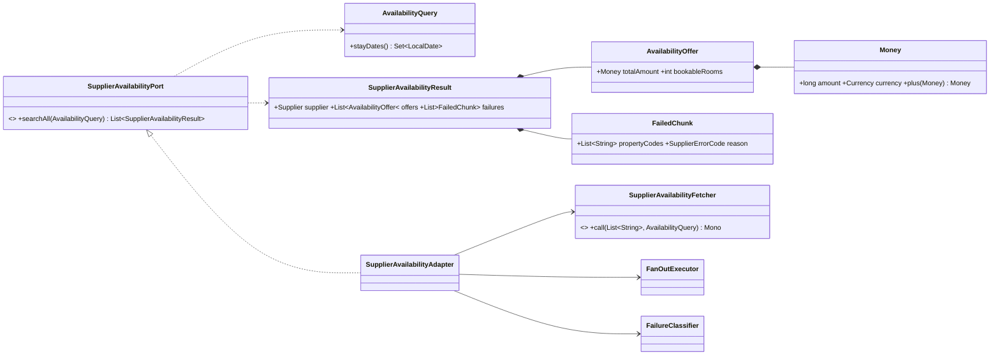
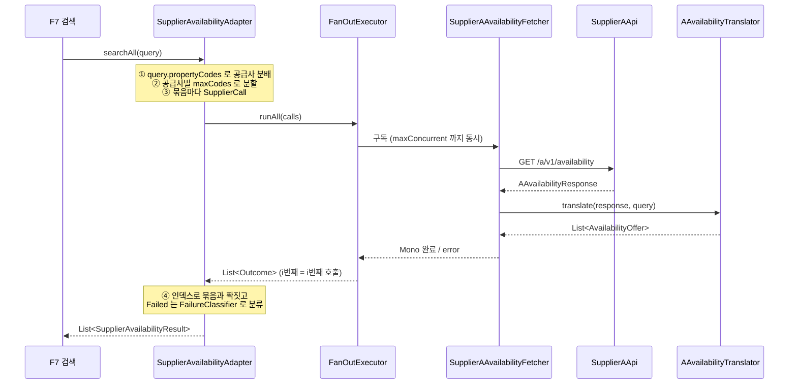

# supplier-availability-adapter 설계 — 공급사 재고·요금 어댑터 (F5)

status: 확정
updated: 2026-09-07

## 1. 요구사항 재해석·범위

**해결하려는 문제.** F3a가 깔아 둔 배선(그룹 등록·조합기·마스킹 필터)과 F3의 실패 유형 위에, 공급사 A·B의
**재고·요금** 호출을 얹고 서로 다른 두 응답을 자사 표준 항목으로 번역해 `core`가 소유한 포트로 내놓는다.
목록(F3)과 다른 점은 두 가지다 — **한 번에 보낼 수 있는 코드가 50개로 제한**되어 공급사당 호출이 여러 건이
되고, 그래서 **한 공급사 안에서 성공과 실패가 동시에 존재**한다.

**수용 기준.**

1. 계약 §5②의 A 응답과 §6②의 B 응답이 같은 `AvailabilityOffer` 목록으로 번역된다.
2. 2026-09-10~13 조회에서 A `OCN-DBL` = `Money(435600, KRW)`, B `R-201` = `Money(453600, KRW)`,
   양쪽 `bookableRooms` = 1이 재현된다.
3. 어느 날짜든 `remainingRooms`가 0이면 `bookableRooms`가 0이 되고 **항목은 결과에서 빠지지 않는다**.
4. 공급사당 코드가 한도를 넘으면 묶음으로 잘려 여러 건이 나가고, **한 묶음의 실패가 다른 묶음의 항목을
   지우지 않는다**. 실패한 묶음의 코드 목록이 결과 안에 남는다.
5. 요청 숙박일 중 하나라도 응답에 없으면 그 항목은 결과에서 빠지고, 응답의 **모든** 항목이 그러면
   공급사 실패(`INVALID_RESPONSE`)로 올라간다.

**포함.**

- `core.application` 포트 `SupplierAvailabilityPort`와 질의 `AvailabilityQuery`,
  표준 항목 `AvailabilityOffer`, 금액 `Money`, 결과 `SupplierAvailabilityResult`·`FailedChunk`
- `SupplierAApi`·`SupplierBApi`에 재고·요금 메서드 추가와 원본 DTO
- 번역기 `AAvailabilityTranslator`·`BAvailabilityTranslator` (요금 합산·재고 최솟값·날짜 검증)
- Fetcher 인터페이스와 A·B 구현, 포트 어댑터 `SupplierAvailabilityAdapter` (공급사별 묶음 분할)
- 공급사별 한도 `SupplierAvailabilityProperties`와 yaml
- `docs/features/README.md` F5 절과 `docs/availability-api-integration-design.html`의 낡은 값 정정

**제외.**

| 제외 항목 | 이유 |
|---|---|
| 공급사 코드 ↔ 내부 id 역매핑, 미매핑 처리 | F7. **어댑터는 DB를 모른다** — 어느 코드가 누구 것인지는 F7이 갈라서 넘긴다 |
| 자사 API 응답 조립·정렬, `soldOut` 파생 | F7. `soldOut`은 `bookableRooms == 0`이라 어디서든 파생된다 |
| 재시도·서킷 | F9. 재시도는 묶음 하나(`Mono`) 단위로 어댑터가 건다 (F3a §7) |
| 캐시 | F10 |
| fan-out 세 값 재산정 | F9. 재검토 조건만 §3.6에 남긴다 |
| 부분 기간 제안 ("3박 중 2박은 됩니다") | 막는 것은 재고가 아니라 **요금**이다 — 재고는 날짜별로 보존되지만 B가 기간 총액만 주므로 부분 기간 요금을 만들 수 없다 |
| 실제 소켓을 여는 자동 테스트 | D-F3-5와 같은 판단. k6로 확인한다 |

**DDD 적용 여부 — 전술 패턴을 적용하지 않는다.** 이 범위에는 불변식을 지키는 Aggregate가 없고, 외부 API를
내부 모델로 정규화하는 Adapter/ACL이 전부다. `core.application`의 값들은 LAY-7의 `Result` 타입이며
자기 검증(DDD-4)만 갖는다. F3와 같은 판단이다.

## 2. 도메인 모델

Aggregate·Entity는 없다. 새로 생기는 값은 전부 `core`의 `com.stay.property.application`에 둔다.

| 값 | 형태 | 불변식·규칙 | 근거 |
|---|---|---|---|
| `Money(long amount, Currency currency)` | record | `currency` non-null. `plus(Money)`는 **통화가 다르면 거부**. `amount`는 통화의 최소 단위 정수 | DDD-4 · OOP-8 · D-F5-1 |
| `AvailabilityQuery(LocalDate checkIn, LocalDate checkOut, int adults, int children, Map<Supplier, List<String>> propertyCodes)` | record | `checkOut > checkIn`, `adults >= 1`, `children >= 0`, `propertyCodes` 비어 있지 않음. `stayDates()`는 `checkIn`부터 `checkOut` 전날까지 | DDD-4 · D-F5-12 |
| `AvailabilityOffer(String propertyCode, String propertyName, String roomCode, String roomName, int maxOccupancy, boolean breakfastIncluded, Money totalAmount, int bookableRooms)` | record | 코드·이름 공백 불가, `maxOccupancy >= 1`, `bookableRooms >= 0` | DDD-4 · CLN-6 |
| `FailedChunk(List<String> propertyCodes, SupplierErrorCode reason)` | record | `propertyCodes` 비어 있지 않음, `List.copyOf` | DDD-4 |
| `SupplierAvailabilityResult(Supplier supplier, List<AvailabilityOffer> offers, List<FailedChunk> failures)` | record | non-null + `List.copyOf`. **둘 다 비어도 된다** | D-F5-7 |

**`SupplierAvailabilityResult`에 "둘 다 빌 수 없다"를 두지 않는 이유.** 계약상 공급사는 **아는 코드만**
돌려주므로(계약 §8, F2 설계 1.6), 호출이 성공했는데 `items`가 빈 배열일 수 있다. 그 상태의 뜻은
"물어봤는데 공급사가 아는 상품이 하나도 없다"이며 오류가 아니다. T-18이 이 경계를 고정한다.

**`Money`가 금액과 통화를 한 타입으로 묶는 이유.** 계약 §1이 금액을 "통화의 최소 단위 정수(KRW는 원 단위,
소수점 없음)"로, 통화를 "ISO 4217 코드(`KRW`, `USD` 등)"로 정한다. **통화가 열려 있으므로 `long` 단독으로는
`453600`이 45만 원인지 $4,536.00인지 값만 보고 알 수 없다.** 지금 필요한 불변식은 하나 — A의 날짜별 합산에서
공급사가 통화를 섞어 보내는 계약 위반을 경계에서 막는 것이다.

## 3. 레이어 배치

### 3.1 패키지·클래스

```
core
└─ com.stay.property.application                     (순수 자바, Spring 의존 0)
   ├─ SupplierAvailabilityPort   «port»  List<SupplierAvailabilityResult> searchAll(AvailabilityQuery)
   ├─ AvailabilityQuery          record  + stayDates() : Set<LocalDate>
   ├─ AvailabilityOffer          record
   ├─ Money                      record  + plus(Money)
   ├─ SupplierAvailabilityResult record
   ├─ FailedChunk                record
   └─ (F3, 무변경) SupplierErrorCode

supplier-client
└─ com.stay.property.infrastructure
   ├─ (F3a·F3, 무변경) FanOutExecutor · FanOutPolicy · SupplierCall · Outcome
   │                   FailureClassifier · InvalidSupplierResponseException · MaskingExchangeFilter
   ├─ SupplierAvailabilityFetcher    interface  Supplier supplier();
   │                                            Mono<List<AvailabilityOffer>> call(List<String> chunk, AvailabilityQuery query);
   ├─ SupplierAvailabilityAdapter    @Component implements SupplierAvailabilityPort
   ├─ SupplierAvailabilityProperties record @ConfigurationProperties("supplier")  + maxCodes(Supplier)
   ├─ supplier.a
   │   ├─ (수정) SupplierAApi        @GetExchange("/a/v1/availability") Mono<AAvailabilityResponse> availability(...)
   │   ├─ AAvailabilityResponse(List<AAvailabilityItem> items)
   │   ├─ AAvailabilityItem(String hotelCode, String hotelName, String roomTypeCode, String roomTypeName,
   │   │                    Integer maxOccupancy, Boolean breakfastIncluded, String currency,
   │   │                    List<ADailyRate> dailyRates)
   │   ├─ ADailyRate(LocalDate date, Integer remainingRooms, Integer nightlyRate, Integer taxAmount)
   │   ├─ AAvailabilityTranslator    List<AvailabilityOffer> translate(AAvailabilityResponse, AvailabilityQuery)
   │   └─ SupplierAAvailabilityFetcher @Component
   └─ supplier.b
       ├─ (수정) SupplierBApi        @GetExchange("/b/api/search") Mono<BSearchResponse> search(...)
       ├─ BSearchResponse(String resultCode, String resultMessage, BSearchData data)
       ├─ BSearchData(List<BSearchItem> items)
       ├─ BSearchItem(String propertyId, String propertyName, String roomId, String roomName,
       │              Integer maxOccupancy, Boolean breakfastIncluded, String currency,
       │              Integer totalPrice, Boolean taxIncluded, List<BInventory> inventory)
       ├─ BInventory(LocalDate date, Integer remainingRooms)
       ├─ BAvailabilityTranslator    List<AvailabilityOffer> translate(BSearchResponse, AvailabilityQuery)
       └─ SupplierBAvailabilityFetcher @Component
```

- **의존 방향**: `supplier-client → core` 단방향 (LAY-1·OOP-6). 포트 소유는 `core.application` (LAY-5).
- **리액티브 타입은 `supplier-client`를 벗어나지 않는다.** 포트는 `List`를 돌려준다.
- DTO는 전부 `record`이며 **계약 문서의 필드명을 그대로** 쓴다. `taxIncluded`는 DTO에는 있고 표준 모델에는
  없다 — 항상 `true`라 정보가 아니다(D6).
- **필드명은 리터럴로 둔다** — 상수 클래스를 만들지 않는다(D-F5-11). F3의 기존 9곳도 그대로 둔다.

### 3.2 클래스 관계



### 3.3 호출 순서



### 3.4 어댑터 — 분배·분할·접기

```
searchAll(query):
    calls  = []                       # List<SupplierCall<List<AvailabilityOffer>>>
    owners = []                       # 인덱스 → (supplier, chunk). 결과를 되짚기 위한 곁 목록
    for (supplier, codes) in query.propertyCodes:                       # ①
        fetcher = fetchers[supplier]
        for chunk in partition(codes, properties.maxCodes(supplier)):   # ②
            calls.add(SupplierCall(supplier, fetcher.call(chunk, query)))   # ③
            owners.add((supplier, chunk))

    outcomes = executor.runAll(calls)                       # F3a
    for i in 0..outcomes.size:                              # ④
        (supplier, chunk) = owners[i]
        Success -> offersBySupplier[supplier]   += outcome.value
        Failed  -> failuresBySupplier[supplier] += FailedChunk(chunk, classify(outcome.cause))
    return supplier 값 순서로 SupplierAvailabilityResult 목록
```

- **`owners`가 필요한 이유**: 조합기는 결과를 공급사가 아니라 **호출 인덱스**로만 식별한다(F3a 포트 계약 5).
  같은 공급사가 여러 건이므로 `Outcome.supplier()`로는 어느 묶음인지 알 수 없고, `FailedChunk`에 담을
  코드 목록도 만들 수 없다.
- **묶음 분할은 어댑터가 한다** (D-F5-5). Fetcher가 안에서 자르면 조합기의 `.timeout(perCall)`이 묶음
  하나가 아니라 그 공급사 전체에 걸려 **묶음이 늘수록 호출 하나의 상한이 저절로 조여지고**, 실패해도 어느
  묶음인지 알 수 없다.
- Fetcher 등록은 F3와 같은 규칙 — 공급사별 정확히 하나. 중복·누락이면 생성 시 `IllegalStateException`.
- 조합기의 방어망(`block(hardStop)`)이 던지는 예외는 잡지 않는다. 공급사 장애가 아니라 우리 설정·코드의
  결함이다.

### 3.5 번역기 — 요금·재고·날짜

두 번역기의 뼈대는 같고 **요금 계산만 다르다.**

```
translate(response, query):
    items = requireField(response.items(), "items")     # B 는 resultCode 검사 → data null 검사 먼저
    offers = []
    for item in items:
        byDate = item.dailyRates() 를 date 로 색인       # B 는 inventory
        total = 0; minRoom = MAX
        rejected = false
        for d in query.stayDates():                     # ★ 응답이 아니라 요청 숙박일을 돈다
            rate = byDate.get(d)
            if rate == null: rejected = true; warn(...); break
            total  += rate.nightlyRate() + rate.taxAmount()      # A 만. B 는 아래 참조
            minRoom = min(minRoom, rate.remainingRooms())
        if rejected: continue                            # 이 항목만 제외
        offers.add(AvailabilityOffer(..., Money(total, currency), minRoom))
    if !items.isEmpty() && offers.isEmpty():
        throw InvalidSupplierResponseException(supplier, "모든 항목의 날짜가 요청 기간과 어긋난다 items=…")
    return offers
```

**요청 숙박일(`D`)을 도는 이유.** 응답 배열(`R`)을 돌면 초과·중복·누락을 각각 판정해야 하지만, `D`를 돌면
세 가지가 한꺼번에 해결된다 — **여분 날짜는 읽히지 않고, 중복은 색인에서 하나만 남아 총액이 자동으로
정확해지며**, 명시적으로 검사할 것은 **누락 하나**뿐이다.

| 상황 | 결과 |
|---|---|
| 정상 (`R` = `D`) | 그대로 합산 |
| 여분 (`R` ⊃ `D`) | `D`분만 합산 → 총액 정확. `byDate.size() > D.size()`면 warn |
| 중복 (`R`에 같은 날짜 2줄) | 색인에서 하나만 남음 → 총액 정확 |
| 누락 (`D` ⊄ `R`) | **그 항목만 제외** + warn |
| 모든 항목이 누락 | **공급사 실패로 승격** → `INVALID_RESPONSE` |

날짜가 `null`인 줄이 섞이면 색인을 만들기 전에 `requireField`로 걸러 **응답 전체 실패**로 간다 —
기존 번역기의 필수 필드 검사와 같은 갈래다. 0박 요청(`checkIn == checkOut`)은 `AvailabilityQuery`의
불변식이 막으므로 여기까지 오지 않는다.

**요금 — A와 B가 갈리는 유일한 곳.**

| | A | B |
|---|---|---|
| 계산 | `Σ(nightlyRate + taxAmount)` — 날짜별 net + 세금 | `totalPrice` 그대로 — 기간 총액 gross |
| 검산 (09-10~13) | `121,000 + 157,300 + 157,300 = 435,600` | `453,600` |
| 출처 | **우리가 만든 파생값** | 공급사가 준 값 |

**총액이 틀릴 위험은 A에만 있다.** B는 배열이 어긋나도 `totalPrice`가 틀리지 않는다. 그래도 B에도 같은
날짜 검증을 거는 이유는 **재고** 때문이다 — 2박치 배열로 3박 가능 여부를 판정하면 최솟값이 의미를 잃는다.

**A의 합산 근거(날짜별 `nightlyRate`·`taxAmount`)는 표준 모델에 싣지 않고 어댑터 로그에만 남긴다** (CLN-9).
검색 총액이 예약 단계와 어긋났을 때 사후에 대사할 유일한 재료다.

**재고** — `bookableRooms = min(숙박일 전체의 remainingRooms)`. 값의 뜻은 "날짜별 잔여"가 아니라
**"요청한 숙박 기간 전체를 연속으로 점유할 수 있는 해당 객실 타입의 수"** 다. 연박은 같은 객실 타입을
기간 내내 이어서 잡아야 하므로 최솟값이 곧 그 수다.

> **전제 (D-F5-3).** 최솟값 판정은 **연박 가능 여부를 재고만으로 결정할 수 있다는 전제** 위에 있다. 업계
> API는 최소·최대 숙박일수, 특정일 체크인/체크아웃 금지, 사전 예약 기간 제한 같은 **체류 제약**으로도
> 연박을 막는다. **우리 공급사 계약에 그 제약이 없어서 최솟값이 충분한 것**이다. 공급사가 체류 제약을
> 제공하기 시작하면 최솟값은 필요조건일 뿐이므로 이 규칙을 다시 본다.

**품절** — `bookableRooms == 0`이어도 **항목을 빼지 않는다**(D8). `soldOut` 파생은 F7이 한다.

**이름** — 숙소명·객실 타입명은 응답 값을 그대로 쓴다(D9). 목록 갱신 주기만큼 낡은 이름이 나가지 않게 한다.

**조식** — `breakfastIncluded`는 부가 정보가 아니라 **`totalAmount`의 비교 가능성을 결정하는 조건**이다.
업계 모델에서 판매 단위는 (객실 타입 × 요금제)이고 조식 포함 여부는 요금제의 조건이므로, **조식 조건이
다른 두 항목의 `totalAmount`는 같은 축에서 비교되지 않는다.** F7이 가격 오름차순을 기본 정렬로 두면
조식 미포함 상품이 구조적으로 상단을 차지한다.

### 3.6 설정

```yaml
supplier:
  a:
    availability:
      max-codes: 50       # 계약 §5② — 한 요청에 담을 수 있는 숙소 코드 수
  b:
    availability:
      max-codes: 50       # 계약 §6②
```

- **공급사별로 둔다** (D-F5-6). 지금 값이 같은 것은 우연이며, 계약이 바뀌어 한쪽이 30이 되면 그쪽만 고친다.
- `max-codes < 1`이면 기동을 실패시킨다. 0이면 묶음이 무한히 생긴다.
- **목록(F3)에는 한도가 적용될 자리가 없다** — 목록 API는 파라미터를 받지 않는다. 그래서 키가
  `availability` 아래에 있다.

**fan-out 값은 이번에 건드리지 않는다** (D-F5-10). 검색용 `supplier.fan-out`은 현행
(`max-concurrent 2` · `per-call 4s` · `budget 5s`)을 유지한다.

> **재검토 조건.** 지켜야 하는 부등식은 `budget > ⌈호출 수 ÷ max-concurrent⌉ × per-call`이고, 호출 수는
> 이제 공급사 수가 아니라 **묶음 수**다. 현재 값은 **공급사당 숙소 50개(묶음 1개)까지만** 최악 기준을
> 만족한다. 그 이상이 되는 시점에 **① 캐시 적중률(F10) ② 일일 요청량 ③ rate limit 조건 ④ 페이지네이션
> 도입 여부**를 함께 놓고 동시 상한의 **단위(전역/공급사별)와 값**을 재산정한다. **rate limit 값은 계약에
> 없으므로**(계약은 429·`E429`의 존재만 말한다) 먼저 확보해야 한다.

## 4. 적용 패턴

| 패턴 | 격리하는 변화 | 검토한 대안 |
|---|---|---|
| **Adapter / ACL** — 번역기 + Fetcher | 공급사 응답 구조가 바뀌어도 `AvailabilityOffer`와 그 소비자(F7)는 그대로 | 공급사 DTO를 그대로 위로 올리기 — 공급사 스키마가 자사 API에 새어 나간다 |
| **Strategy** — `SupplierAvailabilityFetcher` 구현 2개를 `List` 주입 후 `EnumMap` 색인 | 공급사 추가가 어댑터 수정이 아니라 구현 추가가 되게 | `if (supplier == A)` 분기 — OOP-4 위반, 공급사마다 어댑터를 고쳐야 한다 |
| **값 객체** — `Money` | 통화 해석 규칙을 한 타입 안에 봉인 | `long` 원시값 — 통화가 열려 있어 값의 뜻이 안 정해진다 (§2) |

`FanOutExecutor`·`FailureClassifier`는 F3a·F3의 것을 **그대로 쓴다**. Reactor 배치 연산자
(`buffer`·`window`·`parallel().runOn()`)는 도입하지 않는다 (D-F5-9).

## 5. 테스트 리스트

| ID | 레이어 | 분류 | 케이스 | 기법 | 기대 결과 |
|---|---|---|---|---|---|
| T-01 | core | Normal | 같은 통화의 `Money` 를 더하면 | ECP | 금액이 합산되고 통화가 보존된다 |
| T-02 | core | Invalid | 다른 통화의 `Money` 를 더하면 | Error Guessing | `IllegalArgumentException`, 메시지에 두 통화 코드 |
| T-03 | core | Invalid | `AvailabilityQuery` 의 checkOut ≤ checkIn / adults < 1 / propertyCodes 빈 맵 (Parameterized 3) | BVA | `IllegalArgumentException`, 메시지에 어긋난 조건 |
| T-04 | core | Normal | 3박(09-10~09-13)으로 `stayDates()` 를 부르면 | ECP | 09-10·11·12 세 개. 체크아웃일은 없다 |
| T-05 | core | Invalid | `AvailabilityOffer` 의 코드·이름 공백 / `bookableRooms` 음수 (Parameterized 5) | Error Guessing | `IllegalArgumentException`, 메시지에 필드명 |
| T-06 | supplier-client | Normal | 계약 §5② A 응답(3박) → 번역 | ECP | offer 1개, `Money(435600, KRW)`, `bookableRooms` 1 |
| T-07 | supplier-client | Normal | 계약 §6② B 응답(3박) → 번역 | ECP | offer 1개, `Money(453600, KRW)`, `bookableRooms` 1 |
| T-08 | supplier-client | Boundary | 요청 범위 밖 여분 날짜가 붙어 오면 (A·B) | BVA | 총액이 여전히 435,600 / 453,600, offer 유지 |
| T-09 | supplier-client | Boundary | 요청 숙박일 하나가 응답에 없으면 (항목 2개 중 1개만) | BVA | 그 항목만 빠지고 나머지 offer 는 남는다 |
| T-10 | supplier-client | Invalid | 응답의 모든 항목이 날짜 누락이면 | Decision Table | `InvalidSupplierResponseException`, 메시지에 공급사·항목 수 |
| T-11 | supplier-client | Invalid | 필수 필드(`items`·코드·이름·`currency`) null·공백 (Parameterized 6×2) | Error Guessing | `InvalidSupplierResponseException`, 메시지에 계약 필드명 |
| T-12 | supplier-client | Boundary | 어느 날짜의 `remainingRooms` 가 0이면 | BVA | `bookableRooms` 0, 항목은 제외되지 않는다 |
| T-13 | supplier-client | Invalid | B 재고·요금 응답의 `resultCode` 가 `E503` 이면 | ECP | `SupplierBResultException`, 코드 보존 |
| T-14 | supplier-client | Boundary | 한도 50에 코드 49·50·51·60개 (Parameterized 4) | BVA | 묶음 1·1·2·2개, 코드 순서·내용 보존 |
| T-15 | supplier-client | Normal | 공급사 2곳 × 각 2묶음 전부 성공 | ECP | 공급사당 결과 1개, `offers` 는 두 묶음 항목을 합친 것, `failures` 빈 목록 |
| T-16 | supplier-client | Interaction | A의 첫 묶음만 실패 | Decision Table | A 결과에 둘째 묶음 offers 유지 + `FailedChunk(그 50개 코드, 분류된 사유)` |
| T-17 | supplier-client | Interaction | A의 모든 묶음 실패 | Decision Table | A는 offers 비고 failures 2개, B 결과는 그대로 |
| T-18 | supplier-client | Normal | 호출은 성공했는데 `items` 가 빈 배열이면 | ECP | offers·failures 둘 다 빈 목록, 예외 없음 |
| T-19 | supplier-client | Invalid | 공급사별 한도가 0 이하이거나 빠지면 | BVA | 기동 실패, 메시지에 `supplier.<공급사>.availability.max-codes` |
| T-20 | supplier-client | Invalid | 재고·요금 Fetcher 가 중복 등록되거나 없으면 | Decision Table | 생성 시 `IllegalStateException`, 메시지에 해당 공급사 |
| T-21 | supplier-client | Invalid | Fetcher 의 프록시가 호출 즉시 던지면 | Error Guessing | `call()` 은 안 던지고 `block()` 에서 같은 예외 (`Mono.defer`) |

**만들지 않는 것 (TDD-8).** DTO record·`FailedChunk`·`SupplierAvailabilityResult`의 단순 생성(값 보관만
하고 규칙이 없다) · `FailureClassifier` 재검증(F3 T-08~13이 덮는다. F5는 그것이 실제로 불리는지만 T-16으로
본다) · `FanOutExecutor` 동작(F3a T-01~06, 변경 없음) · 실제 소켓·타임아웃(k6) · `soldOut` 파생(F7).

## 6. 결정 카드

| ID | 질문 | 검토한 안 | 결정 | 탈락 사유 | 구현 차단 |
|---|---|---|---|---|---|
| D-F5-1 | 금액을 어떤 타입으로 담나 | `long` 원시 / `BigDecimal` / **`Money` 값 객체(내부 `long`)** / javax.money·Joda-Money | `Money(long, Currency)` | `long` 원시: 통화를 안 들고 다녀 `453600`이 KRW인지 USD인지 값만으로 모른다 · `BigDecimal`: 이 범위에 나눗셈이 없어 scale·RoundingMode가 아무 일도 안 하고 JSON에 없던 소수 자릿수가 새어 나간다 · 기성 라이브러리: Boot 4.1.1 BOM이 `moneta`·`joda-money` 본체를 관리하지 않아 비관리 의존성이 `core` 시그니처에 박힌다 | 예 |
| D-F5-2 | 총액을 어떻게 표현하나 | **gross 기간 총액 단일값** / (base, tax) 분리 + 플래그 | `totalAmount` + `currency`, `taxIncluded` 안 실음 | 분리: 업계 표준(base/tax를 나눠 전달하고, 합칠 땐 `all_inclusive` 플래그)이지만 **KRW 단일 통화·국내 단일 표시 규칙** 전제에서는 표시할 곳이 없다. 이 전제가 깨지면(다통화 유입, 세금 별도 표시 시장) 되돌려야 하며 **A는 원본 복원이 가능하지만 B는 불가능하다**(계약 §8 제한 4와 같은 비대칭) | 예 |
| D-F5-3 | 재고를 무엇으로 내보내나 | 숫자만 / 숫자 + `soldOut` / `soldOut`만 | `bookableRooms` 숫자만 | `soldOut`만: 어댑터가 불리언으로 접으면 복구 불가 · 숫자 + `soldOut`: `soldOut`은 `== 0`이라 같은 사실이 두 벌이 된다. F7이 파생한다. 이름을 `availableRooms`에서 바꾼 이유는 그 이름이 `[3,1,1]` 중 무엇인지 말하지 않기 때문이다 | 예 |
| D-F5-4 | 품절 항목을 결과에 남기나 | **남긴다** / 뺀다 / 어댑터는 남기고 노출은 F7 | 남긴다 (D8 유지) | 뺀다: 0을 버리면 복구 불가 · F7 이관: 업계 기본값은 옵트인(Expedia Rapid는 `include=unavailable_reason` 명시 필요)이지만, 범위 검색으로 이미 나온 항목이면 품절이라고 보여주는 것이 이 서비스의 선택이다 | 아니오 |
| D-F5-5 | 묶음 분할을 어디서 하나 | **어댑터** / Fetcher | 어댑터 | Fetcher: 조합기의 `.timeout(perCall)`이 묶음 하나가 아니라 공급사 전체에 걸려 **묶음이 늘수록 호출 하나의 상한이 저절로 조여진다.** 또 조합기가 받은 호출 1건 안에 묶음이 숨어 `FailedChunk`에 담을 코드 목록을 만들 수 없다 | 예 |
| D-F5-6 | 한도 설정 키를 어떤 모양으로 | **공급사별** / 공통 하나 / 엔드포인트별 | `supplier.<공급사>.availability.max-codes` | 공통 하나: 지금 값이 같은 것은 우연이며 같아야 할 이유가 없다. 세 번째 공급사가 30이면 키 구조를 갈아엎어야 한다 · 엔드포인트별: 목록 API는 파라미터를 안 받아 적용 대상이 하나뿐이다 | 예 |
| D-F5-7 | 부분 실패를 어떻게 표현하나 | sealed 3변형(PARTIAL) / **단일 타입 + 실패 목록** / 묶음 단위 결과 리스트 | `SupplierAvailabilityResult(supplier, offers, failures)` | 3변형: 소비자 F7은 "받은 offer는 쓰고 실패는 사유로 싣는다"만 하므로 분기 본문이 같아진다 — 타입만 늘고 분기는 안 갈린다 · 묶음 리스트: "A의 3묶음 중 1묶음 실패 = A는 부분 실패"를 소비자가 매번 계산해야 한다. 근거는 AIP-233(`failed_requests`를 요청 인덱스로 되짚음)·SQS(`Successful`/`Failed` 두 목록)·DynamoDB(`UnprocessedItems`가 재시도 입력과 같은 형태)이며, AIP-193이 부분 오류를 지양하라면서 둔 예외 조항이 **"particularly in bulk operations"** 로 이 상황을 가리킨다 | 예 |
| D-F5-8 | 요청 기간과 응답 날짜가 어긋나면 | 검증 없음 / 개수 비교 / 집합 판정 4갈래 / **요청 숙박일 순회** | `D`를 돌며 누락만 검사, 항목 제외 → 전부면 승격 | 검증 없음: A 총액이 2박치로 조용히 틀리고 정렬 1등이 된다 · 개수 비교: "3개인데 하나가 범위 밖"을 통과시킨다 · 4갈래 판정: `DUPLICATED`는 실재 근거가 확인 안 된 사유(레이스) 하나뿐이었고, 순회 방향을 바꾸니 판정 자체가 불필요해졌다 | 예 |
| D-F5-9 | Reactor 배치 연산자를 쓰나 | **안 쓴다** / `buffer` / `window` / `parallel().runOn()` | 순수 자바 List 파티션 + 기존 `flatMap(maxConcurrent)` | `buffer`·`window`: 리액티브 소스용인데 우리 소스는 메모리 `List`라 Flux로 감쌌다 되돌리는 왕복만 생기고 동시 상한이 두 겹이 된다 · `parallel().runOn()`: 공식 레퍼런스가 "does not parallelize the work"라 명시하며 rail 수 ≠ 동시 구독 수다. WebClient 호출은 이미 논블로킹이다 | 예 |
| D-F5-10 | fan-out 세 값을 지금 정하나 | 지금 정한다 / **미룬다** | 현행 유지 + 재검토 조건 기록 | 지금 정한다: 재산정에 필요한 입력(캐시 적중률·일일 요청량·rate limit 조건·페이지네이션)이 하나도 없다. 없는 입력으로 정하면 어차피 다시 정해야 한다. 동시 상한의 **단위**(전역/공급사별)도 같은 시점에 함께 본다 | 아니오 |
| D-F5-11 | 계약 필드명을 상수로 빼나 | 상수 클래스 / **리터럴 유지** | 리터럴 유지 | 상수: `hotelCode()` 접근자와 `"hotelCode"` 문자열이 어긋나는 것을 컴파일러가 못 잡는 건 양쪽 다 같은데, **리터럴은 어긋남이 한 줄 안에 보이고 상수는 다른 파일을 열어야 보인다.** 탐지 가능성이 오히려 나빠진다 | 아니오 |
| D-F5-12 | 어느 코드가 누구 것인지 누가 아나 | **F7이 갈라서 넘김** / 어댑터가 갈라냄 / 평평한 쌍 목록 | `Map<Supplier, List<String>>` | 어댑터가 갈라냄: 코드로 공급사를 알아내려면 DB를 봐야 하는데 "어댑터는 DB를 모른다"(README F5) · 평평한 쌍: 안전성 차이가 없고 `groupingBy` 한 줄이 F7에 있느냐 어댑터에 있느냐 차이뿐인데, F1의 `Property`가 이미 `supplier`를 들고 있어 F7 쪽이 자연스럽고 어댑터의 ① 단계가 사라진다 | 예 |
| D-F5-13 | 포트를 공급사별로 나누나 | 공급사별 `search(supplier, query)` / **`searchAll(query)` 하나** | `searchAll(query)` | 공급사별: 조합기의 `budget`이 "검색 1건 전체"에 걸려야 하는데 따로 부르면 호출마다 따로 걸려 검색 하나가 최악 2배가 된다. F3의 `fetchAll()`과도 같은 결이다 | 예 |

## 7. 참고 문서

- 계약: `docs/supplier-api-contract.md` (§1 공통 규약 · §5② A 재고·요금 · §6② B 재고·요금 · §7 실패 대응표 · §8 제한사항)
- 확정 결정: `docs/availability-api-integration-design.html` (D6~D12)
- 선행 설계: `docs/features/webclient-config/01-design.md` (조합기·포트 계약·D-F3A-14) ·
  `docs/features/supplier-client/01-design.md` (실패 유형·번역기 규약)
- 검산 근거: `docs/features/mock-supplier-server/01-design.md` §1.2 수용 기준 5 (A 435,600 / B 453,600)
- 프로젝트 규칙: `.claude/skills/coding-standard`, `.claude/skills/test-standard`, `.claude/publish-checks.md`
- 시각화: `docs/features/supplier-availability-adapter/design.html` (결정의 원본은 이 md)

### 이번 범위에서 함께 고치는 문서

| 문서 | 고칠 것 |
|---|---|
| `docs/features/README.md` | F5 절에 묶음 분할이 빠져 있다 · 검산값 396,000 / 415,800 → **435,600 / 453,600** · "닫아야 할 결정" 두 항목을 D-F5-1·D-F5-8로 닫힘 표시 |
| `docs/availability-api-integration-design.html` | D6 정규화 예시의 총액과 날짜별 값 · D7 예시 `[3,1,4]` → 계약과 같은 `[3,1,1]` |
