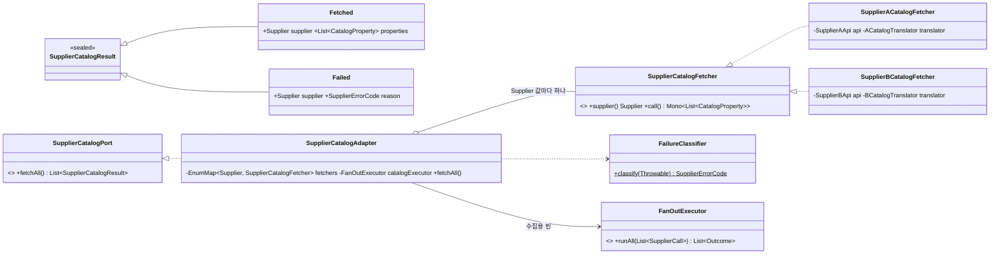
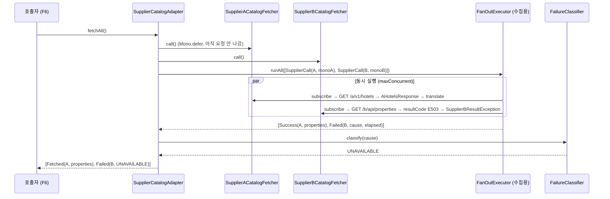

# supplier-client 설계 — 공급사 목록 클라이언트와 목록 포트 (F3 + F4 통합)

status: 확정
updated: 2026-09-07

## 1. 요구사항 재해석·범위

**해결하려는 문제.** F3a가 깔아 둔 배선(그룹 등록·조합기·마스킹 필터) 위에 공급사 A·B의 **숙소 목록** 호출을
얹고, 서로 다른 두 응답을 자사 표준 목록 모델로 번역해 `core`가 소유한 포트로 내놓는다. F6(목록 수집)이 이
포트만 보고 매핑을 갱신할 수 있어야 한다.

**F3과 F4를 하나로 합친 이유.** F3(HTTP Interface·DTO)만으로는 A의 실패 본문을 어떻게 받을지, B의
`resultCode`를 누가 해석할지를 소비자(D12 실패 정규화) 없이 정할 수 없다. 두 기능의 어려운 결정이 전부
같은 자리(번역기·분류기)에 있어 나누면 둘 다 미완이 된다. 재고·요금(F5)은 묶음 분할과 PARTIAL 값 형태라는
별개의 결정이 있어 따로 간다.

**수용 기준.**

1. `SupplierCatalogPort.fetchAll()`이 등록된 공급사 수만큼 결과를 `Supplier` 값 순서로 돌려준다.
2. 계약 문서의 A 목록 JSON과 B 목록 JSON이 같은 `CatalogProperty` 목록으로 번역된다. `maxOccupancy`는 버린다.
3. A 503과 B `E503`이 같은 `Failed(supplier, UNAVAILABLE)`이 된다. 유형은 8개이며 분류는 한 곳에서만 한다.
4. 한 공급사의 실패가 다른 공급사의 `Fetched`를 지우거나 흐름을 끊지 않는다.
5. 기동 시 검색용·수집용 조합기 빈이 각각 다른 정책으로 뜨고, 수집 정책도 부등식 검사를 받는다.

**포함.**

- `core.application` 포트 `SupplierCatalogPort`와 표준 목록 모델 `CatalogProperty`·`CatalogRoom`,
  결과 `SupplierCatalogResult`, 실패 유형 `SupplierErrorCode`
- 공급사별 HTTP Interface `SupplierAApi`·`SupplierBApi`(목록 메서드만)와 원본 DTO
- 번역기 `ACatalogTranslator`·`BCatalogTranslator`, 번역 실패 예외
- Fetcher 인터페이스와 A·B 구현, 포트 어댑터 `SupplierCatalogAdapter`, 실패 분류기 `FailureClassifier`
- 수집용 조합기 정책 `CatalogFanOutProperties`와 조합기 빈 1개 추가
- yaml: 그룹 기본 헤더(`X-Api-Key`)·타임아웃 초기값·수집 정책. F3a `@ImportHttpServices`의 `types` 채우기
- F3a T-10의 탐침 인터페이스를 실제 `SupplierAApi`로 바꿔 정식 테스트로 승격
- D-F0-6 재검토 조건 문언 정정(F0 설계 문서·README F4 절)

**제외.**

- 재고·요금 호출·DTO·묶음 분할(F5) · 매핑 저장·주기 갱신(F6) · 재시도·서킷(F9)
- 실제 소켓을 여는 자동 테스트 — 만들지 않는다(D-F3-5). 실제 HTTP 경로는 k6로 확인한다(5.2)
- `ErrorCode`·`CommonErrorCode`·`SupplierErrorCode`의 네이밍·관계 정리 — 컨텍스트 전용 응답 코드가 처음
  필요한 feature에서 한 번에(D-F3-4)
- 타임아웃·예산 값의 실측 확정 — 값은 설정이며 이 문서의 초기값은 자리표시자다(D-F3-6)

**DDD 적용 여부.** 전술 패턴을 적용하지 않는다. 이 범위에는 불변식을 지키는 Aggregate가 없고, 외부 API를
내부 모델로 정규화하는 Adapter/ACL이 전부다. `core.application`의 값들은 LAY-7의 `Result` 타입이며
자기 검증(코드·이름 비지 않음)만 갖는다.

## 2. 도메인 모델

Aggregate·Entity는 없다. 새로 생기는 값은 전부 `core`의 `com.stay.property.application`에 둔다.

| 값 | 형태 | 불변식·규칙 | 근거 |
|---|---|---|---|
| `CatalogProperty(String code, String name, List<CatalogRoom> rooms)` | record | `code`·`name` 공백 불가, `rooms`는 null 대신 빈 목록(`List.copyOf`) | DDD-4 · CLN-7 |
| `CatalogRoom(String code, String name)` | record | `code`·`name` 공백 불가 | DDD-4 |
| `SupplierCatalogResult` | sealed interface | `Fetched(Supplier supplier, List<CatalogProperty> properties)` \| `Failed(Supplier supplier, SupplierErrorCode reason)`. `Fetched`는 HTTP 성공 + 디코딩 + 번역 검증을 전부 통과한 뒤에만 만들어진다 | D-F3-2 |
| `SupplierErrorCode` | enum | `INVALID_REQUEST` · `UNAUTHORIZED` · `RATE_LIMITED` · `SUPPLIER_ERROR` · `UNAVAILABLE` · `TIMEOUT` · `INVALID_RESPONSE` · `UNEXPECTED`. `ErrorCode`를 구현하지 않는다 | D-F3-3 · D-F3-4 |

`Supplier`(F1, `com.stay.property.domain`)는 그대로 쓴다. 검증 실패 시 예외 메시지에 비어 있는 필드명을
포함한다(CLN-6). 이 예외는 `core`에서 `IllegalArgumentException`으로 던지고, 번역기가 공급사 컨텍스트를 붙여
감싼다(3.4).

## 3. 레이어 배치

### 3.1 패키지·클래스

```
core
└─ com.stay.property.application                        (순수 자바, Spring 의존 0)
   ├─ SupplierCatalogPort          «port»    List<SupplierCatalogResult> fetchAll()
   ├─ SupplierCatalogResult        sealed    Fetched | Failed
   ├─ CatalogProperty              record
   ├─ CatalogRoom                  record
   └─ SupplierErrorCode            enum (8)

supplier-client
└─ com.stay.property.infrastructure
   ├─ (F3a, 무변경) SupplierCall · Outcome · BudgetExceededException · FanOutExecutor · FanOutPolicy
   │                FanOutProperties · MaskingExchangeFilter
   ├─ (F3a, 수정)   SupplierHttpClientConfig     @ImportHttpServices 두 개에 types 채움
   ├─ SupplierCatalogFetcher       interface    Supplier supplier(); Mono<List<CatalogProperty>> call();
   ├─ SupplierCatalogAdapter       @Component   implements SupplierCatalogPort
   ├─ FailureClassifier            final class  static SupplierErrorCode classify(Throwable)
   ├─ InvalidSupplierResponseException  RuntimeException(Supplier supplier, String reason)
   ├─ CatalogFanOutProperties      record @ConfigurationProperties("supplier.catalog.fan-out")
   ├─ SupplierCatalogConfig        @Configuration  수집용 FanOutExecutor 빈
   ├─ supplier.a
   │   ├─ SupplierAApi             @HttpExchange  @GetExchange("/a/v1/hotels") Mono<AHotelsResponse> hotels()
   │   ├─ AHotelsResponse(List<AHotel> items)
   │   ├─ AHotel(String hotelCode, String hotelName, List<ARoomType> roomTypes)
   │   ├─ ARoomType(String roomTypeCode, String roomTypeName, Integer maxOccupancy)
   │   ├─ ACatalogTranslator       List<CatalogProperty> translate(AHotelsResponse)
   │   └─ SupplierACatalogFetcher  @Component implements SupplierCatalogFetcher
   └─ supplier.b
       ├─ SupplierBApi             @HttpExchange  @GetExchange("/b/api/properties") Mono<BPropertiesResponse> properties()
       ├─ BPropertiesResponse(String resultCode, String resultMessage, BPropertiesData data)
       ├─ BPropertiesData(List<BProperty> items)
       ├─ BProperty(String propertyId, String propertyName, List<BRoom> rooms)
       ├─ BRoom(String roomId, String roomName, Integer maxOccupancy)
       ├─ SupplierBResultException RuntimeException(String resultCode)
       ├─ BCatalogTranslator       List<CatalogProperty> translate(BPropertiesResponse)
       └─ SupplierBCatalogFetcher  @Component implements SupplierCatalogFetcher
```

- **의존 방향**: `supplier-client → core` 단방향. `core`는 `supplier-client`를 모른다(LAY-1·OOP-6).
- **포트 소유**: `core`의 `application`(module-split D-MS-4). 구현은 `supplier-client`(LAY-5).
- **리액티브 타입은 `supplier-client`를 벗어나지 않는다.** 포트는 `List`를 돌려준다.
- **패키지**: 공통은 F3a와 같은 `com.stay.property.infrastructure`. 공급사별 지식(HTTP Interface·DTO·번역기·
  Fetcher·B 전용 예외)만 `.supplier.a` / `.supplier.b`. `api-app`은 `supplier-client`를 `runtimeOnly`로만 갖는다.
- DTO는 전부 `record`이며 계약 문서의 필드명을 그대로 쓴다. A의 실패 본문(`{error, message}`)은 **디코딩하지
  않는다** — 분류는 HTTP 상태만 쓰고(D-F3-3) 본문은 `WebClientResponseException`이 문자열로 들고 있어 로그에
  충분하다. `maxOccupancy`는 DTO에는 있고 표준 모델에는 없다(F4 범위 정의).

### 3.2 클래스 관계



### 3.3 호출 시퀀스 — `fetchAll()` 1회, A 성공·B 실패



### 3.4 각 클래스의 책임과 규칙

**`SupplierCatalogFetcher` 구현(A·B).** `call()`은 **모든 작업을 `Mono.defer` 안에 넣는다.**
`Mono.defer(() -> api.hotels()).map(translator::translate)` 형태다. 프록시 호출·번역에서 나는 예외는 전부
Mono의 error 신호가 되어 조합기의 `onErrorResume`이 받는다. Mono를 만드는 동안 던진 예외는 조합기 밖이라
못 잡으므로 이 규칙은 리뷰 확인 항목이다(D-F3-3 조건 ①). `supplier()`는 상수를 돌려준다.

**번역기(A·B).** 봉투를 해체하고 성공이 아니면 던지며, 표준 모델을 만든다. 그 이상은 하지 않는다.

- A: `items` 각 항목을 `CatalogProperty(hotelCode, hotelName, roomTypes → CatalogRoom(roomTypeCode, roomTypeName))`로.
  `items`가 비면 빈 목록. 필수 필드가 null·공백이면 `InvalidSupplierResponseException(A, "<필드명> is missing")`.
- B: `resultCode != "0000"`이면 `SupplierBResultException(resultCode)`. `0000`인데 `data`가 null이면
  `InvalidSupplierResponseException(B, "data is null")`. 그 외는 A와 같은 규칙으로 `propertyId`·`propertyName`·
  `rooms → CatalogRoom(roomId, roomName)`.
- 표준 모델 생성에서 나는 `IllegalArgumentException`은 번역기가 `InvalidSupplierResponseException`으로 감싼다.
  이 두 예외 타입만이 INVALID_RESPONSE로 분류되며, 범용 예외는 그러지 않는다(D-F3-7).

**`FailureClassifier.classify(Throwable)`.** 조합기 뒤에서 **한 곳만** 호출된다. 예외의 `getCause()` 사슬을
바깥부터 따라가며 **처음 맞는 규칙**으로 결정한다. 사슬 어디에도 맞는 것이 없으면 `UNEXPECTED`와 함께
**ERROR 로그**(예외 포함)를 남긴다 — catch-all이 아니라 "분류표에 없는 예외가 왔다"는 신호다.

| 순서 | 사슬에서 만난 예외 | 유형 |
|---|---|---|
| 1 | `BudgetExceededException`, `java.util.concurrent.TimeoutException` | TIMEOUT |
| 2 | `WebClientResponseException` 상태 400 / 401 / 429 / 500 / 503 | INVALID_REQUEST / UNAUTHORIZED / RATE_LIMITED / SUPPLIER_ERROR / UNAVAILABLE |
| 3 | `WebClientResponseException` 그 밖의 상태 | UNEXPECTED (계약에 없는 상태) |
| 4 | `SupplierBResultException` `E400` / `E401` / `E429` / `E500` / `E503` | 2와 같은 다섯 값 |
| 5 | `SupplierBResultException` 그 밖의 코드 | INVALID_RESPONSE |
| 6 | `InvalidSupplierResponseException`, `org.springframework.core.codec.DecodingException`, `UnsupportedMediaTypeException` | INVALID_RESPONSE |
| 7 | `WebClientRequestException` — 사슬에 `io.netty.handler.timeout.ReadTimeoutException`이 있으면 | TIMEOUT |
| 8 | `WebClientRequestException` — 그 외(연결 거부·이름 해석 실패·연결 타임아웃 등) | UNAVAILABLE |
| 9 | 위에 없음 | UNEXPECTED + ERROR 로그 |

**`SupplierCatalogAdapter.fetchAll()`.**

1. `fetchers`(`EnumMap`, `Supplier` 값 순서)마다 `new SupplierCall<>(fetcher.supplier(), fetcher.call())`을 만든다.
2. 수집용 `FanOutExecutor.runAll(calls)`에 한 번에 넘긴다. 결과 순서는 요청 순서(F3a 계약 4).
3. `Outcome.Success`는 `Fetched`, `Outcome.Failed`는 `classify(cause)`로 `Failed(supplier, reason)`.
   실패마다 **warn 한 줄** `공급사 목록 실패 supplier={} reason={}`만 남긴다 — 원인·경과 시간은 조합기가
   이미 warn으로 남겼다(CLN-9).
4. `block(hardStop)`이 터져 조합기가 던지는 예외는 잡지 않고 전파한다. 공급사 장애가 아니라 우리 설정·코드 결함이다.

생성자는 `List<SupplierCatalogFetcher>`를 받아 `EnumMap`을 만든다. **같은 `Supplier`가 둘이거나 `Supplier` 값 중
Fetcher가 없는 것이 있으면 `IllegalStateException`으로 기동을 실패**시킨다. 등록된 Fetcher가 곧 "수집 대상"의
정의이므로 누락을 조용히 넘기면 그 공급사는 영원히 수집되지 않는다.

**`CatalogFanOutProperties`.** F3a `FanOutProperties`와 같은 형태·검사(`max-concurrent >= 1`,
`budget > per-call`)로 prefix만 `supplier.catalog.fan-out`. `toPolicy()`로 `FanOutPolicy`를 만든다.

**`SupplierCatalogConfig`.** `@EnableConfigurationProperties(CatalogFanOutProperties.class)` +
`@Bean("catalogFanOutExecutor") FanOutExecutor`. 기존 `fanOutExecutor` 빈(검색용)은 그대로 두고, 어댑터는
`@Qualifier("catalogFanOutExecutor")`로 받는다. F3a 클래스는 `SupplierHttpClientConfig`의 `types`만 바뀐다.

### 3.5 설정 (`api-app/src/main/resources/application.yaml`)

```yaml
spring:
  http:
    serviceclient:
      supplier-a:
        base-url: http://localhost:9091
        connect-timeout: 1s
        read-timeout: 45s          # 뒷그물. 실제 상한은 조합기 per-call 이 진다
        default-header:
          X-Api-Key: test-key      # F2 모의 서버가 받는 값. 실제 키는 환경 변수로 덮어쓴다
      supplier-b:
        base-url: http://localhost:9092
        connect-timeout: 1s
        read-timeout: 45s
        default-header:
          X-Api-Key: test-key

supplier:
  fan-out:                         # 검색용(F5·F7). F5 가 묶음 수와 함께 다시 잡는다
    max-concurrent: 2
    per-call: 4s
    budget: 5s
  catalog:
    fan-out:                       # 수집용. 공급사 2 → 부등식 40s > ⌈2÷2⌉×30s
      max-concurrent: 2
      per-call: 30s
      budget: 40s
```

- 값의 근거는 외부 문헌이 아니라 자사 응답 목표다. 검색은 사용자가 기다리고 캐시(F10)를 전제하므로 짧게, 수집은
  배치가 기다리고 **오래 걸려도 다 받는 것이 중요**하므로 길게. 그룹 `read-timeout`은 두 용도 중 긴 쪽보다
  크게 두어 소켓이 조합기보다 먼저 끊지 않게 한다. 전부 **설정이지 결정이 아니며** 5.2로 실측한 뒤 바꾼다.
- 기본 헤더 프로퍼티는 Boot 4.1 `spring.http.serviceclient.<group>.default-header.*`다. 키가 쿼리가 아니라
  헤더로 나가므로 F3a가 남긴 reactor.netty DEBUG 유출 경고는 해당하지 않는다. `MaskingExchangeFilter`가
  `x-api-key`를 이미 가린다.
- `supplier-client/src/test/resources/application.yaml`에도 `supplier.catalog.fan-out.*`과 두 그룹의
  `default-header`를 같은 모양으로 넣는다(T-17~T-19).

## 4. 적용 패턴

| 패턴 | 격리하는 변화 | 검토한 대안 |
|---|---|---|
| Adapter / ACL — `SupplierCatalogAdapter`가 포트를 구현하고 번역기 A·B가 원본 DTO를 `CatalogProperty`로 바꾼다 | 공급사 API 모양이 바뀌어도 `core`는 표준 모델만 본다 | `core`가 DTO를 직접 읽기 — LAY-1 위반이라 탈락 |
| Strategy — `SupplierCatalogFetcher` 인터페이스, 구현 A·B, `EnumMap<Supplier, Fetcher>` 등록 | 공급사 C 추가 = Fetcher 1개 + yaml 그룹 1개. 어댑터·포트 무변경 | 어댑터 안 `switch (supplier)` — 공급사마다 분기가 늘어 OOP-4 탈락 |
| 실패를 값으로 — `sealed SupplierCatalogResult`, F3a `Outcome`의 연장 | 한 공급사의 실패가 다른 공급사 결과나 호출 흐름을 끊지 않는다 | 예외 던지기 — D-F3-2에서 탈락 |

Strategy에 `supports(type)` 선택 메서드가 없는 이유: 고르는 것이 아니라 전부 실행하므로(D-F3-1), `EnumMap`의
키가 곧 "이 공급사를 수집한다"는 등록이다. 구현이 둘이라 단일 구현체 인터페이스 금지에도 걸리지 않는다.

**적용하지 않은 것.** Fetcher 공통 흐름의 Template Method(구현 둘, PAT-2) · Fetcher Factory(설정에서 한 번
조립하면 끝, PAT-3) · 재시도 Decorator(호출자·정책이 F9). `FailureClassifier`는 분기 8개지만 판정 순서가
의미를 갖고 각 분기가 한 줄이라 순서 있는 `switch`/`if` 하나가 다형성보다 읽기 쉽다(OOP-4 검토 후 미적용).

## 5. 테스트 리스트

### 5.1 자동 테스트

| ID | 레이어 | 분류 | 케이스 | 기법 | 기대 결과 |
|---|---|---|---|---|---|
| T-01 | core | Invalid | `CatalogProperty`·`CatalogRoom`의 코드·이름이 null 또는 공백이면 (`@ParameterizedTest`) | ECP | 생성 시 `IllegalArgumentException`, 메시지에 필드명 |
| T-02 | supplier-client | Normal | 계약 문서의 A 목록 응답을 번역하면 | ECP | `hotelCode→code`, `roomTypes→rooms`, `maxOccupancy`는 버려진다 |
| T-03 | supplier-client | Normal | 계약 문서의 B `0000` 응답을 번역하면 | ECP | `propertyId→code`, `rooms→rooms` |
| T-04 | supplier-client | Boundary | A·B `items`가 비면 (각 1개) | BVA | 빈 목록, 예외 아님 |
| T-05 | supplier-client | Invalid | B `resultCode`가 `0000`이 아니면 (`E400`~`E503`, Parameterized) | ECP | `SupplierBResultException`, 코드 보존 |
| T-06 | supplier-client | Invalid | B `0000`인데 `data`가 null이면 | Error Guessing | `InvalidSupplierResponseException`, 공급사 B |
| T-07 | supplier-client | Invalid | A·B 필수 필드가 null·공백이면 (Parameterized) | ECP | `InvalidSupplierResponseException`, 공급사·사유 포함 |
| T-08 | supplier-client | Normal | A 상태 400·401·429·500·503의 `WebClientResponseException`을 분류하면 (Parameterized) | Decision Table | INVALID_REQUEST · UNAUTHORIZED · RATE_LIMITED · SUPPLIER_ERROR · UNAVAILABLE |
| T-09 | supplier-client | Normal | B `E400`~`E503` + 미지 코드를 분류하면 (Parameterized) | Decision Table | 위 다섯 값 + 미지 코드는 INVALID_RESPONSE |
| T-10 | supplier-client | Normal | `TimeoutException`·`BudgetExceededException`을 분류하면 (Parameterized) | ECP | TIMEOUT |
| T-11 | supplier-client | Interaction | `WebClientRequestException` 안에 `ConnectException`이 감싸여 오면 | Error Guessing | cause 사슬을 따라가 UNAVAILABLE |
| T-12 | supplier-client | Normal | `DecodingException`·`InvalidSupplierResponseException`을 분류하면 (Parameterized) | ECP | INVALID_RESPONSE |
| T-13 | supplier-client | Invalid | 분류표에 없는 예외를 분류하면 | Error Guessing | UNEXPECTED |
| T-14 | supplier-client | Invalid | HTTP Interface가 호출 시점에 동기 예외를 던지면 (A·B 각 1개) | Error Guessing | `call()`은 던지지 않고 Mono가 error로 끝난다 |
| T-15 | supplier-client | Normal | Fetcher A·B가 모두 성공하면 (조합기 실물, Fetcher 더블) | ECP | `[Fetched(A), Fetched(B)]`, 크기 2, `Supplier` 순서 |
| T-16 | supplier-client | Interaction | B Fetcher만 실패하면 | Error Guessing | `Fetched(A)` 보존 + `Failed(B, 분류된 코드)` |
| T-17 | supplier-client | Invalid | `supplier.catalog.fan-out`의 `budget ≤ per-call` / `max-concurrent < 1`이면 (Parameterized) | Decision Table | 기동 실패 |
| T-18 | supplier-client | Interaction | 컨텍스트를 띄우면 | Error Guessing | `SupplierAApi`·`SupplierBApi` 프록시가 타입으로 주입된다 (F3a T-10 탐침 대체) |
| T-19 | supplier-client | Interaction | 컨텍스트를 띄우면 | Error Guessing | 조합기 빈이 둘이고 정책이 서로 다르다 |
| T-20 | supplier-client | Invalid | 같은 `Supplier`의 Fetcher가 둘이거나 한 `Supplier`에 Fetcher가 없으면 (Parameterized) | Decision Table | 어댑터 생성 시 `IllegalStateException` |

**만들지 않는 것.**

- `SupplierCatalogResult`·DTO record·`SupplierErrorCode` enum — 단순 값
- Fetcher 정상 경로 — 호출과 번역을 잇는 위임뿐이며 T-15가 덮는다
- hardStop 예외 전파 — 어댑터에 잡는 코드가 없어 검증할 행동이 없다. 리뷰 확인 항목
- 실제 HTTP 디코딩·`read-timeout` 발동 — 5.2로 간다(D-F3-5)
- 인증 키 마스킹 — F3a T-09

**웹 서버가 필요 없다.** T-02~T-13은 순수 단위 테스트, T-14는 HTTP Interface를 Mockito로 대체, T-15·16·20은
`FanOutExecutor` 실물(테스트용 `FanOutPolicy`) + Fetcher 람다, T-17~T-19는 F3a T-10과 같은 서버 없는
컨텍스트 테스트(`webEnvironment = NONE`)다.

### 5.2 k6 검증 계획 (자동 테스트가 덮지 못하는 것)

D-F3-5에 따라 소켓을 여는 자동 테스트는 두지 않는다. 다음 항목은 **api-app + F2 모의 서버를 띄운 뒤 k6로**
확인한다. F3 자체에는 `fetchAll()` 호출자가 없으므로 **실행 시점은 수집 실행 경로가 생기는 F6**이고, F3은
확인 항목만 정한다. 스크립트는 `k6/`에 F2 스크립트와 나란히 둔다.

| 항목 | 모의 서버 모드 | 기대 |
|---|---|---|
| 그룹 등록 프록시가 실제 HTTP로 DTO를 디코딩한다 | 정상 | 두 공급사 모두 `Fetched`, 매핑 수가 시드와 같다 |
| A 503 / B `E503`이 같은 유형이 된다 | 장애 | 둘 다 `UNAVAILABLE`, 다른 공급사 `Fetched` 보존 |
| per-call 초과가 TIMEOUT이 된다 | 지연(> per-call) | `TIMEOUT`, 전체 소요가 `budget` 안 |
| 무응답이 budget 안에 잘린다 | 무응답 | `TIMEOUT`, 전체 소요 ≤ `hardStop` |
| 기본 헤더가 나간다 | 정상 | 모의 서버 인증 통과. 로그에 키 마스킹 |
| 3.5 초기값이 실제 목록 크기에서 맞는지 | 정상 | 값 조정 여부 기록 |

## 6. 결정 카드

| ID | 질문 | 검토한 안 | 결정 | 탈락 사유 | 구현 차단 |
|---|---|---|---|---|---|
| D-F3-1 | 포트 시그니처 | A `fetchAll()` / B `fetch(Supplier)` / C 둘 다 | **A** (사용자 결정 2026-09-07). 등록된 Fetcher 전체를 조합기에 N건으로 넣는다. 공급사가 늘어도 F6 무변경 | B: 하나씩 부르면 논블로킹 조합기의 의미가 없고, 트랜잭션 일치는 fetchAll 뒤 공급사별 트랜잭션으로 성립한다. C: F11 호출자 없이 메서드를 미리 만드는 것(D-F1-8) | 예 |
| D-F3-2 | 결과 형태 | A sealed 값 / B 예외 / C 전체 성공 필수 | **A** `Fetched` \| `Failed` (사용자 결정 2026-09-07). README F6 "공급사별 독립 실행·실패 시 기존 매핑 유지"는 그대로 | B: 한 공급사 실패가 흐름을 끊는다. C: 한 공급사 장애가 전체 동기화를 막고 README F6과 충돌한다 | 예 |
| D-F3-3 | 실패 분류 위치·유형 수 | A 조합기 뒤 1곳 / B 단계별 3곳 / C 번역기+조합기 2곳 · 유형 8개 / README 5개 | **A, 8개** (사용자 결정 2026-09-07). 조건: Fetcher는 `Mono.defer`, 분류기는 cause 사슬 추적, hardStop 예외는 전파 | B·C: 같은 예외를 여러 곳에서 해석해 유형이 어긋난다. 5개: 500과 503이 한 값이면 F9가 재시도 대상을 못 가르고, INVALID_RESPONSE(계약 불일치)·UNEXPECTED(우리 버그 후보)는 보는 사람이 다르다 | 예 |
| D-F3-4 | `ErrorCode` 처분 | A 지금 제거 / B 유지 / C 공급사 enum이 구현 | **독립 enum `SupplierErrorCode`, `ErrorCode`·`CommonErrorCode` 무변경** (사용자 결정 2026-09-07). 네이밍·관계 정리는 컨텍스트 전용 응답 코드가 처음 필요한 feature(F7 후보)에서 한 번에 | A: D-F0-6 조건이 도메인 모듈 인터페이스의 존폐를 외부 경계 타입의 구현 여부에 건 범주 착오였고, 그 발동을 근거로 한 제거도 같은 착오. C: 공급사 코드가 자사 응답 `code` 자리에 실릴 수 있게 되어 D-F0-9 경계 위반 | 예 |
| D-F3-5 | 소켓 테스트 서버 | A JDK `HttpServer` / B Boot RANDOM_PORT 스텁 / C MockWebServer / reactor-netty `HttpServer` | **만들지 않는다** (사용자 결정 2026-09-07). 공급사는 더블로 응답을 설정해 검증하고, 실제 HTTP·타임아웃·503은 k6 + F2 모의 서버로 확인한다(5.2) | A·reactor-netty: 의존성 0이지만 더블 + k6로 대체된다. B: 모듈에 없는 webmvc 스택이 테스트에 들어오고 블로킹 sleep이 계측을 왜곡한다(F3a 폐기본과 같은 문제). C: Boot 4.1.1 BOM이 관리하지 않는 새 라이브러리 | 예 |
| D-F3-6 | 수집 예산 정책 | A 한 벌 공유 / B 수집 정책 별도(빈 둘 · `runAll` 오버로드) / C 조합기 우회 | **B, 빈 둘** (사용자 결정 2026-09-07). `CatalogFanOutProperties` + 수집용 `FanOutExecutor` 빈. 초기값은 3.5 | A: 검색은 사용자가, 수집은 배치가 기다리므로 한 벌이면 하나는 반드시 틀린다. B 오버로드: 정책이 private 메서드 5곳에 퍼져 F3a 수정 범위가 크다. C: F3a의 실패 처리·계측·로그를 복제하고 정상 경로가 두 갈래가 된다 | 예 |
| D-F3-7 | 번역 실패 예외 타입 | 전용 예외 / 범용 `IllegalArgumentException`을 그대로 분류 | **전용** `InvalidSupplierResponseException(supplier, reason)` + `SupplierBResultException(resultCode)` | 범용: 무관한 버그까지 INVALID_RESPONSE로 분류되어 UNEXPECTED의 신호 기능이 죽는다 | 예 |
| D-F3-8 | Fetcher 등록 검사 | 중복·누락 모두 기동 실패 / 중복만 / 검사 없음 | **중복·누락 모두 `IllegalStateException`** | 중복만: 누락된 공급사가 조용히 수집에서 빠진다. 검사 없음: 같은 이유 + `EnumMap` 덮어쓰기로 한 Fetcher가 사라진다 | 예 |
| D-F0-6 (정정) | `ErrorCode` 재검토 조건 | — | 조건을 "공급사 실패 유형이 구현하지 않으면 제거"에서 **"두 번째 구현체 후보는 컨텍스트 domain의 코드 enum이며, 컨텍스트 전용 응답 코드가 처음 필요한 feature에서 재검토"** 로 바꾼다. F0 결정(인터페이스 유지)은 불변. `docs/features/api-response/01-design.md`의 카드 행과 README F4 절을 이 브랜치에서 함께 고친다 | — | 아니오 |

## 7. 뒤 feature로 넘기는 계약

- **F5 (재고·요금)**: `SupplierAApi`·`SupplierBApi`에 메서드 추가, DTO, 묶음 분할(한도는 `supplier.<공급사>.*`,
  D-F3A-14), 묶음 단위 실패 값 형태. `supplier.fan-out.*`을 `supplier.search.fan-out.*`으로 개명할지 판단.
  검색 예산 부등식은 묶음 수 확정 후 재산정.
- **F6 (수집)**: `fetchAll()` 한 번 → 결과를 `Supplier`별로 나눠 **공급사별 트랜잭션**으로 upsert. `Fetched`일
  때만 갱신·"사라진 상품" 비교를 하고, `Failed`는 `reason`을 로그로 남기고 기존 매핑을 유지한다. 5.2의 k6
  시나리오를 F6에서 실행하고 3.5 값을 조정한다.
- **F8 (부분 실패)**: `suppliers[].reason = SupplierErrorCode.name()`. 값 체계는 여기서 끝났다.
- **F9 (재시도)**: 재시도 대상 후보 `UNAVAILABLE`·`RATE_LIMITED`·`TIMEOUT`. `SUPPLIER_ERROR`(500)는 F9가
  판단. 재시도가 붙으면 부등식 우변에 `× (1 + 최대 재시도)`.
- **F7 (검색)**: 컨텍스트 전용 응답 코드가 처음 필요한지 확인하고, 필요하면 D-F0-6·D-F3-4의 정리를 이때 한다.
- **리뷰 확인 항목**: ① Fetcher `call()`이 `Mono.defer`로 시작하는가 ② 어댑터에 조합기 예외를 잡는 코드가
  없는가 ③ 분류기 밖에서 `SupplierErrorCode`를 만드는 곳이 없는가.

## 8. 참고 문서

- `docs/features/webclient-config/01-design.md` §3 포트 계약(1~5)·§7, `02-implementation.md` 「남은 이슈」
- `docs/features/api-response/01-design.md` D-F0-3·6·9·10
- `docs/features/property-mapping/01-design.md` D-F1-8
- `docs/features/module-split/01-design.md` D-MS-4
- `docs/supplier-api-contract.md` ① 숙소 목록, 실패 표현 비교표
- `docs/features/README.md` F3·F4·F6 절
- `docs/features/supplier-client/design.html` — 협의용 그림(구성도·3안 비교·D12 매핑도·시퀀스). 결정의 원본은 이 문서다
- 프로젝트 규칙: `.claude/skills/coding-standard`, `.claude/skills/test-standard`, `.claude/publish-checks.md`
