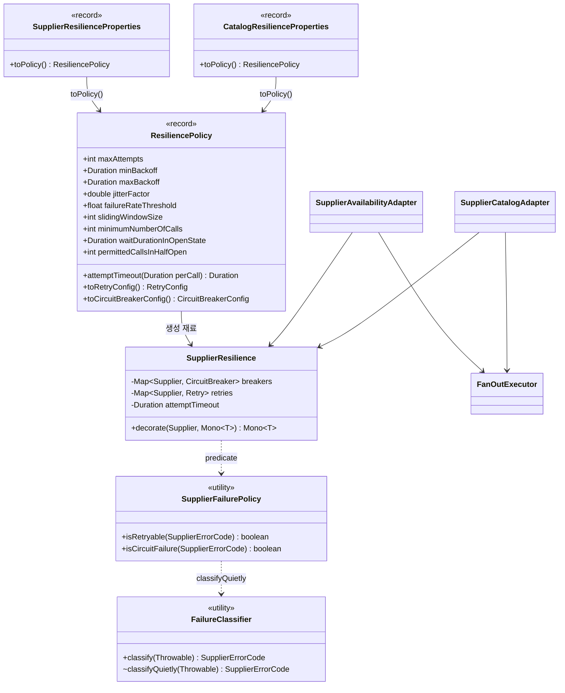
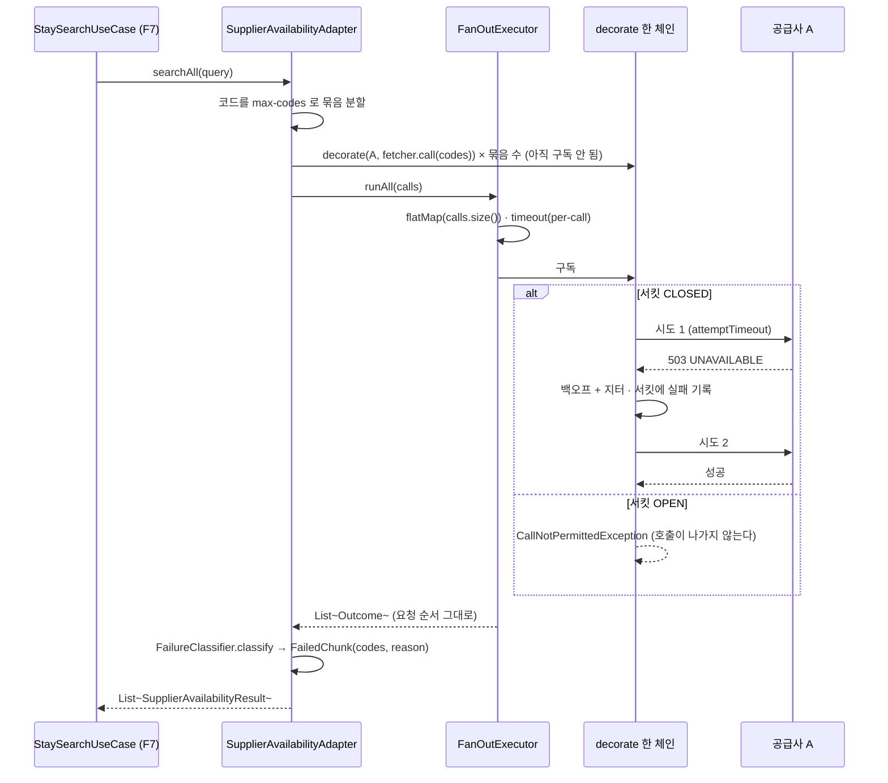

# supplier-resilience 설계 — 공급사 재시도·서킷 (F9)

status: 확정
updated: 2026-09-07

## 1. 요구사항 재해석·범위

**해결하려는 문제.** 공급사가 일시적으로 흔들릴 때 검색이 통째로 비지 않게 하고(재시도), 공급사가
계속 죽어 있을 때 그쪽으로 호출을 계속 흘려보내지 않게 한다(서킷). 두 장치는 서로 반대 방향으로
작동한다 — **재시도는 부하를 늘리고 서킷은 끊는다.** 그래서 값을 따로 정할 수 없고, 조합기가 이미
들고 있는 상한(`per-call`·`budget`)과 한 부등식 안에서 함께 잡아야 한다.

**범위를 여는 사실 하나.** F6이 병합되며 검색(`api-app`)과 수집(`batch-app`)이 **별도 프로세스**가
됐고, 두 모듈이 `supplier.fan-out`·`supplier.catalog.fan-out`을 각각 한 벌씩 들고 있다. 그래서
"검색용/수집용 정책 두 벌"은 새로 만드는 구조가 아니라 **이미 있는 구조에 한 벌을 더 얹는 것**이다.

### 1.1 실측 (F3a 이연 항목 「타임아웃 값과 동시 호출 상한의 실측 보정」 종결)

F3a가 "F3 이후 F2 모의 서버로 측정"을 이연으로 남겼고, 조건이 충족되어 이 feature에서 측정했다.
실행 환경은 로컬(10코어), 모의 서버 A(9091)·B(9092)를 `./gradlew :mock-supplier-*:bootRun`으로 기동.

**측정 1 — 정상 모드 기준선** (`k6/load.js`, 20 VU · 50초 · 188,190 요청 · 실패 0)

| 공급사 | p50 | p95 | p99 | max |
|---|---|---|---|---|
| A | 2.27ms | 11.11ms | 55.47ms | 539ms |
| B | 1.77ms | 9.02ms | 42.53ms | 527ms |

**측정 2 — 꼬리 지연 주입** (`k6/tail-latency.js`, A에만 10% 확률 5초 지연)

A의 분포가 `p50 1.34ms · p85 2.41ms · p90 6.74ms · p95 5s`다. **중간값이 없다** — 정상 아니면 정확히
5초다. 고장이 "조금 느려지는 것"이 아니라 "정상 아니면 멈춤"이라는 뜻이다.

**측정 3 — 동시 호출 수를 올리면** (A 재고·요금 단일 엔드포인트, 각 단계 20초)

| 동시 수 | p50 | p95 | p99 | 실패 |
|---|---|---|---|---|
| 10 | 0.68ms | 1.37ms | 3.01ms | 0 |
| 40 | 3.20ms | 6.99ms | 13.23ms | 0 |
| 80 | 7.18ms | 15.10ms | 32.63ms | 0 |
| 160 | 14.49ms | 33.94ms | 79.12ms | 0 |

처리량이 약 9,000 rps에서 포화되고 지연이 동시 수에 **선형**으로 늘 뿐, 무릎도 429도 없다.

**실측이 닫은 것과 닫지 못한 것.**

| | 결론 |
|---|---|
| `per-call` 값 | **실측으로 정할 수 없다.** 분포가 이봉형이라 상한을 50ms로 두든 3.9s로 두든 결과가 같다. 계약(`docs/supplier-api-contract.md`)에도 응답시간 SLA가 없다. `per-call`은 지연에 맞춘 값이 아니라 **멈춘 호출을 끊는 장치**로 정의하고 현행 4s를 유지한다 |
| 동시 상한 | **실측으로 반대 근거가 나오지 않는다.** 160 동시에서도 실패 0이고 모의 서버는 밀리면 줄을 세울 뿐 거절하지 않는다. 구조로 닫는다 (D-F9-5) |
| rate limiter 도입 조건 | **성립하지 않는다.** 부하로는 429가 재현되지 않고 고장 제어 API로 강제할 때만 나온다. README의 조건("한도 초과 유형이 관측될 때만")을 충족하지 못하므로 F10으로 이월 (D-F9-10) |
| 재시도의 이득 | **계산된다.** 묶음 실패율 10%에서 공급사당 묶음이 3이면 그 공급사가 최소 한 묶음 실패할 확률이 `1 − 0.9³ = 27.1%`, 시도 2회면 `1 − 0.99³ = 2.97%`, 3회면 `0.30%`다. 단 묶음 3은 가정이다(§1.2) |

### 1.2 앞선 문서의 정정 — "부등식이 이미 깨져 있다"는 가정 위에 있다

F3a `01-design.md` §7과 `features/README.md` F9 절이 **"숙소 120곳이 A·B 각 3묶음이면 호출 6건이고
현재 값은 재시도 없이도 이미 깨진다"**고 적고 있다. 실제 데이터를 세면 다르다.

| 공급사 | 시드 숙소 | `max-codes` | 묶음 수 |
|---|---|---|---|
| A | 2곳 (`A-3201` · `A-3305`) | 50 | 1 |
| B | 1곳 (`P-88410`) | 50 | 1 |

호출은 **2건**이고 `⌈2÷2⌉ × 4s = 4s < 5s`로 **부등식은 지금 성립한다.** "숙소 120곳"은 계약에도
시드에도 요구사항에도 출처가 없는 **예시 가정**이 문서에 사실처럼 남은 것이다. 이 표는 F7 병합 뒤
(`64f443e`) 다시 확인했고 값이 그대로다 — F7은 검색 대상 수를 바꾸지 않았다.

정정은 이 feature에서 **실제로 수행했다**(§7 「함께 고치는 문서」). 대상은 다섯 곳이고, F7이 자기
설계에 같은 부등식을 한 번 더 적어 한 곳이 늘었다.

### 1.3 수용 기준

1. 재시도 대상 유형(§3.4)의 실패는 정해진 횟수만큼 다시 시도되고, 대상이 아닌 유형은 **한 번도**
   다시 시도되지 않는다.
2. 재시도가 소진되면 **원래 예외**가 실패 값의 원인으로 남는다 — 감싼 예외가 아니다.
3. 재시도 전체가 조합기의 `per-call` 안에서 끝난다. 조합기 코드는 재시도 때문에 바뀌지 않는다.
4. 한 공급사가 연속으로 실패하면 서킷이 열리고, 열린 동안 그 공급사로는 **호출이 나가지 않는다**
   (모의 서버 접근 로그에 요청이 없다).
5. 열린 서킷이 대기 시간을 지나면 정해진 수만큼만 통과시키고, 그 결과로 닫히거나 다시 열린다.
6. 서킷이 열려 있어도 **다른 공급사의 결과는 그대로 돌아온다**.
7. 동시 구독 수가 요청의 호출 수를 넘지 않으며, 호출 목록이 비어도 예외가 나지 않는다.
8. 서킷의 **상태 전이가 로그로 남는다** — 어느 공급사가 언제 열리고 닫혔는지 로그만으로 재구성된다.

### 1.4 포함 / 제외

**포함**

- `SupplierResilience` — 공급사별 `Retry`·`CircuitBreaker` 인스턴스를 들고 `Mono` 하나를 감싸는 데코레이터
- `ResiliencePolicy` — 재시도·서킷 수치를 한 값으로 묶고 시도별 상한을 **유도**한다
- `SupplierResilienceProperties`(`supplier.resilience`) · `CatalogResilienceProperties`(`supplier.catalog.resilience`)
- `SupplierFailurePolicy` — 실패 유형별 "재시도하는가 / 서킷이 세는가" 판정
- `FailureClassifier`에 규칙 추가와 **로그 없는 판정 진입점 분리** (D-F9-11)
- 두 어댑터가 묶음/호출마다 `decorate`를 거치도록 배선
- `FanOutExecutor`의 동시 상한을 **요청마다 호출 수로** 잡고 `max-concurrent` 프로퍼티 삭제 (D-F9-5)
- 커넥션 풀 **명시 설정** — 크기와 대기 타임아웃 (D-F9-6)
- 서킷 **상태 전이 로그** — `getEventPublisher().onStateTransition(...)` (§4.1 대응 1)
- Resilience4j 코어 모듈 의존성 추가 (`supplier-client`에만)

**제외**

| 제외 항목 | 이유 |
|---|---|
| rate limiter | **F10.** 관측 조건이 성립하지 않는다(§1.1). 캐시와 함께 "공급사로 나가는 총 호출을 줄이는" 같은 문제로 본다 |
| 캐시된 직전 값을 돌려주는 fallback | **F10.** 돌려줄 데이터가 아직 없다. F9의 fallback은 "실패 값을 돌려주는 것"이다 (D-F9-8) |
| `suppliers[]` 응답 표기 | **F7.** `{supplier, status}` 2필드로 확정됐고 `reason`은 응답에 실리지 않는다(D-F7-4) |
| 서킷 상태의 프로세스 간 공유 | 분산 저장소가 없다. 한계를 D-F9-7에 명시한다 |
| 메트릭·이벤트 sink | D-F3A-10 유지. 소비자가 없다. 상태 전이는 로그로만 남긴다 |
| 호출 수 자체를 줄이는 것 | **F9가 풀 수 없다.** 호출이 수천 건이 되면 상한을 키우는 게 아니라 캐시(F10)·검색 대상 제한으로 간다 (§3.3 경계) |

### 1.5 DDD 전술 패턴 — 적용하지 않는다

이 범위에는 불변식을 지키는 Aggregate가 **없다.** `core`에 생기는 변경은 `SupplierErrorCode`에
열거 상수 하나를 더하는 것뿐이고(D-F9-8), 만드는 것은 전부 `supplier-client`의
횡단 요소다. `coding-standard`「적용하지 않을 때」에 따라 Transaction Script도 DDD도 아닌
**Decorator + 값 객체(설정)** 구성으로 간다.

---

## 2. 도메인 모델

**새 타입은 없다.** `core`에 생기는 변경은 열거 상수 하나다.

- 실패 유형은 `SupplierErrorCode`(F3, `core.application`)를 쓰되 **`CIRCUIT_OPEN` 하나를 더한다**
  (D-F9-8). 서킷이 끊은 것은 공급사가 실패한 것이 아니라 **우리가 부르지 않은 것**이고, F7의 요약
  로그가 이 값을 그대로 찍어 「공급사별 성공률·타임아웃 비율」의 재료로 쓰기 때문이다
  (`SearchStaysUseCase`, F7 §3.8).
- 서킷이 차단한 호출은 `Outcome.Failed(supplier, CallNotPermittedException, elapsed)`로 표현된다 —
  기존 실패 경로와 같은 모양이라 `FailedChunk`·`SupplierCatalogResult.Failed`의 **구조는 바뀌지 않는다.**
- **응답 계약은 그대로다.** `suppliers[]`는 `{supplier, status}` 2필드이고(D-F7-4) 사유는 실리지
  않는다. 값을 더하는 일이 응답 경계를 넘지 않으므로 F7의 결정과 충돌하지 않는다.

---

## 3. 레이어 배치

전부 `supplier-client`(infrastructure)에 산다. `core`·`persistence`·`api-app`·`batch-app` 어디에도
새 타입이 생기지 않는다 (LAY-5 — 외부 API 클라이언트 어댑터의 몫).

```
supplier-client/src/main/java/com/stay/property/infrastructure/
├── SupplierResilience.java              (신규) 데코레이터. 공급사별 Retry·CircuitBreaker 보유
├── ResiliencePolicy.java                (신규) record. 수치 묶음 + 시도별 상한 유도
├── SupplierResilienceProperties.java    (신규) record. supplier.resilience
├── CatalogResilienceProperties.java     (신규) record. supplier.catalog.resilience
├── SupplierFailurePolicy.java           (신규) 유형별 재시도/서킷 판정
├── FailureClassifier.java               (수정) CallNotPermittedException 규칙 + 판정 진입점 분리
├── FanOutExecutor.java                  (수정) flatMap 동시성을 호출 수로
├── FanOutPolicy.java                    (수정) maxConcurrent 제거
├── FanOutProperties.java                (수정) max-concurrent 제거
├── CatalogFanOutProperties.java         (수정) max-concurrent 제거
├── SupplierAvailabilityAdapter.java     (수정) 묶음마다 decorate
├── SupplierCatalogAdapter.java          (수정) 호출마다 decorate
├── SupplierHttpClientConfig.java        (수정) 검색용 SupplierResilience 빈 + 커넥터 풀 설정
└── SupplierCatalogConfig.java           (수정) 수집용 SupplierResilience 빈
```

의존 방향은 그대로 안쪽으로만 향한다 (LAY-1). Resilience4j 타입은 `supplier-client` 밖으로 나가지
않으며, `SupplierCall`·`Outcome`이 이미 리액티브·인프라 타입의 경계다(D-F3A-7).

### 3.1 클래스 관계



### 3.2 상한의 2단 배치 (D-F9-3)

조합기가 `timeout(per-call)`을 **어댑터가 넘긴 `Mono` 바깥에** 건다. 그래서 어댑터가 재시도를 붙이면
자동으로 상한 안쪽이 되고, **재시도 전체가 상한 하나를 나눠 쓴다.** 시도별 상한을 안쪽에 한 겹 더 둬서
푼다.

```
어댑터가 만드는 call.mono() :
    fetcher.call(codes, query)
        .timeout(attemptTimeout)                        ① 시도별 상한 (신규, 유도값)
        .transformDeferred(CircuitBreakerOperator.of(cb))  ② 서킷   = 안쪽  ┐ D-F9-4
        .transformDeferred(RetryOperator.of(retry))        ③ 재시도 = 바깥  ┘

조합기 FanOutExecutor.toArrival() — 재시도 때문에 바뀌지 않는다 :
    Mono.defer(() -> call.mono()
            .timeout(policy.perCall())                  ④ 전체 상한 (기존)
            .map(Success::new)
            .onErrorResume(cause -> Mono.just(failed(...))))   ⑤ 값으로 흡수 (기존)
```

연산자 순서의 근거 — 재시도는 **업스트림을 다시 구독**하므로, 재시도 연산자 위(①)에 있는 것은
시도마다 다시 실행되고 아래(④)에 있는 것은 재시도 사이클 전체에 대해 한 번만 적용된다. `⑤`가 실패를
값으로 흡수하므로 **재시도는 반드시 그 앞**에 와야 한다.

**시도별 상한은 프로퍼티로 두지 않고 유도한다** (D-F3A-11 `hardStop = budget + 1s`와 같은 방식).

```
attemptTimeout = (per-call − 백오프 합) ÷ maxAttempts
```

`per-call 4s`, 백오프 합 0.3s, 시도 2회면 **1.85s**다. 이렇게 두면 "재시도를 포함한 총 소요가
`per-call`을 넘지 않는다"가 **구조적으로** 성립하고 손잡이가 늘지 않는다. 시도 수를 3으로 올리면
시도별 상한이 저절로 줄어드는데, 이는 "정해진 예산 안에서 시도를 늘리면 시도마다 짧아진다"를 그대로
드러내는 것이라 오히려 정확하다.

> **커넥션 풀의 대기 타임아웃도 여기서 파생한다** (정정 2026-09-07, 리뷰 round-1 #1). 이 문서는 원래
> D-F9-6에서 「대기 타임아웃 < `per-call`」이라고 적었으나 **그 부등식이 틀렸다.** 호출을 실제로 먼저
> 자르는 것은 바깥의 `per-call`이 아니라 **같은 체인 안쪽의 시도별 상한**이다 — 검색 경로에서
> `per-call ÷ 2 = 2s`는 시도별 상한 1.85s보다 커서, 풀 고갈이 자기 예외로 드러나기 전에 시도별 상한에
> 잘린다. 옳은 조건은 **`풀 대기 < 시도별 상한`**이고, 시도별 상한이 위 식으로 `per-call`에서 유도되므로
> 풀 대기도 거기서 파생하는 것이 자연스럽다. 풀 하나를 검색용·수집용이 나눠 쓰므로 기준은 **둘 중 짧은
> 시도별 상한**이다.
>
> ```
> pendingAcquireTimeout = min(용도별 attemptTimeout) ÷ 2
> ```
>
> 값이 아니라 **유도 기준**을 고친 것이 요점이다. 풀 대기가 자기가 지켜야 할 바로 그 값에서 나오므로,
> `per-call`이나 시도 수를 바꿔도 부등식이 따라 움직이고 두 값이 어긋날 자리가 남지 않는다.

**순서가 만드는 두 가지 결과** (D-F9-4).

- **서킷의 표본 단위가 「시도」다.** 재시도가 바깥이므로 각 시도가 서킷을 통과한다. 자세한 결과는
  아래 §3.2.1.
- **`CallNotPermittedException`이 재시도에 노출된다.** 제외하지 않으면 재시도가 열린 서킷을 계속
  두드린다. 이 제외는 선택이 아니라 이 순서의 **필수 짝**이며, 리뷰 확인 항목이다. API 는
  `RetryConfig.Builder.ignoreExceptions(CallNotPermittedException.class)` — 화이트리스트
  (`retryExceptions`)로 어차피 빠지더라도 **의도를 코드에 남기려고 명시**한다. 이 설정은
  `RetryOperator` 경로에서도 그대로 먹는다 — 그 연산자는 정책을 자체 해석하지 않고
  `Retry.AsyncContext.onError()` 에 위임하며, 제외된 예외는 `-1` 을 받아 백오프 없이
  `Mono.error(원래 예외)` 로 즉시 내려간다.

> **`maxAttempts` 는 「재시도 횟수」가 아니라 「총 시도 횟수」다** — 공식 설명이 *"including the initial
> call as the first attempt"*. 기본값 3은 재시도 2회를 뜻한다. 이 설계의 `maxAttempts = 2`는 **최초 호출
> 1회 + 재시도 1회**이며, §3.2 의 시도별 상한 유도식과 §1.1 의 확률 계산이 모두 이 뜻으로 쓰였다.

시도별 상한을 서킷보다 **안쪽**에 두는 이유도 여기서 나온다 — 그래야 타임아웃이 서킷의 실패 표본으로
기록되어 **느린 공급사가 서킷을 열 수 있다.**

#### 3.2.1 표본이 「시도」 단위라는 것의 실제 결과

재시도가 서킷 바깥이므로 논리 호출 1건이 창에 여러 건으로 기록된다. 다만 **부풀림이 비대칭**이다 —
성공하면 1건, 실패하면 2건이다. 시도별 실패 확률을 `q`, `maxAttempts = 2`로 두면

```
표본 수 기댓값      = (1−q)·1 + q(1−q)·2 + q²·2 = 1 + q
실패 표본 기댓값    = q(1−q)·1 + q²·2           = q + q²
서킷이 관측하는 실패율 = (q + q²) / (1 + q)      = q
```

**서킷이 보는 실패율은 언제나 시도별 실패율 `q` 와 정확히 같다** — `maxAttempts` 와 무관하다.
서킷이 세는 단위가 곧 시도이므로 당연한 결과다. 따라서 **실패율은 왜곡되지 않고, 환산 계수도 필요 없다.**

바뀌는 것은 숫자의 **뜻** 하나뿐이다.

| | 뜻 |
|---|---|
| `failureRateThreshold` | "검색의 절반이 실패하면"이 아니라 **"시도의 절반이 실패하면"**이다. 그 시점의 실제 논리 실패율은 `q^maxAttempts` — 임계 50%면 검색 실패율은 25%다. 서킷이 **사용자 피해가 커지기 전에** 열린다는 뜻이라 방향이 맞다 |
| `slidingWindowSize`·`minimumNumberOfCalls` | 창이 `1 + q` 배로 빨리 찬다 — 전면 장애면 2배다. **장애가 심할수록 판정이 빨라진다**는 뜻이라 이것도 의도한 방향이다. 값을 키울 이유가 없다 |

> **문서에 못박을 것.** 이 값들은 **논리 호출이 아니라 시도 기준**이다. 값 자체를 조정하는 것이 아니라
> 이 해석을 주석과 설계 문서에 남긴다.

> **위험.** 실제 공급사의 p99가 시도별 상한보다 크면 정상 응답을 자르기 시작한다. 모의 서버 분포에서는
> 어떤 값이든 결과가 같아 이 위험이 드러나지 않는다(§1.1 측정 2). **하한 검사값은 이연 항목**이며,
> 실제 공급사가 붙는 시점에 재검토한다.

### 3.3 동시 상한 — 값을 정하지 않고 없앤다 (D-F9-5)

`FanOutExecutor`가 호출 목록을 통째로 받으므로 **요청 시점에 호출 수를 안다.**

```java
Flux.fromIterable(calls).index()
    .flatMap(indexed -> toArrival(...), Math.max(1, calls.size()))
    .take(policy.budget())
```

`Math.max(1, ...)`가 필요한 이유는 `flatMap`이 concurrency 0을 거부하기 때문이다 — 호출 목록이 비면
터진다.

이러면 **웨이브가 항상 1**이라 지켜야 하는 부등식이 다음으로 줄어든다.

```
budget > per-call
```

이것은 `FanOutProperties`·`CatalogFanOutProperties`가 **이미 기동 시 검사하고 있는 조건**이다. 따라서
D-F3A-8이 남긴 미완결("기동 시점에는 공급사 수를 몰라 최소 조건만 강제한다")이 해소된다 — 최소 조건이
곧 완전한 조건이 된다.

`max-concurrent` 프로퍼티는 **삭제한다.** 2도 6도 근거가 없었고, 근거 없는 값을 잘 고르는 대신 정할
값 자체를 없앤다.

> **경계 — F9가 풀 수 없는 문제.** 묶음이 늘면 한 요청이 내는 동시 호출도 그만큼 늘고, 자체 천장이
> 없다. 호출이 수천 건에 이르면 커넥션 풀도 답이 아니다. 그때 필요한 것은 **상한을 키우는 것이 아니라
> 호출 수 자체를 줄이는 것**이며, 그것은 캐시(F10)와 검색 대상 제한의 몫이다. 이 설계는 그 지점을
> 경계로 명시하고 넘기지 않는다.

### 3.4 재시도 대상과 서킷 기록 대상

두 판정은 다른 질문에 답한다 — 재시도는 "다시 부르면 달라지나", 서킷은 "공급사가 아픈가".

| `SupplierErrorCode` | 재시도 | 서킷이 센다 | 근거 |
|---|---|---|---|
| `SUPPLIER_ERROR` (500) | O | O | 일시적 내부 오류. GET이라 멱등이다 |
| `UNAVAILABLE` (503·연결 거부) | O | O | "지금은 안 된다"는 신호 |
| `TIMEOUT` | O | O | 응답이 늦거나 멈춤 |
| `RATE_LIMITED` (429) | **X** | O | 이미 한도를 넘겼는데 다시 때리면 더 나빠진다. 서킷은 세야 한다 — 공급사가 못 받고 있는 상태다 |
| `INVALID_REQUEST` (400) | X | X | 같은 요청은 같은 결과. 우리 요청이 틀렸다 |
| `UNAUTHORIZED` (401) | X | X | 키를 고쳐야 낫는다. 서킷을 열어도 회복되지 않고 진단만 흐려진다 |
| `INVALID_RESPONSE` | X | X | 계약 위반. 다시 불러도 같은 본문이 온다 |
| `UNEXPECTED` | X | X | 분류표에 없다. 모르는 것을 재시도하지 않는다 |
| `CIRCUIT_OPEN` (우리가 차단) | X | X | 공급사가 준 실패가 **아니다.** 다시 부르면 서킷을 둔 이유가 사라지고, 서킷 표본으로 세면 자기 상태를 자기가 먹인다 |
| `POOL_EXHAUSTED` (우리 풀이 빔) | X | X | 역시 공급사가 준 실패가 아니라 **자사 병목**이다. 자리가 없는데 다시 부르면 같은 줄을 한 번 더 세우고, 표본으로 세면 부하가 오를수록 우리 풀이 멀쩡한 공급사의 서킷을 연다 (D-F9-6) |

**재시도 대상은 서킷 기록 대상의 부분집합**이다. 재시도하는 것은 전부 "공급사가 아픈" 유형이지만
그 역은 성립하지 않으며, 갈리는 자리가 `RATE_LIMITED` 하나다. rate limiter 없이 429에 대응하는 방법이
이것이다.

**`POOL_EXHAUSTED` 를 값으로 더하는 판단 기준은 D-F9-8과 같다** — 그 값을 읽을 소비자가 실재하는가.
요약 로그가 `reason`을 그대로 찍으므로(F7 §3.8) 소비자는 있고, 여기서 `TIMEOUT`으로 적으면 그 줄이
"공급사가 느리다"는 **거짓 문장**이 되어 새벽에 멀쩡한 공급사를 의심하게 만든다. 실패 유형은 재시도·서킷
판정만 가르는 것이 아니라 **사람이 읽는 문장**이기도 하다. 예외 타입에서 이 유형이 갈리는 자리는
§3.6의 유도식과 짝이다 — 유도식이 무너지면 이 값은 코드에 있어도 실제로는 나오지 않는다.

`CallNotPermittedException`(서킷이 차단)은 **재시도 대상이 아니고 서킷 표본도 아니다** — 차단 자체는
실패가 아니고, 차단된 호출을 다시 부르는 것은 서킷을 둔 이유를 무효로 만든다. 재시도에서 빼는 것은
`RetryConfig.ignoreExceptions` 로, 서킷 표본에서 빼는 것은 **자기 예외라 애초에 기록하지 않는** 것으로
이뤄진다. 표기는 `CIRCUIT_OPEN` 이다 (D-F9-8) — 여기서 `UNAVAILABLE` 로 쓰면 §3.4의 첫 문장("서킷은
공급사가 아픈가에 답한다")이 요약 로그에서 거짓이 된다.

### 3.5 호출 순서 (검색 1건)



### 3.6 설정

```yaml
supplier:
  fan-out:                      # 검색용 — max-concurrent 를 지운다
    per-call: 4s
    budget: 5s
  resilience:                   # 검색용 (신규)
    max-attempts: 2             # 최초 호출 포함. 재시도는 1회
    min-backoff: 200ms
    max-backoff: 600ms
    jitter-factor: 0.5
    sliding-window-size: 10
    minimum-number-of-calls: 5
    failure-rate-threshold: 50
    wait-duration-in-open-state: 60s
    permitted-calls-in-half-open: 2
    # slidingWindowType·maxWaitDurationInHalfOpenState·automaticTransition·slowCall* 는
    # 기본값을 그대로 쓰므로 프로퍼티로 노출하지 않는다 (§3.7)
  catalog:
    fan-out:                    # 수집용 — max-concurrent 를 지운다
      per-call: 30s
      budget: 40s
    resilience:                 # 수집용 (신규). 배치는 오래 기다려도 되고 다 받는 것이 중요하다
      max-attempts: 3
      ...
```

두 벌을 두는 근거는 `CatalogFanOutProperties`가 이미 든 것과 같다 — **검색은 사용자가 기다리고 수집은
배치가 기다리므로 한 벌을 나눠 쓰면 어느 한쪽은 반드시 틀린다.** 값이 다른 이유는 대기 주체가 다르고,
수집은 지금 실패해도 다음 주기가 있으므로 시도를 더 줄 수 있다.

커넥션 풀은 명시 설정한다 (D-F9-6). 기본값이 `max(코어 수, 8) × 2`라 **배포 머신마다 달라지고**,
`flatMap` 상한을 없앤 뒤에는 이것이 **유일한 상한**이기 때문이다.

크기와 대기 타임아웃은 성격이 다르다.

| | 걸리는 범위 | 값 |
|---|---|---|
| `maxConnections` | **원격 호스트마다 따로** — reactor-netty 자바독이 *"the maximum number of connections **(per connection pool)**"*이고 풀은 호스트별로 갈린다. 공급사 A가 붙든 자리는 B의 자리를 줄이지 않는다 | 50 (공급사당). 실측에서 동시 80까지 p99 33ms로 선형이던 구간 |
| `pendingAcquireTimeout` | **이 자원을 쓰는 모든 경로에 값 하나** — 검색용·수집용이 같은 `ReactorResourceFactory`를 쓴다 | `min(용도별 attemptTimeout) ÷ 2` (§3.2) |

대기 타임아웃이 **가장 짧은** 시도별 상한을 기준으로 삼는 이유는, 한 경로에서라도 시도별 상한이 먼저
터지면 그 경로의 풀 고갈이 다시 `TIMEOUT`으로 기록되기 때문이다. 크기는 이연 항목(§6.1)이지만 대기
타임아웃은 **값이 아니라 유도식**이라 이연 대상이 아니다.

### 3.7 서킷 — 상태 셋, 전이 넷, 그리고 값

서킷에서 정할 것은 셋뿐이고 서로 겹치지 않는다 — **① 상태를 누가 갖는가**(§3.6에서 공급사 단위·프로세스
로컬로 닫혔다) **② 상태를 언제 바꾸는가**(전이 4개) **③ 각 상태에서 호출자가 무엇을 받는가.**

#### 상태 셋

상태는 셋이고, 3×3 조합 중 **실제로 존재하는 전이는 넷뿐**이다. 나머지 다섯(자기 자신으로 · CLOSED→
HALF_OPEN · OPEN→CLOSED)은 존재하지 않는다 — **회복은 반드시 HALF_OPEN을 거친다.**

| 상태 | 호출에 일어나는 일 | 호출자가 받는 것 | 벗어나는 유일한 길 |
|---|---|---|---|
| `CLOSED` | 공급사로 **그대로 나간다.** 결과를 크기 10 창에 넣는다 | 정상 결과 또는 실제 실패 | 표본 **5건 이상** + 실패율 **50% 이상** → `OPEN` |
| `OPEN` | **호출하지 않는다.** `CallNotPermittedException`을 즉시 던진다. 소켓·풀 슬롯·시도별 상한 어느 것도 쓰지 않는다 | `CIRCUIT_OPEN` 실패 값 (D-F9-8) | 60초 경과 **그리고 그 뒤 호출이 도착** → `HALF_OPEN` |
| `HALF_OPEN` | **앞의 2건만** 내보낸다. 3건째부터는 `OPEN`과 똑같이 즉시 거부 | 탐침이면 실제 결과, 아니면 `CIRCUIT_OPEN` | 탐침 2건의 결과가 모이면 즉시 판정 → 전부 성공이면 `CLOSED`, 하나라도 실패면 `OPEN` |

**"탐침"은 합성 호출이 아니라 진짜 검색이다.** 이 절에서 탐침이라 부르는 것은 별도의 헬스체크가
아니라, `HALF_OPEN`이 된 뒤 **가장 먼저 도착해 자리를 얻은 실제 검색 요청**이다. Resilience4j에는
탐침을 만들어 보내는 기능이 없다 — `CircuitBreakerOperator.of(cb)`는 `Function<Publisher<T>,
Publisher<T>>`라서 **어댑터가 이미 만들어 넘긴 `Mono`의 구독을 허용하거나 거부할 뿐**이고, 공급사 API를
참조하지도 스케줄러를 돌리지도 않는다. 따라오는 결과가 셋이다.

1. **탐침이 실패하면 그 손해는 실제 사용자가 받는다.** 허용 수 2면 회복 시도 한 번에 최대 두 명이 그
   공급사에 대해 `PARTIAL`/`FAILED`를 본다. 허용 수를 크게 잡지 않는 또 하나의 이유다.
2. **탐침이 성공하면 그 결과는 버려지지 않고 그대로 응답에 실린다.** 검사용 호출이 아니라 원래 하려던
   일이기 때문이다. (라이브러리가 값을 그대로 흘려보내는 동작이라 별도 테스트를 두지 않는다 — TST 「적용하지 않을 때」.)
3. **트래픽이 없으면 회복도 없다.** 아래 첫 항목과 같은 사실의 다른 면이다.
   `automaticTransitionFromOpenToHalfOpenEnabled`를 켜도 **상태만** 바뀔 뿐 호출은 여전히 만들지 않는다.

두 가지가 놓치기 쉽다.

- **`OPEN`은 시간이 아니라 호출이 깨운다.** 공식 문서가
  `automaticTransitionFromOpenToHalfOpenEnabled`를 설명하며 *"if set to false the transition to
  HALF_OPEN **only happens if a call is made**, even after `waitDurationInOpenState` is passed. The
  advantage here is **no thread monitors** the state of all CircuitBreakers"*라고 적는다. [R-3] 60초가 지나도 아무도 검색하지 않으면 상태는 `OPEN` 그대로다.
  다음 호출이 `tryAcquirePermission()`을 부르는 순간에야 전이한다. 새벽에 공급사가 살아나도 첫 검색이
  올 때까지 차단이 유지되며, 이것은 결함이 아니라 **"부르지 않으면 알 수 없다"는 사실의 반영**이다.
  (`automaticTransitionFromOpenToHalfOpenEnabled`를 켜면 감시 스레드가 생긴다 — 아래 표에서 끈 이유다.)
- **`HALF_OPEN`의 거부는 대기가 아니다.** 공식 문서가 *"Further calls are rejected with a
  `CallNotPermittedException`, **until all permitted calls have completed**"*라고 적는다 — 줄을 서는
  것이 아니라 즉시 거부다. 회복 확인 중이라고 사용자가 더 기다리는 일은 없다. [R-3]

#### 전이 넷 — 판정식과 지배 파라미터

| 전이 | 판정식 | 지배 파라미터 · 우리 값 | 값이 크면 / 작으면 |
|---|---|---|---|
| ① `CLOSED`→`OPEN` | 표본 ≥ **5** **그리고** 실패율 ≥ **50%** — 둘 다 만족해야 한다 | `minimumNumberOfCalls` 5 · `failureRateThreshold` 50 · `slidingWindowSize` 10 | 최소 호출 수가 크면 **서킷이 죽은 코드가 된다**(기본값 100 = "99건이 다 실패해도 안 열린다"). 작으면 우연 몇 건에 열린다 |
| ② `OPEN`→`HALF_OPEN` | 마지막 전이로부터 **60초** 경과 **그리고** 호출 도착 | `waitDurationInOpenState` 60s | 크면 회복을 늦게 확인한다. 작으면 아직 아픈 공급사를 반복해 찌른다 |
| ③ `HALF_OPEN`→`CLOSED` | 탐침 **2건**의 실패율 < 50% → 실질적으로 **2건 모두 성공** | `permittedNumberOfCallsInHalfOpenState` 2 | 크면 회복 확인에 그만큼의 검색이 필요하고 회복 중인 공급사에 한꺼번에 부하가 간다. 1이면 우연 한 번이 판정을 지배한다 |
| ④ `HALF_OPEN`→`OPEN` | 탐침 2건의 실패율 ≥ 50% → 실질적으로 **1건이라도 실패** | 독립 파라미터 **없음** — ③과 임계를 공유 | 이 칸의 실제 설계는 값이 아니라 **탐침 수를 2로 고른 것**이다 (아래 「왜 2인가」) |

**임계 하나가 두 전이를 지배하는 것이 회피 불가능한 제약**이다. Resilience4j는 `failureRateThreshold`를
`CLOSED` 판정과 `HALF_OPEN` 판정에 함께 쓰고, half-open만 더 엄격하게 두는 손잡이가 없다.

#### 전 과정 — 장애 한 번을 호출 단위로

값 셋이 맞물리는 방식은 한 번의 장애를 끝까지 따라가야 보인다. 공급사 A가 죽었다 살아나는 동안:

| 구간 | 상태 | 무슨 일이 일어나나 |
|---|---|---|
| 호출 1–4 (성공) | `CLOSED` | 표본 4건. **5건 미만이라 판정 자체를 하지 않는다** — 실패율이 100%여도 이 구간에서는 열리지 않는다 |
| 호출 5 (첫 실패) | `CLOSED` | 표본 5, 실패 1 → 20% < 50%. 유지 |
| 호출 6–9 (연속 실패) | `CLOSED`→`OPEN` | 표본 9, 실패 5 → **55.6% ≥ 50%** → 연다 |
| 이후 60초 | `OPEN` | 공급사로 **한 건도 나가지 않는다.** 각 호출은 즉시 `CallNotPermittedException` → `CIRCUIT_OPEN`. 재시도는 이 예외를 `ignoreExceptions`로 제외하므로 두드리지 않는다. 사용자는 4초를 기다리는 대신 **즉시 B의 결과**를 받는다 |
| 60초 뒤 **첫 호출** | `OPEN`→`HALF_OPEN` | **이 호출이 전이를 일으키고, 그 호출 자신이 탐침 1번이 된다** — `OpenState.tryAcquirePermission()`이 `toHalfOpenState()`를 부른 뒤 곧바로 허용 자리를 하나 집는다. 전이만 시키고 자기는 거부되는 것이 아니다. 다음 호출이 탐침 2번, 3건째부터 즉시 거부 |
| 탐침 2/2 성공 | `HALF_OPEN`→`CLOSED` | 닫고 **창을 비운다.** 옛 실패가 다음 판정에 남지 않는다 |
| 탐침 중 1건이라도 실패 | `HALF_OPEN`→`OPEN` | 다시 60초 |

이 흐름이 말하는 설계상의 요점 셋.

1. **최소 호출 수가 없으면 서킷은 첫 실패에 열린다.** 그래서 5가 임계 50%보다 먼저 걸리는 조건이다.
2. **차단이 이득인 이유는 재시도를 막아서가 아니라 첫 호출을 막아서다.** 죽은 공급사로 나가는 호출
   하나가 시도별 상한(1.85초) 동안 **검색을 붙든다.** 재시도까지 하면 그 검색은 약 3.9초를 기다린 뒤에야
   부분 결과를 낸다. §4.1의 "왜 토큰 버킷이 아니라 서킷인가"가 여기서 나온다.
3. **회복 판정은 요청이 와야 일어난다.** 트래픽이 없으면 상태도 움직이지 않는다.

#### 캐시(F10)가 붙으면 이 판정이 달라진다

**서킷은 캐시 미스에만 반응한다.** 캐시가 적중한 검색은 어댑터까지 내려오지 않으므로 공급사 호출이
없고, 따라서 **표본도 없고 상태 변화도 없다.** F10이 앞에 붙으면 이 절의 판정이 세 방향으로 달라진다.

| | 영향 | 왜 |
|---|---|---|
| ① 여는 판정이 **느려진다** | `minimumNumberOfCalls 5`를 채우는 **실시간**이 캐시 적중률만큼 늘어난다. 적중률 90%면 검색 10건당 1건만 공급사로 나가므로 10배 | 표본이 검색 수가 아니라 **캐시 미스 수**로 쌓인다 |
| ② **회복이 더 늦어진다** | `OPEN`→`HALF_OPEN`은 호출이 깨우는데(§3.7), 캐시 적중은 어댑터에 닿지 않는다. 60초가 지나도 **캐시 미스가 나야** 전이한다 | 위 「`OPEN`은 시간이 아니라 호출이 깨운다」의 직접적 귀결 |
| ③ 닫힌 뒤에도 **옛 실패가 남는다** | 부분 실패 응답을 캐시하면 서킷이 `CLOSED`로 돌아온 뒤에도 TTL 동안 그 공급사가 `FAILED`인 응답이 나간다 | 캐시는 서킷의 상태 변화를 모른다 |

③이 F10과 직접 부딪힌다 — F10은 **부분 실패도 캐시**하기로 했고 TTL이 30초다. 서킷 회복과 캐시 만료가
서로를 모르는 채 각자 돈다.

**그래도 서킷 설정은 그대로 유지한다.** 캐시의 TTL이 짧고 공급사 rate limit·응답 속도를 고려해
호출 자체가 줄면 **실제로 서킷이 열리는 일은 드물어진다.** 그렇다고 설정을 빼지 않는다 — 이 어댑터가
언제 어디서 불릴지(캐시를 거치지 않는 경로·배치·새 소비자) 지금 알 수 없고, 서킷은 **열리지 않을 때
비용이 0**이기 때문이다. 판정에 쓰는 값도 그대로 둔다. 캐시가 앞에 있으면 표본이 느리게 쌓일 뿐,
값의 뜻이 바뀌지는 않는다.

> **F10으로 넘기는 결정.** 캐시를 **서킷보다 앞에 둘 것인가 뒤에 둘 것인가**가 위 셋을 한꺼번에 정한다.
> 앞에 두면(검색 결과 캐시) ①②③ 전부 발생하고, 뒤에 두면(공급사 호출 단위 캐시) 서킷이 모든 호출을
> 보므로 ①②는 사라지지만 캐시의 목적(공급사 호출 절감)이 약해진다. **F9에서는 정하지 않는다** —
> 캐시가 없어 지금은 셋 다 발생하지 않고, 캐시 구조를 모르는 채 정하면 틀린다.
> **F10 착수 시 이 절을 입력으로 받는다.**

#### 값 — 기본값과 우리 값

기본값은 `CircuitBreakerConfig` 소스에서 직접 확인했다. **기본값 그대로 쓰면 서킷이 죽은 코드가 된다** —
`minimumNumberOfCalls` 100은 "호출 99건이 전부 실패해도 열리지 않는다"는 뜻이고, 우리 트래픽에서 100건은
오지 않는다.

| 파라미터 | 기본값 | 우리 값 | 근거 |
|---|---|---|---|
| `slidingWindowType` | COUNT_BASED | **그대로** | 아래 「왜 COUNT_BASED인가」 |
| `slidingWindowSize` | 100 | **10** | 오래된 결과가 빨리 밀려나 staleness가 줄고, 판정에 필요한 표본이 현실적인 수가 된다 |
| `minimumNumberOfCalls` | 100 | **5** | 100이면 영원히 판정하지 않는다. 아래 「이 쌍이 뜻하는 것」 |
| `failureRateThreshold` | 50 | **그대로** | §3.2.1에서 실패율이 왜곡되지 않음을 확인했으므로 조정할 이유가 없다 |
| `waitDurationInOpenState` | 60s | **그대로** | 아래 「왜 60초를 줄이지 않나」 |
| `permittedNumberOfCallsInHalfOpenState` | 10 | **2** | 아래 「왜 2인가」 |
| `maxWaitDurationInHalfOpenState` | 0 (무한) | **그대로** | 아래 「왜 0을 유지하나」 |
| `automaticTransitionFromOpenToHalfOpenEnabled` | false | **그대로** | true면 모든 서킷 인스턴스를 감시하는 스레드가 생긴다. 호출이 올 때 전환하면 충분하고, 호출이 없으면 전환할 이유도 없다 |
| `slowCallRateThreshold` | 100 (사실상 비활성) | **그대로 = 쓰지 않는다** | 아래 「느린 호출 판정을 쓰지 않는 이유」 |
| `slowCallDurationThreshold` | 60s | **그대로 (미사용)** | 위와 같다 |

**왜 COUNT_BASED인가.** `minimumNumberOfCalls`의 공식 정의에 붙은 괄호가 결정적이다 —
*"the minimum number of calls which are required **(per sliding window period)**"*. TIME_BASED 60초 +
최소 10이면 **60초 안에 표본 10건**이 모여야 한다. 우리 호출은 검색 요청에 종속적이라 분당 검색이
적으면 **공급사가 완전히 죽어도 실패율이 계산되지 않아 서킷이 영영 열리지 않는다.** COUNT_BASED는
"마지막 N개 호출"이라 얼마가 걸리든 N개가 모이면 판정한다. 두 위험의 무게가 다르다 — staleness는
오탐을 낳지만 "열리지 않음"은 **서킷을 도입한 이유 자체를 없앤다.**

> **전환 조건 (이연).** 트래픽이 실측으로 확보되어 "창 기간 안에 `minimumNumberOfCalls`가 안정적으로
> 채워진다"가 확인되면 TIME_BASED로 옮기는 편이 낫다. 그때 이 카드를 다시 본다.

**이 쌍(10 / 5)이 뜻하는 것.** 임계 50%이므로 **표본 5건 중 3건이 실패하면** 열린다. 공급사가 완전히
죽었다면 검색 1건이 표본 2건(시도 2회)을 전부 실패로 남기므로 **검색 2~3건 만에** 열린다. 재시도가
이미 일시적 흔들림을 흡수한 뒤이므로, 여기까지 온 실패는 "재시도로도 안 되는 실패"다 — 그 수준의
실패가 두세 번 연달아 나면 여는 것이 맞다. **이 쌍이 이 절에서 유일하게 조정 여지가 있는 값**이며,
더 둔감하게 하려면 `minimumNumberOfCalls`를 10으로 올린다(검색 5건).

**왜 60초를 줄이지 않나.** 차단 중에는 사용자가 **호출당 4초를 기다리는 대신 즉시 부분 결과**를 받는다.
즉 차단이 길어도 그 자체는 사용자에게 손해가 아니라 이득이다. 줄여야 하는 근거는 "회복을 늦게
알아챈다" 하나인데, 그 비용을 재려면 **공급사가 실제로 얼마나 자주·얼마나 오래 죽는지**를 알아야 하고
그 데이터가 없다. 근거 없이 줄이지 않는다.

**왜 2인가.** Azure 의 Circuit Breaker 패턴 문서가 half-open 을 이렇게 정의한다 — *"A limited number
of requests … are allowed to pass through. If these requests are successful … switches to the Closed
state. … **If any request fails**, the circuit breaker assumes that the fault is still present, so it
**reverts to the Open state**."* 즉 **탐침이 하나라도 실패하면 되돌린다**가 문서화된 의미론이다.

그런데 Resilience4j 는 그 의미론을 직접 제공하지 않는다 — half-open 판정도 **허용 호출 전체의 실패율**로
하고, 게다가 `failureRateThreshold` 를 CLOSED 판정과 **같은 값으로 공유**한다(half-open 만 엄격하게 두는
손잡이가 없다). 우회할 수 없는 제약이다.

**허용 수 2가 그 의미론을 재현한다.** 임계 50%에서 탐침 2건이면 1건 실패 = 50% 이고, 공식 설명이
"이 비율 **이상**이면 OPEN" 이므로 **한 건만 실패해도 다시 열린다.** 3으로 두면 1건 실패가 33%라
닫혀 버려 Azure 의 권고와 어긋난다.

탐침이 이미 **재시도를 안에 품고 있다**는 것도 같은 방향이다 — 실패한 탐침은 이미 두 번 실패한 것이라
"우연"으로 보기 어렵다. 그런 신호가 하나 나왔는데 회복으로 판정하는 것은 위험하다. 기본값 10은 회복
확인에 검색 10건이 필요해 회복이 느려진다.

**왜 0을 유지하나.** `maxWaitDurationInHalfOpenState`가 막는 위험은 "허용된 호출이 영영 완료되지 않아
half-open에 갇히는 것"인데, **우리 호출에는 시도별 상한과 `per-call` 상한이 이중으로 걸려 있어 반드시
종료한다.** 반대로 값을 주면 짝인 `transitionToStateAfterWaitDuration`의 기본값이 `OPEN`이라,
트래픽이 적을 때 **탐침이 다 모이기 전에 다시 OPEN으로 돌아가 호출을 막는다** — 회복이 오히려
늦어진다. 게다가 값을 주면 스케줄 작업이 하나 생긴다(`automaticTransition`을 끄는 이유와 같은 성격).

**느린 호출 판정을 쓰지 않는 이유.** `slowCallDurationThreshold`가 하려는 일을 **시도별 상한이 이미
하고 있다** — 그보다 느린 호출은 `TimeoutException`이 되어 서킷의 실패 표본으로 기록된다(그래서 시도별
상한을 서킷보다 안쪽에 뒀다, §3.2). 같은 일을 두 손잡이로 하면 어느 쪽이 걸렸는지 로그에서
구분되지 않는다.

**half-open에서 허용 수를 넘으면 즉시 거부다.** `HalfOpenState.tryAcquirePermission()`이 카운터를
내리고 0이면 `CallNotPermittedException`을 던진다 — 대기 경로가 없다. 이것이 "회복 중인 공급사에
요청이 쏟아지는 것"을 막는 실제 장치다.

---

## 4. 적용 패턴

| 패턴 | 격리하는 변화 | 검토한 대안 |
|---|---|---|
| **Decorator** (`SupplierResilience.decorate`) | "호출 하나에 재시도·서킷을 입힌다"는 횡단 요소를, 호출을 만드는 코드(Fetcher)와 결과를 모으는 코드(조합기) 어느 쪽도 모르게 격리한다. 정책이 바뀌어도 두 어댑터의 배선 한 줄만 본다 | ① 조합기가 직접 — D-F3A-5(조합기는 `Throwable`을 분류하지 않는다)와 충돌 ② Fetcher마다 — 같은 정책이 네 벌(A·B × 목록·재고)로 복제된다 ③ Spring AOP 어노테이션 — `Mono` 체인 내부에는 프록시 경계가 없어 **붙지 않는다** |
| **정적 팩토리 + 값 객체** (`Properties → Policy`) | 설정 바인딩과 라이브러리 설정 객체 생성 사이를 갈라, 기동 시점 검증이 한곳에 모인다 | 없음 — F3a·F5가 이미 쓰는 형태를 그대로 따른다(일관성) |

### 4.1 왜 토큰 버킷이 아니라 서킷인가

AWS Builders' Library 는 서킷에 유보적이다 — *"circuit breakers introduce modal behavior into systems
that can be difficult to test, and can introduce significant addition time to recovery. We have found
that we can mitigate this risk by limiting retries locally using a token bucket."* 패턴을 도입하는
근거를 한 줄 남기라는 `PAT-1` 에 따라, 이 유보론에 답한다.

**그 권고는 「재시도 증폭」을 문제로 놓은 것이다.** 추측이 아니라 **원문의 지시어가 그렇게 말한다** —
같은 단락이 *"Even with a single layer of retries, traffic still significantly increases when errors
start."* 로 문제를 세우고, 이어서 *"Circuit breakers … are widely promoted to solve **this problem**."*
로 서킷을 그 문제의 해법으로 놓은 **다음에** 유보를 붙인다. AWS 가 재는 것은 **재시도로 늘어난 부하**다.

그런데 **이 시스템에서 죽은 공급사가 물리는 비용은 재시도가 아니다.**

| | 토큰 버킷만 | 서킷 OPEN |
|---|---|---|
| 죽은 공급사로 나가는 **첫 호출** | **그대로 나간다** — 토큰 버킷은 재시도만 막는다 | **나가지 않는다.** 0ms 에 `CallNotPermittedException` |
| 검색 1건이 죽은 공급사를 기다리는 시간 | 시도별 상한 × 시도 수 ≈ **3.9초** | **0** |
| 사용자 체감 | 죽은 공급사 몫이 매 검색마다 소모된다 | 즉시 실패 값이 되고 살아 있는 공급사만 기다린다 |

**부하 실측이 이 표를 그대로 확인했다** (`04-runtime-verification.md` 관측 5). 공급사 하나가 5초씩
지연되는 상태에서 VU 40 · 40초를 걸었더니 31,539 요청 중 **타임아웃 비용을 낸 것은 3건뿐**이고 나머지는
전부 차단됐다. p(95)가 **101ms**로, 차단이 없었다면 매 검색이 지불했을 3.9초와 비교된다.

> **정정 (2026-09-07, 리뷰 round-1 #2).** 여기 원래 "그 슬롯은 살아 있는 공급사가 써야 할 것"이라고
> 적었는데 **사실이 아니다.** reactor-netty의 `maxConnections`는 *"the maximum number of connections
> **(per connection pool)**"* 이고 **풀은 원격 호스트별로 갈린다.** A가 붙든 자리는 B가 못 쓰는 자리가
> 아니다. 결론(서킷이 맞다)은 유지되지만 **근거가 다르다** — 비용은 공급사 간 자원 경쟁이 아니라
> **검색 자체가 죽은 공급사를 기다리는 시간**이고, 그것은 위 실측이 잰 값이다.

> **결론.** 토큰 버킷은 **재시도가 만드는 추가 부하**를 줄이는 장치이고, 서킷은 **첫 호출이 검색을
> 붙드는 것**을 없애는 장치다. 우리 비용은 후자에 있으므로 서킷이 맞다. 둘은 대체재가 아니다.

**유보론을 무시하지 않는 대응 세 가지.** "modal behavior 가 테스트하기 어렵다" 는 지적은 우리에게도
유효하므로 짝으로 둔다.

1. **상태 전이를 반드시 로그로 남긴다** — `CircuitBreaker.getEventPublisher().onStateTransition(...)`.
   모달 동작이 관측되지 않으면 운영자가 "왜 이 공급사가 빠졌는지" 를 재구성할 수 없다. 조합기가
   예산 초과를 굳이 로그로 남기는 것과 같은 논리다. 메트릭 sink 는 여전히 만들지 않는다(D-F3A-10).
2. **HALF_OPEN → CLOSED 와 HALF_OPEN → OPEN 두 전이를 테스트로 못 박는다**(T-11). AWS 가 "테스트하기
   어렵다" 고 한 바로 그 부분이라, 비워 두면 유보론이 그대로 적중한다.
3. **`waitDurationInOpenState` 를 과하게 크게 잡지 않는다** — "significant addition time to recovery"
   가 이 값에서 나온다. 기본값 60초를 유지하되 §6.1 의 발동 조건에 재검토를 걸어 둔다.

`PAT-4`가 "Decorator(횡단 요소: 재시도·캐시)"를 우선 후보로 두고 있고, 이 경우가 정확히 그것이다.
`PAT-2`(Rule of Three)에 걸리지 않는 이유는 추상화를 새로 만드는 것이 아니라 **라이브러리가 제공하는
연산자를 한 자리에 모으는 것**이기 때문이다.

---

## 5. 테스트 리스트

> `test-standard` TST-3의 레이어별 방식을 따른다. 이 feature는 `core`에 타입이 없으므로 domain
> 테스트가 없고, Spring 컨텍스트가 필요한 것은 프로퍼티 바인딩과 빈 배선뿐이다.

**테스트 스택 보정 — `reactor-test`를 `supplier-client`의 test 스코프에 둔다** (승인 2026-09-07, 리뷰
round-1 #3). 근거는 T-08이 기법으로 지정한 **가상 시간**이고, `StepVerifier`·`VirtualTimeScheduler`가
그 아티팩트에만 있다. 실시간으로 재는 대안은 백오프 상한(150ms)을 CI 부하에 노출시켜 간헐 실패를 만든다.
버전은 Boot BOM이 관리하므로 좌표에 적지 않는다.

| ID | 레이어 | 분류 | 케이스 | 기법 | 기대 결과 |
|---|---|---|---|---|---|
| T-01 | supplier-client | Normal | `ResiliencePolicy.attemptTimeout(4s)` — 시도 2회·백오프 합 0.3s | ECP | 1.85s |
| T-02 | supplier-client | Boundary | 시도 수 1·2·3, per-call 이 백오프 합보다 작은 경우 (Parameterized 4) | BVA | 시도 1이면 per-call 그대로, 시도가 늘면 단조 감소, 음수가 되면 예외 |
| T-03 | supplier-client | Normal | `SupplierFailurePolicy.isRetryable` — 표의 유형 전부 (Parameterized 10) | Decision Table | §3.4 표와 일치 (O 3개 · X 7개) |
| T-04 | supplier-client | Normal | `SupplierFailurePolicy.isCircuitFailure` — 표의 유형 전부 (Parameterized 10) | Decision Table | §3.4 표와 일치 (O 4개 · X 6개) |
| T-05 | supplier-client | Normal | 재시도 대상 실패가 한 번 난 뒤 성공하는 `Mono`를 `decorate` 하면 | ECP | 결과가 성공이고 공급사 호출이 2회 |
| T-06 | supplier-client | Invalid | 재시도 대상이 **아닌** 실패(`INVALID_REQUEST`)를 내는 `Mono`를 `decorate` 하면 | Decision Table | 호출이 1회, 원래 예외 그대로 |
| T-07 | supplier-client | Boundary | 재시도가 소진될 때까지 계속 실패하면 | BVA | 호출이 `maxAttempts` 회, **원래 예외**가 나온다 (감싼 예외가 아니다) |
| T-08 | supplier-client | Normal | 재시도 사이에 백오프가 실제로 걸리는가 (가상 시간) | ECP | 시도 간격이 `minBackoff` 이상이고 지터 범위 안 |
| T-09 | supplier-client | State Transition | 실패를 임계까지 쌓으면 → 서킷이 열린다 | State Transition | 이후 호출은 공급사를 부르지 않고 `CallNotPermittedException` |
| T-10 | supplier-client | State Transition | 열린 뒤 대기 시간이 지나면 → half-open, 허용 수만큼만 통과. **테스트 자신이 호출자 역할**을 한다(합성 탐침이 없으므로 흉내 낼 대상도 없다) | State Transition | 허용 수 초과 호출은 즉시 거부, 공급사 호출 수 = 허용 수 |
| T-11 | supplier-client | State Transition | half-open 의 탐침이 성공하면 / 실패하면 (Parameterized 2) | State Transition | 각각 CLOSED / OPEN 으로 간다 |
| T-12 | supplier-client | Interaction | 차단된 호출이 재시도되지 않는다 | Error Guessing | `CallNotPermittedException` 에 대해 호출 시도가 1회 |
| T-13 | supplier-client | Interaction | A 의 서킷이 열려 있어도 B 호출은 그대로 나간다 | Decision Table | B 결과는 성공, A 만 실패 값 |
| T-14 | supplier-client | Normal | `FailureClassifier.classify(CallNotPermittedException)` | ECP | `CIRCUIT_OPEN` — `UNAVAILABLE` 과 갈린다 (D-F9-8) |
| T-15 | supplier-client | Invalid | 분류표에 없는 예외를 `classifyQuietly` 로 판정하면 | Error Guessing | `UNEXPECTED` 이고 **ERROR 로그가 남지 않는다** (D-F9-11) |
| T-16 | supplier-client | Normal | 조합기가 호출 N 건을 받으면 동시 구독 수 | ECP | N 을 넘지 않는다 (웨이브 1) |
| T-17 | supplier-client | Boundary | 조합기에 **빈 호출 목록**을 넣으면 | BVA | 예외 없이 빈 리스트 (`Math.max(1, 0)` 가드) |
| T-18 | supplier-client | Invalid | `supplier.resilience.*` 값이 빠지거나 범위를 벗어나면 (Parameterized) | BVA | **기동 실패**, 메시지에 해당 키 |
| T-19 | supplier-client | Interaction | 어댑터가 묶음마다 `decorate` 를 거치는가 | Decision Table | 묶음 수만큼 `decorate` 호출, 각 호출의 공급사가 그 묶음의 공급사 |
| T-20 | supplier-client | Interaction | 검색용·수집용 `SupplierResilience` 빈이 **서로 다른 정책**으로 만들어지는가 | Decision Table | 두 빈이 다른 인스턴스이고 수치가 각 prefix 를 따른다 |
| T-21 | supplier-client | Normal | `FailureClassifier.classify(PoolAcquireTimeoutException)` — WebClient 가 감싼 모양과 그대로 온 모양 (Parameterized 2) | ECP | 둘 다 `POOL_EXHAUSTED` — `TIMEOUT`·`UNAVAILABLE` 과 갈린다 (D-F9-6) |
| T-22 | supplier-client | Interaction | 풀 고갈로 실패하는 `Mono` 를 `decorate` 하면 | Decision Table | 호출이 1회(재시도 없음)이고 서킷의 실패 표본 수가 0 |

**만들지 않는 것 (TDD-8).**

- Resilience4j 자체 동작(백오프 계산 정확도·슬라이딩 윈도우 집계) — 라이브러리 테스트다. 우리는
  **우리가 준 설정이 그대로 반영되는지**와 **경계에서의 행동**만 본다.
- `FanOutExecutor`의 나머지 계약(포트 계약 1~5) — F3a T-01~06이 덮고 있고 이 feature가 바꾸지 않는다.
- 실제 소켓·커넥션 풀 고갈 — k6와 모의 서버로 확인하며 단위 테스트로 만들지 않는다. **다만 풀 고갈이
  어떤 유형이 되는가**(`POOL_EXHAUSTED`)와 그 유형이 재시도·서킷 판정에서 빠지는가는 예외 객체를
  직접 만들어 확인한다 — 소켓이 필요 없고, 리뷰 round-1 #1이 정확히 이 자리가 비어서 드러났다.
  대기 타임아웃이 시도별 상한보다 짧다는 것은 테스트가 아니라 **유도식이 지킨다**(§3.2) — 값이 그
  상한에서 나오므로 두 값이 어긋날 자리가 없다.
- `Properties → Policy` 단순 위임.

**삭제하는 기존 테스트.** `FanOutExecutorTest`의 **"동시 구독 수가 동시 호출 상한을 넘지 않는다"**
(Parameterized, `maxConcurrent` 인자)는 상한 프로퍼티가 사라지므로 T-16으로 대체한다. 같은 클래스의
"호출 목록이 비면 빈 리스트" 테스트는 **남기고 의미가 커진다** — `Math.max(1, ...)` 가드를 지키는
자리가 되기 때문이다(T-17).

---

## 6. 결정 카드

| ID | 질문 | 검토한 안 | 결정 | 탈락 사유 | 구현 차단 |
|---|---|---|---|---|---|
| D-F9-1 | 재시도·서킷의 수단 | Reactor `retryWhen` 만 / **Resilience4j 코어 직접 배선** / Resilience4j 스타터 / Spring Retry / Spring Cloud CircuitBreaker / Framework 7 `@Retryable` | **Resilience4j 코어**(`resilience4j-bom` + `-reactor`·`-circuitbreaker`·`-retry`), 스타터 없이 `@Bean` 배선 | Reactor만: **서킷이 없다**(공식 연산자 부록 전체에 circuit 항목 없음) · 스타터: BOM 2.4.0 에 `-spring-boot4` 가 **누락**(직접 확인)되고 Boot **4.0.0** 대상 빌드이며, 어노테이션 AOP 는 `Mono` 체인 내부에 **붙지 않아** 이점 자체가 없다 · Spring Retry: 저장소가 `spring-attic` 으로 **아카이브** · Spring Cloud CB: Boot 4.1 호환이 명시된 유일한 경로지만 resilience4j **2.3.0** 에 고정되고 쓰지 않을 추상화가 한 겹 · Framework 7 `@Retryable`: 서킷이 없어 결국 따로 구해야 하고 AOP 경계 문제가 같다 | 예 |
| D-F9-2 | 재시도를 Reactor 로 할까 Resilience4j 로 할까 | Reactor `retryWhen` / **Resilience4j `RetryOperator`** | **Resilience4j** | Reactor: ① "새 의존성 0"이 성립하지 않는다 — `resilience4j-reactor` POM 의 runtime 스코프에 `resilience4j-retry` 가 **이미 있어** 서킷을 받는 순간 딸려 온다(직접 확인) ② 소진 시 `Exceptions.retryExhausted` 로 감싸는데 그 타입이 `RetryExhaustedException extends IllegalStateException` 이라, 조합기가 `cause.getClass().getSimpleName()` 을 로그에 찍을 때 **진짜 원인이 사라진다.** `RetryOperator` 는 `Mono.error(throwable)` 로 **원래 예외를 그대로** 흘린다 ③ 이 코드베이스는 `IllegalStateException` 을 "우리 설정·코드의 결함"으로 **예약**해 두었다(FanOutExecutor 주석) | 예 |
| D-F9-3 | 상한과 재시도의 배치 | 안쪽(per-call 공유) / 바깥(시도마다 per-call) / **2단 상한** | **2단** — 어댑터가 시도별 상한을 안쪽에, 조합기 `per-call` 은 전체 상한으로 유지 | 안쪽: 5초 지연이 4초에 잘려 **재시도 여지가 0** 이라 주요 장애 시나리오에 무력하다 · 바깥: 조합기를 고쳐야 하고(D-F3A-5 와 충돌) 고쳐도 8.3s 라 동기 경로에서 예산을 못 지킨다 | 예 |
| D-F9-4 | 재시도와 서킷 중 어느 쪽이 바깥인가 | ① **재시도 바깥·서킷 안쪽** / ② 서킷 바깥·재시도 안쪽 | **①** — Resilience4j 의 공식 중첩 순서를 그대로 따른다 | ②: **라이브러리의 문서화된 표준과 반대**다. 스타터 문서가 Aspect order 를 `Retry ( CircuitBreaker ( ... ( Function ) ) )` 로 명시하고, `Decorators` 소스도 `withCircuitBreaker` → `withRetry` 순서로 감싸 `Retry(CircuitBreaker(Supplier))` 를 만든다. 표본이 논리 호출과 1:1 이 되는 이점은 있으나, 근거 없이 라이브러리 표준을 뒤집으면 뒤에 오는 사람이 두 배로 헷갈린다. **AI 의 최초 추천이 ② 였고 조사 결과로 뒤집혔다** | 예 |
| D-F9-5 | 동시 상한을 얼마로 정하나 | 상수 2 유지 / 상수 6 / 공급사 수 × k / 공급사별 상한 / **요청마다 `calls.size()` (프로퍼티 삭제)** | **프로퍼티 삭제.** 조합기가 요청마다 호출 수로 잡아 웨이브가 항상 1 | 상수: 2도 6도 **근거가 없다.** 6의 출처인 "숙소 120곳"은 계약·시드·요구사항 어디에도 없는 가정이고 실제 시드는 A 2곳·B 1곳이라 묶음이 각 1이다 · 공급사 수 × k: 부등식의 좌변은 공급사 수가 아니라 **묶음 수**라 좌변을 못 따라간다. 숙소가 늘면 공급사 수 그대로도 깨진다 · 공급사별 상한: 전부 동시로 가면 전역이든 공급사별이든 결과가 같아 `Flux.merge` 분할과 프로퍼티 이름 변경이 **순수한 비용**이 된다 | 예 |
| D-F9-6 | 그러면 실제 상한은 어디에 있나 | flatMap 기본값(256)에 맡김 / 커넥션 풀 기본값에 맡김 / **커넥션 풀 명시 설정** | **명시 설정.** 크기(호스트당)와 대기 타임아웃(**`< 시도별 상한`**)을 준다. 짝으로 `POOL_EXHAUSTED` 를 실패 유형에 더해 재시도·서킷 양쪽에서 뺀다 | 기본값에 맡김: 풀 기본이 `max(코어 수, 8) × 2` 라 **배포 머신마다 상한이 달라진다.** 그리고 대기 타임아웃 기본이 45초라 우리 상한이 **먼저** 터져 `TIMEOUT` 으로 기록되고, **자사 병목이 공급사 장애로 오분류되어 서킷이 멀쩡한 공급사를 차단**한다 | 예 |
| | | | **정정 (2026-09-07, 리뷰 round-1 #1)** | 원래 이 칸은 「대기 타임아웃 `< per-call`」이라고 적었고 그 근거를 "그러면 풀 고갈이 고유한 예외로 먼저 터져 구분된다" 로 달았다. **부등식이 틀렸다** — 구속하는 것은 바깥의 `per-call` 이 아니라 같은 체인 안쪽의 시도별 상한이라, `per-call ÷ 2 = 2s` 는 시도별 상한 1.85s 에 먼저 잘린다. 게다가 **타임아웃을 짧게 두는 것만으로는 구분되지 않는다** — `PoolAcquireTimeoutException` 이 `java.util.concurrent.TimeoutException` 을 상속하고 WebClient 가 `WebClientRequestException` 으로 감싸므로, 어느 경로로 와도 분류표는 `TIMEOUT`·`UNAVAILABLE` 을 준다(둘 다 재시도 대상이자 서킷 표본). 그래서 **유도 기준(§3.2)과 분류 규칙(§3.4) 둘 다** 이 카드의 결정에 포함한다 | |
| D-F9-7 | 서킷의 단위와 상태의 위치 | 묶음 단위 / 전역 단위 / 공급사 단위 / **공급사 × 용도 단위 · 프로세스 로컬** | **레지스트리 키 = `<공급사>:<용도>`** (`A:availability` · `A:catalog`), 프로세스마다 한 벌 | 묶음 단위: 묶음은 요청과 함께 사라져 **통계를 이어받을 주체가 없다** · 전역 단위: A 가 죽었는데 B 호출까지 막는다. 두 공급사는 독립 사건이다 · 공급사 단위(용도 미분리): 아래 「왜 용도까지 나누나」 | 예 |
| | | | **왜 용도까지 나누나** | 처음엔 "프로세스가 검색/수집으로 갈려 있으니 공급사 × 용도가 **자동으로** 성립한다"고 적었으나 **사실이 아니었다.** `api-app` 은 `runtimeOnly(project(":supplier-client"))` 로 catalog 어댑터까지 빈으로 띄운다(그래서 `api-app/application.yaml` 에 `supplier.catalog.fan-out` 블록이 있다). 지금은 **부르는 코드가 없어** 실제 호출이 0이라 결과적으로 성립할 뿐, 모듈 경계가 보장하지 않는다. 목록 동기화를 트리거하는 엔드포인트가 하나 생기면 **`per-call 30s` 인 catalog 호출과 `per-call 4s` 인 availability 호출이 같은 실패율 창에 섞여**, 느린 목록 호출이 검색용 서킷을 연다. 고치는 비용은 레지스트리 조회 키 한 줄이고 런타임 비용은 0이라 **지금 나눈다** | |
| | | | **한계(명시)** | 상태가 프로세스 로컬이라 ① 배치가 공급사를 무너뜨려도 검색 쪽 서킷은 모르고 ② `api-app` 을 여러 대로 띄우면 인스턴스마다 따로 논다. 공유하려면 분산 저장소가 필요한데 지금 없다 | |
| D-F9-8 | 서킷이 차단한 것을 무엇으로 표기하나 | 빈 목록 반환 / 기존 `UNAVAILABLE` 로 분류 / **`CIRCUIT_OPEN` 값 추가** / 캐시된 직전 값 | **`CIRCUIT_OPEN` 을 `SupplierErrorCode` 에 더한다** | 빈 목록: "차단됨"과 "전부 품절"이 응답에서 같아진다 — D-F5-3·D-F5-4 에서 반대 방향으로 이미 결정한 사안 · `UNAVAILABLE` 재사용: F7 이 **요약 로그에 사유를 싣기 시작하면서**(`SearchStaysUseCase` 가 `FailedChunk::reason` 을 읽는다) 이 값이 **거짓 문장이 된다** — 그 줄의 용도가 「공급사별 성공률·타임아웃 비율」인데(F7 §3.8) 자사 차단을 공급사 장애로 적는다 · 캐시 값: 돌려줄 데이터가 없다(F10) | 예 |
| | | | **뒤집힌 결정** | 처음엔 `UNAVAILABLE` 재사용으로 닫았다. 근거는 "소비자가 아직 없다" — 그때는 `reason` 을 읽는 프로덕션 코드가 `CatalogSyncUseCase` 한 줄뿐이었고 `FailedChunk.reason` 은 **아무도 읽지 않았다.** F7 병합으로 그 전제가 죽었다(D-F3A-10 의 조건이 충족됐다). 기록해 둔 발동 조건은 "수집기가 붙으면" 이었고 수집기는 아직 없지만, **손해는 수집기가 아니라 로그 줄에서 이미 발생한다** — 사람이 그 줄을 읽고 공급사를 의심하게 된다. 조건의 글자가 아니라 조건이 지키려던 것을 따랐다 | |
| | | | **응답과 무관하다** | 값 하나를 더해도 `suppliers[]` 는 `{supplier, status}` 그대로다(D-F7-4). 사유는 F7 이 "지표의 몫"으로 옮긴 자리에만 남으므로 이 결정은 D-F7-4 를 건드리지 않는다 | |
| D-F9-9 | 재시도 대상 / 서킷 기록 대상 | 같은 집합 / **다른 집합(부분집합 관계)** | **재시도 ⊂ 서킷 기록**, 갈리는 자리는 `RATE_LIMITED` | 같은 집합: 429 를 재시도하면 이미 넘긴 한도를 더 밀어 올린다. 반대로 429 를 서킷에서 빼면 공급사가 못 받고 있는데 계속 보낸다. **두 판정은 다른 질문에 답한다** | 예 |
| D-F9-10 | rate limiter 를 넣나 | 지금 넣는다 / **F10 으로 이월** | **이월** | 지금: README 가 건 조건("한도 초과 유형이 관측될 때만")이 성립하지 않는다 — 측정 3 에서 160 동시까지 실패 0 이고 429 는 고장 제어로 강제할 때만 나온다. 임계값을 정할 입력이 하나도 없다. 캐시와 함께 "공급사로 나가는 총 호출을 줄이는" 같은 문제로 F10 에서 본다 | 아니오 |
| D-F9-11 | 판정 predicate 가 `classify` 를 부르면 로그가 겹친다 | 중복 허용 / **판정 진입점 분리** | **분리** — 로그 없는 `classifyQuietly`(판정용)와 기존 `classify`(보고용) | 중복 허용: 재시도 predicate·서킷 predicate·어댑터가 각각 부르므로 분류표에 없는 예외 하나에 **ERROR 가 3줄** 찍힌다. 실제 장애 때 가장 시끄러워진다 · 로깅을 어댑터로 옮기기: 어댑터는 **원인 메시지를 못 싣는다**(HTTP 오류 예외 메시지에 요청 URL 의 자격 증명이 들어 있어 F5 가 의도적으로 뺐다). 계약에 없는 HTTP 상태 번호 같은 detail 은 분류기 안에서만 안전하게 남길 수 있다 | 예 |
| D-F9-12 | 재시도·서킷을 어느 층에 거나 | 조합기 / **어댑터(묶음 하나)** / Fetcher 안 | **어댑터** | 조합기: **`Throwable` 을 분류하지 않기로** 되어 있어(D-F3A-5) 재시도 대상인지 판단할 근거가 없다. 분류기를 주입하면 "실패 분류 체계를 한 곳에 둔다"는 F3a 의 결정이 깨지고 조합기가 공급사 도메인을 알게 된다 · Fetcher 안: 같은 정책이 **네 벌**(A·B × 목록·재고)로 복제되어, 공급사가 늘 때마다 복사해야 하고 한 곳만 안 고치면 그 공급사만 조용히 다르게 동작한다. 검색용·수집용 수치를 다르게 두기도 어렵다 | 예 |
| D-F9-13 | 서킷의 슬라이딩 윈도를 무엇으로 | **COUNT_BASED** / TIME_BASED | **COUNT_BASED**(기본값 유지) | TIME_BASED: `minimumNumberOfCalls` 가 **"per sliding window period"** 라 창 기간 안에 그 수를 못 채우면 **실패율이 계산되지 않는다.** 우리 호출은 검색 요청에 종속적이라 분당 검색이 적으면 **공급사가 완전히 죽어도 서킷이 영영 열리지 않는다** — 도입 이유 자체가 사라진다. COUNT_BASED 의 staleness 는 오탐을 낳을 뿐이라 두 위험의 무게가 다르다. 전환 조건은 §6.1 | 예 |

### 6.1 이연 항목

| 항목 | 왜 지금 못 닫나 | 발동 조건 |
|---|---|---|
| 캐시와 서킷의 배치 순서 | 캐시가 앞에 있으면 서킷이 **캐시 미스만** 본다 — 여는 판정이 느려지고, 회복 전이가 캐시 미스를 기다리며, 닫힌 뒤에도 TTL 동안 옛 실패가 응답에 남는다 (§3.7) | **F10 착수 시.** 캐시 구조(키 단위·TTL·부분 실패 캐시 여부)를 모르는 채 정하면 틀린다 |
| half-open 허용 수를 묶음 수에 맞추기 | 오늘은 **공급사당 묶음이 1**이라 허용 수 2가 곧 "검색 2건"이다. 묶음이 여럿이 되면 **검색 1건이 허용 수를 독점**해 회복 판정이 한 요청에 좌우된다 | **`⌈그 공급사의 조회 대상 코드 수 ÷ 그 공급사의 max-codes⌉ ≥ 2` 가 되는 때.** 숫자(51)로 적지 않는 이유는 `max-codes` 가 공급사별 값이고 두 값이 같은 것이 우연이기 때문이다(D-F5-6). 그때의 대응은 §6.2 의 구간표를 따른다 |
| 시도별 상한의 하한 검사값 | 실제 공급사의 응답 분포가 있어야 "이보다 짧으면 정상 응답을 자른다"를 정할 수 있다. 모의 서버 분포로는 어떤 값이든 결과가 같다 | 실제 공급사 연동 시 |
| 커넥션 풀 크기의 구체값 | 자사 자원(인스턴스 수·메모리)과 예상 동시 요청 수가 정해져야 한다 | 배포 환경 확정 시 |
| 윈도를 TIME_BASED 로 전환 | 트래픽이 창 기간 안에 `minimumNumberOfCalls`를 채우지 못하면 서킷이 열리지 않는다 | **"창 기간 안에 최소 호출 수가 안정적으로 채워진다"가 실측될 때** (D-F9-13) |
| `waitDurationInOpenState` 조정 | 줄여야 하는 근거는 "회복을 늦게 알아챈다" 하나인데, 그 비용을 재려면 **공급사가 얼마나 자주·얼마나 오래 죽는지**를 알아야 한다 | 장애 빈도·지속 시간이 관측될 때 |

> **동시 상한은 이연 항목이 아니다.** D-F9-5에서 값을 미룬 것이 아니라 **없앴다.** F7의 묶음 수를
> 기다릴 이유가 사라졌다.

### 6.2 half-open 설계 — 우리 구조 특유의 문제

`permittedNumberOfCallsInHalfOpen`이 "회복 중인 공급사에 요청이 쏟아지는 것"을 구조적으로 막는다 —
허용 수 밖의 호출은 **나가지 않고** 그 자리에서 실패 값이 된다.

그런데 **묶음 분할이 그 보호를 왜곡한다.** 검색 1건이 한 공급사로 묶음 여러 건을 **동시에** 내므로,

- 허용 수가 묶음 수와 같으면 **먼저 도착한 검색 한 건이 회복 판정을 독점**한다.
- 허용 수가 묶음 수보다 **작으면** 한 검색 안에서도 일부 묶음만 통과해, 공급사가 회복됐는데도
  부분 실패로 보인다.

**다만 오늘은 발생하지 않는다.** 실제 시드가 A 2곳·B 1곳이라 공급사당 묶음이 **1**이고, 허용 수 2가
곧 "검색 2건을 시험한다"와 같다. 문제가 시작되는 지점은 `⌈코드 수 ÷ max-codes⌉ ≥ 2` 다.

**허용 수를 `시험할 검색 수 × 묶음 수`로 잡는 안은 기각한다.** 두 가지 이유다.

1. **묶음 수는 런타임 값이다.** 요청마다 조회하는 숙소 수가 달라 묶음 수도 달라진다. 정적 설정값의
   인수로 삼으면 어떤 값을 넣어도 상당수 요청에서 틀린다.
2. **그 곱이 half-open 을 무력화한다.** "검색 3건 × 묶음 3개 = 9" 로 잡으면 회복 중인 공급사가 **동시에
   9건**을 받는다. Azure 가 half-open 을 둔 이유가 *"prevent a recovering service from suddenly being
   flooded with requests"* 이고 *"a flood of work can cause the service to time out or fail again"*
   인데, **그 flood 를 우리가 설정으로 재현하는 셈**이다. 막으려던 것을 만들게 된다.

대신 **최대 묶음 수 구간으로 판단한다.**

| 최대 묶음 수 | 허용 수 | 근거 |
|---|---|---|
| **1 (오늘)** | **2 고정** | 서로 다른 검색이 탐침을 나눠 갖는다 — 의도한 동작 |
| 2~3 | 최대 묶음 수와 같게 | 검색 1건이 한 탐침 세트가 되어 판정이 원자적이다. 3 이하는 flood 라 부르기 어렵다 |
| **4 이상** | **늘리지 않는다** | 4 이상을 동시에 흘리면 Azure 가 경고하는 flood 다. 그때는 파라미터가 아니라 **구조**를 본다 — `max-codes`·묶음 전략·서킷을 거는 층 |

> 이 구간표는 **공식 출처가 없는 판단**이다. Azure 의 flood 경고를 상한 근거로 삼았을 뿐이고,
> "몇 건부터 flood 인가" 를 정한 문서는 없다. 그렇게 표시해 둔다.

**"half-open 에서 묶음을 순차로 보내는" 접근은 쓰지 않는다.** Resilience4j 에 순차 실행 기능이 없고
Azure 문서에도 그런 서술이 없다. 직접 만들려면 **조합기가 서킷의 현재 상태를 알아야 하는데**, 이는
D-F3A-5 보다 더 심한 계층 침범이다. Azure 가 구현 고려사항으로 *"The implementation shouldn't block
concurrent requests or add excessive overhead"* 를 드는 것도 같은 방향이다.

**"회복됐는데 부분 실패로 보인다" 는 결함이 아니다.** Azure 의 정의 자체가 *"A **limited number** of
requests are allowed to pass through"* 이고, 일부만 통과하는 것이 이 상태의 **목적 그 자체**다. 그리고
조합기의 포트 계약 2·3 이 이미 처리한다 — 거부된 호출은 `Outcome.Failed` 가 되고 나머지 결과는 그대로
내려간다. 새 장치 없이 `CIRCUIT_OPEN` 매핑 한 줄이면 된다.

---

## 7. 참고 문서

- 선행 설계: `docs/features/webclient-config/01-design.md` (조합기·포트 계약·D-F3A-5·8·10·11) ·
  `docs/features/supplier-availability-adapter/01-design.md` (묶음 분할 D-F5-5·D-F5-9·D-F5-10)
- 소비자 설계: `docs/features/stay-search-api/01-design.md` (D-F7-4 `reason` 을 응답에서 뺀다 · §3.7 status 판정 · §3.8 로그 규칙) — **병합됨**(PR #12). 구현 실물은 `core` 의 `SearchStaysUseCase`
- 계약: `docs/supplier-api-contract.md` (§7 실패 코드 대응표 · §8 제한 1 코드 50개)
- 검증 도구: `k6/load.js` · `k6/tail-latency.js` · 모의 서버 고장 제어(`/control/mode`, `durationSeconds`로 자동 복구)
- 프로젝트 규칙: `.claude/skills/coding-standard`, `.claude/skills/test-standard`, `.claude/publish-checks.md`
- 시각화: `docs/features/supplier-resilience/design.html` (결정의 원본은 이 md)

### 인용 출처 (검증 통과분만)

문서가 따옴표로 인용하는 문장의 출처다. **검증을 통과한 것만 싣는다** — 확인하지 못한 것은 인용째 뺐다.

| ID | 출처 | 뒷받침하는 것 | 확인 |
|---|---|---|---|
| R-1 | [Circuit Breaker Pattern — Azure Architecture Center](https://learn.microsoft.com/en-us/azure/architecture/patterns/circuit-breaker) | half-open 정의(*"requests **from the application**"*) · *"If any request fails … reverts to the Open state"* · flood 경고 · *"shouldn't block concurrent requests"* · 주기적 핑이 **대안 변형**이라는 것 | 인용 5건 글자 단위 대조 |
| R-2 | [Timeouts, retries, and backoff with jitter — Amazon Builders' Library](https://d1.awsstatic.com/builderslibrary/pdfs/timeouts-retries-and-backoff-with-jitter.pdf) | 서킷 유보론 원문과, 그 유보가 **재시도 증폭**을 문제로 놓은 것이라는 지시어(*"solve **this problem**"*) | PDF 원문 대조 |
| R-3 | [CircuitBreaker — Resilience4j](https://resilience4j.readme.io/docs/circuitbreaker) | 설정 기본값 · `minimumNumberOfCalls`의 *"(per sliding window period)"* · COUNT_BASED/TIME_BASED 차이 · half-open 초과 호출 즉시 거부 · `automaticTransition…=false`면 호출이 있어야 전이 | 페이지 원문 대조 |
| R-4 | [Retry — Resilience4j](https://resilience4j.readme.io/docs/retry) | `maxAttempts`가 *"including the initial call as the first attempt"* · `ignoreExceptions`가 *"ignored and thus are not retried"* · `waitDuration` 기본 500ms | 페이지 원문 대조 |
| R-5 | [Getting Started with resilience4j-spring-boot — Aspect order](https://resilience4j.readme.io/docs/getting-started-3) | 공식 중첩 순서 `Retry ( CircuitBreaker ( RateLimiter ( TimeLimiter ( Bulkhead ( Function ) ) ) ) )` — **D-F9-4의 근거** | 페이지 원문 대조 |
| R-6 | [resilience4j 2.4.0 sources jar](https://repo1.maven.org/maven2/io/github/resilience4j/) (`-circuitbreaker` · `-reactor` · `-all`) | `Decorators` javadoc의 `Fallback(Retry(CircuitBreaker(Supplier)))` · `RetryOperator`가 소진 시 원래 예외를 흘리는 것 · `CircuitBreakerConfig` 기본값과 `transitionToStateAfterWaitDuration` 기본값 `OPEN` | jar 내려받아 원문 대조 |
| R-7 | [resilience4j BOM 2.4.0 POM](https://repo1.maven.org/maven2/io/github/resilience4j/resilience4j-bom/2.4.0/resilience4j-bom-2.4.0.pom) · [스타터 POM](https://repo1.maven.org/maven2/io/github/resilience4j/resilience4j-spring-boot4/2.4.0/resilience4j-spring-boot4-2.4.0.pom) · [Issue #2427](https://github.com/resilience4j/resilience4j/issues/2427) | BOM에 `-spring-boot4`가 없다는 것(open 이슈) · 스타터가 **Boot 4.0.0 / Spring 7.0.2** 대상이라는 것 — **D-F9-1의 근거** | POM 원문 대조 |
| R-8 | [Handling Errors — Reactor Core Reference](https://projectreactor.io/docs/core/release/reference/coreFeatures/error-handling.html) | 재시도가 *"works by re-subscribing to the upstream"*이라 **재시도 위쪽 연산자는 시도마다, 아래쪽은 한 번** 적용된다는 것 — **2단 상한(D-F9-3)의 근거** | 페이지 원문 대조 |

> **싣지 않은 것.** ① AWS 정식 페이지(`builder.aws.com`)는 SPA라 본문 대조가 불가능해 **PDF 직링크를
> 주 출처로 둔다.** ② **Resilience4j 수준에서 "라이브러리가 탐침을 합성하지 않는다"고 말한 문장은 없다** —
> 그래서 그 주장은 인용 없이 구조(`CircuitBreakerOperator`가 `Function<Publisher<T>, Publisher<T>>`라
> 넘겨받은 `Publisher`의 구독만 통제한다)로만 적었다. 패턴 수준의 근거는 R-1이 준다.

### 이번 범위에서 함께 고치는 문서

| 문서 | 고칠 것 |
|---|---|
| `docs/features/webclient-config/01-design.md` | §7 「F9 — 세 값을 따로 정할 수 없다」의 "숙소 120곳" 가정과 부등식 — `max-concurrent` 삭제로 부등식이 `budget > per-call` 로 줄었음을 반영 · D-F3A-8 의 미완결이 해소됐음을 표시 |
| `docs/features/supplier-availability-adapter/01-design.md` | D-F5-10 「fan-out 세 값을 지금 정하나」의 재검토 조건 — 동시 상한의 **단위** 문제가 F9 에서 "상한 자체를 없앰"으로 닫혔음 |
| `docs/features/README.md` | F9 절의 "닫아야 할 결정" 을 D-F9-n 으로 닫힘 표시 · "숙소 120곳" 예시와 부등식 정정 · F9 행 상태 |
| `docs/features/stay-search-api/01-design.md` | 「호출량이 커질 때」의 부등식 — `max-concurrent` 삭제 반영. **다만 그 절의 결론(수천 건이 되면 캐시·재산정)은 그대로 유효**하므로 결론은 건드리지 않는다 |
| `docs/architecture.html` | 「기동 시점에 막는 것」의 부등식과 "재시도가 붙으면 `× (1 + 최대 재시도)`" 서술 — 재시도는 `per-call` **안에서** 도는 2단 상한이라 우변에 곱해지지 않는다 |

> 다섯 곳 모두 **삭제가 아니라 정정**으로 남겼다(원문에 취소선 또는 "F9에서 정정" 표시).
> 틀린 계산이 왜 거기 있었는지가 사라지면 같은 가정이 다시 들어올 수 있기 때문이다.
