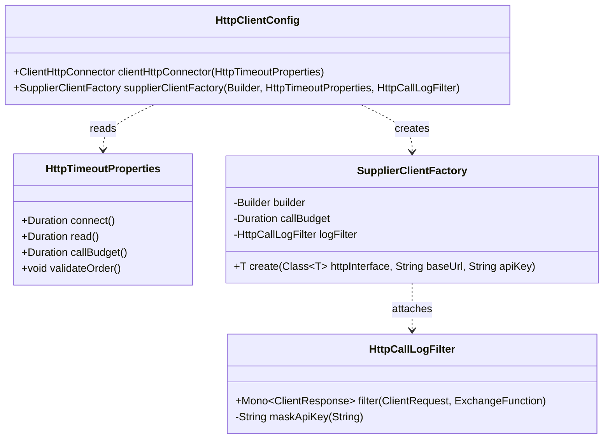

# webclient-config 설계

status: 확정
updated: 2026-09-05

## 1. 요구사항 재해석·범위

### 해결하려는 문제

공급사를 부르는 코드가 아직 한 줄도 없다. 그런데 F3 이후 모든 기능이 외부 HTTP 호출 위에서 돈다.
지금 배선을 깔지 않으면 공급사별 클라이언트마다 **URL 조립·인증 헤더·타임아웃·로깅이 각자 복사**된다.

특히 타임아웃은 조용히 실패하는 종류의 결함이다. **안 걸려 있어도 정상 동작처럼 보이다가**, 공급사가 느려지는 순간
사용자 요청이 무한정 매달린다. 그래서 이 기능의 존재 이유는 "호출을 편하게"가 아니라 **"느려지는 모든 방식에 상한을 두는 것"**이다.

### 수용 기준

1. 선언형 인터페이스 호출 한 번이 실제 HTTP 요청이 되고, 응답이 **평범한 타입**으로 돌아온다. 애플리케이션 코드에 `Mono`가 나오지 않는다.
2. 연결·응답·호출 총량 **세 계층**이 각각 다른 값으로 걸리고, 각각이 정해진 시간 안에 호출을 자른다.
3. 호출 1건마다 메서드·URI·상태·소요시간이 로그에 남고, **인증 키 값은 남지 않는다.**
4. 공급사가 늘거나 용도가 갈릴 때 **인스턴스를 나눌 수 있는 형태**여야 한다(지금 나누지는 않는다).

### 포함

- `WebClient.Builder` 커스터마이즈와 커넥터 구성 — ① connect / ② read 타임아웃
- ③ 호출당 총 시간 상한 — `WebClientAdapter.setBlockTimeout`
- 요청 응답 로깅 필터(`ExchangeFilterFunction`) — 인증 키 마스킹 포함
- `HttpServiceProxyFactory` 기반 프록시 생성 팩토리 — base URL·API key를 인자로 받는다
- 타임아웃 값 3종을 담는 `@ConfigurationProperties`

### 제외

- **공급사별 `@HttpExchange` 인터페이스와 원본 DTO** — F3. 지금 만들면 호출자가 없는 코드가 된다
- **공급사 실패 판정**(A의 4xx·5xx, B의 HTTP 200 + `resultCode`) — F3·F4
- **커넥션 풀 튜닝** — D-F3a-6에서 명시적으로 보류. 기본값에 기댄다
- **병렬 fan-out** — F7. 다만 fan-out 전체 예산과 ③의 관계는 3장에 적어 둔다
- **재시도·차단기** — F9

### DDD 전술 패턴 적용 여부

**적용하지 않는다.** 불변식도 상태 전이도 영속성도 없고, "설정을 읽어 빈을 만든다"가 전부다.
`coding-standard` 「적용하지 않을 때」의 "규칙이 없는 기능에 DDD 전술 패턴을 쓰지 않는다"에 해당한다.
`DDD-1`~`DDD-8`은 적용하지 않으며 `LAY-n`·`OOP-n`·`PAT-n`·`CLN-n`은 그대로 지킨다.

### 제약 — WebClient는 선택이 아니다

**Spring WebClient 사용은 이 프로젝트에 주어진 기본 기술 스택 조건**이다. 대안 클라이언트를 놓고 고르는 자리가 아니므로
결정 카드가 아니라 요구사항으로 기록한다.

다만 우리는 **WebClient의 리액티브 조합 API를 쓰지 않는다.** 그 이유를 남기지 않으면 "조건을 이해하지 못하고 썼다"로 읽히므로 명시한다.

> WebClient는 주어진 조건이며 그대로 사용한다. 공급사 병렬 fan-out의 **조합 수단**으로 Reactor 연산자 대신
> Virtual Thread Executor를 골랐다(D-F3a-2). 근거 셋 — ① 규모(공급사 2 + 묶음 소수)가 연산자 조합의 학습·디버깅 비용을
> 정당화하지 못한다 ② `ThreadLocal`이 살아 있어 MDC 로깅이 그대로 동작한다(Reactor는 Context 전파를 따로 설계해야 한다)
> ③ 요청 서빙이 이미 Virtual Thread라 사고 모델이 하나로 유지된다.
> WebClient는 `@HttpExchange` 프록시 뒤에서 전송을 담당하고, 호출당 총 시간 상한은 `setBlockTimeout`이 맡는다.

## 2. 도메인 모델

**없다.** Aggregate·Entity·VO 어느 것도 만들지 않는다.

| 이름 | 종류 | 내용 |
|---|---|---|
| `HttpTimeoutProperties` | record (`@ConfigurationProperties`) | `connect` · `read` · `callBudget` 세 `Duration` |

이 값들은 도메인 규칙이 아니라 **운영 설정**이다. 지켜야 할 조건은 하나뿐이고 그것도 도메인 불변식이 아니라 설정 정합성이다 —
`connect < read < callBudget`. 이 순서가 깨지면 앞 계층이 영원히 발동하지 않으므로 기동 시 검증한다(4장 참조).

## 3. 레이어 배치

### 패키지

```
com.stay.common.http/
├─ HttpTimeoutProperties     설정 값 홀더 (record)
├─ HttpClientConfig          @Configuration — 커넥터·빌더·팩토리 빈
├─ SupplierClientFactory     base URL·API key 를 받아 프록시를 찍어낸다
└─ HttpCallLogFilter         ExchangeFilterFunction — 호출 1건 로깅·키 마스킹
```

`LAY-6`의 **횡단 요소 예외 조항**(`<root>.common.<이름>`, F0에서 추가)에 따라 `common` 아래 둔다.
성격은 **인프라**이며 **domain 패키지는 이 패키지를 참조하지 않는다.** 참조 방향은 `presentation·infrastructure → common.http` 한 방향뿐이다.

### 클래스 관계와 주요 시그니처



`HttpCallLogFilter.filter`가 `Mono`를 반환하는 것은 **Spring이 정한 인터페이스**라 피할 수 없다.
"애플리케이션 코드에 `Mono`를 노출하지 않는다"는 원칙은 **우리가 부르는 쪽**에 대한 것이고,
프레임워크 확장점을 구현하는 이 한 클래스는 예외다. 이 구분을 흐리지 않기 위해 여기 적어 둔다.

### 타임아웃 세 계층이 걸리는 자리

| 계층 | 무엇을 재나 | 거는 위치 |
|---|---|---|
| ① connect | 연결 수립까지 | 커넥터 — `ChannelOption.CONNECT_TIMEOUT_MILLIS` (또는 `spring.http.reactiveclient.connect-timeout`) |
| ② read | 응답 조각 사이 최대 간격 | 커넥터 — `responseTimeout` (또는 `spring.http.reactiveclient.read-timeout`) |
| ③ 호출 총량 | 요청 시작부터 응답 완료까지 | `WebClientAdapter.setBlockTimeout(callBudget)` |

**②는 총 소요를 못 막는다.** Reactor Netty의 `responseTimeout`은 "각 네트워크 read 작업 사이에 허용되는 최대 간격"이라,
상대가 조금씩 흘려보내면 영원히 걸리지 않는다. 그래서 ③이 선택이 아니라 필수다. T-02·T-03이 이 둘을 갈라서 증명한다.

### fan-out 예산과의 관계 (F7 범위, 여기서는 경계만)

```mermaid
sequenceDiagram
    participant C as 검색 요청
    participant X as VirtualThread Executor (F7)
    participant P as 프록시 (F3a 배선)
    participant S as 공급사
    C->>X: invokeAll(tasks, FAN_OUT_BUDGET)
    par 공급사별 동시 호출
        X->>P: supplierA.search(...)
        P->>S: HTTP (1 2 3 적용)
        S-->>P: 응답 또는 타임아웃
        P-->>X: 값 또는 예외
    and
        X->>P: supplierB.search(...)
        P->>S: HTTP
        S-->>P: 응답 또는 타임아웃
        P-->>X: 값 또는 예외
    end
    X-->>C: 완료분 취합 · 미완료는 취소
```



**예산은 두 겹**이다. ③은 호출 하나의 상한, `invokeAll`의 예산은 fan-out 전체의 상한이다.
`③ < fan-out 예산`이어야 개별 실패와 전체 절단이 구분된다. fan-out 쪽 값은 F7에서 정한다.

## 4. 적용 패턴

| 패턴 | 격리하는 변화 | 검토한 대안 |
|---|---|---|
| **선언형 프록시** (`@HttpExchange` + `HttpServiceProxyFactory` + `WebClientAdapter`) | 경로·헤더·응답 타입·리액티브 타입 해제라는 네 관심사를 인터페이스 선언 한 곳으로 접는다. 공급사가 늘어도 호출부 코드 모양이 그대로다 | 손으로 래퍼 클래스 작성 → 프레임워크가 같은 일을 하므로 `PAT-1`(패턴은 해결책이지 목표가 아니다) 위반. 채택하지 않음 |
| **팩토리** (`SupplierClientFactory`) | "인스턴스를 몇 개 둘 것인가"의 변화. 지금은 공급사별 하나지만, 용도별(목록·가격)로 쪼갤 때 배선을 다시 짜지 않는다 | 전역 `WebClient` 빈 하나 → 나눌 수 없어 나중에 배선을 다시 짜야 한다 |
| **없음 (그 외)** | Strategy·Adapter는 쓰지 않는다. 커넥터 교체는 Spring이 이미 추상화했고 구현체가 하나뿐이다 | — |

인터페이스는 만들지 않는다. `SupplierClientFactory`는 구현체가 하나이고 외부 시스템 경계의 포트도 아니다
(`coding-standard` 「적용하지 않을 때」 — 단일 구현체를 위한 인터페이스 금지).

### 설정 정합성 검증

`HttpTimeoutProperties`는 기동 시 `connect < read < callBudget`을 확인하고 어기면 기동을 중단한다.
값이 어긋나면 앞 계층이 영원히 발동하지 않아 **실패 원인 구분이 불가능**해지는데, 이건 런타임에 조용히 일어나므로
경계에서 잡는다 (Fail Fast).

## 5. 테스트 리스트

| ID | 레이어 | 분류 | 케이스 | 기법 | 기대 결과 |
|---|---|---|---|---|---|
| T-01 | 통합 | Normal | `@HttpExchange` 프록시 호출이 실제 HTTP 요청을 보내고 응답을 평범한 타입으로 반환한다 | ECP | 응답 객체 반환. 호출부에 `Mono` 없음 |
| T-02 | 통합 | Boundary | 응답이 오지 않으면 ② read 타임아웃이 자른다 | BVA | 예외 발생, 경과 시간이 read 값 근처 |
| T-03 | 통합 | Boundary | 응답 조각이 계속 도착해 ②는 걸리지 않는데 총합이 ③을 넘으면 잘린다 | BVA | 예외 발생, 경과 시간이 `callBudget` 근처 |
| T-04 | 통합 | Invalid | 라우팅되지 않는 주소로 호출하면 ① connect 타임아웃 안에 실패한다 | Error Guessing | 예외 발생, 경과 시간이 connect 값 근처 |
| T-05 | 단위 | Normal | 로깅 필터가 호출 1건에 메서드·URI·상태·소요시간을 남긴다 | ECP | 로그 1줄에 네 값이 모두 있음 |
| T-06 | 단위 | Invalid | 로그에 `X-Api-Key` 값이 그대로 노출되지 않는다 | Error Guessing | 키 값 문자열이 로그에 없음 |

### 테스트 방식 — 새 의존성 없이

- **T-01~T-03**: `@SpringBootTest(webEnvironment = RANDOM_PORT)` + 테스트 전용 컨트롤러를 static 중첩 클래스로 `@Import`한다.
  F0의 `ApiResponseE2ETest`가 이미 쓰는 패턴이다. 지연 응답과 조각 응답은 그 컨트롤러가 만든다.
  MockWebServer·WireMock을 **추가하지 않는다** — 기존 의존성으로 된다(F3의 「닫아야 할 결정」이 여기서 닫힌다).
- **T-04**: 예약된 라우팅 불가 대역으로 호출한다. 모의 서버로는 만들 수 없는 경우다(F2 설계가 F3 몫으로 넘긴 항목).
- **T-05·T-06**: Logback `ListAppender`로 로그를 캡처한다.

**F2와 무관하게 돌아간다.** 모의 공급사 서버 없이 이 여섯 개가 전부 통과해야 한다.

## 6. 결정 카드

| ID | 질문 | 결정과 근거 (탈락 안 사유 포함) | 구현 차단 |
|---|---|---|---|
| D-F3a-1 | 커넥터를 무엇으로 | **Reactor Netty 유지.** 능력 차이가 아니라 **새 아티팩트 0개** — 취약점 공지를 추적할 조직을 늘리지 않는다. 탈락: Apache HC5는 3계층 분리와 호스트별 풀이 동급이지만 `httpclient5`·`httpcore5`가 추가되고 기본값(호스트당 5 · connect 3분) 재설정이 필수다 / JDK는 read와 총 예산이 한 손잡이로 합쳐지고 풀이 JVM 전역이다 / Jetty는 브리지 라이브러리가 필요하고 사례가 가장 적다. **재검토 조건**: 풀 대여 지연을 서버 지연과 분리해 계측해야 할 때, direct buffer 메모리 문제가 실제로 관측될 때 | 닫힘 |
| D-F3a-2 | 병렬 fan-out 조합 수단과 포트 반환 타입 | **순수 타입 + Virtual Thread Executor.** `Executors.newVirtualThreadPerTaskExecutor()` + `invokeAll(예산)`. 탈락: `Mono` 노출안은 도메인 포트가 리액티브 런타임에 묶여 `LAY-2` 정면 위반 / 인프라 내부 Reactor안은 도메인은 지키지만 공급사 2개 + 묶음 소수라는 규모가 리액티브 학습·디버깅·MDC 전파 부담의 값을 하지 못한다. **`StructuredTaskScope`는 Java 25에서 아직 preview**(JDK 25.0.2에서 확인)라 쓰지 않는다 | 닫힘 |
| D-F3a-3 | 타임아웃 3값 | **잠정값 connect 2s / read 3s / callBudget 5s.** `connect < read < callBudget` 관계만 확정이고 **숫자는 근거가 약하다** — 공급사 계약에 응답 시간 기준이 없고 실측 대상(F2 모의 서버)이 아직 없다. F2 완료 후 실측으로 보정한다. **알고 지는 빚으로 명시** | 닫힘(잠정) |
| D-F3a-4 | 리다이렉트를 따라갈지 | **끈다.** Boot 3.5부터 follow redirects가 기본 활성으로 바뀌었는데, 공급사 API는 리다이렉트를 쓰지 않는 계약이라 따라갈 이유가 없고 예상치 못한 경로로 요청이 나가는 것을 막는다 | 닫힘 |
| D-F3a-5 | 로그 레벨과 마스킹 대상 | 정상은 `DEBUG`, 실패·타임아웃은 `WARN`. `X-Api-Key` 헤더 값은 **전체 마스킹**. 요청·응답 본문은 남기지 않는다 — 공급사 응답에 무엇이 들어올지 계약으로 보장되지 않고 로그 크기도 예측할 수 없다 | 닫힘 |
| D-F3a-6 | 커넥션 풀 | **보류.** 기본값(호스트당 활성 500)에 기댄다. 값을 정할 부하 데이터가 없어 지금 정하면 남의 숫자를 베끼는 것이 된다. "안 하기로 했다"를 여기 남긴다. F7 이후 실측으로 판단 | 닫힘 |
| — | 클라이언트 라이브러리 | **WebClient — 주어진 제약.** 결정 카드가 아니다. 1장 「제약」 참조 | 해당 없음 |

### D-F3a-2 보충 — 공식 문서와 다른 길이라는 사실

이 결정은 **Spring 공식 문서가 여러 호출에 제시하는 형태(`Mono.zip(...).block()`)와 다르다.** 알고 택했다.
공식 서술 인용과 그에 대한 반론, 조사에서 확인한 것과 확인하지 못한 것은
`connector-reference.html` 「공식 문서는 무엇을 권하나」에 정리했다. 구현에 필요한 것만 여기 적는다.

**감수하는 것 — 구현·후속 단계가 알아야 한다**

- **공개 선례가 없다.** MVC 스택에서 WebClient를 이 방식으로 fan-out 한 기업 공식 사례를 찾지 못했다. 막히면 참고할 사례가 없다.
- `Executors.newVirtualThreadPerTaskExecutor()`는 **스레드 수가 제한되지 않는다.** 코드 묶음이 늘면 동시 호출이 그대로 늘어나므로
  **동시 호출 수 제한을 F7에서 직접 구현해야 한다** — Reactor였다면 연산자 인자 하나였을 일이다. F7 「닫아야 할 결정」에 추가했다.
- **되돌리는 비용**: 도메인 포트가 순수 타입이라 어댑터 내부만 바꾸면 되지만, F7의 fan-out 코드는 다시 쓴다.

## 7. 참고 문서

- `docs/features/webclient-config/connector-reference.html` — 커넥터 4종 비교·3계층 타임아웃·은닉의 결정 근거와 검증 통과 출처 18건
- `docs/features/README.md` — F3a 범위와 완료 기준, F3와의 경계
- `docs/supplier-api-contract.md` — 인증 헤더·엔드포인트·오류 응답 형태
- `docs/tech-reference-research.html` 2장 — WebClient 사용 패턴. **단, "WebClient를 고른 근거는 연산자 조합"이라는 서술은 D-F3a-2로 더 이상 유효하지 않다.** 변경 이력으로 덧붙일 것
- `.claude/skills/coding-standard/SKILL.md` — `LAY-6` 횡단 요소 예외, 「적용하지 않을 때」
- `.claude/skills/test-standard/SKILL.md` — 테스트 리스트 형식, 레이어별 테스트 방식
